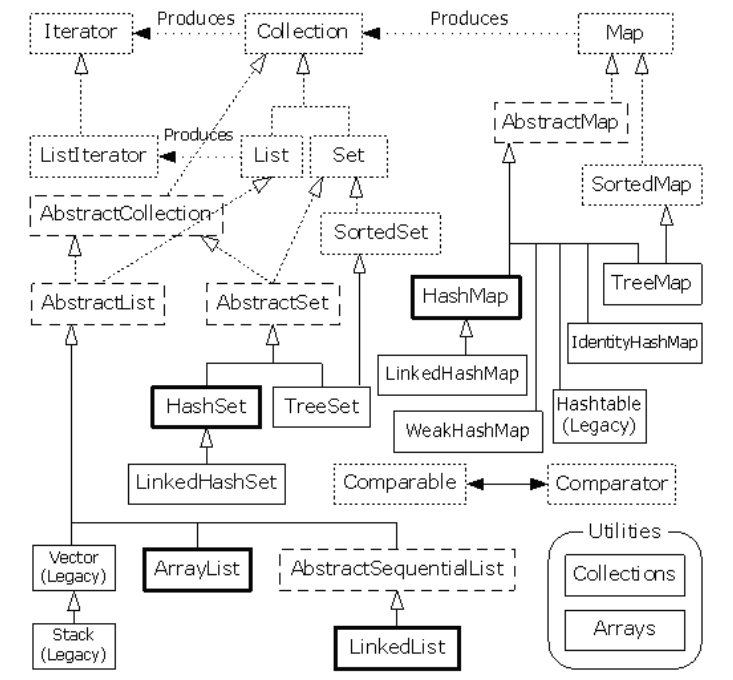

# Data Structures and Algorithms in Java by Michael T. Goodrich, Roberto Tamassia, Michael H. Goldwasser 2014

## Java language

### Exceptions
All subtypes of __RuntimeException__ in Java are officially treated as __unchecked exceptions__, and any exception type that is not part
of the RuntimeException is a __checked exception__.
All __checked exceptions__ that might propagate upward from a method must be explicitly declared in its signature.

### Generics - TODO

### Functional Programming - TODO

## Data Structures

### Arrays

The array is allocated with the specified maximum capacity, but all entries are initially null.

Arrays are great for storing things in a certain order, but they have drawbacks. The capacity of the array must be fixed when it is created, and
insertions and deletions at interior positions of an array can be time consuming if many elements must be shifted.

```
int data[ ] = new int[10];
int[ ][ ] data = new int[8][10];
```

Java provides a class, java.util.Arrays, with a number of built-in static methods for performing common tasks on arrays.

```
java.util.Arrays:

sort(A): Sorts the array A based on a natural ordering of its elements, which must be comparable.
binarySearch(A, x): Searches the sorted array A for value x, returning the index where it is found, or else the index of where it could be inserted while maintaining the sorted order.
```

### LinkedList

A linked list, in its simplest form, is a collection of nodes that collectively form a linear sequence. In a singly linked
list, each node stores a reference to an object that is an element of the sequence, as well as a reference to the next node of the list 

Minimally, the linked list instance must keep a reference to the first node of the list, known as the head.
We can identify the tail as the node having null as its next reference.

An important property of a linked list is that it does not have a predetermined fixed size.
When using a singly linked list, we can easily insert an element at the head of the list,

## Algorithms

### sorting algorithm: insertion-sort

The algorithm proceeds by considering one element at a time, placing the element in the correct order relative to those before it. We
start with the first element in the array, which is trivially sorted by itself. When considering the next element in the array, if it is smaller than the first, we swap
them. Next we consider the third element in the array, swapping it leftward until it is in its proper order relative to the first two elements.

```
/∗∗ Insertion-sort of an array of characters into nondecreasing order ∗/
public static void insertionSort(char[ ] data) {
    int n = data.length;
    for (int k = 1; k < n; k++) { // begin with second character
        char cur = data[k]; // time to insert cur=data[k]
        int j = k; // find correct index j for cur
        while (j > 0 && data[j−1] > cur) { // thus, data[j-1] must go after cur
            data[j] = data[j−1]; // slide data[j-1] rightward
            j−−; // and consider previous j for cur
        }
        data[j] = cur; // this is the proper place for cur
    }
}
```

### Binary Search

used to efficiently locate a target value within a sorted sequence of n elements stored in an array.

The algorithm maintains two parameters, low and high, such that all the candidate elements have index at least low and at most high. Initially, low = 0 and
high = n− 1. We then compare the target value to the median candidate, that is, the element with index mid = ⌊(low +high)/2⌋ .
We consider three cases:
• If the target equals the median candidate, then we have found the item we are
looking for, and the search terminates successfully.
• If the target is less than the median candidate, then we recur on the first half
of the sequence, that is, on the interval of indices from low to mid−1.
• If the target is greater than the median candidate, then we recur on the second
half of the sequence, that is, on the interval of indices from mid+1 to high.
An unsuccessful search occurs if low > high, as the interval [low,high] is empty.

Efficient binary search runs in O(logn) time

```
public static boolean binarySearch(int[ ] data, int target, int low, int high) {
	if (low > high)
		return false; // interval empty; no match
	else {
		int mid = (low + high) / 2;
		if (target == data[mid])
			return true; // found a match
		else if (target < data[mid])
			return binarySearch(data, target, low, mid − 1); // recur left of the middle
		else
			return binarySearch(data, target, mid + 1, high); // recur right of the middle
	}
}
```

OR
```
public static boolean binarySearchIterative(int[ ] data, int target) {
	int low = 0;
	int high = data.length − 1;
	while (low <= high) {
		int mid = (low + high) / 2;
		if (target == data[mid]) // found a match
			return true;
		else if (target < data[mid])
			high = mid − 1; // only consider values left of mid
		else
			low = mid + 1; // only consider values right of mid
	}
	return false; // loop ended without success
}
```

The binary search algorithm runs in O(logn) time for a sorted array with n elements

### Cumulative disk space

Total disk space is equal to the immediate disk space used by the entry plus the sum
of the cumulative disk space usage of any entries that are stored directly within
the entry.

```
public static long diskUsage(File root) {
	long total = root.length( ); // start with direct disk usage
	if (root.isDirectory( )) { // and if this is a directory,
		for (String childname : root.list( )) { // then for each child
			File child = new File(root, childname); // compose full path to child
			total += diskUsage(child); // add child’s usage to total
		}
	}
	System.out.println(total + "\t" + root); // descriptive output
	return total; // return the grand total
}
```

To characterize the cumulative time spent for an initial call to diskUsage, we
must analyze the total number of recursive invocations that are made, as well as the
number of operations that are executed within those invocations.

the overall number of operations is O(n).

### reversing the n elements of an array

```
public static void reverseArray(int[ ] data, int low, int high) {
	if (low < high) { // if at least two elements in subarray
		int temp = data[low]; // swap data[low] and data[high]
		data[low] = data[high];
		data[high] = temp;
		reverseArray(data, low + 1, high − 1); // recur on the rest
	}
} 
```

OR

```
public static void reverseIterative(int[ ] data) {
	int low = 0, high = data.length − 1;
	while (low < high) { // swap data[low] and data[high]
		int temp = data[low];
		data[low++] = data[high]; // post-increment of low
		data[high−−] = temp; // post-decrement of high
	}
}
```

### Fibonacci Series

The Fibonacci series is a series of elements where, the previous two elements are added to get the next element, starting with 0 and 1.

```
static void Fibonacci(int N) {
        int num1 = 0, num2 = 1;

        for (int i = 0; i < N; i++) {
            // Print the number
            System.out.print(num1 + " ");

            // Swap
            int num3 = num2 + num1;
            num1 = num2;
            num2 = num3;
        }
}
```

### Towers of Hanoi

Tower of Hanoi is a mathematical puzzle where we have three rods and n disks. The objective of the puzzle is to move the entire stack to another rod, obeying the following simple rules: 1) Only one disk can be moved at a time. 2) Each move consists of taking the upper disk from one of the stacks and placing it on top of another stack i.e. a disk can only be moved if it is the uppermost disk on a stack. 3) No disk may be placed on top of a smaller disk.

```
static void towerOfHanoi(int n, char from_rod, char to_rod, char aux_rod) {
        if (n == 0) {
            return;
        }
        towerOfHanoi(n - 1, from_rod, aux_rod, to_rod);
        System.out.println("Move disk " + n + " from rod "
                           + from_rod + " to rod "
                           + to_rod);
        towerOfHanoi(n - 1, aux_rod, to_rod, from_rod);
}

// Driver code
public static void main(String args[]) {
        int N = 2;

        // A, B and C are names of rods
        towerOfHanoi(N, 'A', 'C', 'B');
}
```

###  Breadth-First Tree Traversal

Level Order Traversal technique is defined as a method to traverse a Tree such that all nodes present in the same level are traversed completely before traversing the next level.

```
public class TreeNode {
  public int value;
  public TreeNode left;
  public TreeNode right;
 
  public TreeNode(int value) {
    this.value = value;
    right = null;
    left = null;
  }
}

public class TreeMock {
  public static TreeNode createBfsMock() {
    TreeNode rootTreeNode = new TreeNode(1);
    TreeNode treeNode2 = new TreeNode(2);
    TreeNode treeNode3 = new TreeNode(3);
    TreeNode treeNode4 = new TreeNode(4);
    TreeNode treeNode5 = new TreeNode(5);
    TreeNode treeNode6 = new TreeNode(6);
    TreeNode treeNode7 = new TreeNode(7);
    TreeNode treeNode8 = new TreeNode(8);
 
    rootTreeNode.left = treeNode2;
    rootTreeNode.right = treeNode3;
 
    treeNode2.left = treeNode4;
    treeNode2.right = treeNode5;
    treeNode3.right = treeNode6;
 
    treeNode5.left = treeNode7;
    treeNode5.right = treeNode8;
 
    return rootTreeNode;
  }
}

import java.util.LinkedList;
import java.util.Queue;
 
public class BreathFirstSearch {
 
  public static void main(String[] args) {
    bfsForTree(TreeMock.createBfsMock());
  }
 
  public static void bfsForTree(TreeNode node) {
    Queue<TreeNode> queue = new LinkedList<>();
    queue.add(node);
 
    while (!queue.isEmpty()) {
      var currentNode = queue.poll();
 
      if (currentNode != null) {
        System.out.print(currentNode.value + " ");
        queue.add(currentNode.left);
        queue.add(currentNode.right);
      }
    }
  }
}
```

### Depth-First-Search Tree traversal

```
import java.util.ArrayList;
import java.util.List;
 
public class Node {
 
  Object value;
  private List<> adjacentNodes = new ArrayList<>();
  private boolean visited;
 
  public Node(Object value) {
    this.value = value;
  }
 
  public void addAdjacentNode(Node node) {
    this.adjacentNodes.add(node);
  }
 
  public List<> getAdjacentNodes() {
    return adjacentNodes;
  }
 
 
  public Object getValue() {
    visited = true;
    return value;
  }
 
  public boolean isVisited() {
    return visited;
  }
}

public class GraphMock {
 
  public static Node createPreorderGraphMock() {
    Node rootNode = new Node(1);
    Node node2 = new Node(2);
    Node node3 = new Node(3);
    Node node4 = new Node(4);
    Node node5 = new Node(5);
    Node node6 = new Node(6);
    Node node7 = new Node(7);
 
    rootNode.addAdjacentNode(node2);
    node2.addAdjacentNode(node3);
    node3.addAdjacentNode(node4);
    node4.addAdjacentNode(node5);
 
    rootNode.addAdjacentNode(node6);
    rootNode.addAdjacentNode(node7);
 
    return rootNode;
  }
}

/** Recursive Preorder Traversal without Lambda */
public class DepthFirstSearchPreorder {
 
 public static void main(String[] args) {
   Node rootNode = GraphMock.createPreorderGraphMock();
   dfsRecursive(rootNode);
 }
 
 public static void dfsRecursiveWithoutLambda(Node node) {
    System.out.print(node.getValue() + " ");
 
    for (Node eachNode : node.getAdjacentNodes()) {
      if (!eachNode.isVisited()) {
        dfsRecursiveWithoutLambda(eachNode);
      }
    }
  }
}

/* Preorder with Looping */
public static void dfsNonRecursive(Node node) {
   Stack<> stack = new Stack<>();
   Node currentNode = node;
   stack.push(currentNode);
 
   while (!stack.isEmpty()) {
     currentNode = stack.pop();
     if (!currentNode.isVisited()) {
       for (int i = currentNode.getAdjacentNodes().size() - 1; i >= 0; i--) {
         stack.push(currentNode.getAdjacentNodes().get(i));
       }
 
       System.out.print(currentNode.getValue() + " ");
     }
   }
 }

```

### Brute force pattern matching

```
public static int findBrute(char[ ] text, char[ ] pattern) {
  int n = text.length;
  int m = pattern.length;
  for (int i=0; i <= n − m; i++) { // try every starting index within text
    int k = 0; // k is index into pattern
    while (k < m && text[i+k] == pattern[k]) // kth character of pattern matches
      k++;
    if (k == m) // if we reach the end of the pattern,
      return i; // substring text[i..i+m-1] is a match
  }
  return −1; // search failed
}
```

It consists of two nested loops, with the outer loop indexing through all possible starting indices of the pattern in the text.

Thus, the worst-case running time of the brute-force method is O(nm).

### The Boyer-Moore Algorithm pattern matching

The main idea of the Boyer-Moore algorithm is to improve the running time of the brute-force algorithm by adding two potentially time-saving heuristics. Roughly
stated, these heuristics are as follows:
* Looking-Glass Heuristic: When testing a possible placement of the pattern against the text, perform the comparisons against the pattern from right-to-left.
* Character-Jump Heuristic: During the testing of a possible placement of the pattern within the text, a mismatch of character text[i]=c with the corresponding
character pattern[k] is handled as follows. If c is not contained anywhere in the pattern, then shift the pattern completely past text[i] = c. Otherwise,
shift the pattern until an occurrence of character c gets aligned with text[i].

### KMP (Knuth Morris Pratt) Pattern Searching

The basic idea behind KMP’s algorithm is: whenever we detect a mismatch (after some matches), we already know some of the characters in the text of the next window. We take advantage of this information to avoid matching the characters that we know will anyway match. 

Step-by-step approach:
* Initially calculate the hash value of the pattern.
* Start iterating from the starting of the string:
  * Calculate the hash value of the current substring having length m.
  * If the hash value of the current substring and the pattern are same check if the substring is same as the pattern.
  * If they are same, store the starting index as a valid answer. Otherwise, continue for the next substrings.
* Return the starting indices as the required answer.


### Heap-Sort - TODO

A heap is a complete binary tree, and the binary tree is a tree in which the node can have the utmost two children. A complete binary tree is a binary tree in which all the levels except the last level, i.e., leaf node, should be completely filled.

The concept of heap sort is to eliminate the elements one by one from the heap part of the list, and then insert them into the sorted part of the list.

# Bulletproof java code

## requireNonNull

Checks that the specified object reference is not null and throws a customized NullPointerException if it is.

```
public void add(Player player) {
      Objects.requireNonNull(player, "player is required");

      if (players.size() == SIZE) {
          throw new IllegalArgumentException("The team is full");
      }
      this.players.add(player);
  }
```

## unmodifiableList

Returns an unmodifiable view of the specified list. This method allows modules to provide users with "read-only" access to internal lists.

Throws java.lang.UnsupportedOperationException

```
List<Character> list = new ArrayList<Character>(); 
list.add('X'); 
List<Character> immutablelist = Collections.unmodifiableList(list); 
```

## use enumeration instead of String

```
public enum Position {
    GOALKEEPER, DEFENDER, MIDFIELDER, FORWARD;
}
```

## Builder design pattern

Follows the single responsibility to hold the duty to create a player instance. Furthermore, it avoids a mistake that changes the parameter order.

```
public class Player {

    static final Year SOCCER_BORN = Year.of(1863);

    //hide

    private Player(String name, Year start, Year end, Email email, Position position, MonetaryAmount salary) {
        this.name = name;
        this.start = start;
        this.end = end;
        this.email = email;
        this.position = position;
        this.salary = salary;
    }

    @Deprecated
    Player() {
    }

    public static PlayerBuilder builder() {
        return new PlayerBuilder();
    }

    public static class PlayerBuilder {

        private String name;

        private Year start;

        private Year end;

        private Email email;

        private Position position;

        private MonetaryAmount salary;

        private PlayerBuilder() {
        }

        public PlayerBuilder withName(String name) {
            this.name = Objects.requireNonNull(name, "name is required");
            return this;
        }

        public PlayerBuilder withStart(Year start) {
            Objects.requireNonNull(start, "start is required");
            if (Year.now().isBefore(start)) {
                throw new IllegalArgumentException("you cannot start in the future");
            }
            if (SOCCER_BORN.isAfter(start)) {
                throw new IllegalArgumentException("Soccer was not born on this time");
            }
            this.start = start;
            return this;
        }

        public PlayerBuilder withEnd(Year end) {
            Objects.requireNonNull(end, "end is required");

            if (start != null && start.isAfter(end)) {
                throw new IllegalArgumentException("the last year of a player must be equal or higher than the start.");
            }

            if (SOCCER_BORN.isAfter(end)) {
                throw new IllegalArgumentException("Soccer was not born on this time");
            }
            this.end = end;
            return this;
        }

        public PlayerBuilder withEmail(Email email) {
            this.email = Objects.requireNonNull(email, "email is required");
            return this;
        }

        public PlayerBuilder withPosition(Position position) {
            this.position = Objects.requireNonNull(position, "position is required");
            return this;
        }

        public PlayerBuilder withSalary(MonetaryAmount salary) {
            Objects.requireNonNull(salary, "salary is required");
            if (salary.isNegativeOrZero()) {
                throw new IllegalArgumentException("A player needs to earn money to play; otherwise, it is illegal.");
            }
            this.salary = salary;
            return this;
        }

        public Player build() {
            Objects.requireNonNull(name, "name is required");
            Objects.requireNonNull(start, "start is required");
            Objects.requireNonNull(email, "email is required");
            Objects.requireNonNull(position, "position is required");
            Objects.requireNonNull(salary, "salary is required");

            return new Player(name, start, end, email, position, salary);
        }

    }
}
```

And

```
Team bahia = Team.of("Bahia");
  Player marta = Player.builder().withName("Marta")
      .withEmail(email)
      .withSalary(salary)
      .withStart(start)
      .withPosition(Position.FORWARD)
      .build();

  bahia.add(marta);
```

## Thorough testing

## Error handling

### catch only those exceptions that you can handle

### wrap the exceptions in custom exceptions so that the stack trace is not lost

```
catch (NoSuchMethodException e) {
   throw new MyServiceException("Some information: " , e);  //Correct way
}
```

### Throw early Catch late

You should wait until you have all the information to handle it properly.


## Documentation


# Thinking in Java by Bruce Eckel 2006


# Other Algorithms

## sliding-window

###  if a string s has more vowels than consonants

### find the smallest and largest numbers in an array of integers

### outputs all possible strings formed by using the characters 'c', 'a', 't', 'd', 'o', and 'g' exactly once

# Thinking in Java by Bruce Eckel 2006

## Containers in Depth




# References
https://builtin.com/data-science/sliding-window-algorithm

https://protegejj.gitbook.io/algorithm-practice/leetcode/graph/133-clone-graph

