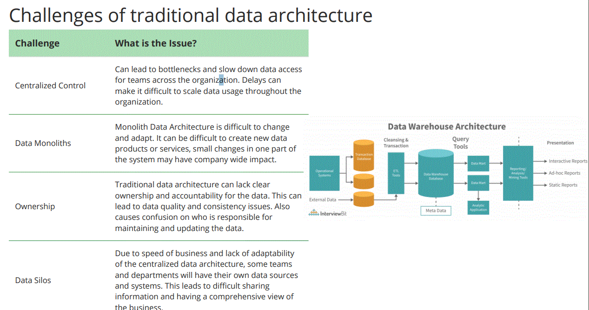
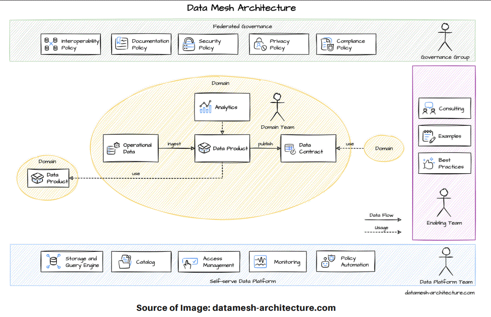

# Data Mesh

Data Mesh is a new approach to data architecture and governance that empowers cross-functional teams to own and manage their own data domains
in a decentralized way, while also collaborating to ensure data quality and consistency across the organization.

## Challenges of traditional data architecture

How Data Mesh solves these challenges:
- Centralized Control: Data ownership and management is distributed across individual domain teams. This reduces the bottlenecks and allows faster data access and more scalable data usage.
- Data Monoliths: Data Mesh uses modular, loosely coupled data systems that can be easily changed and adapted.
- Ownership: Each domain team is responsible for the quality and consistency of the data that they own.
- Data Silos: Data Mesh encourages data sharing and collaboration accross teams. Teams can use their own data systems but need to adopt a mindset of sharing the information using for example APIs.

## Limitations of Data Mesh

- Complexity: Data Mesh introduces additional complexity to an organization's data infrastructure
- Cultural Shift: For a succesful Data Mesh, teams will need to make significant cultural shift on how data is owned and shared
- Governance: Each domain team is responsible for the quality and consistency of the data that they own.
- Tools: Data Mesh encourages data sharing and collaboration accross teams. Teams can use their own data systems but need to adopt a mindset of sharing the information using for example APIs.
- Talent: Data Mesh requires technical expertise across all of the organization domains

## Data Mesh Principles

### Domain Ownership

- Autonomy: Each domain has autonomy over its data and can make decision on how to collect, store , process and share it.
- Accountability: Domain owners are responsible and accountable for the quality, security, consistency of their data products.
- Scalability: Allow teams to easily adapt to changing business needs.
- Integration: Domain owners need to work together to ensure data products integrate well with each other and meet the overall organization strategy and needs.

### Data as a Product

- Data is first-class citizen: Just like software products, data should be treated as a valuable asset that is developed, tested, and delivered to customers..
- Ownership and responsibility: Each data product should have a dedicated team responsible for building, maintaining, and delivering that product to its customers.
- Self-serve: Data products should be designed to be easily discoverable and consumable by their customers without requiring significant support or intervention from the team that  built them.
- Quality & Consistency: Data products should be built using standardized data models, definitions, and quality requirements, and tested rigorously to ensure their quality, reliability, and interoperability

### Self-Serve Data Platform

- Data Product Catalog: A self-serve data platform typically includes a data product catalog that lists all the available data products produced by different teams in the organization.
- Data Access and Governance: Self-serve data platforms provide a way for teams to access and consume data products without relying on a central data team.
- Collaboration: Self-serve data platforms can also facilitate collaboration and knowledge sharing across different teams and domains.
- Data product lifecycle management: A self-serve data platform should provide tools and processes for managing the lifecycle of data products, including versioning, deprecation,
and retirement.

### Federated Computational Governance

- Decentralized Governance: Federated Computational Governance ensures that each team has the autonomy to make decisions about the data within their domain, while still adhering to the overall organizational governance policies.
- Distributed Trust: Data Mesh relies on distributed trust to ensure the integrity and accuracy of data.
- Collaborative Decision-Making: In a Data Mesh environment, decision-making is collaborative and consensusdriven.
- Continuous Improvement: Federated Computational Governance promotes continuous improvement by providing a feedback loop for teams to learn from each other and adapt their governance
policies and procedures over time.

## Data Mesh Architecture

## References

https://www.datamesh-architecture.com/#tech-stacks

https://medium.com/intuit-engineering/intuits-data-mesh-strategy-778e3edaa017

https://www.jpmorgan.com/technology/technology-blog/evolution-of-data-mesh-architecture

