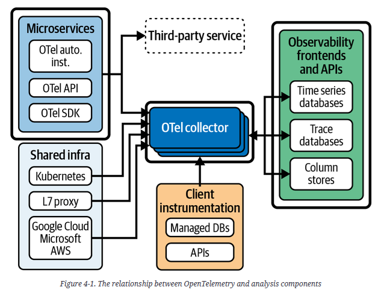
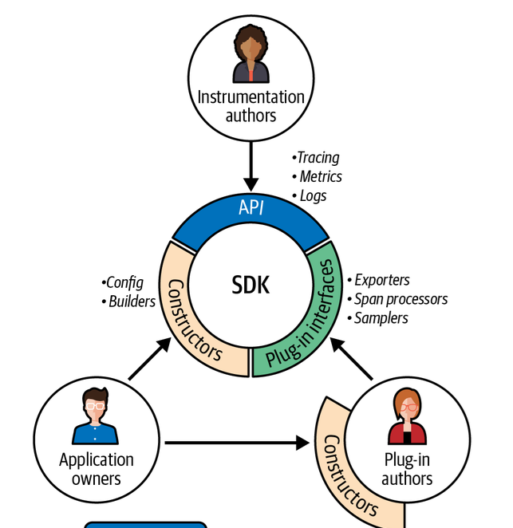

# Open Telemetry by Ted Young, Austin Parker 2024

## Context

A hard context is a unique, per-request identifier that services in a distributed application can propagate to other services that are part of the same request. A basic model of this would be a single request from a web client through a load balancer into an API server, which calls a function in another service to read a database and returns some computed value to the client

A soft context would be various pieces of metadata that each telemetry instrument attaches to measurements from the various services and infrastructure that handle that same request—for example, a customer identifier, the hostname of the load balancer that served the request, or the timestamp of a piece of telemetry data

Hard context defines the overall shape of a system by defining relationships between services and signals. Soft context allows you to create unique dimensions across telemetry signals that help explain what a particular signal represents.

The key distinction between hard and soft contexts is that a hard context directly and explicitly links measurements that have a causal relationship, whereas soft contexts may do so but are not guaranteed to.

Without contexts, the value of telemetry is significantly reduced, because you lose the ability to associate measurements with each other.

In a system with low levels of concurrency, soft contexts may  be suitable for explaining system behavior.

Beyond instrumentation libraries and high-quality telemetry, operators need a rich ecosystem of tools to help them collect and process telemetry data.

## Why Use OpenTelemetry?

- Universal Standards
- Correlated Data

OpenTelemetry solves two big problems. First, it gives developers a single solution for built-in, native instrumentation of their code. Second, it allows for instrumentation and telemetry data to be broadly compatible with the rest of the observability ecosystem.

You need consistent attributes and labels across your telemetry in order to correlate it together. Truly native instrumentation is about having semantically accurate instrumentation

OpenTelemetry concerns itself with three primary signals: traces, metrics, and logs

## Definitions

### Traces

A trace is a way to model work in a distributed system. You can think of it as a set of log statements that follow a well-defined schema. The work done by each service in the system is linked together through hard context

Each trace is a collection of related logs, called spans, for a given transaction. Each span in turn contains a variety of fields.
You can think of a trace as a set of logs that are correlated through a shared identifier

Benefits:
- A single trace represents a single transaction, or journey, through a distributed system. This makes traces the best way to model end-user experience, since one trace corresponds to one user’s path through a system.
- A group of traces can be aggregated across multiple dimensions in order to discover performance characteristics that would be difficult to spot otherwise.
- Traces can be transformed into other signals, such as metrics, allowing for downsampling of the raw data without losing key performance information

### Metrics

Metrics are numeric measurements and recordings of system state, such as the number of users concurrently logged into a system, the amount of disk space used on a device, or the amount of RAM available on a virtual machine (VM)

Metrics are often the first port of call for developers trying to understand overall system health. They’re ubiquitous, fast, and inexpensive for what they do. There are some challenges with traditional metrics, though. Traditionally, they lack hard context—it’s difficult, and in some cases impossible, to accurately correlate a given metric with specific end-user transactions.

There are challenges when two similar metrics are inconsistent in how, or when, they report things.

In OpenTelemetry, metrics have been designed to support three main goals:
- Developers should be able to define important, semantically meaningful events in their code and specify how those events translate into metric signals.
- Operators should be able to control costs, data volume, and resolution by aggregating or reaggregating the time or attributes of those metrics.
- Conversions should not change the intrinsic meaning of a measurement.

As a result:
- OpenTelemetry metrics include semantic meaning that observability pipelines or frontends can take advantage of to intelligently query and visualize metric streams.
- OpenTelemetry metrics can be linked to other signals through both hard and soft context, allowing you to layer telemetry signals for cost control or other purposes.
- OpenTelemetry metrics support StatsD and Prometheus out of the box, allowing you to map those existing metrics signals into the OpenTelemetry ecosystem.

### Logs

Fundamentally, the OpenTelemetry model seeks to unify this signal by enriching log statements with trace context and links to metrics and traces

Four main reasons to use logs:
- To get signals out of services that can’t be traced, such as legacy code, mainframes, and other systems of record
- To correlate infrastructure resources such as managed databases or load balancers with application events
- To understand behavior in a system that isn’t tied to a user request, such as cron jobs or other recurring and on-demand work
- To process them into other signals, such as metrics or traces

### Observability Context

It is propagation mechanism which carries execution-scoped values across API boundaries and between logically associated execution units (like thread).

In other words, contexts carry information across a gap: between two services running on the same computer through a pipe, between different servers through remote procedure calls, or between different threads in a single process

The goal of the context layer is to provide a clean interface either to existing context managers (such as Golang’s context.Context, Java ThreadLocals, or Python’s context manager) or to some other suitable carrier. What’s important is that the context is required and that it holds one or more propagators.

Propagators are how you actually send values from one process to the next.

The project maintains a variety of semantic conventions to create a consistent and clear set of metadata that can be applied to telemetry signals. These conventions allow for analysis across standard dimensions, reducing the need for data to be postprocessed and normalized.

The goal of the semantic conventions process is to create a standardized and representative set of metadata that can accurately model and describe the underlying resources that power not only a given transaction in a distributed system but also the actual transaction itself.

There are three basic types of context in OpenTelemetry: time, attributes, and the context object itself

### Attributes and Resources

Every piece of telemetry that’s emitted by OpenTelemetry has attributes. You may have heard these referred to as fields or tags in other monitoring systems.

Simply put, an attribute is a key-value pair that describes an interesting, or useful, dimension of a piece of telemetry. 

If you wanted to measure how many people are using it, you’d have a single quantity—the count of riders in a given day. Attributes give that measurement useful dimensions, such as the form of transit someone is using, the station they departed from, or even unique identifiers such as their name

### OpenTelemetry Protocol

One of the most exciting features of OpenTelemetry is that it provides a standard data format and protocol for observability data. OpenTelemetry Protocol (OTLP) offers a single well-supported wire format (how data is stored in memory or sent across the network) for telemetry to be transmitted between agents, services, and backends. It can be sent or received in both binary and text-based encoding and aims to use low amounts of CPU and memory. 

Producers of telemetry are able to target OTLP through a thin translation layer between their existing telemetry export formats, making it compatible with a huge array of existing systems. 

Consumers of telemetry can use OTLP with dozens of open source and commercial tools, freeing them from proprietary lock-in.

New signals will require updates, but it remains backward compatible with legacy receivers and exporters, ensuring that investments will not go to waste over time.

OpenTelemetry has a concept of telemetry schemas to help consumers and producers of telemetry address changes in semantic conventions over time. By building schema-aware analysis tools and storage backends or relying on the OpenTelemetry Collector to perform schema transformations, you can benefit from changes in semantic conventions

## Architecture

OpenTelemetry consists of three kinds of components: instrumentation installed within applications, exporters for infrastructure such as Kubernetes, and pipeline components for sending all of this telemetry to a storage system.

### Application Telemetry

<image>

The most critical telemetry comes from OSS libraries such as frameworks, HTTP and RPC clients, and database clients. These libraries perform the heavy lifting in most applications, and often the telemetry from these libraries is sufficient to cover almost all the work that an application performs.

While library instrumentation is very useful, you will inevitably want to instrument critical pieces of application code and business logic. To do this, you use the OpenTelemetry API

In order for OpenTelemetry API calls sent from libraries and application code to actually be processed, you must install the OpenTelemetry client. We refer to this client as the OpenTelemetry SDK. The SDK is a plug-in framework consisting of sampling algorithms, lifecycle hooks, and exporters that can be configured using environment variables or a YAML configuration file.

### Telemetry Pipelines

The telemetry collected from applications and infrastructure must be sent to an observability tool for storage and analysis

## Instrumenting Applications

When you install OpenTelemetry for the first time, we recommend you read the docs on these tools and learn how to use them:

- Java: the OpenTelemetry Java agent can automatically install the SDK and all available instrumentation via the standard -javaagent command-line argument.
- Python: The opentelemetry-instrumentation package can automatically install the SDK and all available instrumentation via the opentelemetry-instrument command.

### Registering Providers

What happens if you make an OpenTelemetry API call? By default, nothing. That API call is a no-op, meaning that the API is safe to call, but nothing happens and there is no overhead.

For something to happen, you need to register providers with the API. A provider is an implementation of the OpenTelemetry instrumentation API. These providers handle all of the API calls. 

Providers:
- A TracerProvider implements the OpenTelemetry tracing API. It consists of samplers, SpanProcessors, and exporters
- A MeterProvider implements the OpenTelemetry metrics API. It consists of views, MetricReaders, MetricProducers, and MetricExporters
- A LoggerProvider implements the OpenTelemetry logging API. It consists of LogRecordProcessors and LogRecordExporters

When shutting down an application, it’s critical to flush any remaining telemetry before the application terminates. Flushing is the process of immediately exporting any remaining telemetry data already buffered in the SDK while blocking shutdown. If your application terminates before flushing the SDK, you could lose critical observability data.

You can configure the SDK in three ways:
- In code, when constructing exporters, samplers, and processors
- Using environment variables
- Using a YAML config file

#### Kubernetes applications

Tips:
- Use sidecar Collectors in each pod as the first stop for your telemetry. 
- Split out Collectors by signal type, so they can scale independently.
- We suggest cleanly separating concerns between telemetry creation and telemetry configuration

You can install the OpenTelemetry Kubernetes Operator through either kubectl or a Helm chart. It supports several deployment types, including these:
- DaemonSet to run a Collector on every node
- Sidecar to run a Collector in every container
- Deployment to run a Collector pool
- StatefulSet to run a stateful Collector pool

#### Serverless Platforms

Serverless platforms such as AWS Lambda and Azure Cloud Functions have gained significant popularity, but they introduce observability challenges. Developers love their ease of use and opinionated structures, but their on-demand, ephemeral nature means you’ll need specialized tooling to get accurate telemetry.

In addition to your standard application telemetry, serverless observability adds a few more things to pay attention to:
- Invocation time: How long does the function run for?
- Resource usage: How much memory and compute does the function use?
- Cold start time: How long does the function take to start up when it hasn’t been used recently?

These metrics should be available from your serverless provider, but how do you get the application telemetry itself?

Tools like the OpenTelemetry Lambda Layer offer a convenient way to capture traces and metrics from AWS Lambda invocations,

If you can’t use the Lambda Layer, ensure that your function waits on the export of telemetry data, and be sure to stop recording spans or measurements before handing control back to the function invocation library. 

#### Queues, Service Buses, and Other Async Workflows

Many modern applications are written to take advantage of event- and queue-based platforms such as Apache Kafka. In general, the architecture of these applications revolves around services that publish and subscribe to topics on a queue. This raises several interesting challenges for observability. Tracing these transactions can be less useful than in “traditional” request/response architectures, since it’s often less clear when a given transaction ends

Instead of thinking of any highly async workflow as a single trace, think of it as many subtraces, linked to an origin either by a custom correlation ID.

## Designing Telemetry Pipelines

Common Topologies:
- No Collector: If the telemetry being emitted requires little to no processing, it may make sense to connect the SDKs directly to the backend, without a Collector. The only things missing from this setup are host metrics, such as RAM, CPU, network, and system load. In general, it is inadvisable to collect host metrics via an application. Doing so consumes application resources, and many application runtimes have difficulty reporting these metrics correctly.
-Local Collector: observing the host machine is the most common reason to run a local Collector. Additional advantages: Gathering environment resources, Avoiding data loss from crashes
- Collector Pools: for systems operating at large scales, adding several Collector pools to the pipeline becomes an attractive option. A Collector pool is a set of Collectors, each running on its own machine, that uses a load balancer to manage and distribute traffic.

### Pipeline Operations: 

Using a pipeline of Collectors to apply changes to telemetry data and protocols is a key part of making adjustments to your observability system without creating downtime or observability blackouts. 

Types of operations available to you when using a Collector:
- Filtering and Sampling: remove anything that you absolutely don’t want. You can use filters to completely drop specific log messages, spans, or metric instruments from your pipeline.
- Transforming, Scrubbing, and Versioning: You can remove or obfuscate sensitive information, create new synthetic attributes by combining existing attribute values, or use schema transformations

Collectors also help you with 
- Privacy and Regional Regulations
- Buffering and Backpressure: It’s also critical—you don’t want to lose any data. This means that you need enough resources available in the pipeline to buffer, or temporarily hold this data in memory, when temporary spikes in traffic or unexpected issues create backpressure
- Changing Protocols: The final stage of a pipeline is export. Processors like the routing processor allow you to specify destinations based on telemetry attributes.

## Questions:
- pull or push: what is the specification for both?

