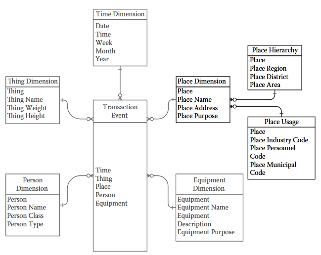

# Data Warhouse

## book: Building and Maintainig Data Warehouse 

https://oden.utexas.edu/media/pending_reports/9780429120930_webpdf.pdf

### Introduction

Guidelines:
- __Enterprise Data__: Data that is applicable to the enterprise. Data that is acted on by a single business unit is also relevant to the remainder of the enterprise.
- __Subject Orientation__: Data will be grouped by subject: all manufacturing data goes together, and the sales data...
- Data Integration: 
    - __Form__: if data elements (e.g., phone numbers) have different layouts (e.g., 123-123-1234 and (123) 123-1234), __one layout__ will be super-imposed on both of them
    - __Function__: When two data elements identify the same thing (e.g., a hammer) with two different names (e.g., part 32G and part B49), these two names will be replaced with __one name__
    - __Grain__: When two data elements apply different hierarchies (e.g., region and district) to the same thing, or different levels of detail (e.g., miles and feet), the two data elements will be  esolved to the __same level of hierarchy__ or detail
- __Nonvolatility__: Unlike the data in operational applications, which is discarded once the company is finished using it, the data in a data warehouse will remain in the warehouse
- __Time Variant__: All data has a context at a moment in time. A data warehouse will keep that context. So, all data from 1995 will retain its context within 1995.
- __One Version of the Truth__: Only the one, true gold, standard copyof each data element would be included in a data warehouse.
- __Long-Term__ Investment: A data warehouse should be flexible enough to absorb changes in the company and the world, and scalable enough to grow with the company. By doing so, a data warehouse can add value to the company for a long time

### Database Design

__Data Model:__ How will the data be organized within relational tables? What are the subject areas? What are the entities? How will they relate?

__Data Architecture__: How will the relational tables be organized? Will they reside in a single central data warehouse, or will they reside in distributed data marts?

Data Modeling Methodology:
- __Conceptual Data Model__: How will the enterprise be organized within the data warehouse? The Conceptual Data Model defines the subject areas and major entities.
- __Logical Data Model__: Which entities exist within each subject area? How will those entities relate to each other? The relationships extend beyond just primary key/foreign key relationships. They include Super Type, Subtype, Attribute, and Associative Entities. It uses __Entity Relationship Diagram__.
- __Physical Data Model__: Databases hold the data of a data warehouse. How will that data be assigned to columns, which are inside tables that are organized into databases that collectively hold the data of a data warehouse. The structures of a Physical Data Model are databases, tables, and views. 

Whereas the entities and relations of a Logical Data Model represent an enterprise, the databases, tables, and views of a Physical Data Model represent physical data structures. 

#### Dimensional Data Model aka Star Schema

A Dimensional Data Model casts data into two groups: Facts and Dimensions.
Facts are also known as Events or Transactions. A Fact is something that happened

##### Fact tables

In the middle is a Fact table (a Fact is an event,transaction, or something that happens at a single moment in time). 

A Fact is something that happened.

Typically, fact includes:
- Time: An event happens at a moment in time
- Place: An event happens in a place or space
- Person: People are usually involved in events
- Thing: Events are often focused on or around an object
- Equipment: Participants in an event often use a tool or equipment
- How: The action that was performed
- Why: Sometimes, but not always, a reason for the action is provided

A Fact table joins to the surrounding Dimension tables using Primary Key/Foreign Key relations.


#### Dimension tables

Surrounding the Fact table are Dimension tables. 

Dimensions are data that qualify or describe enterprise entities involved in a Fact.

A Fact table joins to the surrounding Dimension tables using Primary Key/Foreign Key relations.

```
Time Dimension table                Transaction Event table
Time          ----- foreign key --- Time                        Place Dimenstion table
                                    Place ----- foreign key --- Place
Thing Dimention table
Thing         ----- foreign key --- Thing 
```

Dimension tables are very flexible. Attributes, hierarchies, and hierarchical levels can be added, removed, or changed by simply modifying the columns in a Dimension table

Join Strategies:
- Source Native Key
  - Fact.Thing = Dimension.Thing
  - if enterprise has two unique identifiers: Chair and Table. As long as the Dimension table has only one row for the entity labeled Chair and only one row for the entity labeled Table, this method will work
- Source Native Key with Dates
  - Chair and Table are captured with their Begin and End Dates. 
  - The join between the Fact and Dimension tables must include the Source Native Key and Dates 
  - This achieves only a Type 2 time-variant relation
  - Typically, in an operational database, one Date field identifies when the data in a row became effective and another field identifies when the data in a row ceased being effective.
- Surrogate Key: 
  - Fact table can join the Dimension table using the __generated__ Surrogate Key
  - This approach requires the Dimension table have only one row for each Surrogate Key, otherwise, the results from these tables will be multiplied by a factor of the number of rows the Dimension table has for a duplicated Surrogate Key
- Surrogate Key with Source Native Key: 
  - When the Surrogate Key in the Dimension table identifies the entity, but not the instance of the entity, the Source Native Key can be used to identify an individual instance of an entity
  - The Surrogate Key 123 identifies the entity Chair, but the Source Native Key (Thing ID) must be included to identify the individual instance of Chair.
- Surrogate Key with Surrogate Key Version: Type 2 Join
  - When the Surrogate Key identifies the entity, but not the individual instance of an entity

Factless Fact: A business event may not necessarily transact dollars, move units of product, or return any sort of arithmetic measurement:
- An airplane lands
- A store opens (and closes) its doors
- A truck arrives at a warehouse

#### Snowflake Schema

Sometimes a Dimension, or part of a Dimension, is too complex or volatile to work well in a single Dimension row. 
In such situations, part of the Dimension is normalized out of the Dimension yielding a Dimension of a Dimension, or a Sub-dimension.
Splitting a Dimension in a Star Schema yields a Snowflake Schema.

A __Snowflake Schema is created by normalizing Dimension tables__.



Dimension tables include in each row enough information about its hierarchy to allow the data warehouse customer to __summarize data__ at a higher level of that hierarchy

#### Third Normal Form Data Model

Third Normal Form data warehouses:
- Third Normal Form data warehouses __do not model a business or subject area__, they model relationships between data elements instead.
- Third Normal Form data warehouse structures are too erratic and scattered to be easily understood or optimized.

A Third Normal Form data warehouse uses data structures that are normalized to the Third Normal Form. The result is many small tables rather than a few large tables, and many table joins rather than a few table joins

Advantages:
- ✅ Eliminates data redundancy
- ✅ Ensures data consistency
- ✅ Easier to integrate data from multiple source systems
- ✅ Good for enterprise-wide reporting and operational analytics

Disadvantages:
- ❌ Complex joins
- ❌ Slower for BI queries
- ❌ Harder for business users

Example: Insurance:

| Facility | Date       | Time  | Agent | Type | Transaction # | Policy Number | Insured    | Relation
|----------|------------|-------|-------|------|---------------|---------------|------------|----------
| 1357     | 05/12/1997 | 13:35 | Fred  | New  | 051297-132    | AB-2324-01    | Jane Doe   | Primary
| 1357     | 05/12/1997 | 13:35 | Fred  | New  | 051297-132    | AB-2324-02    | John Doe   | Husband
| 1357     | 05/12/1997 | 13:35 | Fred  | New  | 051297-132    | AB-2324-03    | Janice Doe | Daughter
| 1357     | 05/12/1997 | 13:35 | Fred  | New  | 051297-132    | AB-2324-04    | Mark Doe   | Son

- Fact Header table represents an individual transaction and 
- Each row in the Fact Detail table represents each individual person who is insured.

In a Dimensional Data Model, Fact tables can never be joined together. 
The same is true of Third Normal Form Fact tables—individual facts cannot be joined to each other.

#### Data Mart

A Data Mart is a separate database or set of databases, each with a specific focus.
That focus can be either a subject area or decision support need (e.g., auditing, loss prevention, or profitability).

Data Mart is created when an EDW cannot provide data in the manner required by data customers, and the business need for data in that form justifies the expense and overhead of a Data Mart.

A Data Mart is physically or logically separate from the EDW from which it receives data

A Data Mart may receive data from other sources, including the customers who use it or organizations external to the enterprise.

Page 140


## book: Data Warehousing Guide

https://docs.oracle.com/en/database/oracle/oracle-database/21/dwhsg/database-data-warehousing-guide.pdf


## book: Building the Data Warehouse by Inmon

https://fit.hcmute.edu.vn/Resources/Docs/SubDomain/fit/ThayTuan/DataWH/Bulding%20the%20Data%20Warehouse%204%20Edition.pdf

# Questions

## can dimension tables be related to each other in data warehouse?

## What is a fact table? What types of facts exist (additive, semi-additive, non-additive)?

## What is a surrogate key / technical key? Why do we use it instead of natural/business keys?

## Explain star schema. What are its advantages and disadvantages?

## Explain snowflake schema. When would you prefer it over star schema?

## Describe a time you had to choose between star vs snowflake — what factors influenced your decision?

## What is Data Vault 2.0 modeling? When is it preferred over Kimball/Inmon?

## How do you implement SCD Type 1,2,3,4 in practice? What columns do you usually add?

## What is a junk dimension? Give an example scenario.

## Parquet data format. How does it look like. Does it store schema?


## What is a degenerate dimension? Where is it typically stored?

## Explain conformed dimensions and why they are important

## What is a bridge table? When do you need it (many-to-many relationships)?
## What is a factless fact table? Give two common use cases.
## How do you handle late-arriving dimensions / late-arriving facts?
## How would you model a hierarchical dimension (e.g., geography: city → state → country)?

## Explain snapshot fact tables vs transaction fact tables vs periodic snapshot vs accumulating snapshot.

## How has the rise of cloud data warehouses (Snowflake, BigQuery, Redshift, Databricks SQL) changed data warehouse design?

## How do you handle schema evolution in a production data warehouse?

## Explain data vault hubs, links, satellites. What problem do they solve?
## How would you model customer 360 or product 360 views in a warehouse?

## What techniques do you use for performance tuning in large-scale data warehouses?

##  What does “time-variant” mean in a data warehouse?

##  What does “non-volatile” mean?

## What is granularity?


