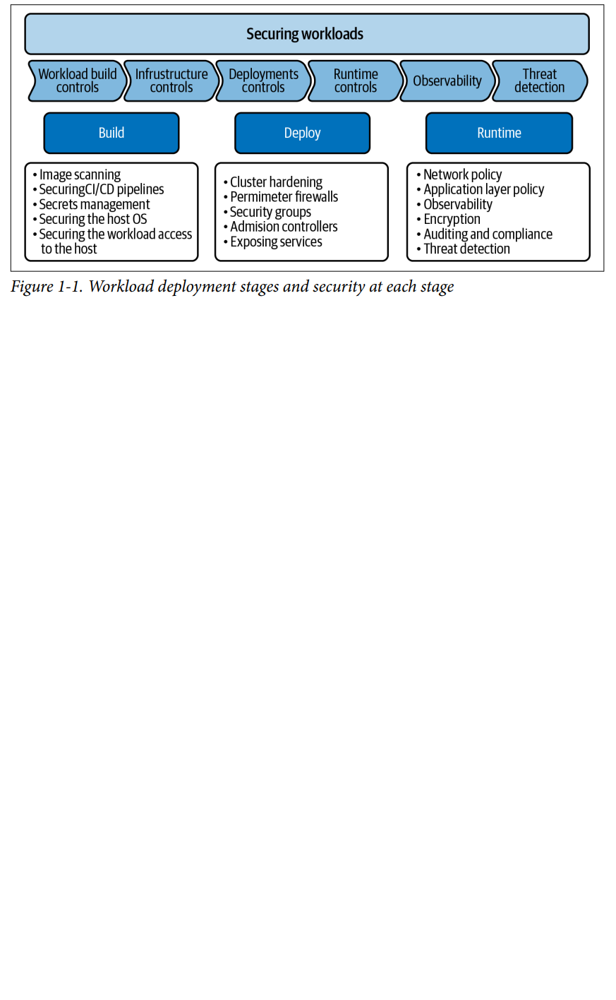
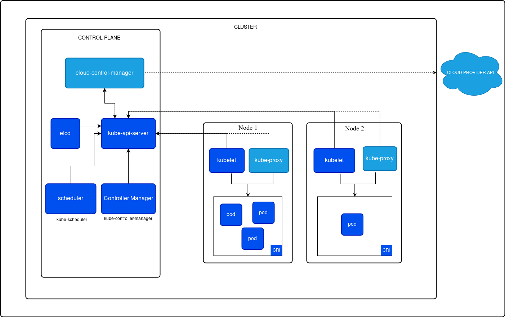

# Table of Contents
- [Kubernetes: Up and Running](#KubernetesUpAndRunning)
- [Kubernetes Security And Observability](#KubernetesSecurityAndObservability)
- [Kubernetes Concepts](#KubernetesConcepts)

# Kubernetes: Up and Running by Brendan Burns, Joe Beda, Kelsey Hightower, and Lachlan Evenson 2022 <a id="KubernetesUpAndRunning"></a>

## Creating and Running Containers

The traditional methods of running multiple programs on a single machine
require that all of these programs share the same versions of shared libraries
on the system.
Docker, the default tool most
people use for containers makes it easy to package an executable and push
it to a remote registry where it can later be pulled by others.
Container images bundle a program and its dependencies into a single
artifact under a root filesystem. The most popular container image format is
the Docker image format.

### Container Images

A container image is a binary package that
encapsulates all of the files necessary to run a program inside of an OS
container.

The most popular and widespread container image format is the Docker
image format, which was developed by the Docker open source project for
packaging, distributing, and running containers using the docker
command.

Each layer adds, removes, or modifies files from the preceding layer in the filesystem.

Containers fall into two main categories:

* System containers: seek to mimic virtual machines and often run a full boot
process. They often include a set of system services typically found in a
VM, such as ssh, cron, and syslog

* Application containers: they commonly run a single program

### Building Application Images with Docker

#### Dockerfiles

A Dockerfile can be used to automate the creation of a Docker container image.

The Dockerfile is a recipe for how to build the container image, while .dockerignore defines the set of files that should be ignored when copying files into the image.

```
# Start from a Node.js 16 (LTS) image 
FROM node:16
# Specify the directory inside the image in which all commands will
run 
WORKDIR /usr/src/app
# Copy package files and install dependencies 
COPY package*.json ./
RUN npm install
RUN npm install express
# Copy all of the app files into the image 
COPY . .
# The default command to run when starting the container 
CMD [ "npm", "start" ]
```

Run the following command to create the simple-node Docker image:

```
docker build -t simple-node .
```

To run this image:

```
docker run --rm -p 3000:3000 simple-nod
```

Optimizing Image Sizes:

* files that are removed by subsequent layers in the system are actually still present in the images.
* preceding layers means that they need to be rebuilt, repushed, and repulled to deploy your image to development. 
In general, __you want to order your layers from least likely to change to most likely to change in order to optimize the image size__ for pushing and pulling.
* __do not do the actual program compilation as part of the construction of the application container image__. The
trouble with doing this is that it leaves all of the unnecessary development tools, which are usually quite large

Image Security: __don’t build containers with passwords baked in__

### Storing Images in a Remote Registry

The standard within the Docker community is to store Docker images in a remote registry.

```
docker login

# tag the 'kuard' image by prepending the target Docker registry. Append another identifier that is usually used for the version of that image, separated by a colon (:)

docker tag kuard gcr.io/kuar-demo/kuard-amd64:blue

# push image to registry

docker push gcr.io/kuar-demo/kuard-amd64:blue

```

### The Container Runtime Interface

Kubernetes provides an API for describing an application deployment, but
relies on a container runtime to set up an application container using the
container-specific APIs native to the target OS.
The interface to this container runtime is defined by the Container Runtime Interface (CRI) standard.
When you install the docker tooling the containerd runtime is also installed and used by the Docker daemon.

A container runtime is the low-level software responsible for running containers on a system.

A container runtime:
- Pulls container images (from registries like Docker Hub).
- Unpacks and prepares container images.
- Isolates resources using Linux features like cgroups and namespaces.
- Launches and manages container processes.
- Handles networking and storage related to containers.
- Cleans up resources when containers stop.

Running Containers with Docker:

```
docker run -d --name kuard --publish 8080:8080 gcr.io/kuar-demo/kuard-amd64:blue
 ```

Docker provides the ability to limit the amount of resources used by
applications by exposing the underlying cgroup technology provided by the
Linux kernel. These capabilities are likewise used by Kubernetes to limit
the resources used by each Pod.

Limiting memory resources: use the --memory and --memory-swap flags

```
docker run -d --name kuard --publish 8080:8080 --memory 200m --memory-swap 1G gcr.io/kuar-demo/kuard-amd64:blue
 ```

Limiting CPU resources: Restrict CPU utilization using the --cpu-shares flag

```
 docker run -d --name kuard \
 --publish 8080:8080 \
 --memory 200m \
 --memory-swap 1G \
 --cpu-shares 1024 \
 gcr.io/kuar-demo/kuard-amd64:blue
```

## Deploying a Kubernetes Cluster

### Kubernetes components

* __controller-manager__: is responsible for running various controllers that regulate behavior in the cluster; for example, ensuring that all of the
replicas of a service are available and healthy.
* __scheduler__: is responsible for placing different Pods onto different nodes in the cluster.
* __etcd server__: is the storage for the cluster where all of the API objects are stored
* __nodes__: nodes are separated into control-plane nodes that contain containers like the API server, scheduler, etc., which manage the cluster,
and worker nodes where your containers will run

What to Install on a Kubernetes Node:
- Container Runtime (containerd, docker is depreciated)
- Kubelet
  - The node agent that registers the node with the control plane and runs containers via the runtime
- Kubeadm
  - A CLI tool to bootstrap the node (and cluster).
  - Used to join the node to an existing Kubernetes cluster.

#### Controller manager

The controller-manager in Kubernetes is a core component that runs controller loops—background processes that continuously monitor the cluster's state and work to move it toward the desired state as defined in the Kubernetes API (typically through manifests like Deployments, ReplicaSets, etc.).

Each controller watches for changes in the cluster and reconciles the actual state with the desired state.

For example:If a Deployment specifies 3 replicas but only 2 Pods are running, the ReplicaSet controller (within the controller-manager) will notice and create a third Pod

Key Controllers in the kube-controller-manager:

| Controller                    | What it manages                                             |
| ----------------------------- | ----------------------------------------------------------- |
| **Node controller**           | Monitors node health and manages node lifecycle.            |
| **Replication controller**    | Ensures the desired number of pod replicas are running.     |
| **Endpoints controller**      | Updates the Endpoints objects when Services or Pods change. |
| **ServiceAccount controller** | Creates default service accounts and tokens.                |
| **Namespace controller**      | Handles namespace lifecycle (e.g., cleanup when deleted).   |
| **Job controller**            | Watches `Job` objects and ensures Pods run to completion.   |
| **Deployment controller**     | Manages rolling updates and scaling for Deployments.        |


### The Kubernetes Client

The official Kubernetes client is kubectl: a command-line tool for interacting with the Kubernetes API

Install kubectl
```
sudo apt-get install -y kubectl
```

Configure kubectl
```
# Minikube
minikube start
kubectl config use-context minikube

# Amazon EKS
aws eks update-kubeconfig --region <REGION> --name <CLUSTER_NAME>
```

Test your connection
```
kubectl get nodes
```


Commands:

```
# check the version of the cluster
kubectl version

# verify that your cluster is generally healthy
kubectl get componentstatuses

# list out all of the nodes in your cluster
kubectl get nodes

# get more information about a specific node
kubectl describe nodes kube1

# label kubernetes objects
kubectl label pods bar color=red

# see logs
kubectl logs <pod-name>

# execute command in running container
kubectl exec -it <pod-name> -- bash

# see kubernetes events
kubectl get events

# top command
kubectl top nodes
kubectl top pods

# an easy way to see how a Kubernetes object changes over time:
kubectl get endpoints alpaca-prod --watch

```

### Cluster Components

* Kubernetes Proxy: responsible for routing network traffic to load-balanced services in the Kubernetes cluster. To do its job, the proxy must be
present on every node in the cluster.

* Kubernetes DNS: provides naming and discovery for the services that are defined in the cluster

* Kubernetes UI: 

### Namespaces

Kubernetes uses namespaces to organize objects in the cluster. You can think of each namespace as a folder that holds a set of objects.

### Creating, Updating, and Destroying Kubernetes Objects

Objects in the Kubernetes API are represented as JSON or YAML files

You can use kubectl to create (or update) this object in Kubernetes by running:

```
kubectl apply -f obj.yaml
```

If you want to see what the apply command will do without actually making the changes, you can use the --dry-run flag to print the objects
to the terminal without actually sending them to the server.

## Pods

A Pod is a collection of application containers and volumes running in the same execution environment. Pods, not containers, are the smallest
deployable artifact in a Kubernetes cluster. This means all of the containers in a Pod always land on the same machine.

Applications running in the same Pod share the same IP address and port
space (network namespace), have the same hostname (UTS namespace),
and can communicate using native interprocess communication channels.

In general, the right question to ask yourself when designing Pods is, “Will
these containers work correctly if they land on different machines?” If the
answer is “no,” a Pod is the correct grouping for the containers.

Create a Pod:

```
kubectl run kuard --generator=run-pod/v1 --image=gcr.io/kuar-demo/kuard-amd64:blue

# check
kubectl get pods
```

### Creating a Pod Manifest:

Pod manifests include a couple of key fields and attributes: 
* metadata section for describing the Pod and its labels,
* spec section for describing volumes and a list of containers that will run in the Pod

```
apiVersion: v1
kind: Pod
metadata:
    name: kuard
spec:
    containers:
    - image: gcr.io/kuar-demo/kuard-amd64:blue
      name: kuard
      ports:
      - containerPort: 8080
        name: http
        protocol: TCP
```

### Accessing Your Pod

#### Using Port Forwarding

```
kubectl port-forward kuard 8080:8080
```

A secure tunnel is created from your local machine, through the Kubernetes master, to the instance of the Pod running on one of the worker nodes.

#### Getting More Info with Logs

The kubectl logs command downloads the current logs from the running instance:

```
kubectl logs kuard
```

#### Running Commands in Your Container with exec

 execute commands in the context of the container itself:

 ```
kubectl exec -it kuard ash
 ```

### Health Checks

When you run your application as a container in Kubernetes, it is
automatically kept alive for you using a process health check. This health
check simply ensures that the main process of your application is always
running. If it isn’t, Kubernetes restarts it.

### Liveness Probe

Liveness health checks run application-specific logic, like loading a web page, to verify that the application is not just still running, but is
functioning properly.

Liveness determines if an application is running properly.

Liveness probes are defined per container

```
apiVersion: v1
kind: Pod
metadata:
    name: kuard
spec:
    containers:
    - image: gcr.io/kuar-demo/kuard-amd64:blue
      name: kuard
      livenessProbe:
        httpGet:
            path: /healthy
            port: 8080
        initialDelaySeconds: 5      # will not be called until 5 seconds after all the containers in the Pod are created
        timeoutSeconds: 1           # The probe must respond within the 1-second timeout
        periodSeconds: 10           # Kubernetes will call the probe every 10 seconds
        failureThreshold: 3         # If more than 3 consecutive probes fail, the container will fail and restart
      ports:
        - containerPort: 8080
          name: http
          protocol: TCP
```

### Readiness Probe

Readiness describes when a container is ready to serve user requests. Containers that fail readiness checks are removed from service load balancers

### Resource Management

Kubernetes allows users to specify two different resource metrics. Resource
requests specify the minimum amount of a resource required to run the
application. Resource limits specify the maximum amount of a resource that
an application can consume.

#### Minimum Required Resources:

Kubernetes guarantees that these resources are available to the Pod. The
most commonly requested resources are CPU and memory, but Kubernetes
supports other resource types as well, such as GPUs.

```
apiVersion: v1
kind: Pod
metadata:
    name: kuard
spec:
    containers:
    - image: gcr.io/kuar-demo/kuard-amd64:blue
      name: kuard
      resources:
        requests:
            cpu: "500m"
            memory: "128Mi"
        limits:
            cpu: "1000m"
            memory: "256Mi"

```

The Kubernetes scheduler will ensure that the sum of all requests of all Pods on a node does
not exceed the capacity of the node

#### Capping Resource Usage with Limits

You can also set a maximum on a it’s resource usage via resource limits.

When you establish limits on a container, the kernel is configured to ensure
that consumption cannot exceed these limits.

### Persisting Data with Volume

Using Volumes with Pods

```
apiVersion: v1
kind: Pod
metadata:
    name: kuard
spec:
    volumes:
    - name: "kuard-data"
      hostPath:
      path: "/var/lib/kuard"
    containers:
    - image: gcr.io/kuar-demo/kuard-amd64:blue
      name: kuard
      volumeMounts:
        - mountPath: "/data"
          name: "kuard-data"

```

There are a variety of ways you can use data in your application:

* Communication/synchronization: shared volume between two containers, forming the basis for communication between them
* Cache: An application may use a volume that is valuable for performance
* Persistent data: Sometimes you will use a volume for truly persistent data—data that is
independent of the lifespan of a particular Pod, and should move
between nodes in the cluster if a node fails or a Pod moves to a different
machine for some reason. To achieve this, Kubernetes supports a wide
variety of remote network storage volumes, including widely supported
protocols like NFS and iSCSI as well as cloud provider network storage
like Amazon’s Elastic Block Store
* Mounting the host filesystem

## Labels and Annotations

* Labels are key/value pairs that can be attached to Kubernetes objects such
as Pods and ReplicaSets

* Annotations, on the other hand, provide a storage mechanism that resembles
labels: key/value pairs designed to hold nonidentifying information that
tools and libraries can leverage

### Labels

In addition to enabling users to organize their infrastructure, labels play a
critical role in linking various related Kubernetes objects.

Kubernetes is a purposefully decoupled system. There is no hierarchy and all components
operate independently. However, in many cases objects need to relate to one
another, and these relationships are defined by labels and label selectors.

For example, ReplicaSets, which create and maintain multiple replicas of a
Pod, find the Pods that they are managing via a selector.

#### Label Selectors

Label selectors are used to filter Kubernetes objects based on a set of labels.

```
# show all pod labels
kubectl get pods --show-labels

# list Pods that have the ver label set to 2
kubectl get pods --selector="ver=2"
```

### Annotations

Annotations provide a place to store additional metadata for Kubernetes
objects where the sole purpose of the metadata is assisting tools and
libraries.

Annotations are used to provide extra information about where an object came from, how to use it,
or policy around that object.

Annotations are used to:
* Keep track of a “reason” for the latest update to an object.
* Communicate a specialized scheduling policy to a specialized scheduler.

## Service Discovery

Service-discovery tools help solve the problem of finding which processes are listening at which addresses for which services.

The Domain Name System (DNS) is the traditional system of service discovery on the internet. DNS is designed for relatively stable name
resolution with wide and efficient caching. It is a great system for the internet but falls short in the dynamic world of Kubernetes.

Real service discovery in Kubernetes starts with a Service object. A Service object is a way to create a named label selector.

The kubernetes service is automatically created for you so that you can find and talk to the Kubernetes API from within the app.

```
 kubectl run alpaca-prod \
 --image=gcr.io/kuar-demo/kuard-amd64:blue \
 --replicas=3 \
 --port=8080 \
 --labels="ver=1,app=alpaca,env=prod"
```

Kubernetes provides a DNS service exposed to Pods running in the cluster. This Kubernetes DNS service was installed as a system component when
the cluster was first created. The DNS service is, itself, managed by Kubernetes. The Kubernetes DNS service provides DNS names for cluster IPs

When referring to a service in your own namespace you can just use the
service name (alpaca-prod). You can also refer to a service in another
namespace with alpaca-prod.default. And, of course, you can use
the fully qualified service name (alpacaprod.default.svc.cluster.local.).

One nice thing the __Service object does is track which of your Pods are ready via a readiness check.__

Kubernetes service types:

* ????????????????????????????

### NodePort
In addition to a cluster IP, the system picks a
port (or the user can specify one), and every node in the cluster then
forwards traffic to that port to the service.
With this feature, if you can reach any node in the cluster you can contact a
service. You use the NodePort without knowing where any of the Pods for
that service are running.

Here we see that the system assigned port 32711 to this service. Now we
can hit any of our cluster nodes on that port to access the service. If you are
sitting on the same network, you can access it directly. If your cluster is in
the cloud someplace, you can use SSH tunneling with something like this:

```
ssh <node> -L 8080:localhost:32711
```

Now if you point your browser to http://localhost:8080 you will be connected to that service.

## HTTP Load Balancing with Ingress

Service object operates at Layer 4 (according to the OSI model ).
This means that it only forwards TCP and UDP connections and doesn’t look inside of those connections

In the case where these services are type: NodePort, you’ll have to have clients connect to a
unique port per service. In the case where these services are type:
LoadBalancer, you’ll be allocating (often expensive or scarce) cloud
resources for each service. But for HTTP (Layer 7)-based services, we can do better.

Kubernetes calls its HTTP-based load-balancing system Ingress. Ingress is a Kubernetes-native way to implement the “virtual hosting” pattern:
That program then parses the HTTP connection and, based on the Host header and the URL path that is requested, proxies the HTTP call to some other program.

CONTINUE: PAGE 115


# Kubernetes Security and Observability by Brendan Creane & Amit Gupta 2021 <a id="KubernetesSecurityAndObservability"></a>

Kubernetes is not secure by default. 

## Security and Observability Strategy

The reason Kubernetes is popular is its declarative nature: It abstracts infrastructure details and allows users to specify the workloads they want to
run and the desired outcomes. 

Kubernetes achieves this abstraction by managing workload creation, shutdown, and restart

In the Kubernetes world, workloads are built as container images and are deployed in a Kubernetes cluster using a configuration file (yaml)
This is typically integrated in the development process, and most development teams use continuous integration
(CI) and continuous delivery (CD) to ensure speedy and reliable delivery of software.

Adding a security-review step to this process is counterproductive, as the only logical place to add that is when the code is being committed.

### Deploying a Workload in Kubernetes: Security at Each Stage



The __build__ stage is where you create (build) software for your workload (application) and build the infrastructure components (host or virtual machines) to host applications. In this stage you consider security for:
* the CI/CD pipeline, 
* implement security for image repositories, 
* scan images for vulnerabilities,
* harden the host operating system,
* implement best practices to secure the image registry and avoid compromising the images in the image registry (use private registries)
* best practices for secrets management; secrets are like passwords that allow access to resources in your cluster

In most cases the development team is responsible for it.

The next stage, __deploy__, is where you set up the platform that runs your Kubernetes deployment and deploy workloads. In this stage you need to think about:
* the security best practices for configuring your Kubernetes cluster and providing external access to applications running inside your Kubernetes cluster,
* policies to limit access to workloads (pod security policies), 
* network policies to control applications’ access to the platform components, 
* role-based access control (RBAC) for access to resources (for example, service creation, namespace creation, and adding/changing labels to pods)

In most enterprises the platform team is responsible for this stage

The final stage is the __runtime__ stage, where you have deployed your application
and it is operational. In this stage you need to think about:
* network security, which involves controls using network policy, 
* threat defense (using techniques to detect and prevent malicious activity in the cluster), 
* enterprise security controls like compliance, auditing, and encryption. 

The security team is responsible for this stage of the deployment.


# Kubernetes Concepts <a id="KubernetesConcepts"></a>

https://kubernetes.io/docs/concepts/

## Advantages

Kubernetes provides you with:

* __Service discovery__ and __load balancing__ Kubernetes can expose a container using the DNS name or using their own IP address. If traffic to a container is high, Kubernetes is able to load balance and distribute the network traffic so that the deployment is stable.
* __Storage orchestration__ Kubernetes allows you to automatically mount a storage system of your choice, such as local storages, public cloud providers
* Automated ___rollouts and rollbacks___ You can describe the desired state for your deployed containers using Kubernetes, and it can change the actual state to the desired state at a controlled rate.
* Automatic bin packing You provide Kubernetes with a cluster of nodes that it can use to run containerized tasks. You tell Kubernetes how much CPU and memory (RAM) each container needs. Kubernetes __can fit containers onto your nodes__ to make the best use of your resources.
* __Self-healing__ Kubernetes restarts containers that fail, replaces containers, kills containers that don't respond to your user-defined health check, and doesn't advertise them to clients until they are ready to serve.
* __Secret and configuration management__ Kubernetes lets you store and manage sensitive information, such as passwords, OAuth tokens, and SSH keys.

## Kubernetes API

The core of Kubernetes' control plane is the API server.

The Kubernetes API lets you query and manipulate the state of API objects in Kubernetes.

Most operations can be performed through the kubectl command-line interface, which in turn use the API. However, you can also access the API directly using REST calls.

Each Kubernetes cluster publishes the specification of the APIs that the cluster serves. kubectl tool fetches and caches the API specification for enabling command-line completion and other features.

## Cluster Architecture

A Kubernetes cluster consists of a control plane plus a set of worker machines, called nodes, that run containerized applications. 



Control plane components:

* __kube-apiserver__: exposes the Kubernetes API
* __etcd__: Consistent and highly-available key value
* __kube-scheduler__: watches for newly created Pods with no assigned node, and selects a node for them to run on.
* __kube-controller-manager__: runs controller processes. There are many different types of controllers: Node controller, Job controller etc.
* __cloud-controller-manager__: embeds cloud-specific control logic. The cloud controller manager lets you link your cluster into your cloud provider's API

Node components:

* __kubelet__: An agent that runs on each node in the cluster. It makes sure that containers are running in a Pod.
* __kube-proxy__: network proxy that runs on each node in your cluster, implementing part of the Kubernetes Service concept. It maintains network rules on nodes. 
* __Container runtime__: empowers Kubernetes to run containers effectively. It is responsible for managing the execution and lifecycle of containers within the Kubernetes environment. Kubernetes supports container runtimes such as containerd,

Addons:

* DNS: Cluster DNS is a DNS server, in addition to the other DNS server(s) in your environment, which serves DNS records for Kubernetes services.
* Web UI (Dashboard)
* Container resource monitoring: records generic time-series metrics about containers in a central database, and provides a UI for browsing that data.
* Cluster-level Logging: responsible for saving container logs to a central log store with a search/browsing interface
* Network plugins:  software components that implement the container network interface (CNI) specification. They are responsible for allocating IP addresses to pods and enabling them to communicate with each other within the cluster

### Nodes

Kubernetes runs your workload by placing containers into Pods to run on Nodes. 

There are two main ways to have Nodes added to the API server:
* The kubelet on a node self-registers to the control plane
* You (or another human user) manually add a Node object

Kubernetes has a "hub-and-spoke" API pattern. All API usage from nodes (or the pods they run) terminates at the API server.

#### Node to Control Plane communication

Nodes should be provisioned with the public root certificate for the cluster such that they can connect securely to the API server along with valid client credentials. A good approach is that the client credentials provided to the kubelet are in the form of a client certificate. 

Pods that wish to connect to the API server can do so securely by leveraging a service account so that Kubernetes will automatically inject the public root certificate and a valid bearer token into the pod when it is instantiated.

#### Control plane to node communication

The first is from the API server to the kubelet process which runs on each node in the cluster. The second is from the API server to any node, pod, or service through the API server's proxy functionality

The connections from the API server to the kubelet are used for:
* Fetching logs for pods.
* Attaching (usually through kubectl) to running pods.
* Providing the kubelet's port-forwarding functionality.

API server to nodes, pods, and services: 
The connections from the API server to a node, pod, or service default to plain HTTP connections and are therefore neither authenticated nor encrypted. They can be run over a secure HTTPS connection by prefixing https: to the node, pod, or service name in the API URL, but they will not validate the certificate provided by the HTTPS endpoint nor provide client credentials. So while the connection will be encrypted, it will not provide any guarantees of integrity. These connections are not currently safe to run over untrusted or public networks

## Concepts

### Pods

Pods are the smallest deployable units of computing that you can create and manage in Kubernetes.
It is a group of one or more containers, with __shared storage and network resources__, and a specification for how to run the containers. 
A Pod's contents are __always co-located and co-scheduled__, and run in a shared context.

A Pod can contain init containers that run during Pod startup. You can also inject ephemeral containers for debugging a running Pod

The shared context of a Pod is a set of Linux namespaces, cgroups, and potentially other facets of isolation - the same things that isolate a container. A Pod is similar to a set of containers with shared namespaces and shared filesystem volumes.

Example:
```
apiVersion: v1
kind: Pod
metadata:
  name: nginx
spec:
  containers:
  - name: nginx
    image: nginx:1.14.2
    ports:
    - containerPort: 80

```

To create the Pod shown above:
```
kubectl apply -f simple-pod.yaml
```

#### Pod templates

Usually you don't need to create Pods directly, even singleton Pods. Instead, create them using workload resources such as Deployment or Job.

You can use workload resources to create and manage multiple Pods for you. 
A __controller__ for the resource handles replication and __rollout and automatic healing__ in case of Pod failure. 
Examples of workload __resources that manage one or more Pods: Deployment, StatefulSet, DeamonSet__

Controllers for workload resources create Pods from a __pod template__ and manage those Pods on your behalf. 
PodTemplates are specifications for creating Pods, and are included in workload resources such as __Deployments__, __Jobs__, and __DaemonSets__.

The sample below is a manifest for a simple Job with a template that starts one container:

```
apiVersion: batch/v1
kind: Job
metadata:
  name: hello
spec:
  template:
    # This is the pod template
    spec:
      containers:
      - name: hello
        image: busybox:1.28
        command: ['sh', '-c', 'echo "Hello, Kubernetes!" && sleep 3600']
      restartPolicy: OnFailure
    # The pod template ends here
```

The __StatefulSet__ controller ensures that the running Pods match the current pod template for each StatefulSet object. If you edit the StatefulSet to change its pod template, the StatefulSet starts to create new Pods based on the updated template. Eventually, all of the old Pods are replaced with new Pods, and the update is complete.

Each workload resource implements its own rules for handling changes to the Pod template.

#### Resource sharing and communication

Pods enable data sharing and communication among their constituent containers.

A Pod can specify a set of __shared storage volumes__. All containers in the Pod can access the shared volumes, allowing those containers to share data. Volumes also allow persistent data in a Pod to survive in case one of the containers within needs to be restarted.

Each Pod is assigned a unique IP address for each address family. Every container in a Pod shares the network namespace, including the IP address and network ports. Inside a Pod (and only then), the containers that belong to the Pod can communicate with one another using __localhost__.

The containers in a Pod can also communicate with each other using standard inter-process communications like SystemV semaphores or POSIX shared memory.

#### Pod security settings

To set security constraints on Pods and containers, you use the securityContext field in the Pod specification. This field gives you granular control over what a Pod or individual containers can do. For example:
* Drop specific Linux capabilities to avoid the impact of a CVE.
* Force all processes in the Pod to run as a non-root user or as a specific user or group ID.
* Set a specific seccomp profile.

#### Pod Lifecycle

Pods are only scheduled once in their lifetime; assigning a Pod to a specific node is called __binding__, and the process of selecting which node to use is called __scheduling__. 
If Kubernetes isn't able start the Pod on the selected node, then that particular Pod never starts.

If one of the containers in the Pod fails, then Kubernetes may try to restart that specific container. Pods can however fail in a way that the cluster cannot recover from. 

Kubernetes uses a higher-level abstraction, called a __controller__, that handles the work of managing the relatively disposable Pod instances.

__Pod phases:__ A Pod's status field is a PodStatus object, which has a phase field.
* Pending: The Pod has been accepted by the Kubernetes cluster, but one or more of the containers has not been set up and made ready to run.
* Running: The Pod has been bound to a node, and all of the containers have been created. At least one container is still running.
* Succeeded: All containers in the Pod have terminated in success, and will not be restarted
* Failed: All containers in the Pod have terminated, and at least one container has terminated in failure. 
* Unknown: For some reason the state of the Pod could not be obtained. 

__Pod conditions__: A Pod has a PodStatus, which has an array of PodConditions
* PodScheduled: the Pod has been scheduled to a node.
* PodReadyToStartContainers
* ContainersReady: all containers in the Pod are ready
* Initialized: all init containers have completed successfully.
* Ready: the Pod is able to serve requests

__Container states__:
* Waiting
* Running
* Terminated

Kubernetes manages container failures within Pods using a __restartPolicy__ defined in the Pod spec.

Your application can inject extra feedback or signals into PodStatus: Pod readiness. 
To use this, set readinessGates in the Pod's spec to specify a list of additional conditions that the kubelet evaluates for Pod readiness:

```
kind: Pod
...
spec:
  readinessGates:
    - conditionType: "www.example.com/feature-1"
status:
  conditions:
    - type: Ready                              # a built in PodCondition
      status: "False"
      lastProbeTime: null
      lastTransitionTime: 2018-01-01T00:00:00Z
    - type: "www.example.com/feature-1"        # an extra PodCondition
      status: "False"
      lastProbeTime: null
      lastTransitionTime: 2018-01-01T00:00:00Z
  containerStatuses:
    - containerID: docker://abcd...
      ready: true
```

#### Pod network readiness

After a Pod gets scheduled on a node, it needs to be admitted by the kubelet and to have any required storage volumes mounted. Once these phases are complete, the kubelet works with a container runtime (using Container runtime interface (CRI)) to set up a runtime sandbox and configure networking for the Pod.

#### Container probes

A probe is a diagnostic performed periodically by the kubelet on a container.

__Check mechanisms__: There are four different ways to check a container using a probe:
* exec: Executes a specified command inside the container.
* grpc: Performs a remote procedure call using gRPC.
* httpGet: Performs an HTTP GET request against the Pod's IP address on a specified port and path.
* tcpSocket: Performs a TCP check against the Pod's IP address on a specified port.

__Types of probe__:
* livenessProbe: Indicates whether the container is running. If the liveness probe fails, the kubelet kills the container, and the container is subjected to its restart policy
* readinessProbe: Indicates whether the container is ready to respond to requests. If the readiness probe fails, the endpoints controller removes the Pod's IP address from the endpoints of all Services that match the Pod.
* startupProbe: Indicates whether the application within the container is started. All other probes are disabled if a startup probe is provided, until it succeeds. If the startup probe fails, the kubelet kills the container, and the container is subjected to its restart policy. Startup probes are useful for Pods that have containers that take a long time to come into service. Rather than set a long liveness interval, you can configure a separate configuration for probing the container as it starts up, allowing a time longer than the liveness interval would allow.

#### Init Containers

Init containers are exactly like regular containers, except:
* Init containers always run to completion.
* Each init container must complete successfully before the next one starts.

#### Sidecar Containers

Sidecar containers are the secondary containers that run along with the main application container within the same Pod. These containers are used to enhance or to extend the functionality of the primary app container by providing additional services, or functionality such as logging, monitoring, security, or data synchronization, without directly altering the primary application code.

### Workload Management

Your applications run as containers inside Pods; however, managing individual Pods would be a lot of effort. For example, if a Pod fails, you probably want to run a new Pod to replace it. Kubernetes can do that for you.

You use the Kubernetes API to create a workload object that represents a higher abstraction level than a Pod, and then the Kubernetes control plane automatically manages Pod objects on your behalf.

#### Deployments

A Deployment provides declarative updates for Pods and ReplicaSets.
You describe a desired state in a Deployment, and the Deployment Controller changes the actual state to the desired state at a controlled rate.

```
apiVersion: apps/v1
kind: Deployment
metadata:
  name: nginx-deployment
  labels:
    app: nginx
spec:
  replicas: 3     #  three replicated Pods
  selector:
    matchLabels:
      app: nginx  # defines how the created ReplicaSet finds which Pods to manage
  template:
    metadata:
      labels:
        app: nginx
    spec:
      containers:
      - name: nginx
        image: nginx:1.14.2
        ports:
        - containerPort: 80
```
Create the Deployment by running the following command:

```
kubectl apply -f https://k8s.io/examples/controllers/nginx-deployment.yaml
```

#### ReplicaSet - do not use

A ReplicaSet's purpose is to maintain a stable set of replica Pods running at any given time.

A ReplicaSet is defined with fields, including a selector that specifies how to identify Pods it can acquire, a number of replicas indicating how many Pods it should be maintaining, and a pod template specifying the data of new Pods it should create to meet the number of replicas criteria. 

A ReplicaSet is linked to its Pods via the Pods' metadata.ownerReferences field, which specifies what resource the current object is owned by.

__Deployment is a higher-level concept that manages ReplicaSets and provides declarative updates to Pods along with a lot of other useful features.__ 
Therefore, we recommend using Deployments instead of directly using ReplicaSets, unless you require custom update orchestration or don't require updates at all.

```
apiVersion: apps/v1
kind: ReplicaSet
metadata:
  name: frontend
  labels:
    app: guestbook
    tier: frontend
spec:
  # modify replicas according to your case
  replicas: 3
  selector:
    matchLabels:
      tier: frontend
  template:
    metadata:
      labels:
        tier: frontend
    spec:
      containers:
      - name: php-redis
        image: us-docker.pkg.dev/google-samples/containers/gke/gb-frontend:v5

```

#### StatefulSets

StatefulSet is the workload API object used to manage stateful applications.

Manages the deployment and scaling of a set of Pods, and __provides guarantees about the ordering and uniqueness of these Pods.__

Like a Deployment, a StatefulSet manages Pods that are based on an identical container spec. 
Unlike a Deployment, a StatefulSet maintains a sticky identity for each of its Pods. These pods are created from the same spec, but are not interchangeable: each has a persistent identifier that it maintains across any rescheduling.

StatefulSets are valuable for applications that require one or more of the following.
* Stable, unique network identifiers.
* Stable, persistent storage.
* Ordered, graceful deployment and scaling.
* Ordered, automated rolling updates.

```
apiVersion: v1
kind: Service
metadata:
  name: nginx
  labels:
    app: nginx
spec:
  ports:
  - port: 80
    name: web
  clusterIP: None
  selector:
    app: nginx
---
apiVersion: apps/v1
kind: StatefulSet
metadata:
  name: web
spec:
  selector:
    matchLabels:
      app: nginx # has to match .spec.template.metadata.labels
  serviceName: "nginx"
  replicas: 3 # by default is 1
  minReadySeconds: 10 # by default is 0     
  template:
    metadata:
      labels:
        app: nginx # has to match .spec.selector.matchLabels
    spec:
      terminationGracePeriodSeconds: 10
      containers:
      - name: nginx
        image: registry.k8s.io/nginx-slim:0.24
        ports:
        - containerPort: 80
          name: web
        volumeMounts:
        - name: www
          mountPath: /usr/share/nginx/html
  volumeClaimTemplates:   # provide stable storage using PersistentVolumes provisioned by a PersistentVolume Provisioner.
  - metadata:
      name: www
    spec:
      accessModes: [ "ReadWriteOnce" ]
      storageClassName: "my-storage-class"
      resources:
        requests:
          storage: 1Gi
```

#### DaemonSet

A DaemonSet __ensures that all (or some) Nodes run a copy of a Pod__. 
As nodes are added to the cluster, Pods are added to them. 
As nodes are removed from the cluster, those Pods are garbage collected. Deleting a DaemonSet will clean up the Pods it created.

Some typical uses of a DaemonSet are:
* running a cluster storage daemon on every node
* running a logs collection daemon on every node
* running a node monitoring daemon on every node

```
apiVersion: apps/v1
kind: DaemonSet
metadata:
  name: fluentd-elasticsearch
  namespace: kube-system
  labels:
    k8s-app: fluentd-logging
spec:
  selector:
    matchLabels:
      name: fluentd-elasticsearch
  template:
    metadata:
      labels:
        name: fluentd-elasticsearch
    spec:
      tolerations:
      # these tolerations are to have the daemonset runnable on control plane nodes
      # remove them if your control plane nodes should not run pods
      - key: node-role.kubernetes.io/control-plane
        operator: Exists
        effect: NoSchedule
      - key: node-role.kubernetes.io/master
        operator: Exists
        effect: NoSchedule
      containers:
      - name: fluentd-elasticsearch
        image: quay.io/fluentd_elasticsearch/fluentd:v2.5.2
        resources:
          limits:
            memory: 200Mi
          requests:
            cpu: 100m
            memory: 200Mi
        volumeMounts:
        - name: varlog
          mountPath: /var/log
      # it may be desirable to set a high priority class to ensure that a DaemonSet Pod
      # preempts running Pods
      # priorityClassName: important
      terminationGracePeriodSeconds: 30
      volumes:
      - name: varlog
        hostPath:
          path: /var/log

```

#### Jobs

A Job creates one or more Pods and will continue to retry execution of the Pods until a specified number of them successfully terminate. 
As pods successfully complete, the Job tracks the successful completions. 
When a specified number of successful completions is reached, the task (ie, Job) is complete. 

__Parallel execution__ for Jobs:
* Non-parallel Jobs
* Parallel Jobs with a fixed completion count
* Parallel Jobs with a work queue: the Pods must coordinate amongst themselves or an external service to determine what each should work on.

__Controlling parallelism__: can be set to any non-negative value. 

#### CronJob

#### ReplicationController

#### Autoscaling Workloads = HorizontalPodAutoscaler

In Kubernetes, you can scale a workload depending on the current demand of resources.

Kubernetes supports manual scaling of workloads. 
Horizontal scaling can be done using the kubectl CLI. For vertical scaling, you need to patch the resource definition of your workload.

In Kubernetes, you can automatically scale a workload horizontally using a HorizontalPodAutoscaler (HPA).

Example setup:
```
apiVersion: apps/v1
kind: Deployment
metadata:
  name: php-apache
spec:
  selector:
    matchLabels:
      run: php-apache
  template:
    metadata:
      labels:
        run: php-apache
    spec:
      containers:
      - name: php-apache
        image: registry.k8s.io/hpa-example
        ports:
        - containerPort: 80
        resources:
          limits:
            cpu: 500m
          requests:
            cpu: 200m
---
apiVersion: v1
kind: Service
metadata:
  name: php-apache
  labels:
    run: php-apache
spec:
  ports:
  - port: 80
  selector:
    run: php-apache

```
and run it:
```
kubectl apply -f https://k8s.io/examples/application/php-apache.yaml
```

Roughly speaking, the HPA controller will increase and decrease the number of replicas (by updating the Deployment) to maintain an average CPU utilization across all Pods of 50%. The Deployment then updates the ReplicaSet - this is part of how all Deployments work in Kubernetes - and then the ReplicaSet either adds or removes Pods based on the change to its .spec.

To create the HorizontalPodAutoscaler:
```
kubectl autoscale deployment php-apache --cpu-percent=50 --min=1 --max=10
```

OR:

Create the HorizontalPodAutoscaler:
```
apiVersion: autoscaling/v2
kind: HorizontalPodAutoscaler
metadata:
  name: php-apache
spec:
  scaleTargetRef:
    apiVersion: apps/v1
    kind: Deployment
    name: php-apache
  minReplicas: 1
  maxReplicas: 10
  metrics:
  - type: Resource
    resource:
      name: cpu
      target:
        type: Utilization
        averageUtilization: 50
status:
  observedGeneration: 1
  lastScaleTime: <some-time>
  currentReplicas: 1
  desiredReplicas: 1
  currentMetrics:
  - type: Resource
    resource:
      name: cpu
      current:
        averageUtilization: 0
        averageValue: 0
```

It is also possible to __scale workloads based on events__, for example using the Kubernetes Event Driven Autoscaler (__KEDA__).

Another strategy for scaling your workloads is to schedule the scaling operations, for example in order to reduce resource consumption during off-peak hours.

### Services, load balancing, networking

Every Pod in a cluster gets its own unique __cluster-wide IP__ address. Pods can be treated much like VMs or physical host.

- __Containers__ within a Pod use networking to communicate via loopback (__localhost__)
- Cluster networking provides communication between different Pods.
- The __Service API__ lets you expose an _application running in Pods_ to be reachable from __outside your cluster__.
  - Ingress provides extra functionality specifically for exposing HTTP applications, websites and APIs.
  - Gateway API is an add-on that provides an expressive, extensible, and role-oriented family of API kinds for modeling service networking.
- You can also use Services to publish services only for consumption inside your cluster.

#### Service

Service is a method for exposing a network application that is running as one or more Pods in your cluster.

You can run code in Pods. You __use a Service to make that set of Pods available on the network so that clients can interact with it__.

If you use a Deployment to run your app, that Deployment can create and destroy Pods dynamically. From one moment to the next, you don't know how many of those Pods are working and healthy; Kubernetes Pods are created and destroyed to match the desired state of your cluster. Pods are ephemeral resources.

Each Pod gets its own IP address

The Service API, part of Kubernetes, is an __abstraction to help you expose groups of Pods over a network__. 
Each Service object defines a logical set of endpoints (usually these endpoints are Pods) along with a policy about how to make those pods accessible.

The set of Pods targeted by a Service is usually determined by a __selector__ that you define.

Create a Service before its corresponding backend workloads (Deployments or ReplicaSets), and before any workloads that need to access it. 
When Kubernetes starts a container, it provides environment variables pointing to all the Services which were running when the container was started. 
__Service that a Pod wants to access must be created before the Pod__ itself, or else the environment variables will not be populated. DNS does not have this restriction.

suppose you have a set of Pods that each listen on TCP port 9376 and are labelled as app.kubernetes.io/name=MyApp. You can define a Service to publish that TCP listener:

```
apiVersion: v1
kind: Pod
metadata:
  name: nginx
  labels:
    app.kubernetes.io/name: proxy
spec:
  containers:
  - name: nginx
    image: nginx:stable
    ports:
      - containerPort: 80
        name: http-web-svc

---
apiVersion: v1
kind: Service
metadata:
  name: nginx-service
spec:
  selector:
    app.kubernetes.io/name: proxy
  ports:
  - name: name-of-service-port
    protocol: TCP
    port: 80
    targetPort: http-web-svc
```

Kubernetes assigns this Service an IP address (the __cluster IP__)

The controller for that Service continuously scans for Pods that match its selector

__Port definitions__ in Pods have names, and you can reference these names in the targetPort attribute of a Service. 

You can define a Service without specifying a selector to match Pods. For example:

```
apiVersion: v1
kind: Service
metadata:
  name: my-service
spec:
  ports:
    - name: http
      protocol: TCP
      port: 80
      targetPort: 9376
```
Because this Service has no selector, the corresponding EndpointSlice (and legacy Endpoints) objects are not created automatically. 
You can map the Service to the network address and port where it's running, by adding an EndpointSlice object manually.

This makes sense for the following use cases:
- You want to have an external database cluster in production, but in your test environment you use your own databases.
- You want to point your Service to a Service in a different Namespace or on another cluster.
- You are migrating a workload to Kubernetes. While evaluating the approach, you run only a portion of your backends in Kubernetes.

Example:
```
apiVersion: discovery.k8s.io/v1
kind: EndpointSlice
metadata:
  name: my-service-1 # by convention, use the name of the Service
                     # as a prefix for the name of the EndpointSlice
  labels:
    # You should set the "kubernetes.io/service-name" label.
    # Set its value to match the name of the Service
    kubernetes.io/service-name: my-service
addressType: IPv4
ports:
  - name: http # should match with the name of the service port defined above
    appProtocol: http
    protocol: TCP
    port: 9376
endpoints:
  - addresses:
      - "10.4.5.6"
  - addresses:
      - "10.1.2.3"
```

Service types:
* __ClusterIP__: Exposes the Service on a cluster-internal IP. Choosing this value makes the Service only reachable from within the cluster. 
This is the __default__. You can expose the Service to the public internet using an Ingress or a Gateway.
* __NodePort__: Exposes the Service on each Node's IP at a static port. Kubernetes control plane allocates a port from a range specified by --service-node-port-range flag (default: 30000-32767)
* __LoadBalancer__: Exposes the Service externally using an external load balancer. Kubernetes does not directly offer a load balancing component; you must provide one. Used on On cloud providers which support external load balancers. Traffic from the external load balancer is directed at the backend Pods. The cloud provider decides how it is load balanced.
* __ExternalName__: Maps the Service to the contents of the externalName field. The mapping configures your cluster's DNS server to return a CNAME record with that external hostname value. No proxying of any kind is set up.

ClusterIP:
- It’s a virtual IP address assigned to a Service.
- Used for internal communication between components in the cluster (e.g., Pods talking to other Pods via Services).
- Not reachable from outside the cluster (no public access).
- DNS Routes traffic from the ClusterIP to the correct backend Pods using kube-proxy and iptables/ipvs.

NodePort:
- type of Service that exposes an application on a static port on each Node's IP—allowing access from outside the cluster.
- Kubernetes assigns a NodePort (or you can set one manually).
- Each node in the cluster listens on that port.
- kube-proxy routes incoming traffic to the correct backend Pod via a ClusterIP.


#### Ingress

Make your HTTP (or HTTPS) network __service__ available using a protocol-aware configuration mechanism, that understands web concepts like URIs, hostnames, paths, and more. The Ingress concept lets you map traffic to different backends based on rules you define via the Kubernetes API.

An Ingress may be configured to __give Services externally-reachable URLs__, load balance traffic, terminate SSL / TLS, and offer name-based virtual hosting

Exposing services other than HTTP and HTTPS to the internet typically uses a service of type Service.Type=NodePort or Service.Type=LoadBalancer.

You must have an Ingress controller to satisfy an Ingress. Only creating an Ingress resource has no effect.

```
apiVersion: networking.k8s.io/v1
kind: Ingress
metadata:
  name: minimal-ingress
  annotations:
    nginx.ingress.kubernetes.io/rewrite-target: /
spec:
  ingressClassName: nginx-example
  rules:
  - http:
      paths:
      - path: /testpath
        pathType: Prefix
        backend:
          service:
            name: test
            port:
              number: 80
```

An Ingress needs apiVersion, kind, metadata and spec fields. The name of an Ingress object must be a valid DNS subdomain name.

Each HTTP rule contains the following information:
* An optional host. In this example, no host is specified, so the rule applies to all inbound HTTP traffic through the IP address specified
* A list of paths (for example, /testpath), each of which has an associated backend defined with a service.name and a service.port.name or service.port.number
* A backend is a combination of Service and port names

Types of Ingress:
* Ingress backed by a __single Service__
* Simple __fanout__ - routes traffic from a single IP address to more than one Service, based on the HTTP URI being requested
* Name __based virtual hosting__ - multiple host names at the same IP address

#### Ingress Controllers

In order for an Ingress to work in your cluster, there must be an ingress controller running.

#### Gateway API

Gateway API is a family of API kinds that provide dynamic infrastructure provisioning and advanced traffic routing.

### Storage

#### Volumes

On-disk files in a container are ephemeral, which presents some problems for non-trivial applications when running in containers. 

* One problem occurs when a __container crashes or is stopped__. 
Container state is not saved so all of the files that were created or modified during the lifetime of the container are lost. 
During a crash, kubelet restarts the container with a clean state. 
* Another problem occurs when multiple containers are running in a Pod and need to __share files__. 
It can be challenging to setup and access a shared filesystem across all of the containers. 

The Kubernetes volume abstraction solves both of these problems.

A Pod can use any number of volume types simultaneously. __Ephemeral__ volume types have a lifetime of a pod, but __persistent__ volumes exist beyond the lifetime of a pod

To use a volume, specify the volumes to provide for the Pod in .spec.volumes and __declare where to mount those volumes__ into containers in .spec.containers[*].volumeMounts.

Types of volumes:

* azureFile CSI migration
* azureFile CSI migration
* ... many,many
* configMap - provides a way to inject configuration data into pods. The data stored in a ConfigMap can be referenced in a volume of type configMap and then consumed by containerized applications running in a pod.
```
apiVersion: v1
kind: Pod
metadata:
  name: configmap-pod
spec:
  containers:
    - name: test
      image: busybox:1.28
      command: ['sh', '-c', 'echo "The app is running!" && tail -f /dev/null']
      volumeMounts:
        - name: config-vol
          mountPath: /etc/config
  volumes:
    - name: config-vol
      configMap:
        name: log-config
        items:
          - key: log_level
            path: log_level
```
* downwardAPI
* emptyDir - the volume is created when the Pod is assigned to a node. As the name says, the emptyDir volume is initially empty. All containers in the Pod can read and write the same files in the emptyDir volume, though that volume can be mounted at the same or different paths in each container
* hostPath -  mounts a file or directory from the host node's filesystem into your Pod.
* local - mounted local storage device such as a disk, partition or directory.
* nfs - allows an existing NFS (Network File System) share to be mounted into a Pod
* persistentVolumeClaim - used to mount a PersistentVolume into a Pod
* secret -  pass sensitive information, such as passwords, to Pods. You can store secrets in the Kubernetes API and mount them as files for use by pods without coupling to Kubernetes directly.

#### Persistent Volumes

The PersistentVolume subsystem provides an API for users and administrators that abstracts details of how storage is provided from how it is consumed. To do this, we introduce two new API resources: PersistentVolume and PersistentVolumeClaim.

A __PersistentVolume__ (PV) is a piece of storage in the cluster that has been provisioned by an administrator or dynamically provisioned using Storage Classes. It is a resource in the cluster just like a node is a cluster resource.

A __PersistentVolumeClaim__ (PVC) is a request for storage by a user. It is similar to a Pod. Pods consume node resources and PVCs consume PV resources. Pods can request specific levels of resources (CPU and Memory). Claims can request specific size and access modes

__Lifecycle__ of a volume and claim:
* Provisioning: statically (cluster administrator creates a number of PVs) or dynamically (cluster may try to dynamically provision a volume specially for the PVC).
* Binding: A user creates, or in the case of dynamic provisioning, has already created, a PersistentVolumeClaim with a specific amount of storage requested and with certain access modes. A control loop in the control plane watches for new PVCs, finds a matching PV (if possible), and binds them together. If a PV was dynamically provisioned for a new PVC, the loop will always bind that PV to the PVC.
* Using: 
* Reclaiming: user is done with their volume, they can delete the PVC objects from the API that allows reclamation of the resource. The reclaim policy for a PersistentVolume tells the cluster what to do with the volume after it has been released of its claim.
* Retain: allows for manual reclamation of the resource. When the PersistentVolumeClaim is deleted, the PersistentVolume still exists and the volume is considered "released". But it is not yet available for another claim because the previous claimant's data remains on the volume. An administrator can manually reclaim the volume
* Delete:  removes both the PersistentVolume object from Kubernetes, as well as the associated storage asset in the external infrastructure.
* Recycle

#### Storage Classes

A StorageClass provides a way for administrators to describe the classes of storage they offer. Different classes might map to quality-of-service levels, or to backup policies

### Configuration

#### ConfigMaps

Use a ConfigMap for setting configuration data separately from application code.

A ConfigMap is an API object that lets you store configuration for other objects to use

You can write a Pod spec that refers to a ConfigMap and configures the container(s) in that Pod based on the data in the ConfigMap. The Pod and the ConfigMap must be in the same namespace.

Example ConfigMap that has some keys with single values, and other keys where the value looks like a fragment of a configuration format

```
apiVersion: v1
kind: ConfigMap
metadata:
  name: game-demo
data:
  # property-like keys; each key maps to a simple value
  player_initial_lives: "3"
  ui_properties_file_name: "user-interface.properties"

  # file-like keys
  game.properties: |
    enemy.types=aliens,monsters
    player.maximum-lives=5    
  user-interface.properties: |
    color.good=purple
    color.bad=yellow
    allow.textmode=true    

```

There are four different ways that you can use a ConfigMap to configure a container inside a Pod:

* Inside a container command and args
* Environment variables for a container
* Add a file in read-only volume, for the application to read
* Write code to run inside the Pod that uses the Kubernetes API to read a ConfigMap

Example Pod that uses values from game-demo to configure a Pod:

```
apiVersion: v1
kind: Pod
metadata:
  name: configmap-demo-pod
spec:
  containers:
    - name: demo
      image: alpine
      command: ["sleep", "3600"]
      env:
        # Define the environment variable
        - name: PLAYER_INITIAL_LIVES # Notice that the case is different here
                                     # from the key name in the ConfigMap.
          valueFrom:
            configMapKeyRef:
              name: game-demo           # The ConfigMap this value comes from.
              key: player_initial_lives # The key to fetch.
        - name: UI_PROPERTIES_FILE_NAME
          valueFrom:
            configMapKeyRef:
              name: game-demo
              key: ui_properties_file_name
      volumeMounts:
      - name: config
        mountPath: "/config"
        readOnly: true
  volumes:
  # You set volumes at the Pod level, then mount them into containers inside that Pod
  - name: config
    configMap:
      # Provide the name of the ConfigMap you want to mount.
      name: game-demo
      # An array of keys from the ConfigMap to create as files
      items:
      - key: "game.properties"
        path: "game.properties"
      - key: "user-interface.properties"
        path: "user-interface.properties"
```
#### Secrets

A Secret is an object that contains a small amount of sensitive data such as a password, a token, or a key. Such information might otherwise be put in a Pod specification or in a container image.

Secrets are similar to ConfigMaps but are specifically intended to hold confidential data

Kubernetes Secrets are, by default, stored unencrypted in the API server's underlying data store (etcd). Anyone with API access can retrieve or modify a Secret, and so can anyone with access to etcd. Additionally, anyone who is authorized to create a Pod in a namespace can use that access to read any Secret in that namespace; this includes indirect access such as the ability to create a Deployment.

In order to safely use Secrets, take at least the following steps:
* Enable Encryption at Rest for Secrets.
* Enable or configure RBAC rules with least-privilege access to Secrets.
* Restrict Secret access to specific containers.
* Consider using external Secret store providers.

[NEXT TODO](https://kubernetes.io/docs/concepts/configuration/secret/)


# Other

## Helm 

Helm Charts help you define, install, and upgrade even the most complex Kubernetes application.

__Concepts__:
* The chart is a bundle of information necessary to create an instance of a Kubernetes application. A chart is a collection of files that describe a related set of Kubernetes resources.
* The config contains configuration information that can be merged into a packaged chart to create a releasable object.
* A release is a running instance of a chart, combined with a specific config.

__File Structure__: A chart is organized as a collection of files inside of a directory. The directory name is the name of the chart

Example:
```
wordpress/
  Chart.yaml          # A YAML file containing information about the chart
  LICENSE             # OPTIONAL: A plain text file containing the license for the chart
  README.md           # OPTIONAL: A human-readable README file
  values.yaml         # The default configuration values for this chart
  values.schema.json  # OPTIONAL: A JSON Schema for imposing a structure on the values.yaml file
  charts/             # A directory containing any charts upon which this chart depends.
  crds/               # Custom Resource Definitions
  templates/          # A directory of templates that, when combined with values, will generate valid Kubernetes manifest files.
  templates/NOTES.txt # OPTIONAL: A plain text file containing short usage notes

```
Example of ConfigMap mychart/templates/configmap.yaml template:
```
apiVersion: v1
kind: ConfigMap
metadata:
  name: {{ .Release.Name }}-configmap
data:
  myvalue: "Hello World"
```

We can install it like this:
```
helm install full-coral ./mychart
```

Return the rendered template to you so you can see the output:
```
helm install --debug --dry-run goodly-guppy ./mychart. 
```

### Example

From https://github.com/helm/examples/tree/main/charts/hello-world

Chart.yaml
```
apiVersion: v2
name: hello-world
description: A Helm chart for Kubernetes

# A chart can be either an 'application' or a 'library' chart.
#
# Application charts are a collection of templates that can be packaged into versioned archives
# to be deployed.
#
# Library charts provide useful utilities or functions for the chart developer. They're included as
# a dependency of application charts to inject those utilities and functions into the rendering
# pipeline. Library charts do not define any templates and therefore cannot be deployed.
type: application

# This is the chart version. This version number should be incremented each time you make changes
# to the chart and its templates, including the app version.
# Versions are expected to follow Semantic Versioning (https://semver.org/)
version: 0.1.0

# This is the version number of the application being deployed. This version number should be
# incremented each time you make changes to the application. Versions are not expected to
# follow Semantic Versioning. They should reflect the version the application is using.
# It is recommended to use it with quotes.
appVersion: "1.16.0"
```

values.yaml
```
# Default values for hello-world.
# This is a YAML-formatted file.
# Declare variables to be passed into your templates.

replicaCount: 1

image:
  repository: nginx
  pullPolicy: IfNotPresent
  # Overrides the image tag whose default is the chart appVersion.
  tag: ""

nameOverride: ""
fullnameOverride: ""

serviceAccount:
  # Specifies whether a service account should be created
  create: true
  # Annotations to add to the service account
  annotations: {}
  # The name of the service account to use.
  # If not set and create is true, a name is generated using the fullname template
  name: ""

service:
  type: ClusterIP
  port: 80
```

templates/service.yaml
```
apiVersion: v1
kind: Service
metadata:
  name: {{ include "hello-world.fullname" . }}
  labels:
    {{- include "hello-world.labels" . | nindent 4 }}
spec:
  type: {{ .Values.service.type }}
  ports:
    - port: {{ .Values.service.port }}
      targetPort: http
      protocol: TCP
      name: http
  selector:
    {{- include "hello-world.selectorLabels" . | nindent 4 }}
```

templates/deployment.yaml
```
apiVersion: apps/v1
kind: Deployment
metadata:
  name: {{ include "hello-world.fullname" . }}
  labels:
    {{- include "hello-world.labels" . | nindent 4 }}
spec:
  replicas: {{ .Values.replicaCount }}
  selector:
    matchLabels:
      {{- include "hello-world.selectorLabels" . | nindent 6 }}
  template:
    metadata:
      labels:
        {{- include "hello-world.selectorLabels" . | nindent 8 }}
    spec:
      serviceAccountName: {{ include "hello-world.serviceAccountName" . }}
      containers:
        - name: {{ .Chart.Name }}
          image: "{{ .Values.image.repository }}:{{ .Values.image.tag | default .Chart.AppVersion }}"
          imagePullPolicy: {{ .Values.image.pullPolicy }}
          ports:
            - name: http
              containerPort: 80
              protocol: TCP
          livenessProbe:
            httpGet:
              path: /
              port: http
          readinessProbe:
            httpGet:
              path: /
              port: http
```

## Kubernetes Deployments: Rolling vs Canary vs Blue-Green 

https://dev.to/pavanbelagatti/kubernetes-deployments-rolling-vs-canary-vs-blue-green-4k9p

### Canary Deployment

Technique for rolling out new features or changes to a small subset of users or servers before releasing the update to the entire system. This is done by creating a __new replica set__ with the updated version of the software while keeping the original replica set running. A small percentage of traffic is then routed to the new replica set, while the majority of the traffic continues to be served by the original replica set.

#### Example

Create three replicas of our application. The deployment uses a selector to find the appropriate pods to manage based on the label app: myapp.

The template section specifies the configuration for the pods created by the deployment. In this case, we're running a single container in each pod, which is specified with the containers field. The container image used is myapp:v1, which is the first version of our application.

The readinessProbe checks whether the container is ready to receive traffic, and the livenessProbe checks whether the container is still running. If either of these probes fails, the pod will be restarted.

```
apiVersion: apps/v1
kind: Deployment
metadata:
  name: myapp-deployment
spec:
  replicas: 3
  selector:
    matchLabels:
      app: myapp
  template:
    metadata:
      labels:
        app: myapp
    spec:
      containers:
      - name: myapp-container
        image: myapp:v1
        ports:
        - containerPort: 8080
      readinessProbe:
        httpGet:
          path: /
          port: 8080
        initialDelaySeconds: 5
        periodSeconds: 5
      livenessProbe:
        httpGet:
          path: /
          port: 8080
        initialDelaySeconds: 10
        periodSeconds: 10
```

To perform a canary deployment, we would create a second deployment YAML file that specifies the new version of the application, for example, myapp:v2. We would then update the original deployment to set up a canary test by scaling up the replicas of the new version to 1 while keeping the replicas of the old version at 2.

### Rolling Deployment

Kubernetes rolling deployment is a strategy for updating and deploying new versions of software in a controlled and gradual manner. Instead of deploying updates all at once, Kubernetes rolls out changes incrementally, reducing the risk of downtime and allowing for easy rollbacks in case of errors. 

Rolling deployment involves creating a new replica set with the updated version of the software while gradually scaling down the old replica set.

Once the new version is fully deployed, the old replica set is deleted, and the deployment is complete. 

#### Example

This deployment that will create three replicas of our application. The deployment uses a selector to find the appropriate pods to manage based on the label app: myapp.

The strategy section specifies the strategy that Kubernetes should use to update the deployment. In this case, we are using a RollingUpdate strategy. This means that Kubernetes will gradually update the deployment by replacing old replicas with new replicas.


```
apiVersion: apps/v1
kind: Deployment
metadata:
  name: myapp-deployment
spec:
  replicas: 3
  selector:
    matchLabels:
      app: myapp
  strategy:
    type: RollingUpdate
    rollingUpdate:
      maxSurge: 1
      maxUnavailable: 1
  template:
    metadata:
      labels:
        app: myapp
    spec:
      containers:
      - name: myapp-container
        image: myapp:v1
        ports:
        - containerPort: 8080
```

The template section specifies the configuration for the pods created by the deployment. In this case, we're running a single container in each pod, which is specified with the containers field. The container image used is myapp:v1, which is the first version of our application.

To update the deployment, we would create a new deployment YAML file that specifies the new version of the application, for example, myapp:v2. We would then update the original deployment to point to the new YAML file.

Once the update is started, Kubernetes will gradually replace old replicas with new ones until all replicas run the new version. The rolling update process allows for updates to be performed with minimal disruption to users

## Blue-Green Deployment Strategy

The Blue-Green Kubernetes deployment strategy is a technique for releasing new versions of an application to minimise downtime and risk. It involves running two identical environments, one serving as the active production environment (blue) and the other as a new release candidate (green). The new release candidate is thoroughly tested before being switched with the production environment, allowing for a smooth transition without any downtime or errors.

### Example

```
apiVersion: apps/v1
kind: Deployment
metadata:
  name: my-app
  labels:
    app: my-app
spec:
  replicas: 2
  selector:
    matchLabels:
      app: my-app
  template:
    metadata:
      labels:
        app: my-app
        version: blue
    spec:
      containers:
        - name: my-app
          image: myregistry/my-app:blue
          ports:
            - containerPort: 8080
---
apiVersion: v1
kind: Service
metadata:
  name: my-app-service
spec:
  selector:
    app: my-app
  ports:
    - protocol: TCP
      port: 80
      targetPort: 8080
```

In this example, we define a deployment for an application called "my-app" with two replicas. The deployment has a label selector of "app: my-app", which will match the corresponding service that routes traffic to the deployment.

The first template defines the "blue" version of the application. It is defined with the label "version: blue", which allows for easy identification of the version currently in production. The container image for this version is pulled from the Docker registry at "myregistry/my-app:blue".
When a new version is ready, a new template is added with the label "version: green". This new template will have an updated container image with the new version of the application. Once this new template has been created and is ready to be released, the Kubernetes service can be updated to route traffic to the new "green" deployment.


## TODO:

* what is cluster IP? It is a special IP address the system will load-balance across all of the Pods that are identified by the selector.
* what is NodePort? 
* access a pod or container to debug it

# Kubernetes Interview Questions

## What are the main components of Kubernetes architecture?

```
Kubernetes Cluster
├── Master nodes aka Control Plane (often multiple nodes for HA)
│   ├── kube-apiserver: Exposes the Kubernetes API, All interactions go through it
│   ├── etcd: consistent, distributed key-value store.
│   ├── kube-scheduler: Assigns Pods to suitable nodes based on resource requirements
│   ├── kube-controller-manager: collection of background controllers that watch the cluster state via the API server
│   └── cloud-controller-manager: Integrates with cloud providers (AWS, GCP, Azure, etc.) for:
|                      Load balancers
|                      Node management
|                      Storage (volumes)
|                      Route management
└── Worker Nodes (many)
    ├── kubelet
    ├── kube-proxy
    └── Container Runtime (containerd / CRI-O / ...)
        └── Pods (containers)
```

## What is kube-apiserver?

The Kubernetes API server validates and configures data for API objects (such as Pods, Services, Deployments, ConfigMaps, Secrets, Namespaces, and others). It provides a RESTful API (HTTP-based) that exposes the cluster's shared state, acting as the single entry point.

- Exposes the Kubernetes API
- Authentication: Verifies who is making the request (e.g., via certificates, tokens, OIDC, webhook, service accounts, basic auth, etc.).
- Authorization: Checks if the authenticated user is allowed to perform the action
- Persistence: If valid, writes/updates the object to etcd (the backing store). Reads from etcd to respond to queries.


## What is kube-scheduler?

The Kubernetes scheduler is a control plane process which assigns Pods to Nodes. The scheduler determines which Nodes are valid placements for each Pod in the scheduling queue according to constraints and available resources.

- Watches for Unschedulable Pods Monitors the API server for newly created Pods with no nodeName set
- Adds to Scheduling Queue
- Scheduling Cycle

## What is kube-controller-manager?

It runs as a daemon and embeds multiple built-in controllers — each acting as a continuous control loop that watches the cluster's current state (via the API server) and works to reconcile it toward the desired state defined in your objects (Deployments, StatefulSets, Jobs, etc.)

- Watches the API Server: Uses watch mechanisms to monitor changes to objects
- Reconciles State
  - For each controller:
    - Compares actual state (what's running) vs desired state (spec in the object).
    - Takes corrective actions
- No Direct Execution: 
  - It doesn't run containers itself — it updates objects via the kube-apiserver, which then triggers other components (e.g., kubelet starts Pods, kube-scheduler assigns nodes)

## What is kubelet?

It is the primary agent running on each Kubernetes node (worker server) that ensures containers described in PodSpecs are running and healthy, acting as the vital link between the cluster's control plane and the node itself. 
It receives instructions from the API server, manages the pod lifecycle (starting, stopping, restarting containers), enforces resource limits, and reports the node's status back to the control plane, making abstract cluster intent concrete on the node. 

Functions:
- __Pod Management__: Takes PodSpecs (YAML/JSON defining pods) and ensures the actual containers match the desired state. 
- __Health Monitoring__: Checks container health, restarts crashed containers, and handles liveness/readiness probes. 
- __Node Registration__: Registers the node with the Kubernetes API server. 
- __Communication__: Communicates with the control plane to get work and report status. 
- __Resource Enforcement__: Applies resource and security constraints defined in the PodSpec. 

How it works:
- The Kubernetes control plane (like the Scheduler) tells Kubelet which pods to run on its specific node. 
- Kubelet reads these instructions (PodSpecs). 
- It uses a container runtime (like Docker, though Dockershim is deprecated) to create and manage the containers. 
- It constantly monitors the pods and reports their status (e.g., running, failed, resource usage) back to the API server. 


## What is kube-proxy?

Its primary responsibility is to ensure that network traffic intended for a stable Service IP address is properly routed and load-balanced to the ephemeral IP addresses of the backend Pods, even as those Pods are created, terminated, or rescheduled

Functions:
- __Service-to-Pod Mapping__: Pod IPs change frequently, but Service IPs are stable. Kube-proxy continuously watches the Kubernetes API server for changes to Service and EndpointSlice objects and programs the node's network stack (e.g., using iptables or IPVS) to translate the Service's virtual IP and port to an available backend Pod's IP and port.
- __Load Balancing__: Kube-proxy distributes traffic across all healthy Pods associated with a Service. The specific load-balancing algorithm (e.g., round-robin or least connections) depends on the operating mode.
- __Health Checks and Failover__: If a Pod becomes unhealthy or is terminated, kube-proxy detects this change via the API server and automatically updates the network rules to stop routing traffic to that Pod, ensuring requests only go to healthy endpoints.
- __Enabling Service Types__: It is responsible for implementing the internal ClusterIP services, as well as enabling external access via NodePort and LoadBalancer services by opening ports on the nodes and configuring the necessary routing

## What is Container Runtime (e.g., containerd, CRI-O, Docker)?
## What are Namespaces in Kubernetes?
## What is the default namespace?
## What is kubectl?

## How do you check the version of your Kubernetes cluster?
## What is a YAML file in Kubernetes context?

## What are the most common kubectl commands you use daily?

## How do you create a namespace?
## What happens if you delete a Pod manually?
## What is a ReplicaSet?
## What is a Deployment?

## What is the difference between Deployment and ReplicaSet?
## Explain rolling updates in Kubernetes.
## What are Rollback strategies in Deployment?

## What is a Service in Kubernetes?
## What are the different types of Services (ClusterIP, NodePort, LoadBalancer, ExternalName)?
## What is headless Service?
## What is ClusterIP vs NodePort vs LoadBalancer?
## What is Ingress in Kubernetes?
## What is the difference between Service and Ingress?
## What are common Ingress controllers (NGINX, Traefik, HAProxy, etc.)?
## What are ConfigMaps?
## What are Secrets?
## How do you mount a Secret as volume vs environment variable?
## What is the difference between ConfigMap and Secret?
## What are Labels and Selectors?
## What are Annotations?
## What is a DaemonSet?
## What is a StatefulSet? When would you use it over Deployment?
## What is the difference between StatefulSet and Deployment?
## What are Persistent Volumes (PV) and Persistent Volume Claims (PVC)?
## What are StorageClasses?
## What is dynamic provisioning in Kubernetes storage?
## What is a Job in Kubernetes?
## What is a CronJob?
## How do you scale a Deployment manually?
## What is Horizontal Pod Autoscaler (HPA)?
## What metrics does HPA use by default?
## What is Vertical Pod Autoscaler (VPA)?
## What is Cluster Autoscaler?
## How do Probes work (livenessProbe, readinessProbe, startupProbe)?
## 
## What is Pod Disruption Budget (PDB)?
## How does Kubernetes handle node failure?
## What is taint and toleration?
## What are node selectors?
## What is affinity and anti-affinity?
## Explain pod anti-affinity use cases.
## What is Network Policy?
## How do you restrict traffic using NetworkPolicy?
## What is CNI (Container Network Interface)?
## Popular CNI plugins (Calico, Flannel, Cilium, Weave)?
## What is Service Mesh? (Istio, Linkerd)
## What problem does Service Mesh solve?
## What is RBAC in Kubernetes?
## What are Roles vs ClusterRoles?
## What are RoleBindings vs ClusterRoleBindings?
## How do you debug a pod that is CrashLoopBackOff?
## How do you view logs of a pod?
## What is kubectl describe vs kubectl get?
## How do you exec into a running container?
## What is kubectl port-forward?
## How do you drain a node for maintenance?
## What is cordon vs drain vs uncordon?
## What is kubectl taint?
## How do you backup etcd?
## What is Helm and why use it?
## 
## How do you upgrade a Kubernetes cluster (kubeadm method)?
## What is Gateway API vs Ingress?
## 
## How do you handle multi-tenancy in Kubernetes?
## What is Kyverno or OPA Gatekeeper? (Policy engines)
## How do you implement GitOps with Kubernetes? (ArgoCD, Flux)
## What is Karpenter vs Cluster Autoscaler?
## How do you monitor Kubernetes cluster? (Prometheus + Grafana)
## What metrics do you monitor in production Kubernetes?
## How do you centralize pod logs? (EFK / Loki + Grafana)
## What is Pod Security Admission / Pod Security Standards?
## How do you secure Kubernetes cluster (best practices 2026)?
## Explain sidecar container pattern.
## What is init container? Differences from sidecar?
## How do you handle stateful application migration / backup?
## What is Volume Snapshots?
## Explain canary deployment in Kubernetes.
## What is blue-green deployment strategy?
## How would you design a highly available Kubernetes control plane?

