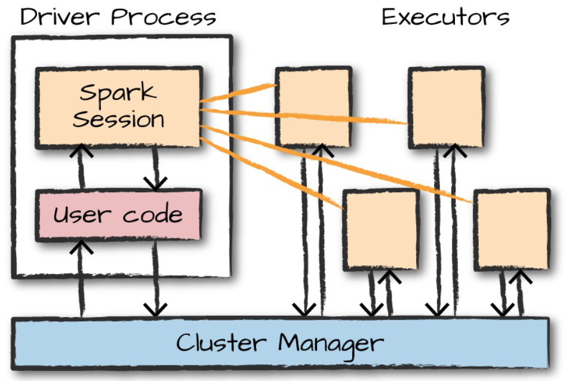

# Table of Contents
- [Spark - the definitive Guide by Bill Chambers and Matei Zaharia 2018](#DefinitiveGuide)
  - [A Gentle Introduction to Spark](#DefinitiveGuideIntroduction)
  - [Structured API Overview](#StructuredAPI)
  - [Basic Structured Operations](#StructuredOperations)
  - [Spark SQL](#SparkSQL)
  - [RDD](#RDD)
  - [How Spark Runs on a Cluster](#SparkClusterRun)
  - [Writing Python Applications](#PythonApplications)
  - [Spark Catalog](#SparkCatalog)
- [Spark Optimizations](#SparkOptimizations)
  - [Optimizing Spark Configurations](#OptimizationsConf)
  - [Optimizing Spark program](#OptimizationsProgramD)
  - [Optimizing storage](#OptimizationsStorage)
- [Spark debugging and analyzing](#SparkDebugging)
- [Examples](#Examples)
  - [Notebook](#Notebook)
  - [Databricks Job](#DatabricksJob)
  - [Spark Streaming](#SparkStreaming)
- [Links](#Links)

# Spark - the definitive Guide by Bill Chambers and Matei Zaharia 2018  <a id="DefinitiveGuide"></a>

Apache Spark is a unified computing engine and a set of libraries for parallel data processing on computer clusters

## A Gentle Introduction to Spark   <a id="DefinitiveGuideIntroduction"></a>

Spark Applications consist of a driver process and a set of executor processes. 

The __driver process__ runs your main() function, sits on a node in the cluster, and is responsible for three things:
maintaining information about the Spark Application; responding to a user’s program or input;
and analyzing, distributing, and scheduling work across the executors.

The __executors__ are responsible for actually carrying out the work that the driver assigns them.
This means that each executor is responsible for only two things: executing code assigned to it
by the driver, and reporting the state of the computation on that executor back to the driver node.

Spark employs a __cluster manager__ that keeps track of the resources available



### The SparkSession

You control your Spark Application through a driver process called the SparkSession. 
The SparkSession instance is the way Spark executes user-defined manipulations across the cluster. 
There is a one-to-one correspondence between a SparkSession and a Spark Application. 
In Scala and Python, the variable is available as spark when you start the console. 

### DataFrame

A DataFrame is the most common Structured API and simply represents a table of data with rows and columns. 
The list that defines the columns and the types within those columns is called the schema.

Spark DataFrame can span thousands of computers.

To allow every executor to perform work in parallel, Spark breaks up the data into chunks called __partitions__. 
A partition is a collection of rows that sit on one physical machine in your cluster.

### DataSets

A type-safe version of Spark’s structured API called Datasets, for writing statically typed code in Java and Scala. 
The Dataset API is not available in Python and R, because those languages are dynamically typed.

The Dataset API gives users the ability to assign a Java/Scala class to the records within a DataFrame and manipulate it as a
collection of typed objects, similar to a Java ArrayList or Scala Seq.

The APIs available on Datasets are type-safe, meaning that you cannot accidentally view the objects in a Dataset as being of another class than the class you put in initially. 
This makes Datasets especially attractive for writing large applications, with which multiple software engineers must interact through well-defined interfaces.

One final advantage is that when you call collect or take on a Dataset, it will collect objects of the proper type in your Dataset, not DataFrame Rows.

```
// in Scala
case class Flight(DEST_COUNTRY_NAME: String,
    RIGIN_COUNTRY_NAME: String,
    count: BigInt)
val flightsDF = spark.read.parquet("/data/flight-data/parquet/2010-summary.parquet/")
val flights = flightsDF.as[Flight]

flights
.filter(flight_row => flight_row.ORIGIN_COUNTRY_NAME != "Canada")
.map(flight_row => flight_row)
.take(5)
```

### Transformations

In Spark, the core data structures are immutable, meaning they cannot be changed after they’re created.

To “change” a DataFrame, you need to instruct Spark how you would like to modify it to do what you want. 
These instructions are called __transformations__.

```
# in Python
divisBy2 = myRange.where("number % 2 = 0")
```

Notice that these return no output. 
This is because we specified only an abstract transformation, and Spark will not act on transformations until we call an action.

Lazy evaulation means that Spark will wait until the very last moment to execute the graph of computation instructions. 
In Spark, instead of modifying the data immediately when you express some operation, you build up a plan of transformations that you would like to apply to your source data. 

By waiting until the last minute to execute the code, Spark compiles this plan from your raw DataFrame transformations to a streamlined physical plan that will run as efficiently as
possible across the cluster. 
This provides immense benefits because Spark can optimize the entire data flow from end to end. 

### Actions

Transformations allow us to build up our logical transformation plan. 
To trigger the computation, we run an action. 
An action instructs Spark to compute a result from a series of transformations.

The simplest action is count, which gives us the total number of records in the DataFrame:
```
divisBy2.count()
```

### Example

Data:
```
head /data/flight-data/csv/2015-summary.csv
DEST_COUNTRY_NAME,ORIGIN_COUNTRY_NAME,count
United States,Romania,15
United States,Croatia,1
United States,Ireland,344
```

Code:
```
# in Python
flightData2015 = spark\
.read\
.option("inferSchema", "true")\
.option("header", "true")\
.csv("/data/flight-data/csv/2015-summary.csv")

flightData2015.take(3)

flightData2015.sort("count").explain()
```

By default, when we perform a shuffle, Spark outputs 200 shuffle partitions. 
Let’s set this value to 5 to reduce the number of the output partitions from the shuffle:

```
spark.conf.set("spark.sql.shuffle.partitions", "5")
flightData2015.sort("count").take(2)
```

### Spark SQL

With Spark SQL, you can register any DataFrame as a table or view (a temporary table) and query it using pure SQL

```
flightData2015.createOrReplaceTempView("flight_data_2015")

# in Python
sqlWay = spark.sql("""
SELECT DEST_COUNTRY_NAME, count(1)
FROM flight_data_2015
GROUP BY DEST_COUNTRY_NAME
""")

dataFrameWay = flightData2015\
.groupBy("DEST_COUNTRY_NAME")\
.count()

sqlWay.explain()
dataFrameWay.explain()
```

### Structured Streaming

With Structured Streaming, you can take the same operations that you perform in batch mode using Spark’s structured APIs and run them in a streaming fashion. 
This can reduce latency and allow for incremental processing. 
The best thing about Structured Streaming is that it allows you to rapidly and quickly extract value out of streaming systems with virtually no code changes. 

Sample of the data:
```
InvoiceNo,StockCode,Description,Quantity,InvoiceDate,UnitPrice,CustomerID,Country
536365,85123A,WHITE HANGING HEART T-LIGHT HOLDER,6,2010-12-01 08:26:00,2.55,17...
536365,71053,WHITE METAL LANTERN,6,2010-12-01 08:26:00,3.39,17850.0,United Kin...
536365,84406B,CREAM CUPID HEARTS COAT HANGER,8,2010-12-01 08:26:00,2.75,17850
```

We’ll also create a schema from this static dataset:
```
# in Python
staticDataFrame = spark.read.format("csv")\
.option("header", "true")\
.option("inferSchema", "true")\
.load("/data/retail-data/by-day/*.csv")

staticDataFrame.createOrReplaceTempView("retail_data")
staticSchema = staticDataFrame.schema
```

The window function will include all data from each day in the aggregation.

The static DataFrame version:
```
# in Python
from pyspark.sql.functions import window, column, desc, col

staticDataFrame\
    .selectExpr(
        "CustomerId",
        "(UnitPrice * Quantity) as total_cost",
        "InvoiceDate")\
    .groupBy(
        col("CustomerId"), window(col("InvoiceDate"), "1 day"))\
    .sum("total_cost")\
    .show(5)
```

Streaming code. The biggest change is that we used __readStream__ instead of read, additionally you’ll notice the maxFilesPerTrigger option, which simply specifies the number of files we should read in at once
```
# in Python
streamingDataFrame = spark.readStream\
    .schema(staticSchema)\
    .option("maxFilesPerTrigger", 1)\
    .format("csv")\
    .option("header", "true")\
    .load("/data/retail-data/by-day/*.csv")

purchaseByCustomerPerHour = streamingDataFrame\
    .selectExpr(
"       CustomerId",
        "(UnitPrice * Quantity) as total_cost",
        "InvoiceDate")\
    .groupBy(
        col("CustomerId"), window(col("InvoiceDate"), "1 day"))\
    .sum("total_cost")
```

## Structured API Overview  <a id="StructuredAPI"></a>

### Structured API Execution

steps:
1. Write DataFrame/Dataset/SQL Code.
2. If valid code, Spark converts this to a Logical Plan.
3. Spark transforms this Logical Plan to a Physical Plan, checking for optimizations along the way.
4. Spark then executes this Physical Plan (RDD manipulations) on the cluster.

__Logical Planning__ represents a set of abstract transformations that do not refer to executors or drivers. 
This plan is unresolved because although your code might be valid, the tables or columns that it refers to might or might not exist. 
Spark uses the catalog, a repository of all table and DataFrame information, to resolve columns and tables in the analyzer. 
The analyzer might reject the unresolved logical plan if the required table or column name does not exist in the catalog. 
If the analyzer can resolve it, the result is passed through the Catalyst Optimizer, a collection of rules that attempt to optimize the logical plan by pushing down predicates or selections.

After successfully creating an optimized logical plan, Spark then begins the __physical planning__ process. 
The physical plan, often called a Spark plan, specifies how the logical plan will execute on the cluster by generating different physical execution strategies and comparing them through a cost model.

An example of the cost comparison might be choosing how to perform a given join by looking at the physical attributes of a given table

Physical planning results in a series of RDDs and transformations

Upon selecting a physical plan, Spark runs all of this code over RDDs, the lower-level programming interface of Spark

## Basic Structured Operations <a id="StructuredOperations"></a>

A __schema__ defines the column names and types of a DataFrame.

```
# in Python
spark.read.format("json").load("/data/flight-data/json/2015-summary.json").schema
```

To Spark, __columns__ are logical constructions that simply represent a value computed on a per-record basis by means of an expression. 
This means that to have a real value for a column, we need to have a row; and to have a row, we need to have a DataFrame. 
You cannot manipulate an individual column outside the context of a DataFrame; you must use Spark transformations within a DataFrame to modify the contents of a column.

An __expression__ is a set of transformations on one or more values in a record in a DataFrame.

Columns provide a subset of expression functionality. 

In Spark, each __row__ in a DataFrame is a single record. 
Spark represents this record as an object of type Row. 
Spark manipulates Row objects using column expressions in order to produce usable values. 
Row objects internally represent arrays of bytes. 

### DataFrame Transformations

To create dataFrame we can:
* create DataFrames from raw data sources
```
# in Python
df = spark.read.format("json").load("/data/flight-data/json/2015-summary.json")
df.createOrReplaceTempView("dfTable")
```

* taking a set of rows and converting them to a DataFrame
```
# in Python
from pyspark.sql import Row
from pyspark.sql.types import StructField, StructType, StringType, LongType
myManualSchema = StructType([
    StructField("some", StringType(), True),
    StructField("col", StringType(), True),
    StructField("names", LongType(), False)
])
myRow = Row("Hello", None, 1)
myDf = spark.createDataFrame([myRow], myManualSchema)
myDf.show()
```

DataFrame transformations:
* We can add rows or columns
```
# in Python
df.withColumn("numberOne", lit(1)).show(2)

df.withColumn("withinCountry", expr("ORIGIN_COUNTRY_NAME == DEST_COUNTRY_NAME")).show(2)
```
* We can remove rows or columns
```
df.drop("ORIGIN_COUNTRY_NAME").columns
```
* filtering rows
```
df.filter(col("count") < 2).show(2)
df.where("count < 2").show(2)
```
* We can transform a row into a column (or vice versa)
```
pivoted = dfWithDate.groupBy("date").pivot("Country").sum()
```
* We can change the order of rows based on the values in columns
```
df.sort("count").show(5)
df.orderBy("count", "DEST_COUNTRY_NAME").show(5)
```

### User-Defined Functions

```
# in Python
udfExampleDF = spark.range(5).toDF("num")
def power3(double_value):
    return double_value ** 3
power3(2.0)
```

Now that we’ve created these functions and tested them, we need to register them with Spark so that we can use them on all of our worker machines. 
Spark will serialize the function on the driver and transfer it over the network to all executor processes. 

### Joins

Join Types:
* __Inner joins__ (keep rows with keys that exist in the left and right datasets)
* __Outer joins__ (keep rows with keys in either the left or right datasets)
* __Left outer joins__ (keep rows with keys in the left dataset)
* __Right outer joins__ (keep rows with keys in the right dataset)
* __Left semi joins__ (keep the rows in the left, and only the left, dataset where the key appears in the right dataset)
* __Left anti joins__ (keep the rows in the left, and only the left, dataset where they do not appear in the right dataset)
* __Natural joins__ (perform a join by implicitly matching the columns between the two datasets with the same names)
* __Cross (or Cartesian) joins__ (match every row in the left dataset with every row in the right dataset)

```
person = spark.createDataFrame([
        (0, "Bill Chambers", 0, [100]),
        (1, "Matei Zaharia", 1, [500, 250, 100]),
        (2, "Michael Armbrust", 1, [250, 100])])\
    .toDF("id", "name", "graduate_program", "spark_status")
graduateProgram = spark.createDataFrame([
        (0, "Masters", "School of Information", "UC Berkeley"),
        (2, "Masters", "EECS", "UC Berkeley"),
        (1, "Ph.D.", "EECS", "UC Berkeley")])\
    .toDF("id", "degree", "department", "school")
sparkStatus = spark.createDataFrame([
        (500, "Vice President"),
        (250, "PMC Member"),
        (100, "Contributor")])\
    .toDF("id", "status")

person.createOrReplaceTempView("person")
graduateProgram.createOrReplaceTempView("graduateProgram")
sparkStatus.createOrReplaceTempView("sparkStatus")

# inner join
joinExpression = person["graduate_program"] == graduateProgram['id']

joinType = "inner"
person.join(graduateProgram, joinExpression, joinType).show()

# outer join
joinType = "outer"
person.join(graduateProgram, joinExpression, joinType).show()

```

Spark approaches cluster communication in two different ways during joins. 
It either incurs a shuffle join, which results in an all-to-all communication or a broadcast join.

When you join a big table to another big table, you end up with a __shuffle join__. 
In a shuffle join, every node talks to every other node and they share data according to which node has a certain key or set of keys (on which you are joining). 
These joins are expensive because the network can become congested with traffic, especially if your data is not partitioned well.

When the table is small enough to fit into the memory of a single worker node, it can often be more efficient to use a __broadcast join__.
What this means is that we will replicate our small DataFrame onto every worker node in the cluster.

With the DataFrame API, we can also explicitly give the optimizer a hint that we would like to use a broadcast join by using the correct function around the small DataFrame in question.

```
import org.apache.spark.sql.functions.broadcast
val joinExpr = person.col("graduate_program") === graduateProgram.col("id")
person.join(broadcast(graduateProgram), joinExpr).explain()
```
### Data Sources

Following are Spark’s core data sources:
* CSV
* JSON
* Parquet
* ORC
* JDBC/ODBC connections
* Plain-text files

Community-created data sources:
* Cassandra
* MongoDB
* XML
* AWS Redshift
* etc.

The core structure for __reading data__ is as follows:
```
DataFrameReader.format(...).option("key", "value").schema(...).load()
```

Example:
```
spark.read.format("csv")
    .option("mode", "FAILFAST")
    .option("inferSchema", "true")
    .option("path", "path/to/file(s)")
    .schema(someSchema)
    .load()
```

The core structure for __writing data__ is as follows:
```
DataFrameWriter.format(...).option(...).partitionBy(...).bucketBy(...).sortBy(...).save()
```

Example:
```
csvFile = spark.read.format("csv")\
    .option("header", "true")\
    .option("mode", "FAILFAST")\
    .option("inferSchema", "true")\
    .load("/data/flight-data/csv/2010-summary.csv")
csvFile.write.format("csv").mode("overwrite").option("sep", "\t").save("/tmp/my-tsv-file.tsv")
```

#### Query Pushdown

First, Spark makes a best-effort attempt to filter data in the database itself before creating the DataFrame.

Spark can actually do better than this on certain queries. 
For example, if we specify a filter on our DataFrame, Spark will push that filter down into the database.

Spark can’t translate all of its own functions into the functions available in the SQL database in which you’re working. 
Therefore, sometimes you’re going to want to pass an entire query into your SQL that will return the results as a DataFrame.

Rather than specifying a table name, you just specify a SQL query.

```
pushdownQuery = """(SELECT DISTINCT(DEST_COUNTRY_NAME) FROM flight_info)
    AS flight_info"""
dbDataFrame = spark.read.format("jdbc")\
    .option("url", url).option("dbtable", pushdownQuery).option("driver", driver)\
    .load()
```

#### Reading or Writing Data in Parallel

The number of files or data written is dependent on the number of partitions the DataFrame has at the time you write out the data. 
By default, one file is written per partition of the data. 

The following code
```
csvFile.repartition(5).write.format("csv").save("/tmp/multiple.csv")
```
will end up with five files inside of that folder.

#### Partitioning

```
csvFile.limit(10).write.mode("overwrite").partitionBy("DEST_COUNTRY_NAME").save("/tmp/partitioned-files.parquet")
```

#### Bucketing

This can help avoid shuffles later when you go to read the data because data with the same bucket ID will all be grouped together into one physical partition.
This means that the data is prepartitioned according to how you expect to use that data later on, meaning you can avoid expensive shuffles when joining or aggregating

#### Managing File Size

You can use the maxRecordsPerFile option and specify a number of your choosing. 
This allows you to better control file sizes by controlling the number of records that are written to each file. 

## Spark SQL <a id="SparkSQL"></a>

In a nutshell, with Spark SQL you can run SQL queries against views or tables organized into databases. 
You also can use system functions or define user functions and analyze query plans in order to optimize their workloads.

Spark SQL has a great relationship with Hive because it can connect to Hive metastores. 
The Hive metastore is the way in which Hive maintains table information for use across sessions.
With Spark SQL, you can connect to your Hive metastore (if you already have one) and access table metadata to reduce file listing when accessing information. 

To connect to the Hive metastore, there are several properties that you’ll need. 

Spark provides several interfaces to execute SQL queries:
* Spark SQL CLI
* Spark’s Programmatic SQL Interface
* JDBC/ODBC Server

### Hive

https://spark.apache.org/docs/3.5.2/sql-data-sources-hive-tables.html

Configuration of Hive is done by placing your hive-site.xml, core-site.xml (for security configuration), and hdfs-site.xml (for HDFS configuration) file in conf/.

When working with Hive, one must instantiate SparkSession with Hive support, including connectivity to a persistent Hive metastore, support for Hive serdes, and Hive user-defined functions.

Example:
```
# warehouse_location points to the default location for managed databases and tables
warehouse_location = abspath('spark-warehouse')

spark = SparkSession \
    .builder \
    .appName("Python Spark SQL Hive integration example") \
    .config("spark.sql.warehouse.dir", warehouse_location) \
    .enableHiveSupport() \
    .getOrCreate()

# spark is an existing SparkSession
spark.sql("CREATE TABLE IF NOT EXISTS src (key INT, value STRING) USING hive")
spark.sql("LOAD DATA LOCAL INPATH 'examples/src/main/resources/kv1.txt' INTO TABLE src")

```

## RDDs <a id="RDD"></a>

You should generally use the lower-level APIs in three situations:
* You need some functionality that you cannot find in the higher-level APIs; for example, if you need very tight control over physical data placement across the cluster.
* You need to maintain some legacy codebase written using RDDs.
* You need to do some custom shared variable manipulation.

### Distributed Shared Variables

Chapter 14. Distributed Shared Variables In addition to the Resilient Distributed Dataset (RDD) interface, the second kind of low-level
API in Spark is two types of “distributed shared variables”: broadcast variables and accumulators. 
These are variables you can use in your user-defined functions (e.g., in a map function on an RDD or a DataFrame) that have special properties when running on a cluster.

Specifically, __accumulators__ let you add together data from all the tasks into a shared result (e.g., to implement a counter so you can see how many of your job’s input records failed to parse), while __broadcast variables__ let you save a large value on all the worker nodes and reuse it across many Spark actions without re-sending it to the cluster.

## How Spark Runs on a Cluster <a id="SparkClusterRun"></a>

Execution Modes:
* __Cluster mode__: a user submits a pre-compiled JAR, Python script, or R script to a cluster manager. 
The cluster manager then launches the driver process on a worker node inside the cluster, in addition to the executor processes. 
This means that the cluster manager is responsible for maintaining all Spark Application–related processes.
* __Client mode__: Client mode is nearly the same as cluster mode except that the Spark driver remains on the client machine that submitted the application. 
This means that the client machine is responsible for maintaining the Spark driver process, and the cluster manager maintains the executor processses.
* __Local mode__: it runs the entire Spark Application on a single machine. It achieves parallelism through threads on that single machine.

## Writing Python Applications  <a id="PythonApplications"></a>

Writing PySpark Applications is really no different than writing normal Python applications or packages. 
It’s quite similar to writing command-line applications in particular. 
Spark doesn’t have a build concept, just Python scripts, so to run an application, you simply execute the script against the cluster.

```
# in Python
from __future__ import print_function
if __name__ == '__main__':
    from pyspark.sql import SparkSession
    spark = SparkSession.builder \
        .master("local") \
        .appName("Word Count") \
        .config("spark.some.config.option", "some-value") \
        .getOrCreate()
    print(spark.range(5000).where("id > 500").selectExpr("sum(id)").collect())
```

## Spark Catalog <a id="SparkCatalog"></a>

https://pyspark.itversity.com/08_spark_metastore/03_exploring_spark_catalog.html

Metadata such as table names, column names, data types etc for the permanent tables or views will be stored in Metastore. 
We can access the metadata using spark.catalog which is exposed as part of SparkSession object.

Notebook example:
```
from pyspark.sql import SparkSession

import getpass
username = getpass.getuser()

spark = SparkSession. \
    builder. \
    config('spark.ui.port', '0'). \
    config("spark.sql.warehouse.dir", f"/user/{username}/warehouse"). \
    enableHiveSupport(). \
    appName(f'{username} | Python - Spark Metastore'). \
    master('yarn'). \
    getOrCreate()
```

# Spark Optimizations <a id="SparkOptimizations"></a>

## Optimizing Spark Configurations  <a id="OptimizationsConf"></a>

Example:
```
from pyspark.sql import SparkSession

spark = (SparkSession.builder
           .master("yarn")
           .appName("test") 
           .config("spark.sql.shuffle.partitions", 200)
           .getOrCreate())
```

### Tuning Spark Executor

Most of the time, we allocate __static resources to the application__. 
But what if some day you are getting massive data in source and the other day you are getting small data? Static allocation will not be a practical choice in this scenario. 

We can dynamically add/remove executors according to our Spark application's workload. 
Spark has a __dynamic allocation technique to enable executor scaling__. 
This approach is best when we have an inconsistent workload daily. 

Set the:
* spark.dynamicAllocation.enabled = true

### Tuning Spark Memory

We often get an out-of-memory error either at the driver or executor sides. To avoid that, we need a correct memory configuration.

Set the:
* set the spark.memory.fraction

### Tune Shuffle File Buffer

Disk access is slower when compared to __in-memory data access__ as it involves a serialization process that takes up time and resources. 
We can reduce disk I/O costs by introducing a __shuffle read/write file buffer in the memory__.

Set the:
* spark.shuffle.file.buffer 

### Tune Shuffle Partitions value

The shuffle-partition means the number of partitions generated after each transformation step that causes data shuffling, such as join(), agg(), reduce(), etc. 
By setting spark.sql.shuffle.partitions property, you can decide the __level of parallelism__ in your Spark application.

Set the:
* spark.sql.shuffle.partitions

## Optimizing Spark program <a id="OptimizationsProgram"></a>

### Broadcast Join

If you are joining a big table with a small table. During this join operation, more shuffling will happen. 
We can avoid shuffling by using a broadcast join. It will __copy a small table to every node where the executor is running__. 

```
from pyspark.sql.functions import broadcastemp_df = spark.sql("select id, name, dept_id from employee")
dept_df = spark.sql("select dept_id, dept_name from department")
df_joined = emp_df.join(broadcast(dept_df),emp_df.dept_id == dept_df.dept_id, ‘inner’)
df_joined.show(20)
```

### Cache data

Every time we call the Action in the Spark program, it triggers DAG and executes it from the beginning. 
That's why it's recommended not to use unnecessary Actions in Spark programs. 
Double-check the code and remove or comment Actions you wrote for debugging/testing in your Spark program.

One key point to improve performance when the same dataframe is being referred to in multiple places is to __cache that dataframe__. 
Spark has two functions to cache dataframe: __cache() and persist()__. 
RDD's cache() function default saves the dataframe to memory while the persist() function is used to store dataframe at the user-defined storage level. 

Spark SQL can cache tables using an in-memory columnar format by calling spark.catalog.cacheTable("tableName") or dataFrame.cache().

### Repartition data

A dataframe is partitioned means there are logical groups of records in it. 
Each task processes each partition, many tasks run in parallel inside one executor, and parallel execution happens in Spark.

__coalesce()__ is mainly used to decrease partitions and __repartition()__ is used to increase partitions.

If you are processing large data and want to create more simultaneous tasks, then you can use the repartition() function to increase the partitions. 
If you want to re-shuffle the data based on column value, you can also use the repartition() function. 
If you want to reduce the number of output files, then you can use the coalesce() function. 

__The optimal number of partitions is usually set as a factor of the total number of cores available in the cluster.__

### Filter data in earlier steps

The key point to improve the performance of joins and other processing is to filter data in earlier steps which you don't need in the result set.

### Use Salting Technique to eliminate data skewness issues

We often see on Spark UI that some tasks take longer, and some finish quickly. 
This happens when your data is __skewed__. 
That means data is not evenly distributed across the partitions. 
So, tasks working on partitions where the data size is more than the other partitions take more time to complete. 
This also causes an out-of-memory issue sometimes. 
Re-shuffling data across partitions can eliminate data skewness. 
We can achieve shuffling by using the repartition() function. 
But this function does not guarantee the even distribution of records. 
So, we must add some random values in a new column in the dataframe, which we often call the salted key, and then we can pass that salted key in the repartition function as an argument. 
After that repartition() function will re-shuffle data based on the salted key column values.

```
salt_df_new = df.withColumn(“salted_key”, (rand * n).cast(IntegerType))
shuffled_df = salt_df_new.repartition(100, ‘salted_key’)
```

### Provide schema explicitly while reading data into dataframe

The predefined schema makes it easier for Spark to get columns and datatypes without reading the entire file; this improves the performance of your Spark code if you are dealing with a massive volume of data. 
We can use the inferSchema=True option if we want Spark to identify schemas implicitly, and we can use the schema option to provide a schema to dataframe.

```
from pyspark.sql.types import StructType, IntegerType, DateTypeschema = StructType([
         StructField(“col_01”, IntegerType()),
         StructField(“col_02”, DateType()),
         StructField(“col_03”, IntegerType()) ])df = spark.read.csv(filename, header=True, schema=schema)

```
### Use the ReduceByKey function over GroupByKey

Both reduceByKey() and groupByKey() are broad transformations, meaning both will shuffle across the partitions. 
The critical difference between reduceByKey() and groupByKey() is that __reduceByKey__() does a map side combine and groupByKey() does not. 
The reduceByKey() acts like a mini reducer. So, the shuffling of data can be reduced if we use reduceByKey()

### Avoid the use of UDFs (User Defined Functions)

UDFs are heavy when it comes to performance. 
__Spark does not optimize UDFs__ as it's like a black box for them. 
Built-in "Spark SQL" functions are optimized and recommended to be used in programs. 

### Check the uniqueness of keys while using the join columns

We should always carefully choose the join columns for joining two dataframes. 
If duplicate values exist in either of the columns, it takes a long time to join such dataframes because a cartesian product can happen.

## Optimizing storage <a id="OptimizationsStorage"></a>

### Bucketing and Partitioning

https://medium.com/@ashwin_kumar_/spark-partitioning-vs-bucketing-partitionby-vs-bucketby-09c98c5b40eb

https://www.newsletter.swirlai.com/p/sai-26-partitioning-and-bucketing

- __Partitioning__ splits records into files present under different directories named the same as partition column values, based on the partition column. 
```
df.write.partitionBy("column1", "column2").parquet("/path/to/data")
```
- __Bucketing__ is helpful in further splitting records into different files based on a hashing function. This improves performance when we read data in Spark.
```
df.write.bucketBy(10, "column1").sortBy("column2").parquet("/path/to/data")
```

Partitioning is often represented as directories, and bucketing is represented as files. 

### Serialized data formats


# Spark debugging and analyzing <a id="SparkDebugging"></a>


# Examples <a id="Examples"></a>

## Notebook <a id="Notebook"></a>

### One

https://databricks-prod-cloudfront.cloud.databricks.com/public/4027ec902e239c93eaaa8714f173bcfc/1033803620506758/3135806884749189/7540521809236567/latest.html

```
file_path = "/FileStore/tables/emp.csv"
df_emp_data = spark.read.csv(file_path, header=True, inferSchema=True)
display(df_emp_data)
```

Check the data schema

```
display(df_emp_data.printSchema())

root
 |-- EMPNO: string (nullable = true)
 |-- ENAME: string (nullable = true)
 |-- JOB: string (nullable = true)
 |-- MGR: string (nullable = true)
 |-- HIREDATE: string (nullable = true)
 |-- SAL: string (nullable = true)
 |-- COMM: string (nullable = true)
 |-- DEPTNO: string (nullable = true)
 |-- UPDATED_DATE: string (nullable = true)
```
Why HIREDATE is showing string instead date type in the schema?

It is showing because it contains dd-mm-yyy date format which is not acceptable by spark. Spark uses yyyy-mm-dd format. So, let's change the date format.

```
from pyspark.sql.functions import *
# change string to date type
df_emp = df_emp_data.withColumn("HIREDATE", to_date(col("HIREDATE"), "dd-MM-yyyy")).fillna({"HIREDATE":"9999-12-31"})
display(df_emp)
```

partition the data using year & month, if required

```
df_emp = (
    df_emp
    .withColumn("YEAR", date_format("HIREDATE", "yyyy"))
    .withColumn("Month", date_format("HIREDATE", "MM"))
)
df_emp.write.format("delta").partitionBy("YEAR", "MONTH").mode("overwrite").saveAsTable("employee_partition_data")
```

## DataBrics job on azure <a id="DatabricksJob"></a>

Run notebook from databrics job and trigger the job via rest api

https://github.com/rchynoweth/Demo/blob/main/Workflows/Parameters/APIJobDefinition.json

```
{
    "job_id": 862519602273592,
    "creator_user_name": "ryan.chynoweth@databricks.com",
    "run_as_user_name": "ryan.chynoweth@databricks.com",
    "run_as_owner": true,
    "settings": {
        "name": "Parameter Blog Job ",
        "email_notifications": {
            "no_alert_for_skipped_runs": false
        },
        "timeout_seconds": 0,
        "max_concurrent_runs": 1,
        "tasks": [
            {
                "task_key": "Bronze",
                "notebook_task": {
                    "notebook_path": "Workflows/Parameters/BronzeLoad",
                    "base_parameters": {
                        "schema": "rac_demo_db",
                        "table": "bronze_iot"
                    },
                    "source": "GIT"
                },
                "job_cluster_key": "Shared_job_cluster",
                "timeout_seconds": 0,
                "email_notifications": {}
            },
            {
                "task_key": "Silver",
                "depends_on": [
                    {
                        "task_key": "Bronze"
                    }
                ],
                "notebook_task": {
                    "notebook_path": "Workflows/Parameters/SilverLoad",
                    "base_parameters": {
                        "schema": "rac_demo_db",
                        "table": "iot_bronze",
                        "target_table_name": "iot_silver"
                    },
                    "source": "GIT"
                },
                "job_cluster_key": "Shared_job_cluster",
                "timeout_seconds": 0,
                "email_notifications": {}
            }
        ],
        "job_clusters": [
            {
                "job_cluster_key": "Shared_job_cluster",
                "new_cluster": {
                    "cluster_name": "",
                    "spark_version": "11.3.x-scala2.12",
                    "spark_conf": {
                        "spark.databricks.delta.preview.enabled": "true"
                    },
                    "azure_attributes": {
                        "first_on_demand": 1,
                        "availability": "ON_DEMAND_AZURE",
                        "spot_bid_max_price": -1
                    },
                    "node_type_id": "Standard_DS3_v2",
                    "spark_env_vars": {
                        "PYSPARK_PYTHON": "/databricks/python3/bin/python3"
                    },
                    "enable_elastic_disk": true,
                    "data_security_mode": "SINGLE_USER",
                    "runtime_engine": "STANDARD",
                    "num_workers": 8
                }
            }
        ],
        "git_source": {
            "git_url": "https://github.com/rchynoweth/Demo",
            "git_provider": "gitHub",
            "git_branch": "main"
        },
        "format": "MULTI_TASK"
    },
    "created_time": 1670079972376
}
```

## Spark streaming  <a id="SparkStreaming"></a>

# Links <a id="Links"></a>

https://www.databricks.com/blog/2016/02/17/introducing-databricks-community-edition-apache-spark-for-all.html


https://github.com/dennyglee/databricks/tree/master/notebooks/Users/denny%40databricks.com
