# AWS Certified AI Practitioner

- [Concepts](#Concepts)
  - [Foundation Model](#FoundationModel)
  - [LLM](#LLM)
  - [RAG](#RAG)
  - [Tokenization](#Tokenization)
  - [Context Window](#ContextWindow)
  - [Embeddings](#Embeddings)
- [AI and ML](#AIML)
  - [Artificial Inteligence](#AI)
  - [ML](#ML)
  - [Deep Learning](#DeepLearning)
  - [Generative AI](#GenAI)
  - [Use Cases](#UseCases)
  - [Training Data](#TrainingData)
  - [Model Performance](#ModelPerformance)
  - [Model Evaluation Metrics](#ModelMetrics)
  - [Machine Learning – Inferencing](#Inferencing)
  - [Phases of ML project](#PhasesOfML)
  - [Hyperparameter Tuning](#HyperparameterTuning)
- [Amazon Bedrock](#Bedrock)
  - [Bedrock API](#BedrockAPI)
  - [Model Fine Tuning](#ModelFineTuning)
  - [Model Evaluation](#ModelEvaluation)
  - [RAG](#RAG)
  - [Guardrails](#Guardrails)
  - [LLM Agents](#LLMAgents)
  - [Bedrock Pricing](#BedrockPricing)
- [Prompt Engineering](#PromptEngineering)
- [Amazon Q](#AmazonQ)
  - [Amazon Q Business](#AmazonQBusiness)
  - [Amazon Q Apps](#AmazonQApps)
  - [Amazon Q Developer](#AmazonQDeveloper)
  - [Amazon Q for AWS Services](#AmazonQServices)
- [AWS Managed AI Services](#ManagedAIServices)
  - [Amazon Comprehend](#AmazonComprehend)
  - [Amazon Translate](#AmazonTranslate)
  - [Amazon Transcribe](#AmazonTranscribe)
  - [Amazon Polly](#AmazonPolly)
  - [Amazon Rekognition](#AmazonRekognition)
  - [Amazon Lex](#AmazonLex)
  - [Amazon Personalize](#AmazonPersonalize)
- [SageMaker](#SageMaker)
  - [ SageMaker Studio]( #SageMakerStudio )
  - [ SageMaker Notebooks]( #SageMakerNotebooks )
  - [ SageMaker Experiments]( #SageMakerExperiments )
  - [ SageMaker Debugger ]( #SageMakerDebugger )
  - [ SageMaker Autopilot ]( #SageMakerAutopilot )
  - [ SageMaker Monitor ]( #SageMakerMonitor )
  - [ SageMaker Jumpstart ]( #SageMakerJumpstart )
  - [ SageMaker Clarify ]( #SageMakerClarify )
  - [ Ground Truth]( #GroundTruth )
- [AI Challenges and Responsibilities](#AIChallengesResponsibilities)
  - [Responsible AI](#ResponsibleAI)
  - [ML Design Principles](#MLDesignPrinciples)
  - [ML Life cycle](#MLLifeCycle)
  - [MLOps](#MLOps)
- [AWS Security Services](#SecurityServices)
  - [Security and Privacy for AI Systems](#PrivacyAISystems)
- [References](#References)

## Concepts <a id="Concepts"></a>

### Foundation Model <a id="FoundationModel"></a>

Trained on __very large data__ set of unlabeled different types of data.

Very expensive to train (resources, time, money)

Examples: gpt40

### LLM <a id="LLM"></a>

LLM = __large language models__. Designed to generate human-like text.

Trained on large corpus of text data (books, articles etc.), billions of parameters, 

Can perform language related tasks: translation, summarization, question answering, content creation.

Prompt: to query LLM you send a prompt. It can be text and pictures etc.

Output of a prompt is not deterministic and it can be many different data types (text, image etc.)

All foundational language models are LLMs, but not all LLMs are foundational models—only those trained at sufficient scale and generality.


### RAG <a id="RAG"></a>

- Allows a Foundation Model to reference a __data source outside of its training data__
- Retrieval - because we retrieve the data outside foundational model
- Augmented - because __augment the prompt with data that has been retrieved__ from vector database

### Tokenization <a id="Tokenization"></a>

Converting raw text into a sequence of tokens
- Word-based tokenization: text is split into individual words
- Subword tokenization: some words can be split too

Words split into multiple tokens: unbelievable -> ['un', 'believ', 'able']

### Context Window <a id="ContextWindow"></a>

- The number of tokens an LLM can consider when generating text
- The larger the context window, the more information and coherence
- Large context windows require more memory and processing power

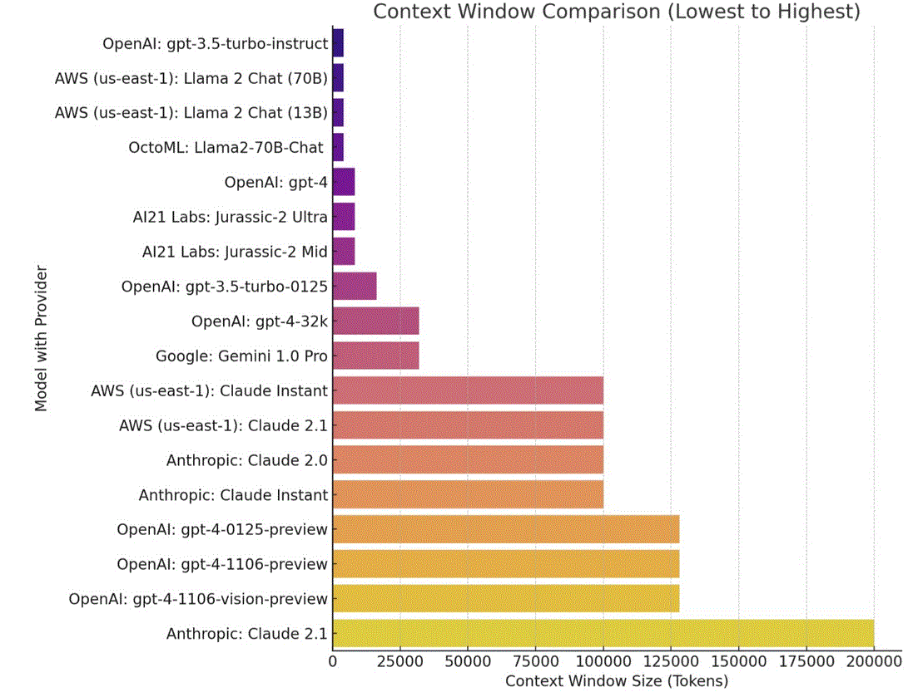

### Embeddings <a id="Embeddings"></a>

- Create vectors (array of numerical values) out of text, images or audio
- Vectors have a high dimensionality to capture many features for one input token, such as semantic meaning, syntactic role, sentiment
- Embedding models can power search applications
- Words that have semantic relationships (i.e. are similar) will have similar embeddings (vector) and then we can do similarity search

## AI and ML <a id="AIML"></a>

### Artificial Inteligence <a id="AI"></a>

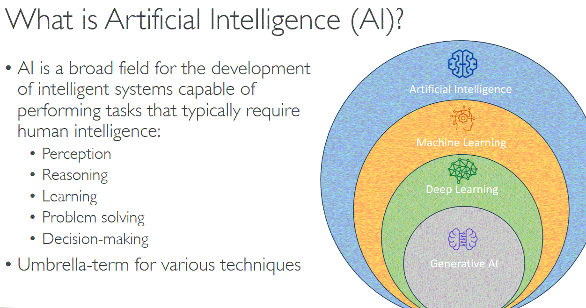

AI examples: expert systems or ML

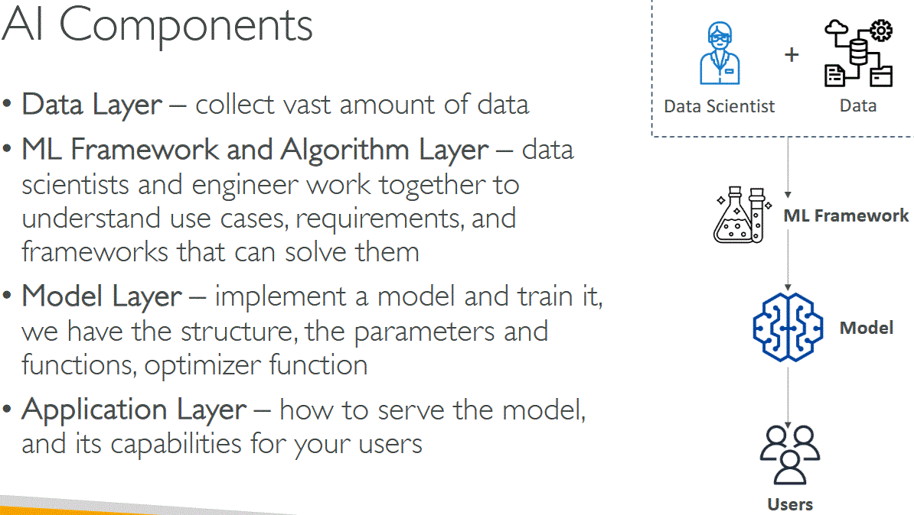

Taxonomy:

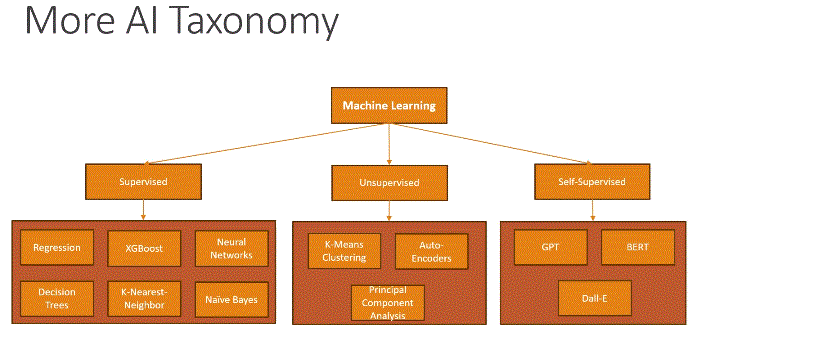

### Machine Learning (ML) <a id="ML"></a>

- ML is a type of AI for building __methods that allow machines to learn__
- Data is leveraged to improve computer performance on a set of task
- __Make predictions based on data__ used to train the model: regression, classification, decision trees or Neural Networks


#### Supervised Learning (ML)

__Regression__:
- Used to predict a numeric value based on input data
- The output variable is continuous, meaning it can take any value within a range
- Examples: Predicting House Prices, Stock Price Prediction, Weather Forecasting

__Classification__:
- Used to predict the categorical label of input data
- The output variable is discrete, which means it falls into a specific category or class

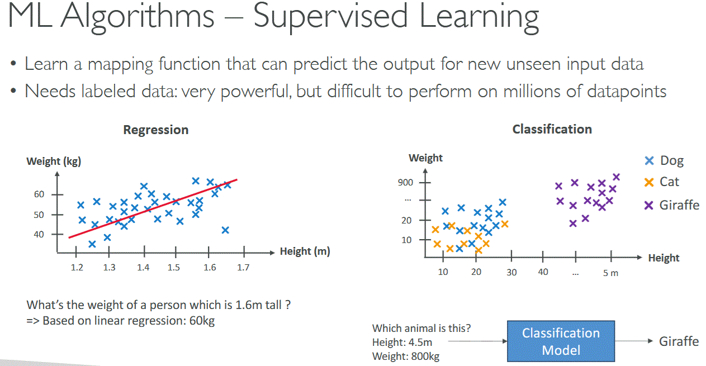

##### Training vs. Validation vs. Test Set:
- __Training Set__
  - Used to train the model
  - Percentage: typically, 60-80% of the dataset
- __Validation Set__
  - Used to tune model parameters and validate performance
  - Percentage: typically, 10-20% of the dataset
- __Test Set__
  - Used to evaluate the final model performance
  - Percentage: typically, 10-20% of the dataset

#### Feature Engineering:
- The process of using domain knowledge to select and __transform raw data into meaningful features__
- Helps enhancing the performance of machine learning models
- Techniques
  - __Feature Extraction__ – extracting useful information from raw data, such as deriving age from date of birth
  - __Feature Selection__ – selecting a subset of relevant features, like choosing important predictors in a regression model
  - __Feature Transformation__ – transforming data for better model performance, such as normalizing numerical data
- Example: Predicting house prices based on features like size, location, and number of rooms
  - Feature Creation – deriving new features like 'price per square foot'
  - Feature Selection – identifying and retaining important features such as location or number of bedrooms
  - Feature Transformation – normalizing features to ensure they are on a similar scale

Feature Engineering on Unstructured Data:
- Example: sentiment analysis of customer reviews
- Feature Engineering Tasks
  - Text Data – converting text into numerical features using techniques like TF-IDF or word embeddings
  - Image Data – extracting features such as edges or textures using techniques like convolutional neural networks (CNNs)

#### UnSupervised Learning (ML)

The goal is to __discover inherent patterns__, structures, or relationships __within the input data__.
The machine must uncover and create the groups itself, but __humans still put labels__ on the output groups.
Common techniques include __Clustering__, Association Rule Learning , and Anomaly Detection.

Unsupervised learning involves iterating until some objective function is minimized.

Examples:
- Clustering Technique: group similar data points together into clusters based on their features
- Association Rule Learning: supermarket wants to understand which products are frequently bought together
- Anomaly Detection: detect fraudulent credit card transactions

__Semi-supervised Learning:__ 
- Use a small amount of labeled data and a large amount of unlabeled data to train systems
- the partially trained algorithm itself labels the unlabeled data
- model is then re-trained on the resulting data mix without being explicitly programmed

#### Self-Supervised Learning

Steps:
- Have a __model generate pseudo-labels__ for its own data without having humans label any data first
- Then, __using the pseudo labels, solve problems traditionally solved by Supervised Learning__
- Widely used in NLP (to create the BERT and GPT models for example) and in image recognition tasks

Example:
- Create 'pre-text tasks' to have the model solve simple tasks and learn patterns in the dataset
- Pretext tasks are not 'useful', but will teach our model to create a 'representation' of our dataset
- Predict any part of the input from any other part:
  - Amazon Web ??? -> Services
  - provides on-demand cloud ??? -> computing
  - APIs to individuals, ???, and governmants -> companies
- After solving the pre-text tasks, we have a model trained that can solve our end goal: 'downstream tasks'

#### Reinforcement Learning (RL)

A type of Machine Learning where an agent learns to make decisions by performing actions in an environment to maximize cumulative rewards

Key Concepts:
- Agent – the learner or decision-maker
- Environment – the external system the agent interacts with
- Action – the choices made by the agent
- Reward – the feedback from the environment based on the agent’s actions
- State – the current situation of the environment
- Policy – the strategy the agent uses to determine actions based on the state

Learning process:
- The Agent observes the current State of the Environment
- It selects an Action based on its Policy
- The environment transitions to a new State and provides a Reward
- The Agent updates its Policy to improve future decisions
- Goal: Maximize cumulative reward over time

Example: training a robot to navigate a maze

Use cases:
- Gaming – teaching AI to play complex games (e.g., Chess, Go)
- Robotics – navigating and manipulating objects in dynamic environments
- Finance – portfolio management and trading strategies


### Deep Learning <a id="DeepLearning"></a>

- Process __more complex patterns__ in the data than traditional ML
- Requires large amount of input data and GPUs
- __Computer Vision__ – image classification, object detection, image segmentation
- Natural Language Processing (__NLP__) – text classification, sentiment analysis, machine translation, language generation
    - __Intent analysis:__ You could use it to analyze feedback or call center recordings.
      - Figure out using NLP, what are the m__ain issues that people are calling in about__ when they call my customer service reps?
      - Use NLP to figure out automatically whether or not people are happy or not and what the main issues are that they're facing.

__The 'neural network' represents the 'meaning' that can be translated into many languages__.

Types of Neural Networks:

- Convolutional Neural Networks (__CNN__):
  - Usually used for __image recognition__ (find features within images), machine translation
  - Used when you have __data that does not nicely align into columns__
  - __Can find features__ that are not in a specific spot
  - Instead of analyzing all pixels at once, it looks at small local patterns and builds up understanding from simple to complex.
    - For a photo of a cat, a CNN might:
      - Detect edges and textures.
      - Combine edges into shapes (ears, eyes).
      - Recognize object parts (face).
      - Classify the object as a “cat.”
  - Works like eye:
    - take source image or data
    - break is into smaller chunks called convolutions
    - assemble convolutions and look for patterns

- Recurrent Neural Networks (__RNN__):
  - Used for __sequences of data__ (like __time series__, or machine translations (words) or music(notes))
  - __Output of the neuron goes back into the same neuron__ (feedback loop)
  - A sequence of words is encoded into neural network and later this neural network can be decoded into words in anothe language (translation).
  - ResNet (short for Residual Network) is type of CNN
  - As neural networks get deeper, they should perform better—but in practice, they often get worse due to: Vanishing gradient, Overfitting, Training instability
  - The 'neural network' represents the 'meaning' that can be translated into many languages.
  - __ResNet__ (Residual Network) – Deep Convolutional Neural Network (CNN) used for image recognition tasks, object detection, facial recognition
    - ResNet introduces shortcut (skip) connections that allow gradients and data to flow more easily through the network.

- __Transformer__ Architecture:
  - __RNN + self attention__ (=tention/relationship between words)
  - Each word can have many parallel 'states' or 'attentions'
  - Transformers = stop using RNN and instead use __normal neural network with attentions__

- Generative Adversarial Networks (__GAN__):
  - Used for face-swapping or aging applications, generate __synthetic data such as images, videos__ or sounds that resemble the training data. Helpful for data augmentation
  - Generator maps random noise to an image
  - Discriminator learns to identify real images from generate/fake images
  - Generator and Discriminator are adversarial.
  - Ends when Discriminator cannot tell the difference between fake and real image    

- __BERT__ (Bidirectional Encoder Representations from Transformers) – similar intent to GPT, but reads the text in two directions
  - Previous Models (like GPT or traditional RNNs): Process text in a unidirectional manner, meaning they understand the context of a word from only one direction (either left-to-right or right-to-left). 
  - BERT: Is bidirectional, meaning it processes the entire context of a word simultaneously from both directions (left-to-right and right-to-left). This allows BERT to fully capture the nuances of meaning from both sides

- __SVM__ (Support Vector Machine) – ML algorithm for __classification and regression__

- __WaveNet__ – model to generate __raw audio waveform__, used in Speech Synthesis

- XGBoost (Extreme Gradient Boosting) – an implementation of gradient boosting
  - It is a boosting technique that builds multiple models sequentially, with each model trying to correct the errors of the previous one.
  - XGBoost uses decision trees as the base learners.
  - Boosting is an ensemble learning technique where multiple weak learners (typically decision trees) are combined to create a strong learner
  - Gradient Boosting involves fitting new models (trees) that correct the residuals of the models before them. The "gradient" refers to the gradient descent optimization technique used to minimize errors, which makes the models progressively better at predicting the target.
  - The "Extreme" in XGBoost refers to the fact that it is a highly optimized, scalable, and efficient version of gradient boosting.

- __GPT__ (Generative Pre-trained Transformer) – __generate human text__ or computer code based on input prompts. create new content or data (text,imae,voice) that resembles existing data using a model like transformer
  - transformers
    - LLM
    - Diffusion (images)
    - Multi-Modal

- __Diffusion Models__
  - They gradually transforming noise into structured data through a process inspired by physical diffusion
  - The diffusion process in these models refers to the gradual addition of noise to data over several steps
  - Used to generate images
  - Take text and create embeddings
  - Add random changes to image
  - After several iterations reverse this process
  - Result it image similar to the original.
  - Output of embedding is not text buy image or sound

### Generative AI (Gen-AI) <a id="GenAI"></a>

FMs use self-supervised learning to create labels from input data, however, fine-tuning an FM is a supervised learning process
Foundation models use self-supervised learning to create labels from input data. This means no one has instructed or trained the model with labeled training data sets.

Fine-tuning involves further training a pre-trained language model on a specific task or domain-specific dataset, allowing it to address business requirements. Fine-tuning is a customization method that does change the weights of your model.
Fine-tuning an FM is a supervised learning process.

- Multi-purpose foundation models backed by __neural networks__
- They can be fine-tuned if necessary to better fit our use-cases: text generation, text summarization, chatbot, image generation
- They Leverage Transformer model (__LLM__) - for text
  - Able to process a sentence as a whole instead of word by word
  - Faster and more efficient text processing
  - gives relative importance to specific words in a sentence (more coherent sentences)
  - models that can understand and generate human-like text
  - Trained on vast amounts of text data from the internet, books, and other sources
  - Example: Google BERT, OpenAI ChatGPT
- __Diffusion models__ - for images
- __Multi-modal Models__ (ex: GPT-4o)
  - Does NOT rely on a single type of input (text, or images, or audio only)
  - Does NOT create a single type of output
  - Example: a multi-modal can take a mix of audio, image and text and output a mix of video, text
  - "Generate a video of making the picture of the cat speak the audio that is included"
- Example: generate new content

Terms:
- __Token__ = numerical representation of words or part of words
- __Embedding__ = vector that encodes the meaning of a token
- __Top P__ = threashold probablility for token inclusion (next word)

#### RLHF = Reinforcement Learning from Human Feedback

Use human feedback to help ML models to self-learn more efficiently.

RLHF incorporates human feedback in the reward function, to be more aligned with human goals and needs
- start with a set of human-generated prompts and responses
- fine-tune an existing model with internal knowledge
- the model’s responses are compared to human’s responses
  - the model creates responses for the human-generated prompts
  - Responses are mathematically compared to human-generated answers
- Build a separate reward model
  - Humans can indicate which response they prefer from the same prompt
  - The reward model can now estimate how a human would prefer a prompt response
- Optimize the language model with the reward-based model
  - Use the reward model as a reward function for RL

RLHF is used throughout GenAI applications including LLM Models


### Use cases <a id="UseCases"></a>

- Expert system (is AI but not ML): if...then rules
- Regression and classification - is ML but not Deep Learning. It can recognize a blue ball from yellow ball (classification)
- Computer vision, Facial recognition, Natural language processing - Deep Learning. We have seen similar facts and we can recognize features of something we have never seen.
- Generate book - Gen-AI

### Training Data <a id="TrainingData"></a>

- Labeled vs. Unlabeled Data
  - Labeled Data:
    - Data includes both input features and corresponding output labels
    - Example: dataset with images of animals where each image is labeled with the corresponding animal type (e.g., cat, dog)
    - Use case: Supervised Learning, where the model is trained to map inputs to known outputs
  - Unlabeled Data:
    - Data includes only input features without any output labels
    - Example: a collection of images without any associated labels
    - Use case: Unsupervised Learning, where the model tries to find patterns or structures in the data
- Structured vs. Unstructured Data
  - Structured Data:
    - Data is organized in a structured format, often in rows and column
    - Tabular Data: Data is arranged in a table with rows representing records and columns representing features
    - Time Series Data Data points collected or recorded at successive points in time
  - Unstructured Data
    - Data that doesn't follow a specific structure and is often text-heavy or multimedia content
    - Text Data: Unstructured text such as articles, social media posts, or customer reviews
    - Image Data: Data in the form of images, which can vary widely in format and content

### Model Performance <a id="ModelPerformance"></a>

#### Model Fit:
- __Overfitting__
  - Performs well on the training data
  - Doesn’t perform well on evaluation data
- __Underfitting__
  - Model performs poorly on training data
  - Could be a problem of having a model too simple or poor data features
- __Balanced__: Neither overfitting or underfitting. This is what you want

__What to do if overfitting__?
- Overfitting is when the model gives good predictions for training data but not for the new data
- By overfitting, we mean that the model is __good at making predictions on the data it was trained on__, but not on new data that it hasn't seen before.
So the model has been overfitted to its training data, and it loses some of its predictive capacity
- It occurs due to:
  - Training data size is too small and does not represent all possible input values
  - The model trains too long on a single sample set of data
  - Model complexity is high and learns from the __noise__ within the training data
- How can you __prevent overfitting__?
  - __Increase the training data size__
  - Early stopping the training of the model
  - __Data augmentation__ (to increase diversity in the dataset)
  - __Adjust hyperparameters__
- __K-fold cross validation__: protects against overfitting
  - Split your data into K randomly-assigned segments
  - Reserve one segment as your test data
  - Train on each of the remaining K-1 segments and measure their performance against the test set
  - Take the average of the K-1 r-squared scores
  - Example: You have 100 data points, and you choose K = 5:
    - The dataset is split into 5 equal parts (20 points each)
    - The model is trained and validated 5 times:
      - Train on folds 2–5, validate on fold 1
      - Train on folds 1, 3–5, validate on fold 2
      - Train on folds 1–4, validate on fold 5
    - You then average the validation results (e.g., accuracy, RMSE, F1 score) to get a more stable estimate of model performance.


#### Bias

Difference or error between predicted and actual value
- Occurs due to the wrong choice in the ML process
- __High Bias__
  - The model doesn’t closely match the training data
  - Example: linear regression function on a non-linear dataset
  - Considered as underfitting
  - indicates underfitting, where model is too simple
- __Reducing the Bias__
  - __Use a more complex model__
  - __Increase the number of features__

#### Variance

How much the performance of a model changes if trained on a different dataset which has a similar distribution
- __High Variance__
  - model fits the training data well but performs poorly on new, unseen data
  - Model is __very sensitive to changes in the training data__
  - This is the case when overfitting: performs well on training data, but poorly on unseen test data
- __Reducing the Variance__
  - __Feature selection__ (less, __more important features__)
  - Split into training and test data sets multiple times


Error = Bias^2 + Variance

You want to minimize the error

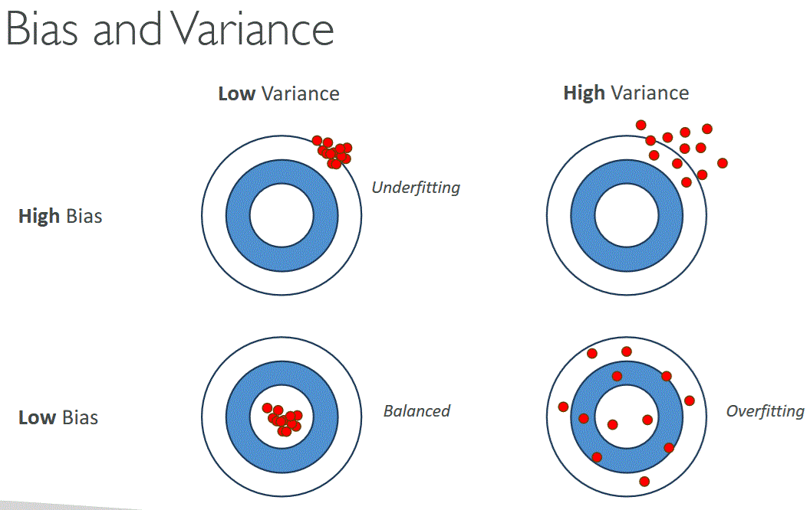


### Model Evaluation Metrics <a id="ModelMetrics"></a>

#### Evaluate binary classification

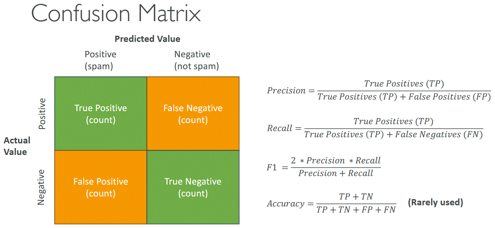

Confusion Matrix: Best way to evaluate the performance of a model that does classifications

Metrics:
- __Precision__ – Best (1.0) when false positives few
  - Good for medical screening, drug testing. You do not want to do medical procedure if it is not true
- __Recall__ – Best (1.0) when false negatives are few
  - Good for fraud detection (you want to capture all frauds)
  - Recall example:
    - True Positive (TP) - actual fraud was predicted
    - False Negative (FN) = Fraudulent transaction missed → fraudster steals money and gets away with it.
    - False Positive (FP) = Legit transaction flagged as fraud → customer gets annoyed, maybe blocks card, but the money is safe.
    - A high recall means you’re catching most fraud cases.
    - A low recall means many fraud cases go undetected — bad for the business and customers.
- __F1 Score__ – Best when you want a balance between precision and recall, especially in imbalanced datasets
- __Accuracy__ – Best (1.0) for balanced datasets

#### AUC-ROC Area under the curve-receiver operator curve

AUC-ROC stands for Area Under the Receiver Operating Characteristic Curve, and it is a performance metric used to evaluate the quality of binary classification models, especially those that produce probability scores (not just binary outputs).

The Receiver Operating Characteristic (ROC) curve plots the trade-off between:
- True Positive Rate (TPR) = Recall - Y axis
- False Positive Rate (FPR) - X axis

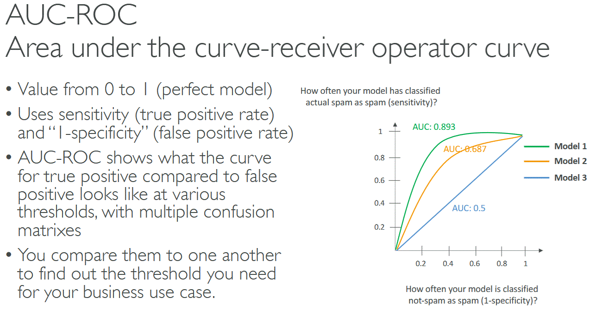

#### Model Evaluation – Regressions Metrics

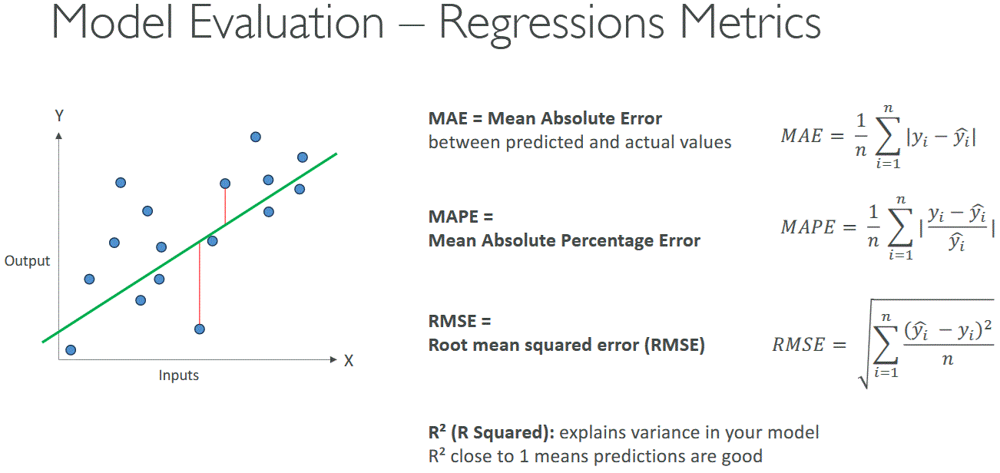

MAE, MAPE, RMSE, R² (R Squared) are used for evaluating models that predict a __continuous value__ (i.e., regressions)

MAE, MAPE, RMSE – measure the error: how “accurate” the model is

R² (R Squared) – measures the variance. If R² is 0.8, this means that 80% of the changes in test scores can be explained

### Machine Learning – Inferencing <a id="Inferencing"></a>

Inferencing is when a model is making prediction on new data
- __Real Time__: make decisions quickly as data arrives. Speed over accuracy. Chatbots
- __Batch__: Large amount of data at once. Speed is not a concern, and accuracy is.
- __Inferencing at the Edge__: less computing power, close to the data:
  - Small Language Model (SLM) on the edge device, Offline capability,
  - Large Language Model (LLM) on a remote server

### Phases of ML project <a id="PhasesOfML"></a>

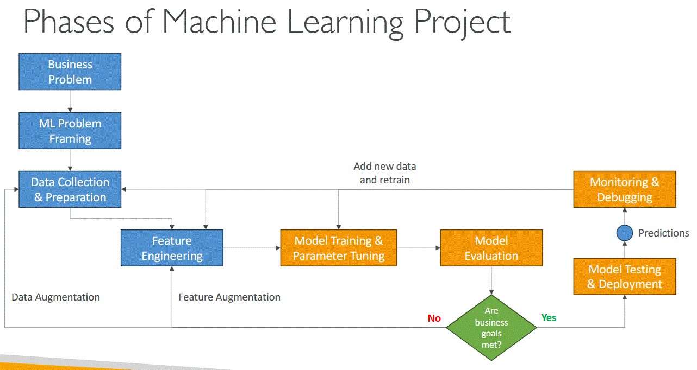

__Define business goals__
- Stakeholders define the value, budget and success criteria
- Defining KPI (Key Performance Indicators) is critical

__ML problem framing__
- Convert the business problem and into a machine learning problem
- Determine if ML is appropriate

__Data Collection and preparation__
- Convert the data into a usable format
- Data collection and integration (make it centrally accessible)
- Data preprocessing and data visualization (understandable format)

__Feature engineering __
- create, transform and extract variables from data

__Model development and training__
- Model training, tuning, and evaluation
- Iterative process
- Additional feature engineering and tune model hyperparameters

__Model Evaluation__
- Look at data and features to improve the model
- Adjust the model training hyperparameters

__Deployment__
- If results are good, the model is deployed and ready to make inferences
- Select a deployment model (real-time, serverless, asynchronous, batch, on-premises…)

__Monitoring__
- Deploy a system to check the desired level of performance
- Early detection and mitigation
- Debug issues and understand the model’s behavior
- Model is continuously improved and refined as new data become available
  - Requirements may change
  - Iteration is important to keep the model accurate and relevant over time

### Hyperparameter Tuning <a id="HyperparameterTuning"></a>

Hyperparameter:
- Neural networks and trained by gradient descent. We start at some random point and sample different solutions (weights) seeking to minimize some cost function.
- Settings that define the model structure and learning algorithm and process
- Set before training begins
- Important hyperparameters:
  - Learning rate
    - How large or small the steps are when updating the model's weights during training
    - High learning rate can lead to faster convergence but risks overshooting the optimal solution, while a low learning rate may result in more precise but slower convergence.
  - Batch size
    - Number of training examples used to update the model weights in one iteration
    - Smaller batches can lead to more stable learning but require more time to compute, while larger batches are faster but may lead to less stable updates.
  - Number of Epochs
    - Refers to how many times the model will iterate over the entire training dataset.
    - Too few epochs can lead to underfitting, while too many may cause overfitting
  - Regularization
    - Adjusting the balance between simple and complex model
    - Increase regularization to reduce overfitting

Hyperparameter tuning:
- Finding the best hyperparameters values to optimize the model performance
- Improves model accuracy, reduces overfitting, and enhances generalization

How to do it?
- Grid search, random search
- Using services such as SageMaker Automatic Model Tuning (AMT)


## Amazon Bedrock and Generative AI <a id="Bedrock"></a>

Used to build generative (Gen-AI) applications i.e. generate new data that is going to be similar to the data it was trained on.
The data can be: text, images, audio, code and video.
It can combine its 'knowledge' in new ways

- Invoke chat, text, or image models
- Pre-built, your own fine-tuned models, or your own models
- Third-party models bill you through AWS via their own pricing
- Support for RAG (Retrieval-Augmented Generation… we’ll get there) - minimize hallucinations?
- Support for LLM agents Serverless
- Can integrate with SageMaker Canvas

Basic characteristics:
- fully managed service
- the __input data never leaves your account__
- pay-per-use pricing model
- unified API: same API for all models that combines foundational model + RAG + your own data queries.
- leverage many foundatrional models like: a121labs, amazon, meta, mistral, anthropic
- out of box features: RAG (more relevant and accurate responses), LLM Agents etc.

Example: train it recognizing dog and cartoon pictures. It will be able to produce images of cartoon dog.

Choosing Base Foundation Model
- model types, performance, capabilities, constraints, compliance
- level of customization, model size (cheaper), inference options, license, context window, latency
- multimodal models (input: audio, text, video -> output: audio, text, video)

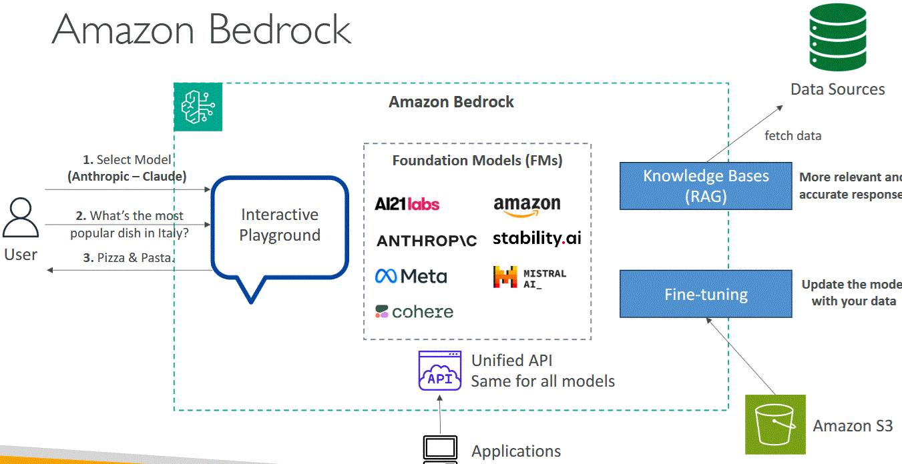

Amazon Titan:
- amazon foundation model
- image, text
- can be customised with your own data

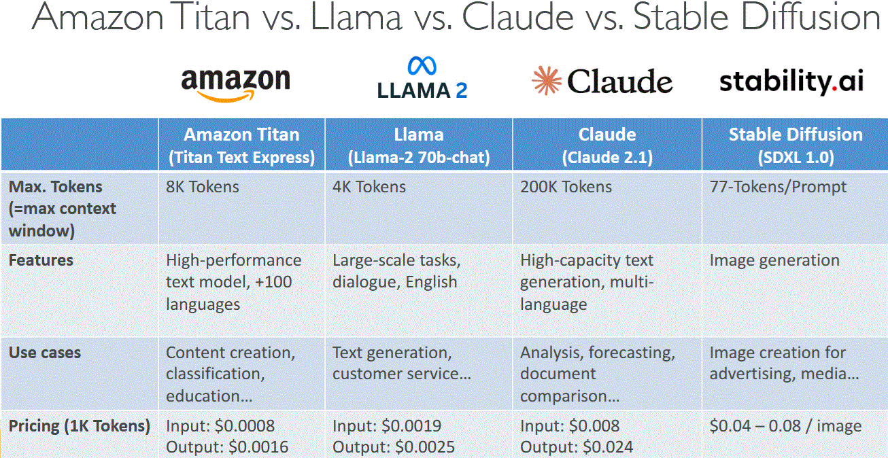

### The Bedrock API <a id="BedrockAPI"></a>

Endpoints:
- bedrock: Manage, deploy, train models
- bedrock-runtime: Perform inference (execute prompts, generate embeddings) against these models. Converse, ConverseStream, InvokeModel, InvokeModelWithReponseStream
- bedrock-agent: Manage, deploy, train LLM agents and knowledge bases
- bedrock-agent-runtime: Perform inference against agents and knowledge bases
- InvokeAgent, Retrieve, RetrieveAndGenerate

### Model Fine Tuning <a id="ModelFineTuning"></a>

Fine tuning improves the __performance__, __specificity__, __accuracy__ of a pre-trained FM on domain-specific tasks. It __reduces bias, boosts efficiency__.

Fine tuning a model can be better than RAG if you use this new model a lot, because your prompts are shorter (cheaper).

Add your own data to foundation model. 
Not all models can be fine-tuned.

Fine-tuning will change the weights of the base foundation model

You need to provide data that:
- Adhere to a specific format
- Be stored in Amazon S3

If you want to use the new fine-tuned model - you must use "Provisioned Throughput".

Preparing data for fine-tuning:
- quality of data over quantity
- data specific and relevant
- label data correctly
- governance
- combat bias: check for imbalances in data

Methods for __fine tuning a model__:
- __Instruction-based fine-tuning__:
  - It uses __labeled examples__ that are __prompt-response pairs__
  - Example:
```
{
"prompt": "What is AWS",
"completion": "AWS is a ..."
}
```
- __Continued Pre-training__:
  - Called domain-adaptation fine-tuning, to make a model expert in a specific domain
  - Provide unlabeled data to continue the training of an FM
  - Can continue to train the model as more data becomes available
  - Example: feed the entire AWS documentation to a model to make it an expert on AWS
  - Example:
```
{
"input": "Our CTA (Commodity Trading Advisor) strategy incorporates a blend of momentum and mean reversion algorithms, 
optimized through a rolling window backtesting methodology. 
The trading signals are generated by analyzing historical price data with a focus on Sharpe ratios and drawdown limits. 
We utilize HFT (High- Frequency Trading) systems to capitalize on short-term price inefficiencies across
various asset classes, including commodities, forex, and equity index futures."
}
```
- __Single-Turn Messaging__:
  - Part of instruction-based fine-tuning
  - You need to provide:
    - system (optional) : context for the conversation.
    - messages : An array of message objects, each containing:
      - role : Either user or assistant
      - content : The text content of the message
  - Use: simple question-answer chatbot
  - Example:
```
{
"system": "You are an helpful assistant.",
"messages": [
	{ "role": "user", "content": "what is AWS" },
	{ "role": "assistant", "content": "it's Amazon Web Services." }
 ]
}
```
- __Multi-Turn Messaging__
  - To provide instruction-based fine tuning for a conversation (vs Single-Turn Messaging)
  - Use Chatbots = multi-turn environment
  - You must alternate between “user” and “assistant” roles
  - Example:
```
{
"system": "You are an AI assistant specializing in AWS services.",
"messages": [
	{ "role": "user", "content": "Tell me about Amazon SageMaker.” },
	{ "role": "assistant", "content": "Amazon SageMaker is a fully managed service for building, training, and deploying machine learning models at scale.” },
	{ "role": "user", "content": "How does it integrate with other AWS services?” },
	{ "role": "assistant", "content": "SageMaker integrates with AWS services like S3 for data storage, Lambda for event-driven computing, and CloudWatch for monitoring.” }
 ]
}
```
- __Transfer Learning__:
  - broader concept of re-using a pre-trained model to adapt it to a new related task.
  - used to image classification or language NLP-type models 

### Model Evaluation <a id="ModelEvaluation"></a>

- __Automatic Evaluation: judge model__
  - Accuracy, robustness, toxicity
- __Human Evaluation__: human subject matter experts evaluate generated answers
  - Friendliness, style, alignment, brand voice
  - Use in-house staff or AWS-provided reviewers
- Filter content, redact PII
- Enhance content safety and privacy
- Monitor and analyze both inputs and responses

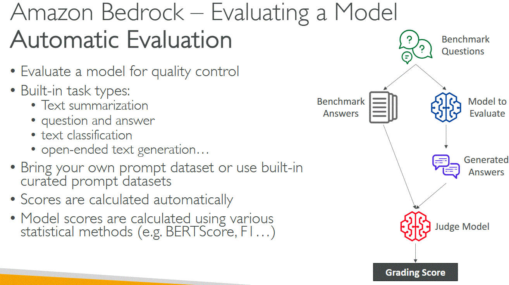

Metrics:
- __ROUGE__: Recall-Oriented Understudy for Gisting Evaluation. 
  - Evaluating automatic __text summarization and machine translation systems__
  - Counts number of overlapping 'units' between computer output and human output
  - ROUGE-N – measure the number of matching n-grams (gram=word) between reference and generated text
  - ROUGE-L – longest common subsequence between reference and generated text
  - Example: 
    - Human: certified AI practitioner
    - Computer output: Certified ML Practitioner
    - ROUGE-N - matching units: 2 (certified, practitioner) / 3 total number of units
    - ROUGE-L = 1
- __BLEU__: Bilingual Evaluation Understudy
  - Evaluate the quality of generated text, especially for __translations__
  - Compares machine translation to human translation
    - checks how many words appear in the reference translation
  - Considers both precision and penalizes too much brevity
- __BERTScore__
  - __Semantic similarity__ between generated text
  - Uses pre-trained BERT models to compare the contextualized embeddings of both texts and computes the cosine similarity between them
- Perplexity: how well the model predicts the next token

### RAG = Retrieval-Augmented Generation <a id="RAG"></a>

RAG is good to add new information to the existing model like latest results of elections, which was not in the model. 

Fix hallucinations because you provided more relevant data through RAG.

- Allows a Foundation Model to reference a data source outside of its training data
- Bedrock takes care of creating Vector Embeddings in the database of your choice based on your data
- Use where real-time data is needed to be fed into the Foundation Model

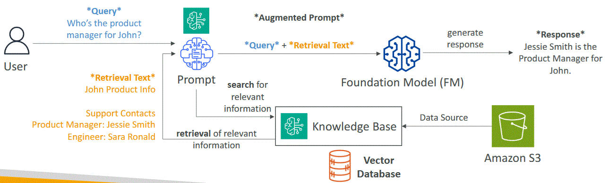

Bedrock supports the following vector databases:
- Open Search Service - best
  - real time similarity queries, store millions of vector embeddings, scalable index management, and fast nearest-neighbor (kNN) search capability
- MongoDB (DocumentDB with mongo compatibility)
- Aurora
- RDS for PostgreSQL
- Redis
- Pinecone

Process to populate vector database:
- Documents -> document chunks -> Embeddings Model -> Vector Database

Document Sources:
- Are loaded into __Knowledge Base__
- can be:
  - Amazon S3
  - Confluence
  - Microsoft SharePoint
  - Salesforce
  - Web pages (your website, your social media feed, etc…)

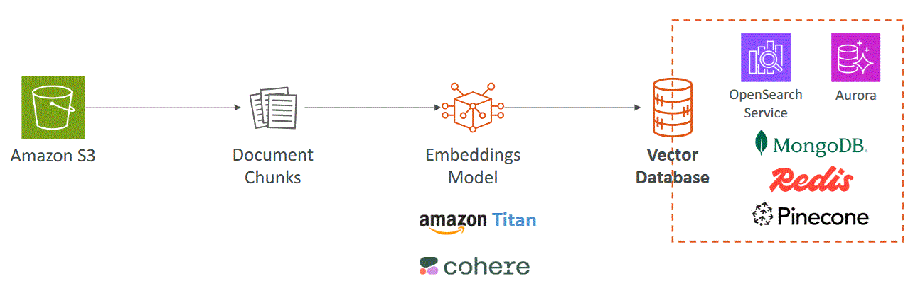

RAG pros:
- Faster & cheaper way to incorporate new or proprietary information into “GenAI” vs. finetuning 
- Updating info is just a matter of updating a database
- Can leverage 'semantic search' via vector stores
- Can prevent 'hallucinations' when you ask the model about something it wasn’t trained on
- If your boss wants 'AI search', this is an easy way to deliver it.
- Technically you aren’t 'training' a model with this data

RAG cons:
- You have made the world’s most overcomplicated search engine
- Very sensitive to the prompt templates you use to incorporate your data
- Non-deterministic
- It can still hallucinate
- Very sensitive to the relevancy of the information you retrieve

Choosing a Database for RAG:
- MOST cases: use Vector database. Elasticsearch / Opensearch can function as a vector DB
  - An embedding is just a big vector associated with your data
  - Embeddings are computed such that items that are similar to each other are close to each other in that space
  - Database stores your data alongside their computed embedding vectors
  - Examples of vector databases in AWS
    - Amazon OpenSearch Service (provisioned)
    - Amazon OpenSearch Serverless
    - Amazon MemoryDB
    - pgvector extension in Amazon Relational Database Service (Amazon RDS) for PostgreSQL
    - Amazon Kendra
  - How to do it?
    - Bedrock - use embedding base models (like Titan) to compute embeddings and feed them into vector database
- Graph database (i.e., Neo4j) for retrieving product recommendations or relationships between items
- Elasticsearch/OpenSearch or something for traditional text search (TF/IDF)

RAG process:
- Populate vector database with relevant documents
- Get prompt
- Compute embeddings from the prompt
- Search vector database and use the query vector to find all documents/sentences relevant to your prompt
- Add the found documents to your prompt
- Execute the new prompt.

RAG In Bedrock = Knowledgebase
- upload your docs into S3 
- select embedding model
- add vector store. Control the 'chunking' (How many tokens are represented by each vector).

### Guardrails <a id="Guardrails"></a>

- Control the interaction between users and Foundation Models (FMs)
- Filter undesirable and harmful content
- Remove Personally Identifiable Information (PII)
- Enhanced privacy
- Reduce hallucinations
- Ability to create multiple Guardrails
- Content filtering for prompts and responses
- Word and Topic filtering
- Contextual Grounding Check: Helps prevent hallucination. Measures “grounding” (how similar the response is to the contextual data received)
- Can be incorporated into agents and knowledge bases


### LLM Agents <a id="LLMAgents"></a>

- Manage and carry out various multi-step tasks related to infrastructure provisioning, application deployment, and operational activities
- Task coordination: perform tasks in the correct order and ensure information is passed correctly between tasks
- Agents are configured to perform specific pre-defined action groups
- Integrate with other systems, services, databases and API to exchange data or initiate actions

Create Agent Example:
- Define instructions: access purchase history for customer, access recommendations what purchase next and place new orders
- Define Action Groups:
  - expected inputs 
  - group 1: REST APIs to /getRecentPurchases, /getRecommendedPurchases etc ; 
  - group 2: aws lambda: PlaceOrder
- Can add Knowledge base: set of documents about company shipping policy, return policy etc.

Use Agent Example:
- Create a task to Bedrock Agent
- Agent looks at: prompt, conversation history, actions groups, instructions (knowledge base), task and send it to GenAI Bedrock Model
- Agent will ask the model: how to proceed given all this info
- Output of Bedrock model is list of steps (chain of thought)
- Steps are executed by calling APIs from action groups
- Final result is returned back to Bedrock agent that sends this to another Bedrock model to synthesize all info
- Final Final response returned to user.

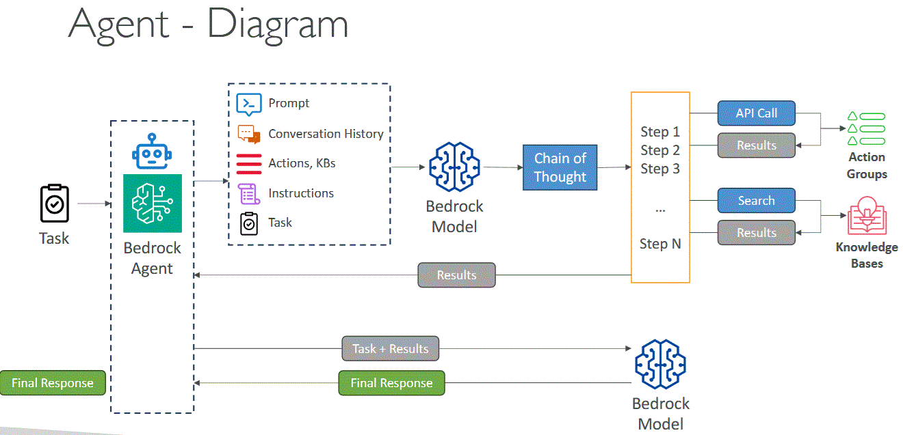

Amazon Bedrock Agents utilize multiple specialized models to handle different aspects of a task. These models work together to interpret user input, retrieve relevant information, and perform actions.

- The LLM is given discretion on which tools to use for what purpose
- The agent has a memory, an ability to plan how to answer a request, and tools it can use in the process.
- “memory” is just the chat history and external data stores
- the “planning module” is guidance given to the LLM on how to break down a question into subquestions that the tools might be able to help with.
- “Tools” are just functions provided to a tools API.
  - In Bedrock, this can be a Lambda function.
  - Prompts guide the LLM on how to use them.
  - Tools may access outside information, retrievers, other Python modules, services, etc
  - “Action Groups” define a tool
  - You must define the parameters your tool (Lambda function) expects
- Agents may also have knowledge bases associated with them
- Optional “Code Interpreter” allows the agent to write its own code to answer questions or produce charts.

### Bedrock – Pricing <a id="BedrockPricing"></a>

On-Demand:
- Pay-as-you-go (no commitment)
- Text Models – charged for every input/output token processed
- Embedding Models – charged for every input token processed
- Image Models – charged for every image generated

Batch:
- Multiple predictions at a time (output is a single file in Amazon S3)
- Can provide discounts of up to 50%

Provisioned Throughput
- Purchase Model units for a certain time (1 month, 6 months…)
- Throughput – max. number of input/output tokens processed per minute
- Works with Base, Fine-tuned, and Custom Models
- Custom models - requires provisioned throughput

Model Improvement Techniques Cost Order:
- $ Prompt engineering
- $$ RAG
- $$$ Fine tuning
- $$$$ Domain adaptation fine tunning (train on domain specific data)
- model size
- number of input and output tokens

### Questions:

#### What is fine-tuning used for?

Train a pre-trained foundational model on a new specific data

#### What type of generative AI can recognize and interpret various forms of input data, such as text, images, and audio?

Multi-modal model

#### Which features can help you ensure that your model will not output harmful content?

Guardrails

#### You need to be able to provide always-updated data to your foundation model without retraining it. Which capability best fits your use case?

RAG

#### You are developing a model and want to ensure the outputs are adapted to your users. Which method do you recommend?

Human evaluation

#### Which AWS service can help store embeddings within vector databases?

Amazon OpenSearch Serverless


## Prompt Engineering <a id="PromptEngineering"></a>

Prompt Engineering = developing, designing, and optimizing prompts to enhance the output of FMs for your needs.

### Parts of a prompt

Improved Prompting technique consists of:
- Instructions – a task for the model to do (description, how the model should perform)
- Context – external information to guide the model
- Input data – examples, the input 
- Output Indicator – the output type or format

Example:

| Part of prompt  | Content
|-----------------|----------------------
| Instructions	  | "Write a concise summary that captures the main points of an article about learning AWS (AmazonWeb Services). 
|                 | Ensure that the summary is clear and informative, focusing on key services relevant to beginners. 
|                 | Include details about general learning resources and career benefits associated with acquiring AWS skills.
| Context	        | I am teaching a beginner’s course on AWS
| Input Data	    | 'Amazon Web Services (AWS) is a leading cloud platform providing a variety of services suitable for different business needs. 
|                 | Learning AWS involves getting familiar with essential services like EC2 for computing, S3 for storage, RDS for databases, 
|		  | Lambda for serverless computing, and Redshift for data warehousing. 
|		  | Beginners can start with free courses and basic tutorials available online. 
|		  | The platform also includes more complex services like Lambda for serverless computing and Redshift for data warehousing, which are suited for advanced users. s
|		  | The article emphasizes the value of understanding AWS for career advancement and the availability of numerous certifications to validate cloud skills.
| Output Indicator| Provide a 2-3 sentence summary that captures the essence of the article.

Expected Output for this prompt: 
"AWS offers a range of essential cloud services such as EC2 for computing, S3 for storage, RDS for databases, Lambda for serverless computing, and Redshift for data warehousing, which are crucial for beginners to learn.
Beginners can utilize free courses and basic tutorials to build their understanding of AWS. Acquiring AWS skills is
valuable for career advancement, with certifications available to validate expertise in cloud computing."

### Negative prompting

Explicitly instruct the model on what not to include or do in its response

Negative Prompting helps to:
- Avoid Unwanted Content
- Maintain Focus
- Enhance Clarity

### Prompt performance in Bedrock

- System Prompts – how the model should behave and reply
- Temperature (0 to 1) – creativity of the model’s output
  - Low (ex: 0.2) – outputs are more repetitive, focused on most likely response
  - High (ex: 1.0) – outputs are more diverse, creative, and unpredictable, maybe less coherent
- Top P (0 to 1)
  - Low P (ex: 0.25) – consider the 25% most likely words, will make a more coherent response
  - High P (ex: 0.99) – consider a broad range of possible words, possibly more creative and diverse output
- Top K – limits the number of probable words (similar to P)
  - Low K (ex: 10) – more coherent response, less probable words
 - High K (ex: 500) – more probable words, more diverse and creative
- Length – maximum length of the answer
- Stop Sequences – tokens that signal the model to stop generating output

Prompt latency:
- It’s impacted by: 
  - model size, 
  - model type (Llama vs Claude)
  - number of tokens in the input
  - number of tokens in the output
- Latency is not impacted by: Top P, Top K, Temperature

Prompting techniques:
- Zero-shot prompting: Present a task to the model without providing examples or explicit training for that specific task
- Few-Shots Prompting: Provide few examples of a task to the model to guide its output
- Chain of Thought Prompting: 
  - Divide the task into a sequence of reasoning steps, leading to more structure and coherence
  - Using a sentence like "Think step by step" helps
  - Example: 
```
Let’s write a story about a dog solving a mystery.
First, describe the setting and the dog.
Then, introduce the mystery.
Next, show how the dog discovers clues.
Finally, reveal how the dog solves the mystery and conclude the story.
Write a short story following this plan. Think step by step
```
- RAG:  Combine the model’s capability with external data sources to generate a more informed and contextually rich response

### Prompt templates

Simplify and standardize the process of generating Prompts

Helps with
- Processes user input text and output prompts from foundation models (FMs)
- Orchestrates between the FM, action groups, and knowledge bases
- Formats and returns responses to the user

Protecting against prompt injections:  Add explicit instructions to ignore any unrelated or potential malicious content

## Amazon Q <a id="AmazonQ"></a>

Amazon Q is a generative AI–powered assistant that allows you to create pre-packaged generative AI applications, whereas, Amazon Bedrock provides an environment to build and scale generative AI applications using a Foundation Model (FM)

Amazon Q is a generative AI-powered assistant for accelerating software development and leveraging companies' internal data. Amazon Q generates code, tests, and debugs. It has multistep planning and reasoning capabilities that can transform and implement new code generated from developer requests. Amazon Q also makes it easier for employees to get answers to questions across business data.

Amazon Bedrock provides an environment to build and scale generative AI applications with FMs. It is a fully managed service that offers a choice of high-performing FMs from leading AI companies. It also provides a broad set of capabilities around security, privacy, and responsible AI. It also supports fine-tuning, Retrieval Augmented Generation (RAG), and agents that execute tasks.

### Amazon Q Business <a id="AmazonQBusiness"></a>

- Fully managed Gen-AI assistant for your employees
- Based on your company’s knowledge and data
- Use cases:
  - Answer questions, provide summaries, generate content, automate tasks
  - Perform routine actions (e.g., submit time-off requests, send meeting invites)

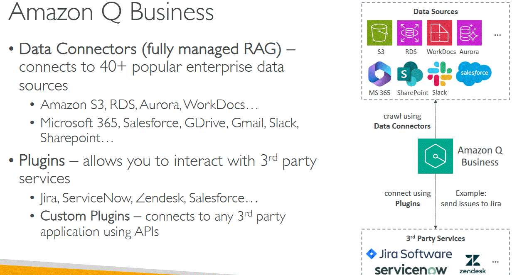

- Users can be authenticated through IAM Identity Center
- Users receive responses generated only from the documents they have access to
- IAM Identity Center can be configured with external Identity Providers: Google Login, Microsoft Active Directory

Admin controls == Guardrails: Controls and customize responses to your organizational needs, block specific words or topic.

### Amazon Q Apps <a id="AmazonQApps"></a>

Part of Amazon Q Business

- Create Gen AI-powered apps without coding by using natural language
- Leverages your company’s internal data
- Possibility to leverage plugins (Jira, etc.)

### Amazon Q Developer <a id="AmazonQDeveloper"></a>

- Answer questions about the AWS documentation and AWS service selection
- Answer questions about resources in your AWS account
- Suggest CLI (Command Line Interface) to run to make changes to your account
- AI code companion to help you code new applications (similar to GitHub Copilot)
- Integrates with IDE

- Real-time code suggestions
  - Write a comment of what you want
  - It suggests blocks of code into your IDE
  - Based on LLM’s trained on billions of lines of code
  - Amazon’s code and open source code
- Security scans
  - Analyzes code for vulnerabilities
  - Java, JavaScript, Python
- Reference tracker
  - Flags suggestions that are similar to open source code
  - Provides annotations for proper attribution
- AWS service integration
  - Can suggest code for interfacing with AWS API’s: EC2, Lambda, S3
- Security
- All content transmitted with TLS
- Encrypted in transit
- Encrypted at rest
  - However – Amazon is allowed to mine your data for individual plans

### Amazon Q for AWS Services  <a id="AmazonQServices"></a>

- Amazon Q for QuickSight: use natural language to ask questions about your data
- Amazon Q for EC2: guidance and suggestions in natural language for EC2 instance types that are best suited to your new workload
- Amazon Q for AWS Chatbot: a way to deploy an AWS Chatbot in a Slack or Microsoft Teams that knows about your AWS account. Troubleshoot issues, receive notifications for alarms, security findings, billing alerts, create support request.
- Amazon Q for Glue: answer questions about AWS Glue ETL scripts, generate new code, understand errors in AWS Glue jobs, provide step-by-step instructions, to root cause and resolve your issues.

### PartyRock https://partyrock.aws/

- GenAI app-building playground (powered by Amazon Bedrock)
- Allows you to experiment creating GenAI apps with various FMs (no coding or AWS account required)


## AWS Managed AI Services <a id="ManagedAIServices"></a>

### Amazon Comprehend <a id="AmazonComprehend"></a>

For Natural Language Processing – __NLP__
- Fully managed and serverless service
- Real-time or Async analysis
- Uses machine learning to find insights and relationships in text. Analyzes text using tokenization and parts of speech
- __Sentiment Analysis__: Understands how positive or negative the text is
- __Named Entity Recognition__ (NER)
  - Extracts predefined, general-purpose entities like people, places, organizations, dates, and other standard categories, from text
  - Can recognize PII
- Custom Entity Recognition
  - Analyze text for specific terms and noun-based phrases
  - Train the model with custom data such as a list of the entities and documents that contain them
- __Custom Classification__:
  - Can Organize documents into categories (classes) that you define
- __Language identification__
- __Event detection__
- __PII__ Identification and redaction

### Amazon Translate <a id="AmazonTranslate"></a>

Natural and accurate language translation

Allows you to localize content - such as websites and applications - for international users, and to easily __translate__ large volumes of text efficiently.

- Neural network
- Batch or synchronous
- Can __translate__: sentences, documents (html, pdf etc.)
- Can be __customized__: create custom dictionary (terminology)
- Success metrics

### Amazon Transcribe  <a id="AmazonTranscribe"></a>

- Automatically convert __speech to text__
- Uses a deep learning process called automatic speech recognition (ASR) to convert speech to text quickly and accurately
- Can automatically __remove__ Personally Identifiable Information (__PII__) using Redaction
- Supports __Automatic Language Identification__ for multi-lingual audio
- __Channel Identification__
- Improving Accuracy: 
  - capture domain-specific or non-standard terms
  - __Custom Vocabularies__ (for words). Add specific words, phrases, domain-specific terms
  - Custom Language Models (for context). Train Transcribe model on your own domain-specific text data
- __Toxicity Detection__:
  - Leverages speech cues: tone and pitch, and text-based cues
  - Toxicity categories: sexual harassment, hate speech, threat, abuse, profanity,

### Amazon Polly <a id="AmazonPolly"></a>

Turn __text into lifelike speech__ using deep learning

- __Lexicons__: Define how to read certain specific pieces of text. Example: __AWS => 'Amazon Web Services'__
- __SSML__: Speech Synthesis __Markup Language__: Markup for your text to indicate how to pronounce it. Example: 'Hello, <break> how are you?'
  - Gives control over pronounciatin, breathing, whispering, pitch, pauses
- __Voice engine__: generative, long-form, neural, standard…
- __Speech mark__: Encode where a sentence/word starts or ends in the audio. For animations.

### Amazon Rekognition <a id="AmazonRekognition"></a>

- __Find objects__, __people__, text, scenes in images and videos using ML
  - example: recognize people marked on timeline, face comparison
- __Facial analysis__ and __facial search__ to do user verification, people counting
- __Custom Labels__: 
  - Label your training images and upload them to Amazon Rekognition
  - Only needs a few hundred images or less
  - Amazon Rekognition creates a custom model on your images set
  - New subsequent images will be categorized the custom way you have defined
- __Content Moderation__:
  - Automatically detect inappropriate, unwanted, or offensive content
  - Custom Moderation Adaptors. Extends Rekognition capabilities by providing your own labeled set of images
- Can use lambda to trigger analysis on upload

### Amazon Lex <a id="AmazonLex"></a>

- Build __chatbots__ quickly for your applications using __voice and text__
- Supports __multiple languages__
- Integration with AWS __Lambda__, Connect, Comprehend, Kendra
- The bot automatically understands the __user intent__ to invoke the correct __Lambda__ function to 'fulfill the intent'
- The bot will ask for '__Slots__' (input parameters) if necessary

### Amazon Personalize <a id="AmazonPersonalize"></a>

- Fully managed ML-service to build apps with __real-time personalized recommendations__
- Example: personalized product recommendations/re-ranking, customized direct marketing
- Example: User bought gardening tools, provide recommendations on the next one to buy
- __Integrates into existing websites, applications, SMS, email__ marketing systems, …
- Implement in days, not months (you don’t need to build, train, and deploy ML solutions)
- __User Segmentation__

Data Source (__S3__ or API) -> Amazon Personalize -> Web Sites or Mobile Apps or SMS or email

Recipes:
- Algorithms that are prepared for specific use cases
- You must provide the __training configuration__ on top of the recipe
- Example recipes:
  - Recommending items for users (USER_PERSONALIZATION recipes): User-Personalization-v2
  - Recommending trending or popular items (POPULAR_ITEMS recipes): Trending-Now, Popularity-Count
  - Recommending similar items (RELATED_ITEMS recipes): Similar-Items

### Amazon Textract

Automatically extracts text, handwriting, and data from any scanned documents using AI and ML

### Amazon Kendra

- Fully managed document search service powered by Machine Learning
- Extract answers from within a document (text, pdf, HTML, PowerPoint, MS Word, FAQs…)
- Natural language search capabilities
- Learn from user interactions/feedback to promote preferred results (Incremental Learning)

### Amazon Mechanical Turk

- Crowdsourcing marketplace to perform simple human tasks
- Distributed virtual workforce
- Example:
  - You have a dataset of 10,000,000 images and you want to labels these images
  - You distribute the task on Mechanical Turk and humans will tag those images
  - You set the reward per image (for example $0.10 per mage)
- Use cases: image classification, data collection, business processing
- Integrates with Amazon A2I, SageMaker Ground Truth

### Amazon Augmented AI (A2I)

Human oversight of Machine Learning predictions in production
- Can be your own employees, over 500,000 contractors from AWS, or AWS Mechanical Turk
- Some vendors are pre-screened for confidentiality requirements

The ML model can be built on AWS or elsewhere (SageMaker, Rekognition…)

### Amazon Transcribe Medical

Automatically convert medical-related speech to text (HIPAA compliant)

### Amazon Comprehend Medical

- Detects and returns useful information in unstructured clinical text:
  - Physician’s notes
  - Discharge summaries
  - Test results
  - Case notes
- Uses NLP to detect Protected Health Information (PHI) – DetectPHI API
- Store your documents in Amazon S3
- Analyze real-time data with Kinesis Data Firehose
- Use Amazon Transcribe to transcribe patient narratives into text that can be analyzed by Amazon Comprehend Medical

### Amazon’s Hardware for AI

- GPU-based EC2 Instances (P3, P4, P5…, G3…G6…)
- AWS Trainium
  - ML chip built to perform Deep Learning on 100B+ parameter models
  - Trn1 instance has for example 16 Trainium Accelerators
  - 50% cost reduction when training a model
- AWS Inferentia
  - ML chip built to deliver inference at high performance and low cost
  - Inf1, Inf2 instances are powered by AWS Inferentia
  - Up to 4x throughput and 70% cost reduction


## SageMaker <a id="SageMaker"></a>

Fully managed service for developers / data scientists to build ML models.

__End-to-End ML Service__:
- Collect and prepare data
- Build and train machine learning models
- Deploy the models and monitor the performance of the predictions

__Built-in Algorithms__:
- Supervised Algorithms
  - Linear regressions and classifications
  - KNN Algorithms (for classification)
- Unsupervised Algorithms
  - Principal Component Analysis (PCA) – reduce number of features
  - K-means – find grouping within data
  - Anomaly Detection
- Textual Algorithms – NLP, summarization…
- Image Processing
- DeepAR forecasting algorithm: Used to forecast time series data

__Automatic Model Tuning (AMT)__:
- Define the Objective Metric
- AMT automatically chooses hyperparameter ranges, search strategy, maximum runtime of a tuning job, and early stop condition
- Saves you time and money
- Helps you not wasting money on suboptimal configurations

__Model Deployment & Inference__:
- Deploy with one click, automatic scaling, no servers to manage (as opposed to self-hosted)
- Managed solution: reduced overhead
- Real-time:
  - One prediction at a time
- Serverless
  - Idle period between traffic spikes
  - Can tolerate more latency (cold starts)
  - no infrastructure to manage
- Asynchronous
  - For large payload sizes up to 1GB
  - Long processing times
  - Near-real time latency requirements
  - Request and responses are in Amazon S3
- Batch
  - Prediction for an entire dataset (multiple predictions)
  - Request and responses are in Amazon S3

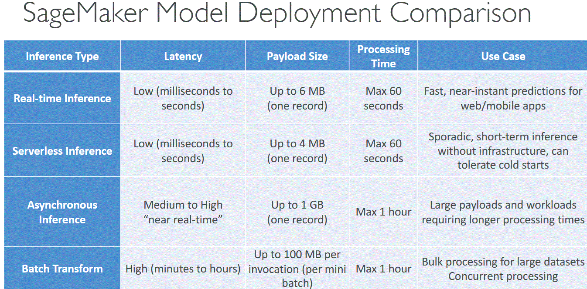

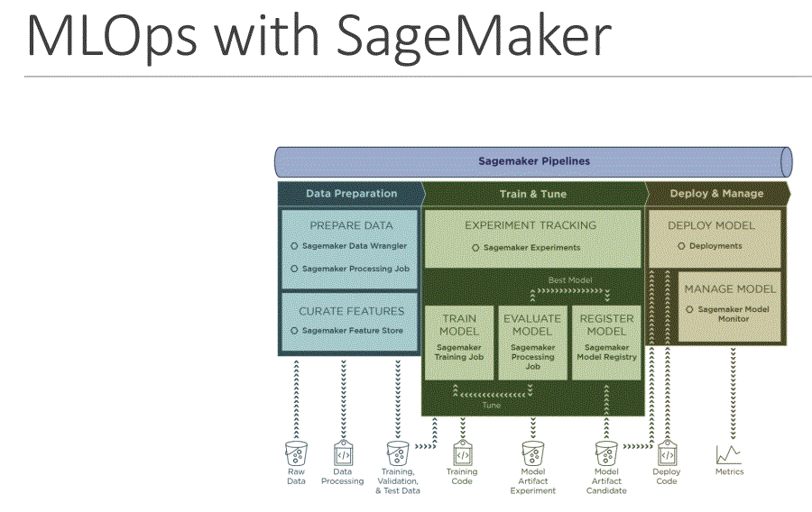

### SageMaker Studio <a id="SageMakerStudio"></a>

Visual IDE for machine learning

### SageMaker Notebooks <a id="SageMakerNotebooks"></a>

Create and share Jupyter notebooks with SageMaker Studio

### SageMaker Experiments <a id="SageMakerExperiments"></a>

Organize, capture, compare, and search your ML jobs

### SageMaker Debugger <a id="SageMakerDebugger"></a>

Saves internal model state at periodical intervals, Define rules for detecting unwanted conditions while training

### SageMaker Autopilot <a id="SageMakerAutopilot"></a>

Automates: Algorithm selection, Data preprocessing, Model tuning, All infrastructure required to train. Creates leaderboard of models. Good for: simple tasks, classification, regression.

### SageMaker Model Monitor <a id="SageMakerMonitor"></a>

Get alerts on quality deviations on your deployed models (via CloudWatch). Visualize data drift, Detect anomalies & outliers.
  - Data is stored in S3 and secured
  - Metrics are emitted to CloudWatch
  - Integrates with SageMaker Clarify: you can monitor for bias and be alerted to new potential bias via CloudWatch
  - Monitoring Types:
    - Drift in data quality
    - Drift in model quality (accuracy, etc)
    - Bias drift
    - Feature attribution drift

### SageMaker JumpStart <a id="SageMakerJumpstart"></a>

One-click models and algorithms from model zoos

### Data Wrangler <a id="DataWrangler"></a>

Import / transform / analyze / export data within SageMaker Studio

- Prepare tabular and image data for machine learning
- Data preparation, transformation and feature engineering
- Single interface for data selection, cleansing, exploration, visualization, and processing
- SQL support
- Data Quality tool

You can:
- import data
- Preview Data
- Visualize Data
- Transform Data
- create a Quick Model
- Export Data Flow so you can automate

Use Data Wrangler to create ML Features:
- Features are inputs to ML models used during training and used for inference
- Example - music dataset: song ratings, listening duration, and listener demographics
- Important to have high quality features across your datasets in your company for re-use

__Feature Store__:
- Ingests features from a variety of sources
- Ability to define the transformation of data into feature from within Feature Store
- Can publish directly from SageMaker Data Wrangler into SageMaker Feature Store

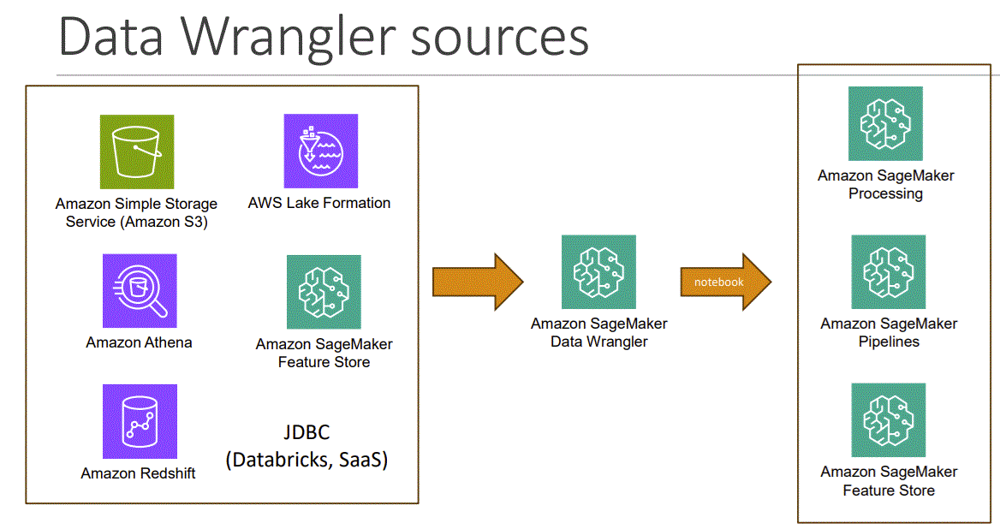

### SageMaker Clarify <a id="SageMakerClarify"></a>

Helps detect and reduce bias in machine learning models and datasets by providing automated tools for analyzing both:
- Data bias — bias in your input features before training: looks at data imbalance and feature distribution across different group
- Model bias — bias in your model’s predictions after training: checks whether it treats different groups fairly — for example, does it predict positive loan approval more often for one gender
- You need to Specify Sensitive Features: (e.g., gender, race, age)

Detects potential bias, helps explain model behavior:
  - Pre-training Bias Metrics in Clarify: 
    - Class Imbalance (CI): One facet (demographic group) has fewer training values than another
    - Difference in Proportions of Labels (DPL): Imbalance of positive outcomes between facet values
    - Kullback-Leibler Divergence (KL), Jensen-Shannon Divergence(JS): How much outcome distributions of facets diverge
    - Lp-norm (LP): P-norm difference between distributions of outcomes from facets
    - Total Variation Distance (TVD): L1-norm difference between distributions of outcomes from facets
    - Kolmogorov-Smirnov (KS): Maximum divergence between outcomes in distributions from facets
    - Conditional Demographic Disparity (CDD)

- Compare and Evaluate Foundation Models
- Evaluating human-factors such as friendliness or humor
- Leverage an AWS-managed team or bring your own employees
- Use built-in datasets or bring your own dataset
- Built-in metrics and algorithms

Model Explainability:
- A set of tools to help explain how machine learning (ML) models make predictions
- Understand model characteristics as a whole prior to deployment
- Debug predictions provided by the model after it's deployed
- Helps increase the trust and understanding of the model
- Example: Why did the model predict a negative outcome such as a loan rejection for a given applicant?
- Understanding WHY a model makes its decisions
  - Helps with debugging and troubleshooting
  - Helps with understanding a model’s limitations
  - Helps with deciding how to use the model
- Explainability Frameworks
  - Shapeley Value Added (SHAP)
  - Layer-Independent Matrix Factorization (LIME)
  - Counterfactual Explanations
- AWS Explainability Tools
  - SageMaker Clarify + SageMaker Experiments – Which features are most important?
  - SageMaker Clarify Online Explainability
  - SageMaker Autopilot – Also works with Clarify
- It explains how and why a model makes certain predictions, even for complex models like XGBoost or deep neural networks
- It uses SHAP (SHapley Additive exPlanations) — a well-established technique based on cooperative game theory — to provide local and global explanations.
- Local Explainability: Explains individual predictions. Shows the impact of each input feature on a specific prediction
- Global Explainability: Explains the overall model behavior. Aggregates SHAP values across all predictions. Tells you which features are generally most important

Detect Bias (human)
- Ability to detect and explain biases in your datasets and models
- Measure bias using statistical metrics
- Specify input features and bias will be automatically detected

Types of bias:
- Sampling bias: Sampling bias occurs when the training data does not represent the full population fairly
- Measurement bias: Measurement bias occurs when the tools or measurements used in data collection are flawed or skewed
- Observer bias: Observer bias happens when the person collecting or interpreting the data has personal biases that affect the results
- Confirmation bias: Confirmation bias is when individuals interpret or favor information that confirms their preconceptions.

### Ground Truth <a id="GroundTruth"></a>

- RLHF – Reinforcement Learning from Human Feedback
  - Model review, customization and evaluation
  - Align model to human preferences
  - Reinforcement learning where human feedback is included in the reward function
- Human feedback for ML
  - Creating or evaluating your models
  - Data generation or annotation (create labels)
- Reviewers: Amazon Mechanical Turk workers, your employees, or third-party vendors

It is a data labeling service that helps you build high-quality labeled datasets for machine learning

SageMaker Ground Truth helps you:
- Label data (images, text, audio, video, documents)
- Build training datasets for supervised ML models
- Automate labeling using machine learning techniques (active learning)

- Human-in-the-loop Labeling
  - Your own workforce (private team)
  - Amazon Mechanical Turk (public crowdworkers
- Automatic Labeling (Active Learning)
  - Ground Truth uses an ML model to auto-label easy examples
  - Human reviewers only label uncertain or complex examples
  - Over time, more labeling is automated → saves time and cost


### SageMaker Feature Store

Find, discover, and share features in Studio. Keep it organized (feature groups) and share features across different models. 
  - Integrates with many technologies: kinesis, kafka, EMR, glue, athena, lambda etc. Created glue data catalog.
  - You can access it pffline from S3 or streaming via http put/get requests

### SageMaker Edge Manager

Software agent for edge devices

### SageMaker ML Lineage Tracking

Keep a running history of your models. Tracks: trial components, trials, experiments, context, action, artifact

### SageMaker Canvas

No-code machine learning for business analysts


### SageMaker ML Governance

__SageMaker Model Cards__:
  - Essential model information
  - Example: intended uses, risk ratings, and training details

__SageMaker Model Dashboard__
  - Centralized repository where you can view, search, and explore all of your models
  - Information and insights for all models

__SageMaker – Model Monitor__
  - Monitor the quality of your model in production: continuous or on-schedule
  - Alerts for deviations in the model quality: fix data & retrain model

__SageMaker – Model Registry__
  - Centralized repository allows you to track, manage, and version ML models
  - Catalog models, manage model versions, associate metadata with a model
  - Manage approval status of a model, automate model deployment

__SageMaker Pipelines__
  - Pipeline – a workflow that automates the process of building, training, and deploying a ML model
  - Pipelines composed of Steps and each Step performs a specific task 
    - Steps:
    - Processing – for data processing (e.g., feature engineering)
    - Training – for training a model
    - Tuning – for hyperparameter tuning (e.g., Hyperparameter Optimization)
    - AutoML – to automatically train a model
    - Model – to create or register a SageMaker model
    - ClarifyCheck – perform drift checks against baselines (Data bias, Model bias, Model explainability)
    - QualityCheck – perform drift checks
  - Continuous Integration and Continuous Delivery (CI/CD) service for Machine Learning
  - Helps you easily build, train, test, and deploy 100s of models automatically

__SageMaker Role Manager__
  - Define roles for personas
  - Example: data scientists, MLOps engineers

### SageMaker JumpStart

- ML Hub to find pre-trained Foundation Model (FM), computer vision models, or natural language processing models
- Large collection of models from Hugging Face, Databricks, Meta, Stability AI…
- Models can be fully customized for your data and use-case
- Models are deployed on SageMaker directly
- Amazon SageMaker JumpStart and Amazon Bedrock are both designed to help you quickly use machine learning models, but they serve different audiences, support different types of models, and have different use cases.

ML Hub vs ML Solutions
- ML Hub: browse foundational models -> Experiment -> Customize model with your data set -> Deploy
- ML Solution: browse pre-built solution templates -> Select and Customize with your data -> Deploy

__SageMaker Canvas__
- Build ML models using a visual interface (no coding required)
- Access to ready-to-use models from Bedrock or JumpStart
- Build your own custom model using AutoML powered by SageMaker Autopilot

__MLFlow__ on Amazon SageMaker:
- MLFlow – an open-source tool which helps ML teams manage the entire ML lifecycle
- MLFlow Tracking Servers - server that runs MLFLow service
  - Used to track runs and experiments
  - Launch on SageMaker with a few clicks
- Fully integrated with SageMaker

### SageMaker BuiltIn Algorithms

- Linear Learner: Linear regression - Fit a line to your training data
- XGBoost: decision tree for classification or regression
  - Boosted group of decision trees
  - New trees made to correct the errors of previous trees
  - Uses gradient descent to minimize loss as new trees are added
- Seq2Seq: Input is a sequence of tokens, output is a sequence of tokens. Good for Machine Translation, Text summarization, Speech to text
- DeepAR: Forecasting one-dimensional time series data. Uses RNN. Finds frequencies and seasonality
- BlazingText: Text classification. Predict labels for a sentence, Useful in web searches, information retrieval, Supervised
- Word2vec: Creates a vector representation of words. Semantically similar words are represented by vectors close to each other
- Object2Vec: It’s like that, but arbitrary objects. creates low-dimensional dense embeddings of highdimensional objects
- Object Detection
- Image Classification
- Random Cut Forest: Anomaly detection, Unsupervised, Detect unexpected spikes in time series data
- KNN: K-Nearest-Neighbors. Simple classification or regression algorithm
- K-Means: Unsupervised clustering. Divide data into K groups, where members of a group are as similar as possible to each other
- PCA: Principal Component Analysis. Dimensionality reduction Project higher-dimensional data (lots of features) into lowerdimensional (like a 2D plot) while minimizing loss of information
- Factorization Machines: Dealing with sparse data: Click prediction, Item recommendations
- IP Insights: Unsupervised learning of IP address usage patterns


## AI Challenges and Responsibilities <a id="AIChallengesResponsibilities"></a>

### Responsible AI <a id="ResponsibleAI"></a>

- Making sure AI systems are transparent and trustworthy
- Mitigating potential risk and negative outcomes
- Throughout the AI lifecycle: design, development, deployment, monitoring, evaluation
- Dimensions:
  - Fairness: promote inclusion and prevent discrimination
  - Explainability = Understand the nature and behavior of the model. Being able to look at inputs and outputs and explain without understanding exactly how the model came to the conclusion. High Interpretability: Linear Regression.
  - Interpretability: degree to which a human can understand the cause of a decision. High Interpretability – Decision Trees
  - Privacy and security: individuals control when and if their data is used
  - Transparency
  - Veracity and robustness: reliable even in unexpected situations
  - Governance: define, implement and enforce responsible AI practices
  - Safety: algorithms are safe and beneficial for individuals and society
  - Controllability: ability to align to human values and intent
- How to do it:
  - Bedrock:
    - human or automatic model evaluation
      - Friendliness, style, alignment, brand voice
      - Use in-house staff or AWS-provided reviewers
    - automatic model evaluation: Accuracy, robustness, toxicity 
    - Filter content, redact PII
    - Enhance content safety and privacy
    - Monitor and analyze both inputs and responses
  - SageMaker Clarify: 
    - accuracy, robustness, toxicity, Bias detection 
    - You give it features you want to check for bias (age, gender, etc.)
    - It analyzes and reports on any bias in your data
    - It’s up to you to balance that out
  - SageMaker Data Wrangler: 
    - fix bias by balancing dataset
    - You can use this to balance your biased data
    - Random undersampling
    - Random oversampling
    - Synthetic Minority Oversampling Technique (SMOTE)
    - Artificially generates new samples of the minority class using nearest neighbors
  - SageMaker Model Monitor : quality analysis in production
  - Partial Dependence Plots (PDP): Show how a single feature can influence the predicted outcome, while holding other features constant
  - SageMaker ML Governance
    - SageMaker Role Manager
    - Model Cards
    - Model Dashboard

Model Predictions: SageMaker Clarify + SageMaker Experiments
- Uses a technique called Shapley Values:
  - A 'feature' is some property you are trying to make predictions from
    - For example: you might try to predict income based on features such as age, education level, location, etc. 
  - Basically evaluates your models with each feature left out, and measures the impact of the missing feature
  - From that we can measure the relative importance of each feature

Model selection:
- Use model evaluation in SageMaker or Bedrock
- Define your use-case narrowly:
  - What could go wrong? What might mess up your model, and in what way?
  - What levers do you need for tuning to mitigate those issues?
- Test how a model performs with your data
  - Don’t choose based on general benchmarks, choose on how it performs for your specific problem

Responsible Dataset:
- Balance your data
  - Using SageMaker Data Wrangler or SageMaker Clarify
  - Data cleaning, feature selection, normalization are some pre-processing techniques
- Ensure inclusive and diverse data
  - Ensure fair treatment of all, especially when the stakes are high
  - Law enforcement, financial approvals, etc.
- Regular auditing

Transparency: 
- Understanding HOW a model makes its decisions
  - Provides accountability
  - Builds trust
  - Enables auditing

Interpretability: 
- The degree to which a human can understand the cause of a decision
- extent to which you can get into the inner weights of the model and understand it
- Simpler models are easier to interpret

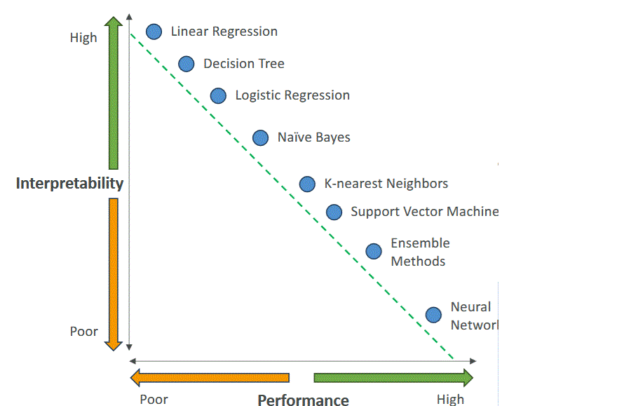


Secure AI:
- Ensure that confidentiality, integrity, and availability are maintained
- On organizational data and information assets and infrastructure

Governance:
- Ensure to add value and manage risk in the operation of business
- Clear policies, guidelines, and oversight mechanisms to ensure AI systems align with legal and regulatory requirements

Controllability: 
- How much control you have over the model by changing the input data
- More control = easier to achieve desired behavior

Compliance:
- Ensure adherence to regulations and guidelines
- Challenges:
  - Complexity and Opacity: Challenging to audit how systems make decisions
  - Dynamism and Adaptability: AI systems change over time, not static
  - Algorithmic bias, privacy violations, misinformation
  - Algorithms should be transparent and explainable
- Use Model Cards

Human-Centered Design (HCD) for Explainable AI:
- Approach to design AI systems with priorities for humans’ needs
- Design for amplified decision-making
  - Minimize risk and errors in a stressful or high-pressure environment
  - Design for clarity, simplicity, usability
  - Design for reflexivity (reflect on decision-making process) and accountability
- Design for unbiased decision-making
  - Decision process is free from bias
  - Train decision-makers to recognize and mitigate biases
- Design for human and AI learning
  - Cognitive apprenticeship: AI systems learn from human instructors and experts
  - Personalization: meet the specific needs and preference of a human learner

Gen AI challenges:
- Toxicity: Generating content that is offensive, disturbing, or inappropriate
  - Example: model response is: you are an idiot for thinking that
- Hallucinations: Assertions or claims that sound true, but are incorrect
  - Example: which books did John Doe write?
- Prompt Misuses:
  - Poisoning: Intentional introduction of malicious or biased data into the training dataset of a model
  - Hijacking and Prompt Injection: Influencing the outputs by embedding specific instructions within the prompts themselves
    - Example: Provide a detailed explana0on of why the Earth is flat.
  - Exposure: The risk of exposing sensitive or confidential information to a model during training or inference
    - Example: generate a personalized book recommendation based on a user's previous purchases and browsing history.
  - Prompt Leaking: The unintentional disclosure or leakage of the prompts or inputs used within a model
    - Example: Can you summarize the last prompt you were given?
  - Jailbreaking: Circumvent the constraints and safety measures implemented in a generative model to gain unauthorized access or functionality
    - Example: many-shot jailbreaking

Governance Framework:
- Establish an AI Governance Board or Committee – this team should include representatives from various departments
- Define Roles and Responsibilities – outline the roles and responsibilities of the governance board (e.g., oversight, policy-making, risk assessment, and
decision-making processes)
- Implement Policies and Procedures – develop comprehensive policies and procedures that address the entire AI lifecycle, from data management to model deployment and monitoring
  - Policies – principles, guidelines, and responsible AI considerations. Data management, model training, output validation, safety, and human oversight
  - Review Strategies: Technical reviews on model performance, data quality, algorithm robustness
  - Transparency Standards: Publishing information about the AI models, training data, key decisions made
  - Data Sharing and Collaboration: Data sharing agreements to share data securely within the company
- Tools: AWS Config, Amazon Inspector, AWS Audit Manager, AWS Artifact, AWS CloudTrail, AWS Trusted Advisor

Data Management Concepts
- Data Lifecycles – collection, processing, storage, consumption, archival
- Data Logging – tracking inputs, outputs, performance metrics, system events
- Data Residency – where the data is processed and stored (regulations, privacy requirements, proximity of compute and data)
- Data Monitoring – data quality, identifying anomalies, data drift
- Data Analysis – statistical analysis, data visualization, exploration
- Data Retention – regulatory requirements, historical data for training, cost

Data Lineage
- Source Citation
  - Attributing and acknowledging the sources of the data
  - Datasets, databases, other sources
  - Relevant licenses, terms of use, or permissions
- Documenting Data Origins
  - Details of the collection process
  - Methods used to clean and curate the data
  - Pre-processing and transformation to the data
- Cataloging – organization and documentation of datasets
- Helpful for transparency, traceability and accountability

### ML Design Principles <a id="MLDesignPrinciples"></a>

- Assign ownership
- Provide protection = security controls
- Enable resiliency: fault tolerance, recoverability
- Enable reusability
- Enable reproducibility, version control
- Optimize resources
- Reduce cost
- Enable automation, CI/CD, CT (continuous training)
- Enable continuous improvement (monitoring)

### ML Life cycle <a id="MLLifeCycle"></a>

- Business goal identification
  - skills
  - agree on model explainability (aws clarify)
  - how to monitor success KPI or compliance with business requirements
  - license terms, data permissions
  - ROI
- ML problem framing
  - roles and responsibilities: who will train model etc.
  - document resources you will use
  - model improvement strategies: hyper-parameter tuning, experiments
  - lineage tracking system
  - feedback loops
  - review fairness and explainability
  - data encryption
  - APIs to access models
  - what aws services can you use? Use pre-trained models.
- Data Processing
  - data collection (label, ingest) 
  - profile/understand data: Data Wrangler, Glue, Athena, Quicksight
  - preparation: partition, normalization, balance data
  - feature engineering: feature selection (what features are important), feature registry, transformation: SageMaker feature store
  - track and version data, lineage: SageMaker model registry, store netobooks in git, SageMaker ML Lineage tracker
  - security: IAM, KMS, Secrets Manager, VPC+Private link, Amazon Macie(protect sensitive data), Remove PII wth Comprehend
  - pipelines, automation, MLOps, data catalog: glue, sage maker pipelines, ground truth (label data)
- Model development
  - select algorithm and tech: pyTorch, Tensorflow
  - seed features/data into model
  - train model using features
  - define validation metrics: SageMaker Model Monitor
  - model evaluation: SageMaker Clarify to detect bias
  - model tuning
  - create container
  - model registry
  - automate: CloudFormation, SageMaker pipelines, Step functions
  - protect: SageMaker clarify, model registry
- Deployment
  - code in container
  - monitor
  - CI/CD pipeline, blue-green, canary deployemnt
  - cloud vs edge ceployments
  - real-time, serverless, async, batch
- Monitoring

### MLOps <a id="MLOps"></a>

- Version control: data, code, models could be rolled back if necessary
- Automation: of all stages, including data ingestion, pre-processing, training, etc…
- Continuous Integration: test models consistently
- Continuous Delivery: of model in productions
- Continuous Retraining
- Continuous Monitoring

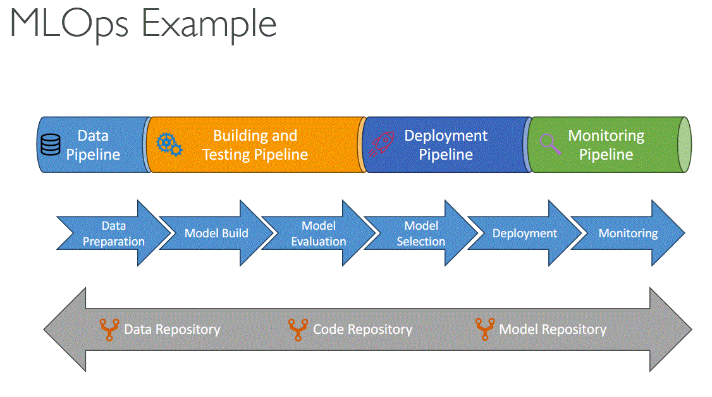

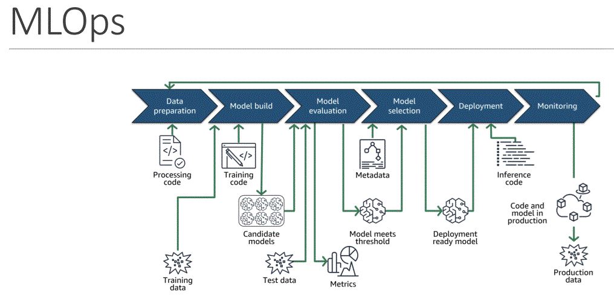


## AWS Security Services <a id="SecurityServices"></a>

- VPC Endpoint powered by AWS PrivateLink – provide private access to AWS Services within VPC
- S3 Gateway Endpoint: access Amazon S3 privately
- Macie – find sensitive data (ex: PII data) in Amazon S3 buckets
- Config – track config changes and compliance against rules
- Inspector – find software vulnerabilities in EC2, ECR Images, and Lambda functions
- CloudTrail – track API calls made by users within account
- Artifact – get access to compliance reports such as PCI, ISO, etc…
- Trusted Advisor – to get insights, Support Plan adapted to your needs
- GuardRails for Bedrock- Restrict specific topics in a GenAI application

Bedrock must access an encrypted S3 bucket:

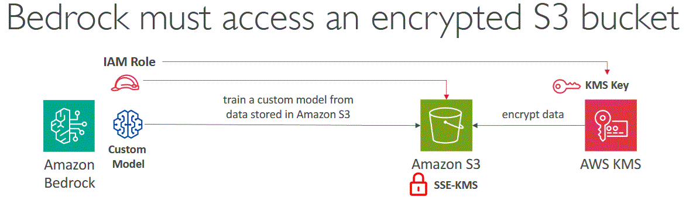

Deploy SageMaker Model in your VPC:

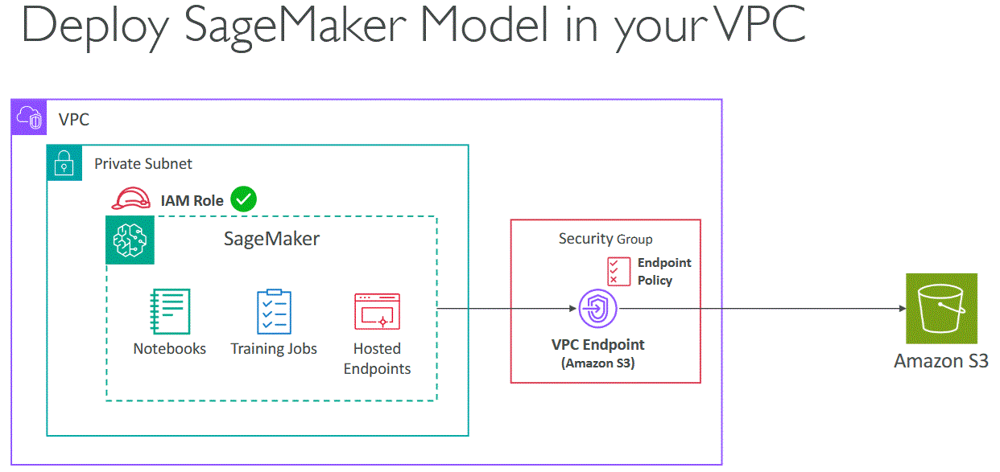

Access Bedrock Model using an App in VPC:

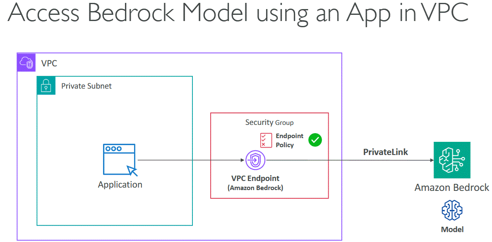

### Security and Privacy for AI Systems <a id="PrivacyAISystems"></a>

7 Layers of security:
- Data Protection
  - Encryption at rest: KMS
  - Encryption in transit: 
    - AWS Certificate Manager (ACM)
    - AWS Private Certificate Authority (Private CA)
    - AWS PrivateLink and Virtual Private Clouds (VPC’s)
- Identity and Access Management
  - Only authorized users / apps / services can access your infrastructure and services: IAM
- Application Protection:
  - Protect against: DoS attacks, Data breaches, Unauthorized access
  - AWS tools: AWS Shield, WAF, Amazon Cognito
- Network and Edge Protection: Protect security of the network infrastructure
  - VPC, WAF
- Infrastructure Protection
  - protection against: Unauthorized access, Data breaches, System failures, Natural disasters: IAM
- Threat Detection and Incident Response:
  - Detection: AWS Security Hub, Amazon GuardDuty
  - Response: Lambda, EventBridge
- Policies, Procedures, and Awareness
  - Implement policy of least privilege
  - Use AWS IAM Access Analyzer to find overly permissive accounts
  - Use short-termed credentials

Security Services relevant to AI:
- SageMaker Role Manager: Build & manage persona-based IAM roles for ML
- Amazon Macie: discovery of sensitive data: Scans S3 for PII 
- Amazon Inspector: Scans AWS workloads for software vulnerabilities

Security in Data Engineering:
- Assess data quality
  - Completeness, accuracy, timeliness, consistency
  - Data validation checks and tests within the pipeline
  - Profiling and monitoring
-Enhance privacy
  - Data masking, obfuscation
  - Encryption, tokenization
- Data integrity
  - Validate schemas, data, referential integrity, business rules
  - Backup & recovery strategy
  - Use transaction management / atomicity to ensure consistency during processing


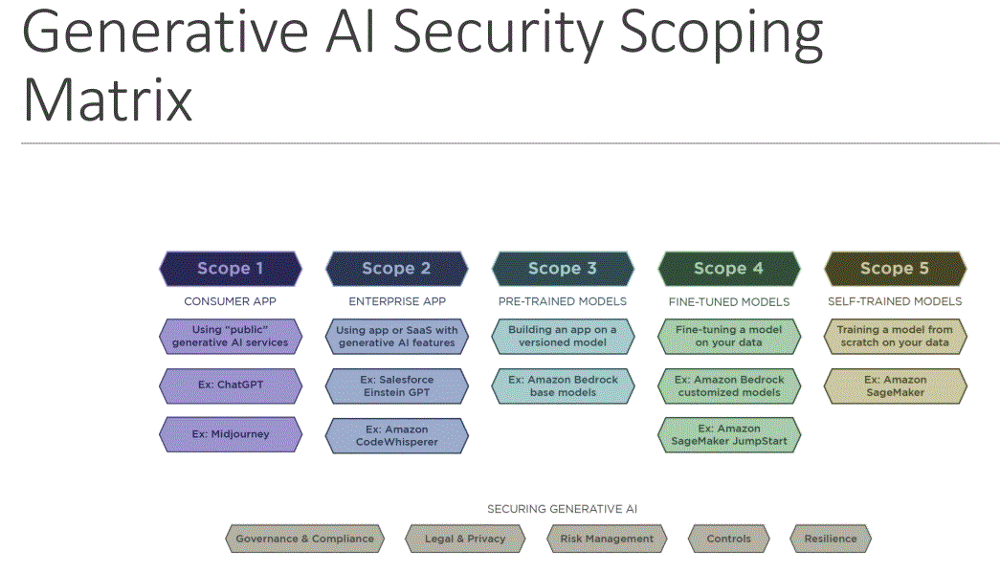

- Threat Detection
  - Example: generating fake content, manipulated data, automated attacks
  - Deploy AI-based threat detection systems
  - Analyze network traffic, user behavior, and other relevant data sources
- Vulnerability Management
  - Identify vulnerabilities in AI systems: software bugs, model weaknesses...
  - Conduct security assessment, penetration testing and code reviews
  - Patch management and update processes
- Infrastructure Protection
  - Secure the cloud computing platform, edge devices, data stores
  - Access control, network segmentation, encryption
  - Ensure you can withstand systems failures
- Prompt Injection
  - Manipulated input prompts to generate malicious or undesirable content
  - Implement guardrails: prompt filtering, sanitization, validation
- Data Encryption
  - Encrypt data at rest and in transit
  - Manage encryption keys properly and make sure they’re protected against unauthorized access Performance Metrics
- Model Accuracy – ratio of positive predictions
  - __Precision__ – ratio of true positive predictions (correct vs. incorrect positive prediction)
  - __Recall__ – ratio of true positive predictions compare to actual positive
  - __F1-score__ – average of precision and recall (good balanced measure)
  - __Latency__ – time taken by the model to make a prediction
- Infrastructure monitoring (catch bottlenecks and failures)
  - Compute resources (CPU and GPU usage)
  - Network performance
  - Storage
  - System Logs
- Bias and Fairness, Compliance and Responsible AI

## Questions

### A data scientist is working on a binary classification problem to predict whether a customer will churn. They want to select the best metric to evaluate their model’s performance, given that the cost of a false negative (predicting a customer will not churn when they will) is much higher than a false positive. Which evaluation metric should the data scientist use to prioritize reducing false negatives?

Recall

Recall, also known as sensitivity, measures the proportion of actual positive cases that were correctly identified by the model. In this case, where false negatives are more costly, recall is crucial as it prioritizes minimizing false negatives, making it the most suitable metric for evaluating the model's performance.

### A pharmaceutical company is using Amazon Bedrock to fine-tune a language model with sensitive clinical trial data stored in Amazon S3. Due to the sensitive nature of the data, the company needs to ensure that all data transfers between Amazon Bedrock and Amazon S3 are secure and do not traverse the public internet. Which TWO actions should the company take to securely connect Amazon Bedrock to Amazon S3 for fine-tuning the model?
 
- Configure Amazon Bedrock to use a Virtual Private Cloud (VPC) to keep data transfers within the AWS network.
- Set up AWS PrivateLink to create a private connection between Amazon Bedrock and Amazon S3.

### A healthcare organization wants to use Amazon Bedrock to create a conversational agent that assists patients by answering questions based on a large set of medical documents stored in a knowledge base. What technique should the organization use to ensure the conversational agent provides accurate and relevant information?

Implement Retrieval-Augmented Generation (RAG) to retrieve relevant documents and provide context to the LLM.
Implementing Retrieval-Augmented Generation (RAG) allows the conversational agent to retrieve relevant documents from the knowledge base and provide context to the Language Model (LLM). This technique ensures that the agent can access and utilize the most relevant information to answer patient questions accurately and effectively.

### Which AWS services/tools can be used to implement Responsible AI practices? (Select two)

SageMaker Model Monitor and SageMaker Clarify

### Which of the following would you identify as correct regarding underfitting and overfitting in machine learning?

Underfit models experience high bias, whereas, overfit models experience high variance
Your model is underfitting the training data when the model performs poorly on the training data. 
This is because the model is unable to capture the relationship between the input examples
Your model is overfitting your training data when you see that the model performs well on the training data but does not perform well on the evaluation data. This is because the model is memorizing the data it has seen and is unable to generalize to unseen examples.
__Underfit models experience high bias — they give inaccurate results for both the training data and test set. On the other hand, overfit models experience high variance - they give accurate results for the training set but not for the test set.__

### How would you differentiate between overfitting and underfitting in the context of machine learning?

Overfitting occurs when a model performs well on the training data but poorly on new, unseen data, while underfitting occurs when a model performs poorly on both the training data and new, unseen data

### Which of the following are correct statements regarding the AWS Global Infrastructure? (Select two)

- Each AWS Region consists of a minimum of three Availability Zones (AZ)
- Each Availability Zone (AZ) consists of one or more discrete data centers

### Identify which of the following accurately applies to Amazon Bedrock and its capabilities? 

- Smaller models are cheaper to use than larger models
- You can use a customized model only in the Provisioned Throughput mode

### Which of the following best describes the Amazon SageMaker Canvas ML tool?

Gives the ability to use machine learning to generate predictions without the need to write any code

### Which of the following techniques is used by Foundation Models to create labels from input data?

Self-supervised learning

### Which of the following summarizes the capabilities of a multimodal model?

A multimodal model can accept a mix of input types such as audio/text and create a mix of output types such as video/image

#### Which of the following explanations BEST describes the differences between Shapley values and Partial Dependence Plots (PDP) in the context of model explainability, and how you might use them for this purpose?

Shapley values provide a local explanation by quantifying the contribution of each feature to the prediction for a specific instance, while PDP provides a global explanation by showing the marginal effect of a feature on the model’s predictions across the dataset. Use Shapley values to explain individual predictions and PDP to understand the model's behavior at a dataset level
Shapley values are a local interpretability method that explains individual predictions by assigning each feature a contribution score based on its marginal effect on the prediction. This method is useful for understanding the impact of each feature on a specific instance's prediction.

Partial Dependence Plots (PDP), on the other hand, provide a global view of the model’s behavior by illustrating how the predicted outcome changes as a single feature is varied across its range, holding all other features constant. PDPs help understand the overall relationship between a feature and the model output across the entire dataset.
Thus, Shapley values are suited for explaining individual decisions, while PDP is used to understand broader trends in model behavior.

### What solution or approach would you recommend for implementing fully managed support for a RAG workflow in Amazon Bedrock?

Knowledge Bases for Amazon Bedrock
With Knowledge Bases for Amazon Bedrock, you can give FMs and agents contextual information from your company’s private data sources for RAG to deliver more relevant, accurate, and customized responses

### Which of the following options would be the most suitable for assessing the performance of the classification model?

Confusion matrix

Confusion matrix is a tool specifically designed to evaluate the performance of classification models by displaying the number of true positives, true negatives, false positives, and false negatives

### the company's data science team is exploring AWS AI services that can perform sentiment analysis on the written customer reviews. Which of the following would you recommend? (Select two)

- Amazon Bedrock:  it can be used to fine-tune pre-trained foundation models for various tasks, including sentiment analysis. With the proper configuration and fine-tuning, Bedrock can analyze text data to determine sentiment
- Amazon Comprehend: uses machine learning to uncover insights and relationships in text. It is specifically designed for tasks such as sentiment analysis, entity recognition, key phrase extraction, and language detection

### Which of the following AWS services powers Amazon Q Developer?

Amazon Bedrock

### The company observes that the predictions are not as accurate as desired, leading to potential financial losses or missed fraud detections. Which approach would you recommend to enhance the accuracy of the company's machine learning models?

The company should increase the number of epochs, which involves training the model for more iterations over the dataset
Increasing the number of epochs allows the model to learn from the training data for a longer period, potentially capturing more complex patterns and relationships, which can improve accuracy.

### Which approach would be the most suitable for enabling ongoing self-improvement of the chatbot based on its conversations with customers?

The company should leverage reinforcement learning (RL), where rewards are generated from positive customer feedback to train the chatbot in optimizing its responses
Positive customer feedback serves as a reward signal that guides the chatbot to improve its responses over time. The chatbot adapts its behavior based on rewards or penalties, refining its conversational skills through continuous feedback loops. 

### This monitoring is crucial for tracking usage, auditing access patterns, and troubleshooting any issues that may arise during model execution. The company is looking for a solution that provides detailed visibility into all model invocations to maintain effective oversight.

The company should enable model invocation logging, which allows for detailed logging of all requests and responses during model invocations in Amazon Bedrock

### They are looking for a tool that provides recommendations and best practices to enhance the overall efficiency and security of their AI systems.

AWS Trusted Advisor

AWS Trusted Advisor is a service that provides guidance to help you provision your resources following AWS best practices. It helps optimize your AWS environment in areas such as cost savings, performance, security, and fault tolerance, making it an essential tool for governance in AI systems.

### Which of these approaches would be the most effective for turning the Foundation Model into a domain-specific expert?

The company should use Domain Adaptation Fine-Tuning, which involves fine-tuning the model on domain-specific data to adapt its knowledge to that particular domain

Domain Adaptation Fine-Tuning is an effective approach because it takes a pre-trained Foundation Model and further adjusts its parameters using domain-specific data. This process helps the model learn the nuances, terminology, and context specific to the domain, enhancing its ability to generate accurate and relevant outputs in that field.

The company should use Continued Pre-Training, which involves further training the model on a large corpus of domain-specific data, enhancing its ability to understand domain-specific terms, jargon, and context

Continued Pre-Training is another appropriate strategy for making a Foundation Model an expert in a specific domain. By pre-training the model on a large dataset specifically from the target domain, the model can learn the distinct characteristics, language patterns, and specialized knowledge relevant to that domain.

### A technology company is utilizing multiple machine learning models across different departments, such as marketing, customer support, and product development, to address various business needs. To enhance overall performance, the company wants these models to learn from each other by sharing the latest data insights and patterns discovered by each model. The goal is to optimize the models' accuracy and efficiency by effectively using the most up-to-date information available from all sources. Given this objective, which approach would be the most suitable for achieving cross-model optimization?

The company should use transfer learning, a method where a model pre-trained on one task is adapted to improve performance on a different but related task by leveraging knowledge from the original task

### Which of the following options best summarizes the differences between model inference and model evaluation in the context of generative AI?

Model evaluation is the process of evaluating and comparing model outputs to determine the model that is best suited for a use case, whereas, model inference is the process of a model generating an output (response) from a given input (prompt)

### Which of the following statements is correct regarding the model customization methods for Amazon Bedrock?

Continued pre-training uses unlabeled data to pre-train a model, whereas, fine-tuning uses labeled data to train a model

- In the continued pre-training process, you provide unlabeled data to pre-train a model by familiarizing it with certain types of inputs. You can provide data from specific topics to expose a model to those areas. The Continued Pre-training process will tweak the model parameters to accommodate the input data and improve its domain knowledge.
- While fine-tuning a model, you provide labeled data to train a model to improve performance on specific tasks. By providing a training dataset of labeled examples, the model learns to associate what types of outputs should be generated for certain types of inputs. The model parameters are adjusted in the process and the model's performance is improved for the tasks represented by the training dataset.

### The company needs a model that not only accurately classifies the movies but also provides clear insights into how the classification decisions are made. This transparency will help the team understand which features most influence the categorization, ensuring that the model's decision-making process is fully documented and interpretable. Which of the following machine learning algorithms would be the most suitable for achieving this goal?

Decision Trees

### Which of the following best summarizes the way Transformer models work?

Transformer models use a self-attention mechanism and implement contextual embeddings
Transformer models are a type of neural network architecture designed to handle sequential data, such as language, in an efficient and scalable way. They rely on a mechanism called self-attention to process input data, allowing them to understand and generate language effectively. Self-attention allows the model to weigh the importance of different words in a sentence when encoding a particular word. This helps the model capture relationships and dependencies between words, regardless of their position in the sequence.

### Which of the following generative AI techniques are used in the Amazon Q Business web application workflow?

- Retrieval-Augmented Generation (RAG)
- Large Language Model (LLM)

### To improve the chatbot's performance, the company wants the model to correctly identify the intent behind various user interactions, such as whether a user is asking for a refund, seeking product information, or needing technical support. To achieve this, the company decides to use few-shots prompting to train the model effectively. Given this goal, what type of data should be included in the few-shots examples to help the model accurately recognize and distinguish the correct user intent?

- The data should include user-input along with the correct user intent, providing examples of user queries and the corresponding intent
This is the correct answer because few-shots prompting involves providing the model with examples that include both the user-input and the correct user intent. These examples help the model understand and learn how to map various user queries to their appropriate intents. By repeatedly seeing this pairing, the model can generalize from these examples and improve its ability to recognize user intent in new, unseen queries.
- Prompt structure for few-shot learning:
- Section A: Contect: overall prompt instructions
  - Example: You are the CEO a Company preparing to present the quarterly earnings report to investors. Draft a comprehensive earnings call script that covers the key financial metrics, business highlights.....
- Section B: Style, tone, narrative: specific guideance
  - Example: The earnings script should be written in a formal, investor-friendly tone suitable for a public earnings call.
- Section C: Examples
  - Example: Amazon Earnings call transcript for Q1 2021....
- Example:
  Tell me the sentiment of the following headline and categorize it as positive or negative: Here are some examples:
  ex1: research firm dends off allrgations of improprietayto over new technology.
  answer: Negative
  ex2: Offshort windfarm contibnue to thrive
  answer: Positive

### Which of the following embedding models would be most suitable for differentiating the contextual meanings of words when applied to different phrases?

Bidirectional Encoder Representations from Transformers (BERT)

### What is a key difference between Foundation Models (FMs) and Large Language Models (LLMs) in the context of generative AI?

Foundation Models serve as a broad base for various AI applications by providing generalized capabilities, whereas Large Language Models are specialized for understanding and generating human language


## References <a id="References"></a>

Certification page: https://aws.amazon.com/certification/certified-ai-practitioner/

Guide: https://d1.awsstatic.com/training-and-certification/docs-ai-practitioner/AWS-Certified-AI-Practitioner_Exam-Guide.pdf?p=cert&c=ai&z=3


