# AWS Architect exam

- [IAM](#IAM)
- [EC2](#EC2)
  - [AMI](#AMI)
  - [Instance Types](#InstanceTypes)
  - [IP](#IP)
  - [Log-in to Private instance](#LoginToEC2)
  - [Block Storage](#BlockStorage)
  - [Placement Groups](#PlacementGroups)
  - [NAT](#NAT)
  - [EC2 lifecycle](#Ec2_lifecycle)
  - [Nitro](#Nitro)
  - [EC2 pricing](#Ec2_pricing)
- [Auto Scaling](#AutoScaling)
  - [AutoScaling Group](#AutoScalingGroup)
  - [Health Checks](#HealthChecks)
  - [Load Balancing](#LoadBalancing)
    - [Load Balancing Security](#LoadBalancingSecurity)
    - [ALB](#ALB)
    - [NLB](#NLB)
    - [GLB](#GLB)
    - [Cross-zone load balancing](#Cross-zone)
    - [Global Accelerator](#GlobalAccelerator)
- [Organizations](#Organizations)
- [VPC](#VPC)
  - [Security Groups](#SecurityGroups)
  - [Connecting To VPC](#ConnectingToVPC)
- [S3](#S3)
- [DNS](#DNS)
  - [Route53](#Route53)
  - [CloudFront](#CloudFront)
- [Block and File Storage](#Block_File_Storage)
  - [EBS](#EBS)
  - [File Share](#FileShare)
- [Containers](#Containers)
  - [ECS](#ECS)
  - [EKS](#EKS)
- [Serverless](#Serverless)
  - [Lambda](#Lambda)
  - [API Gateway](#APIGateway)
  - [Fargate](#Fargate)
- [Database](#Database)
  - [RDS](#RDS)
    - [Aurora](#Aurora)
  - [ElastiCache](#ElastiCache)
  - [DynamoDB](#DynamoDB)
  - [Redshift](#Redshift)
- [Analytics](#Analytics)
  - [EMR](#EMR)
  - [Kinesis](#Kinesis)
    - [Kinesis Data Streams](#KinesisDataStreams)
    - [Kinesis Firehose](#KinesisFirehose)
    - [Kinesis Data Analytics](#KinesisDataAnalytics)
  - [Athena](#Athena)
  - [Glue](#Glue)
- [Messaging](#Messaging)
  - [SQS](#SQS)
  - [SNS](#SNS)
  - [Step Functions](#StepFunctions)
  - [Event Bridge](#EventBridge)
- [Deployment](#Deployment)
- [Observability](#Observability)
  - [CloudWatch](#CloudWatch)
  - [CloudWatch Alarms](#CloudWatchAlarms)
  - [CloudWatchLogs](#CloudWatchLogs)
  - [CloudTrail](#CloudTrail)
  - [CloudWatch Events](#CloudWatchEvents)
- [Security](#Security)
  - [AD](#AD)
  - [Identity Providers](#IdentityProviders)
  - [KMS](#KMS)
  - [HSM](#HSM)
  - [Certificate Manager](#CertificateManager)
  - [WAF](#WAF)
  - [Shield](#Shield)
  - [Cognitio](#Cognitio)
- [Migration](#Migration)
  - [SMS](#SMS)
  - [DMS](#DMS)
  - [DataSync](#DataSync)
  - [Snowball](#Snowball)
  - [Data Transfer](#DataTransfer)

## IAM <a id="IAM"></a>

IAM is used to securely control individual and group access to AWS resources.

It makes it easy to provide multiple users with access to AWS resources.

And with IAM, you can manage:
- users,
- goups,
- access policies,
- roles
- user credentials
- User password policies
- enable multifactor authentication
- generate API keys for programmatic access to IAM.

By default, all __new users are created with no access to any services__. 
They can only log into AWS, but they can't actually do anything.

Permissions must then be explicitly granted to allow a user to access an AWS service.

IAM users are the individuals who've been granted access to an AWS account.

__IAM is a universal or global service__, so it doesn't apply to specific regions.

__IAM is eventually consistent__.

Authentication methods:
- __console passwords__ for logging into the management console,
- __access keys__ for programmatic access,
- __server certificates__, which can be used for some services as well.

Server certificates and certificate-based authentication:
- provides an authentication experience where you __authenticate once__ and then can access aws resources without re-entering your credentials
- CBA requires a private certificate authority (CA) to create private certificates to identify users.
- Short-lived certificates are used with CBA to reduce the potential impact of a compromised credential.

IAM users:
- IAM user is an entity that represent a person or a service.
- By default, they cannot access anything in the account.
- The root user credentials are the email address used to create the account, and there's a password associated with that account.
- The __root account has full administrative permissions and they cannot be restricted__.
- IAM users can be created to represent applications, and those are known then as __service accounts__.
- You can have up to 5,000 users per AWS account.

IAM groups:
- IAM groups are __collections of users__ and have policies attached to them.
- A group's not an identity in itself, so it can't be identified as a principal in a policy.
- use groups to assign permissions to users.
- Always follow the principal of least privilege when assigning permissions.
- You __can't nest groups__
- __Groups cannot be specified in the policy document__. Only users and roles

IAM Roles:
- Roles are created and then __assumed by trusted entities__.
- They are a __way of delegating permissions to resources for users and services__.
- __Users and services can assume a role to obtain temporary security credentials. And those are issued by the Security Token Service, the STS service__.

IAM Policies:
- Policies are documents that define the permissions and they can be applied to users, groups, and roles
- Policy documents are written in JSON and include key value pairs that consist of an attribute and a value.
- __All permissions are implicitly denied by default__.
- The most restrictive policy is applied if there's multiple policies with conflicting statements.

Types of IAM policy:
- __identity-based policies__ which you can attach to users, groups, or roles.
- __resource-based policies__. They get attached to resources like S3 buckets, and you can define permissions for principals accessing the resources using a resource policy.
- __permissions boundaries__. These set the maximum permissions that an identity-based policy can grant to an IAM entity.
- __organizations service__ control policies. These specify the maximum permissions for an organization or an OU.
- __session policies__ that are used with Assume Role API actions.

IAM best practices:
- __lock__ away your account __root user__ access keys,
- create individual users,
- use __groups__ to assign __permissions to users__,
- grant __least privilege__,
- get started using permissions with AWS managed policies,
- Use customer managed policies instead of inline policies.
- Use __access levels to review__ IAM permissions always bearing in mind that least privilege,
- Configure a strong password policy for your users.
- Enable multi-factor authentication.
- Use roles for applications that run on EC2 instances,
- use __roles__ to __delegate permissions__.
- Do not share access keys. Always keep them to yourself and use them only for your accounts.
- __rotate all credentials__ regularly.
- remove any unnecessary credentials.
- use policy conditions for extra security when you're writing your IAM policies.
- monitor activity in your account to see what's actually happening.

Set a custom password policy on your AWS account to specify complexity requirements and mandatory rotation periods for your IAM users' passwords

The IAM password policy does not apply to the AWS account root user password or IAM user access keys

You must configure permissions to allow an IAM entity (user or role) to view or edit their account password policy:
- iam:GetAccountPasswordPolicy
- iam:DeleteAccountPasswordPolicy
- iam:UpdateAccountPasswordPolicy

Example: Read-Only Access to All S3 Buckets
```
{
  "Version": "2012-10-17",
  "Statement": [
    {
      "Effect": "Allow",
      "Action": [
        "s3:GetObject",
        "s3:ListBucket"
      ],
      "Resource": [
        "arn:aws:s3:::*",
        "arn:aws:s3:::*/*"
      ]
    }
  ]
}

```

Type of Identities:

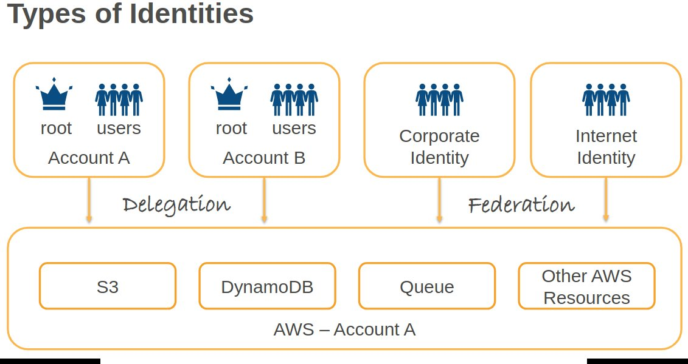

Corporate Identity Federation:
- SAML 2.0 (Security Assertion Mark Up Language) to exchange identity and security information between identity provider and application
- AWS IAM Federation – enables users sign-in to their AWS account with existing corporate credentials
- Non-SAML options – AWS Directory Service for Microsoft Active Directory
- AWS Organizations – Use AWS Single Sign On (SSO) to scale to multiple AWS Accounts (centrally manage access)

Cognito Identity Federation:
- Users can sign-in to mobile and web apps using social identity providers like Facebook, google, amazon
- Support for corporate identity federation using SAML 2.0
- Open Standards Support - Oauth 2.0, SAML 2.0, OpenID Connect
- Map users to roles and limit access to resources

Example of Principal:

| Principal             | Example
|-----------------------|----------------------------------------------------
| AWS account, root user| "Principal”:{"AWS":"arn:aws:iam::123456789012:root"}
|                       | "Principal”:{"AWS":"123456789012"}
| IAM Users             | "Principal":{"AWS":”arn:aws:iam::123456789012:user/alice"}
| IAM Roles             | "Principal":{"AWS":"arn:aws:iam::123456789012:role/cross-acct"}
| AWS Services          | "Principal":{"Service":"elasticmapreduce.amazonaws.com"}
| Anonymous users       | "Principal": “*”
| Federated Users       | "Principal":{"Federated":"www.amazon.com"}
| Assumed-role sessions | Use the role session name to uniquely identify a session
|                       | when the same role is assumed by different principals or for different reasons
|                       | "Principal":{"AWS":"arn:aws:sts::123456789012:assumed-role/role-name/role-session-name"}

Role Based Access Control (RBAC):
- Traditional authorization model used in IAM is called role-based access control. This is based on a person's job-role. [in AWS context, role refers to IAM-role]
- In RBAC model, you implement different policies for different job functions.
- As best policy, you grant the minimum permissions necessary for the job function. this is known as "granting least privilege".
- The disadvantage of RBAC model is that when employees add new resources, you must update policies to allow access to those resources.

Attribute Based Access Control (ABAC):
- ABAC is an authorization strategy that defines permissions based on attributes (also known as Tags)
- Tags can be attached to IAM Principals (users or roles) and to AWS resources
- With ABAC, policies can be designed to allow operations when the principal's tag matches the resource tag.
- ABAC is useful in environments that are growing rapidly and helps with situations where policy management becomes cumbersome
- With ABAC, permissions scale - it is no longer necessary for administrator to update existing policies.
- ABAC requires fewer policies

### Architecture Patterns

#### select group of users only should be allowed to change their IAM password

Create a group for the users and apply a permissions policy that grants the iam:changePassword API permission.

#### an Amazon EC2 instance must be delegated with permissions to an Amazon DynamoDB table.

Create a role, assign a permissions policy to the role that grants access to the DynamoDB database service.

#### A company has created their first AWS account. They need to assign permissions to users based on job function.

Use the AWS managed policies. And those can be aligned with specific common job functions.

#### A solutions architect needs to restrict access to an AWS service based on the source IP address of the requester.

You can create an IAM permissions policy and use the condition element to control access based on source IP address.

#### A developer needs to make programmatic API calls from the AWS CLI.

In this case, you can instruct the developer to create a set of access keys and use those for any programmatic access.

#### A group of users require full access to all Amazon EC2 API actions.

Create a permissions policy that uses a wildcard for the action element relating to EC2. And that would look like the (ec2:*) action.

#### You would like to revoke programmatic access for an IAM user. What steps do you need to take?

Remove access key credentials

#### You would like to version control your policy changes in IAM so that you have ability to rollback changes. What features can you use to automatically track versions?

Managed Policies are automatically version controlled and maintain previous five versions

#### Can an IAM user belong to more than one IAM Group?

Yes

#### A startup has multiple AWS accounts. Employees play different job-roles and require appropriate access in each account. For example, they have limited privileges in the production account, whereas, in the development account, they have a wide range of privileges. What can be done to streamline access to accounts?

The best option is to use AWS organizations to consolidate all accounts under a master account. 
You can enable single sign-on to manage cross-account access. 
IAM role is the second-best option; however, you need to configure and manage roles manually.


## Amazon Elastic Compute Cloud (EC2) <a id="EC2"></a>

__AWS Region__ (36) consists of 2 or more availability zones.

__Availability zone__ = one or more discrete data centers with redundant power, networking, and connectivity in an AWS Region, physically separated by a meaningful distance, 

__Local Zone__ (30+) = data center outside of a region. Its purpose is to run full applicatins closer to users. Supports: EC2, EDB, ECS, EKS, RDS etc.

__Wavelength__: mobile only apps accessing vis 5G

__AWS Outpost__: aws hardware installed on private cound that can be managed via aws console

__Edge location__ (400+) = used primarily by Amazon CloudFront but also by AWS Global Accelerator, AWS Shield, and Route 53
- AWS has hundreds of edge locations around the world
- A smaller data center that caches data closer to users, used mainly for content delivery and DNS resolution
- used specifically to deliver content and services with low latency to end users.
- CDN = CloudFront = content from server hosted in internet service provider

__Regional Edge Cache__ = cache content from Origin so Edge location can get it faster


With EC2, you launch virtual server instances on the AWS cloud.

Each virtual server is known as an instance.

With EC2, you get full control at the operating system layer.

Key pairs are then used to securely connect to EC2 instances.

The storage is either Amazon EBS, which is persistent storage, or Instance Store, which is non-persistent storage.

__Instance metadata__ is the data about your instance that you can use to configure or manage the running instance. Instance metadata is available at this URL: http://169.254.169.254/latest/meta-data

Example Instance metadata response:
```
curl http://169.254.169.254/latest/meta-data

ami-id
ami-launch-index
ami-manifest-path
instance-id
instance-type
local-ipv4
mac
network/
placement/
profile/
public-ipv4
public-hostname
security-groups

curl http://169.254.169.254/latest/meta-data/instance-id

i-0abcd1234efgh5678

```

__User data__ is data that gets supplied in the form of a script and that runs at system startup. Instance user data is available at this URL: http://169.254.169.254/latest/user-data

Example User data response:
```
curl http://169.254.169.254/latest/user-data

#!/bin/bash
yum update -y
yum install -y httpd
service httpd start
chkconfig httpd on
```

Benefits of Amazon EC2 include:
- __elastic computing__. You can easily launch hundreds to thousands of EC2 instances within minutes.
- You get __complete control__ with full root and administrative access.
- __Flexible__: a choice of instance types, operating system, software packages, the type of storage you're adding, and so on and so forth.
- __Reliable__: EC2 offers very high levels of availability. And instances can be rapidly commissioned and replace where needed.
- __Secure__ It's fully integrated with Amazon VPC and the security features of AWS.
- __Inexpensive__, so it can be very low cost and you only pay for what you use.

Steps to login to your ec2:
- Prerequisites:
  - Key pair (.pem file): You must have the private key (.pem) file that corresponds to the key pair specified when launching the EC2 instance.
  - Security group: Ensure the EC2 instance's security group allows inbound SSH traffic (port 22).
  - Public IP or Elastic IP: Your EC2 instance must have a public IP or Elastic IP if you're connecting from outside AWS.
- Copy the Public IPv4 address from ec2 console
- ssh -i /path/to/your-key.pem ec2-user@<Public-IP-or-DNS>

The default SSH username depends on the OS of the base AMI:
| AMI OS       | Default Username
|--------------|------
| Amazon Linux | ec2-user
| Ubuntu       | ubuntu
| RHEL         | ec2-user or root
| CentOS       | centos
| Debian       | admin or debian
| SUSE         | ec2-user

__Storage__:
- Block
  - Instance Storage: __directly connected storage__ attached to physical host
    - some EC2 types do not support any instance storage (t2micro) or Windows does not support it.
    - price included
  - EBS: __external physical storage__, must be in the same AZ
- File
  - EFS (Unix)
  - FSx (Windows)
- Object (S3)

__EC2 instance endpoint__
- network endpoint that allows communication with an EC2 instance
  - public: This is the instance’s public IP address, which can be used to communicate with the instance over the internet.
  - private: allows communication between EC2 instances within the same VPC or across VPCs using VPC peering
- uses aws username and password
- easy to connect from aws console

### AMI <a id="AMI"></a>

An Amazon Machine Image provides the __information required to launch an instance__.

If you create custom AMI then to use it and create new EC2 from it, you need to change the administrator password. Else you will not be able to login to this new EC2.


AMI includes:
- a __template__ for the root volume of the instance,
- __launch permissions__
- a __block device mapping__, which specifies which volume is to attach to the instance.

__AMIs are regional__, so you can only launch an AMI from the region in which it is created.

You can __copy AMIs to other regions__ using the console command line or the API.

AMIs categories:
- community AMIs,
- marketplace AMIs,
- your AMIs, the ones you create yourself.

Steps to create a custom aws AMI:
- Launch an EC2 instance using an existing Amazon-provided AMI
- Install and configure the software, updates, and system settings you want to include in your custom AMI.
- Stop Services (Optional, for consistency): To ensure the disk is in a consistent state, you can stop critical services or the instance itself, though AWS handles this well with modern AMIs.
- Create Image
```
aws ec2 create-image \
    --instance-id i-1234567890abcdef0 \
    --name "MyCustomAMI" \
    --description "AMI with custom software" \
    --no-reboot
```

### Instance types <a id="InstanceTypes"></a>
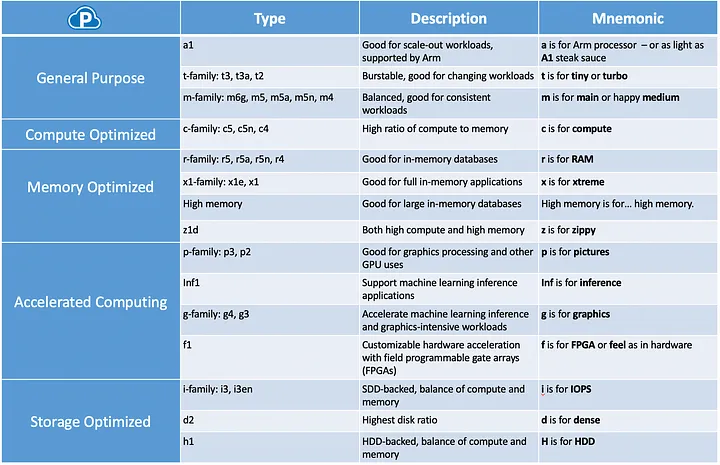

Burstable T-type instances:
- Low to Moderate CPU utilization with occasional increase
- Burstable Instance - CPU
  - Baseline CPU Performance [5-40%]
  - Instance earns a CPU Credit when usage is less than baseline
  - Performance can burst up to 100% using CPU credits
  - CPU is throttled to baseline performance
- Unlimited Mode [Burstable Instance]
  - no need to worry about throttling
  - Pay for excess capacity consumed

I n s t a n c e _t y p e. g e n e r a t i o n.s i z e

c 5 . 2 x l a r g e = Compute Optimized, 5th generation, 2xlarge (8 vCPUs, 16 GB Memory

Resize instances:
- same type
- .small -> .2xlarge
- Stop-Change-Start
- Check compatibility [OS, Storage, etc.]

Process:
- Map app to instance family
- Pick an appropriate size [small, large, 2xlarge and so forth]
- Run performance tests to right-size


### IP addresses <a id="IP"></a>

public IP address:
- lost when you stop your instance
- used in public subnets
- no charge
- associated with private IP of the instance
- cannot be moved between instances

private IP address:
- retained when the instance is stopped
- Used in public and private subnets

elastic IP address:
- static public IP address,
- charged if not used
- associated with private IP address on the instance
- can move around between instances

### How to Log in to Private instance <a id="LoginToEC2"></a>

1. __Bastion Host__:
- For HA, reassign Elastic IP to new Bastion Host instance
- Client can use existing Elastic IP to connect to new instance
- Issues: extra servers to manage

2. __Systems Manager__:
- Automated patching of servers and Automation of routine administrative tasks
- interactive remote shell for Linux and Windows, macOS
- Agent required: AWS preinstalls in many instances
- Simpler and Safer when compared to Bastion Host
- Close SSH and RDP ports in Security Group

3. __VPN or Direct Connect__
- Set Up a VPN Connection: Establish a VPN connection between your on-premises network and your AWS VPC
- Connect to the VPC: your local network will be able to reach the private IP of the EC2 instance within the VPC
- SSH or RDP: From your local machine (now part of the VPN), you can SSH into your EC2 instance

4. __VPC Peering__
- Set up VPC Peering between two VPCs.
- Update route tables in both VPCs to allow routing between them.
- Update Security Groups to allow access to EC2 instances across VPCs.
- SSH to EC2 Instance using its private IP from another EC2 instance in the peered VPC.

### Block Storage for EC2 <a id="BlockStorage"></a>

#### Instance Store

- Highest Performance
- IOPS depends on the instance type and the type:
  - i3.large: 70,000 IOPS
  - i3.16xlarge: 1,000,000 IOPS
  - d2, h1: 3,000 IOPS
- Data persists only for the lifetime of the instance
- Reboot – Data Persists
- Data is lost – when underlying hardware fails, instance stops, or instance terminates
- __Random I/O Workload__ – SSD Preferred. Performance Measured in __IOPS__
- __Sequential I/O Workload__ – Magnetic/HDD Preferred. Performance Measured in __Throughput (MiB/s)__

#### EBS - see 'File Share' section


### Placement groups <a id="PlacementGroups"></a>

- __Cluster placement group__ is designed to keep instances very close for low latency. Think about high performance computing, tightly coupled applications where you've got node to node communication
- __Partition__ will spread your instances across logical partitions so that the groups in one partition don't share the same underlying hardware with other groups of instances. So you can use this for high availability. It's usually used with distributed and replicated workloads. For example, Hadoop, Cassandra and Kafka.
- __Spread placement group__: This will place a small group of instances across distinct underlying hardware to reduce any kind of correlated failures.

### NAT <a id="NAT"></a>

NAT Gateway = special agent with publicIP that connects to InternetGateway
- create NAT gateway in public subnet
- define public IP
- add entry to main route table to NAT Gateway

NAT instances versus NAT gateways:
- The __NAT instance__ is fully managed by you. It's really the old way of doing things.
- __NAT gateway__ is likely to be the best solution in most use cases.    
  - It's fully managed by AWS.
  - You get more scalability over NAT gateway.
  - The only real limitations of the NAT gateway are things like you can't use it as a bastion host, but you should probably separate that into a different instance anyway.
  - There are also __no security groups with a NAT gateway__, whereas there are with a NAT instance.
  - __NAT gateway is deployed inside a subnet and it can scale only inside that subnet in specific AZ__. 
  - For fault tolerance, __it is recommended that you deploy one NAT gateway per availability zone__

### EC2 instance lifecycle <a id="Ec2_lifecycle"></a>

- __Stopping__:
  - Stopping instances works only for EBS-backed instances,
  - no charge for a stopped instance.
  - There is a charge for any EBS volumes in terms of the amount of data that's stored.
  - Data in RAM is lost
  - the instance is migrated to a different host when you start it again.
  - Private IPv4 and IPv6 addresses are retained, public addresses are lost.
  - Any associated elastic IP will, of course, be retained.
- __Hibernation__ applies to on-demand or reserved Linux instances.
  - The contents of RAM get saved to an EBS volume, has to be enabled for hibernation when launched, and specific prerequisites do apply.
  - When you start an instance after hibernation, the root volume is restored to its previous state.
  - The RAM contents are then reloaded and the processes that were previously running on the instance get resumed.
  - Any previously attached volumes are re-attached and the instance retains its instance ID.
- __Rebooting__
  - instances, this is the equivalent to an operating system reboot.
  - The DNS name and IP address gets retained.
  - It doesn't affect billing at all because the instance is still running and it hasn't stopped and started, so it's not a new billing lifecycle.
- AWS may sometimes __retire__ instances:
  - if there's some irreparable failure of the underlying hardware,
  - when an instance reaches its scheduled retirement date
  - it might be stopped or terminated by AWS. Of course, they'll notify you if that happens.
- __Terminating__ EC2 instances:
  - means deleting the instance.
  - And you can't recover a terminated instance.
  - By default, the root EBS volumes are deleted,
- __Recovering__ instances:
  - this is where CloudWatch is monitoring the system status and you can recover the instance if required.
  - It applies if the instance becomes impaired due to underlying hardware or platform issues.
  - A recovered instance is identical to the original instance.

You can modify the following attributes of an instance only when it is stopped:
- Instance type.
- User data.
- Kernel.
- RAM disk

### Nitro <a id="Nitro"></a>

The __Nitro__ system:
- is the underlying platform for the __newer generation EC2 instances__.
- __Breaks logical functions into specialized hardware__ with a hypervisor.
- The hardware includes the Nitro cards for VPC, EBS, Instance Storage, a card controller, a security chip, and the hypervisor itself.
- Nitro aims to improve performance, security, and innovation.
- The __performance is close to bare metal__, even for virtualized instances.
- It gives you the ENA and the EFA.
  - ENA (Elastic Network Adapter) allows: 200 Gbps / network card etc.
    - To enable EFA: In the Network Interface section of the EC2 launch wizard, you will see an option to enable Elastic Fabric Adapter under the Elastic Network Adapter (ENA) options.
  - EFA (Elastic Fabric Adapter): lower and more consistent latency and higher throughput than the TCP transport traditionally used in cloud-based HPC systems
- You have more available bare metal instance types you can use, and it gives you higher network performance.
- It's also good for HPC because there's more optimizations for high performance computing.
- It can also have dense storage instances as well.
- To create a Nitro-based EC2 instance, you need to use an instance type that is powered by the AWS Nitro System:  It is used by modern EC2 instances such as M5, M5a, C5, C5a, R5, R5a, and others.
- When creating EC2 choose an Instance type that is Nitro-based. For example: M5 (General Purpose), C5 (Compute Optimized), R5 (Memory Optimized)

__Nitro enclaves__:
- are __isolated compute environments__ that run on hardened virtual machines.
- __no persistent storage, interactive access, or external networking__,
- uses cryptographic attestation to ensure only the authorized code is running
- integrates with KMS.
- __good for securing and protecting highly sensitive data like PII__, health care data, financial data, or intellectual property data.

### EC2 pricing <a id="Ec2_pricing"></a>

EC2 pricing options:
- __on-demand__, which is the standard rate, there's no discount, there's no commitment. It's very good for any kind of short-term requirements or unpredictable workloads.
- __reserved__ one or three year commitment, but you get a good discount.
  - Provides a capacity reservation when used in a __specific AZ__,
  - __Can switch AZ within the same region__
  - Can change the instance size within the __same instance type__
- __spot__ instances, you get a very low price because you're essentially using unused capacity. So you can get a large discount, but you can also be terminated at any time.
- __Dedicated instances__ offer physical isolation at the host hardware level from instances belonging to other customers. And you pay per instance. __Hardware dedicated to you__ (account), but you don’t control the physical server.
- __Dedicated host__ is physical servers dedicated for your use, so you get the actual hardware dedicated for you. There's no sharing going on there. You control what EC2 instances run on it
  - visibility into and control over the host (e.g. __sockets, cores__, instance distribution).
  - required for bring-your-own-license (__BYOL__) scenarios
  - You __pay per host__, not per instance.
- __savings plans__ where you can commit to a certain amount of usage for various compute services. You have a one or three-year commitment.
  - With Compute Savings Plan, you can get a __significant discount (up to 66%)__ on any compute services such as __EC2, Lambda, and Fargate__ Containers.
  - So, the compute savings plan applies to both __server-based and serverless computing__. 
  - __Reservation applies only to EC2 instances and does not cover serverless usage.__


### Architecture Patterns

#### A company needs to run a short batch script to configure Amazon EC2 Linux instances after they are launched.

Add the bash script to the user data of the EC2 instances, and then it will run as they boot up, as they launch for the first time.

#### A tightly coupled HPC workload, high performance computing requires low latency between nodes and optimum network performance.

Launch the EC2 instances in a single AZ in a cluster placement group and use an Elastic Fabric Adapter.
And that's a standard pattern for this type of workload that needs very low latency communications between nodes.

#### A line of business application receives weekly bursts of traffic and must scale for short periods, and you need the most cost-effective solution.

Use reserved instances for the minimum required workloads, so that's going to give you a big discount from the standard rates.
And then you can use spot instances for the occasional bursts in traffic because you know those are short-lived. And that means that you can get some cost savings there as well.

#### A single instance application uses a static public IP address. In the event of failure, the address must be remapped to a fail over instance.

Attach an elastic IP address to the instance, and you can remap the IP address in the event of a failure.
And that can be done programmatically, so you might have some kind of automated way of deploying that.

#### A fleet of Amazon EC2 instances run in private subnets across multiple AZs. A company needs a redundant path to the internet.

Use NAT gateways so that your instances in the private subnets have internet access. And you can put them into multiple AZs so you've got that high availability because it does ask for redundancy here. And then you need to update the route tables to point them to the NAT gateway.

#### A team of engineers must administer EC2 instances in private subnets from remote locations using SSH,

Deploy a bastion host to jump to the instances in private subnets.

#### You need to allow remote SSH login to the private EC2 instances from the on-premises network. All requests are sent over the internet

Using the Session Manager (part of the system manager service), authorized employees can log in to their EC2 instances using IAM credentials.
Session Manager does not use SSH or RDP ports

#### An application uses several EC2 instances, the architect must eliminate the risk of correlated hardware failures.

Launch the instances in a spread placement group across distinct underlying hardware.
This means that each of the instances in the application is essentially in a separate rack of servers in the AWS data center with separate power supplies and so on.

#### An application requires enhanced networking capabilities.

Choose an instance type that supports enhanced networking. And you need to ensure that the ENA module is installed and ENA support is enabled.

#### An instance needs close to bare metal performance, EFA, the Elastic Fabric Adapter, and high performance networking

Use an AWS Nitro instance type

#### You are using T2 burstable EC2 instances. You are seeing a sustained load on your application running on these instances. What would be the behavior you would observe?

Burstable instances continuously accumulate CPU credits if usage is below baseline performance.

When there is increased load, it can use the available CPU credits to temporarily boost the performance to fully utilize available CPU capacity.

However, when instances are out of CPU credits, it will fall back to baseline performance and applications may get throttled.

To prevent this situation, you can enable the new “unlimited” mode in burstable types and you will simply be billed an additional hourly charge based on extra CPU capacity consumed

####  You have a fleet of hundreds of EC2 instances. If there are problems with AWS managed items like Physical host, network connectivity to host, and system power, how would you be able to track it?   

System status check would identify AWS infrastructure related issues. Instance status check would also fail if a system status check fails. So, either one can be used

#### You need to allow remote SSH login to the private EC2 instances from the on-premises network.

Using the Session Manager (part of the system manager service), authorized employees can log in to their EC2 instances using IAM credentials. 
Session Manager does not use SSH or RDP ports. 
Bastion Host is another option – however, this requires additional servers, and you need to keep the SSH port open
- Configure a bastion host within your VPC that can be accessed from your on-premises network, then use that bastion host to connect to the private EC2 instances via SSH
- AWS Session Manager allows remote SSH login to private EC2 instances from an on-premises network, as it establishes a secure tunnel through the AWS infrastructure without requiring any open inbound ports on the EC2 instance or a public IP address, making it ideal for accessing private instances within a VPC; you only need the SSM Agent installed on the EC2 instance and appropriate IAM permissions to connect

#### When you recover an EC2 instance using CloudWatch Alarm, what happens to the instance?

When an instance is recovered using CloudWatch Alarm Action, a recovered instance is identical to the original instance, including its: Instance ID Public, private, and Elastic IP addresses Instance metadata Placement group Attached EBS volumes Availability Zone

#### Your requirement specifies a single volume with 50 TiB of storage. Which of the following options fulfills this requirement?

Io2 Block Express is the next generation storage solution, delivering unparalleled block storage performance and supporting storage capacities of up to 64 TiB. 
In contrast, all other EBS volume choices are limited to a maximum storage capacity of 16 TiB. 
Historically, when extra storage was required, organizations often relied on attaching multiple EBS volumes to their EC2 instances. Alternatively, configurations like RAID 0 could be employed to combine multiple EBS volumes into a cohesive logical volume.

#### Your security team follows the principle of immutable instances. With this approach, the servers are never patched; instead, the existing servers are replaced with new servers with correct software patches. To speed up the deployment, the security team periodically releases new AMI with all the security patches for known vulnerabilities. The infrastructure is managed using Auto Scaling. How would you replace existing vulnerable instances?

Create a new version of the launch template to use the new AMI, update Auto Scaling Group to use this new version of the template, and then refresh instances

The launch template is immutable, and you need to create a new version with the correct AMI and then configure Auto Scaling Group to use this new version of the launch template. With instance refresh, you can perform a rolling replacement of instances.

#### How does Auto scaling handle spot interruptions?

Auto Scaling automatically handles spot interruptions, deregisters the instance from the load balancer, and initiates steps to launch a replacement instance

In addition, EC2 service publishes a capacity-rebalance early warning event when a spot pool is likely to get interrupted. In this case, Auto Scaling can take proactive action to launch a new replacement instance from another spot pool with less likelihood of interruption

#### As part of application configuration step in an EC2 instance, the configuration script needs user data specified when launching the EC2 instance.  What mechanism can the script use to get this data?

Use Metadata query service http://169.254.169.254/latest/user-data

#### An application requires 100 GB of persistent volume storage. The application is expected to perform 600 IOPS. Which of these options meet the requirements cost-effectively?

General Purpose Volume with 200 GB of storage

General purpose volume offers a baseline performance of 3 IOPS per GB. With 200 GB of storage, the baseline performance is 600 IOPS,

Instance store SSD is not the right choice as the question asks for a persistent storage

#### Can I use default password to login to EC2 created from custom AWS AMI ubuntu?

No: you cannot use a default password to log into an EC2 instance launched from a custom AWS AMI based on Ubuntu. The default Ubuntu AMI and other custom AMIs typically use SSH key-based authentication for login, not passwords


## Elastic Load Balancing and Auto Scaling <a id="AutoScaling"></a>

Scaling types:

| Scaling    | Type Description
|------------|------------------------
| Maintain   | Maintain a constant fleet size
| Scheduled  | Time based – add, remove
| Dynamic    | Metrics based – respond to changes to traffic
| Predictive | Machine Learning based – adjust based on predicted traffic

Services with Auto Scaling Support:
- __EC2__ – Adjust EC2 instance capacity based on need
- __EC2 Spot Fleets__ – optimize cost, replace instances that are interrupted due to price or capacity reasons
- __Elastic Container Service__ – adjust tasks based on load, adjust instances in the cluster
- __DynamoDB__ – Adjust provisioned read and write capacity
- __Aurora__ – Adjust the number of read-replicas based on workload

Scaling Policies:
- Dynamic
  - Target tracking
    - Specify a scaling metric and target utilization
    - AWS creates alarm and adjusts server count to maintain target utilization
  - Step scaling
    - You need to create alarm and specify what action to take at each step
  - Simple scaling
    - You need to create alarm and specify what action to take
    - After every scaling action, policy pauses for cooldown period to expire before taking another scaling action
- Maintain
- Scheduled

### Auto Scaling Group <a id="AutoScalingGroup"></a>
- Auto Scaling __launches and terminates EC2 instance__ is automatically.
- __Scaling is horizontal__, it scales out.
- It provides elasticity and scalability
- __Responds to EC2 status checks and CloudWatch metrics__.
- You can __scale based on demand, performance or on a schedule__.
- __Scaling policies__ will define how to respond to changes in-demand.
- Auto Scaling groups define collections of EC2 instances that are scaled and managed together.

Auto scaling monitoring:
- __Group metrics__:
  - data points about the __ASG__.
  - They have __1 minute granularity__
  - there's no charge.
  - they have to be enabled manually.
- __Basic monitoring__ is at the instance level.
  - By default,
  - it has __5-minute granularity__ and there's no charge.
- With __detailed monitoring__ at the instance level:
  - that's __1 minute granularity__
  - charges do apply.

There are some additional scaling settings:
- We've got __cooldowns__, and they're used with simple scaling policies to prevent Auto Scaling from launching or terminating before the effects of a previous activity are visible.
- The termination policy controls which instances to terminate first when a scale in event occurs.
- __Termination protection__ prevents Auto Scaling from terminating the protected instances.
- The __standby state__ is used to put an instance that's in the in-service state into the standby state for updating and troubleshooting.
- __Lifecycle hooks__ can be used to perform custom actions by pausing instances as the ASG launches or terminates them.
  - Use cases:
    - running scripts to download and install software after launching your instance.
    - Pausing an instance to process data before the instance is terminated by a scale in event.

An __ELB distributes incoming traffic across__ multiple targets such as __EC2 instances__, __containers__, and __IP addresses__, and also __Lambda functions__.

It provides fault tolerance for applications.

### Health checks <a id="HealthChecks"></a>

- __EC2 health checks__, which are the EC2 status checks
- __ELB health checks__, which means it's going to use the ELB health checks in addition to the EC2 instance status checks.

The __health check grace period__:
- how long to wait before checking the health status of an instance after it's been launched into an Auto Scaling group.
- Auto Scaling does not act on health checks until the grace period expires.


### Load Balancing <a id="LoadBalancing"></a>

ELBs can distribute incoming traffic into a __single AZ or multiple AZs__.
 
Only __one subnet per AZ__ can be enabled for each ELB.

You need to ensure you have at least a /27 subnet and make sure there's at least 8 IP addresses available for the ELB to scale.

ELBs can be configured as internet facing or internal only.

Internet facing ELBs:
- the ELB nodes will have public IPs
- they will route traffic to the private addresses of the EC2 instances.
- You need one public subnet in each AZ where the ELB is defined even if you're routing to a private subnet.

Internal only ELB:
- the nodes have private IPs and
- also routes to the private IPS of the instances.

Connection Draining:
- When deregistering instance, allow in-flight requests to complete
- Default wait time is 5 minutes (300 seconds)
- After wait time elapses, instance is deregistered

Sticky Sessions: Route requests from a client to same target

HTTP/2: Multiple requests sent on the same connection

WebSockets:
- Long running TCP Connection
- Bi-directional
- Server to Client Push notification support

Access Logs:
- Elastic Load Balancing provides access logs that capture detailed information about requests sent to your load balancer.
- Each log contains information such as the time the request was received, the client's IP address, latencies, request paths, and server responses.
- You can use these access logs to analyze traffic patterns and troubleshoot issues.

#### Elastic Load Balancing – Security <a id="LoadBalancingSecurity"></a>

- Offload SSL/TLS
- Integrated Certificate Management
- User Authentication – Cognito(Application Load Balancer)
  - Internet Identity Providers
  - SAML
  - OpenID Connect
- LB is in public or private subnet
- EC2s are in private subnets

#### Application Load Balancer <a id="ALB"></a>

- use it with web applications with __layer 7__ routing - http, https, gRPC, WebSockets
- microservices architectures such as Docker containers
- Targets: __EC2, containers, Lambda, on-premises__
- Support for hosting multiple websites (Server Name Indication)
- User Authentication - __Cognito__
- internet-facing or internal: ALB is in public or private subnet
  - select 2 or more subnets in separate AZ for HA
- IPv4 or IPV6
- VPC + public subnet
- Security Group
__ALB will do https decryption__ with the SSL certificate you provide
- forwards request to __target group__: EC2, lambda, ALB, IP addresses (on-premises)
- can do port translation
- __health check__ (default is port http)
- sticky essions using cookies
- idle connection timeout
- Static IP address __NOT supported__

Routing:
- __path-based__ (exampple.com/images or example.com/orders) and __host-based__ routing (images.example.com or orders.example.com)
- Host HTTP header (support for multiple domains)
- Any standard or custom HTTP header
- Query string parameter based
- Source IP based 

ALB – Security Group:
- Allow inbound traffic from clients on listener port
- Allow outbound traffic to instance security group on listener and health check ports

ALB - ACL:
- Allow inbound traffic from clients on listener port
- Allow outbound traffic to client on ephemeral ports
- Allow outbound traffic to instance VPC on listener and health check ports
- Allow inbound traffic from instance VPC on ephemeral ports

#### Network Load Balancer <a id="NLB"></a>

- TCP traffic, extereme performance, millions requests /s, ultra-low latency
- operating at the __TCP__ , __UDP__ , __TLS__ level – __layer 4__
- offers __ultra-low latency__
- Scales to __millions of requests/sec__
- static IP addresses. One Static IP (or Elastic IP) per Availability Zone
- can be used with __VPC endpoint__ services.
- Targets: __EC2, containers, on-premises__
- Preserves Client IP (Source IP)
- __WebSocket__ Support
- sticky essions using cookies
- idle connection timeout
- Static IP address __supported__ (like elastic IP)

Private Link:
- Network LB based Shared Service
- Configure as PrivateLink Powered Service
- Create VPC endpoint for your service in client VPC
- All communication over AWS network

Network Load Balancer does not support Security Group. 
From network perspective, imagine instance interacting with the client directly

NLB - ACL:
- Allow inbound traffic from clients on listener port
- Allow outbound traffic to client on ephemeral ports
- Allow outbound traffic to instance VPC on listener and health check ports
- Allow inbound traffic from instance VPC on ephemeral ports

#### Gateway Load Balancer <a id="GLB"></a>

- This is layer 3 - only packets
- listens for all IP packets across all ports.
- GLP and virtual appliances exchange application traffic using the GENEVE protocol on port 6081.
- Used with virtual appliances such as firewalls, intrusion detection systems, intrusion prevention systems, and deep packet inspection systems.
- Application Server -> Gateway Load Balancer Endpoint -> Gateway Load Balancer -> Security Appliance -YES-> GWLB -> GWLB Endpoint -> Application Server / User
- VPC must use __ingress routing__: inboud or outbound traffic will pass through 3rd party firewall: Integrent Gateway <-> GWLB (with PaloAlto) <-> EC2
  - Simple case: It is EC2 with NIC and firewall software
  - HA case is GWLB instead of EC2
- GWLB does not have url or IP address. It only has endpoint in your VPC
- GWLB should be setup in a separate VPC and you have an endpoint in your VPC

#### Cross-zone load balancing <a id="Cross-zone"></a>
- when cross-zone load balancing is enabled, each load balancer node will distribute traffic across the register targets in all enabled AZ.
- When it's disabled, each load balancer node distributes traffic only across the registered targets in its availability zone.
- With __Application Load Balancers, cross-zone load balancing is always enabled__.
- With __Network Load Balancers and Gateway Load Balancers, cross-zone load balancing is disabled by default__.
- for both ALB and NLB you must select at least 2 AZs
- for ALB Cross-Zone Load Balancing is always ENABLED
- for NLB Cross-Zone Load Balancing is always DISABLED
- if Cross-Zone Load Balancing = OFF and ALB is in AZ1 then it will send traffic only to EC2 in AZ1

### Global Accelerator <a id="GlobalAccelerator"></a>

Cross-region load balancing

- Global Accelerator decides how to route each application request
- Responds instantaneously to changes in health and traffic conditions
- Clients connect to Edge location
- Request travels in AWS Global network (and not public internet)
- Endpoints can be private (Global Accelerator creates a peering connection)
- DDoS Protection
- AWS Shield Standard and Advanced Protection

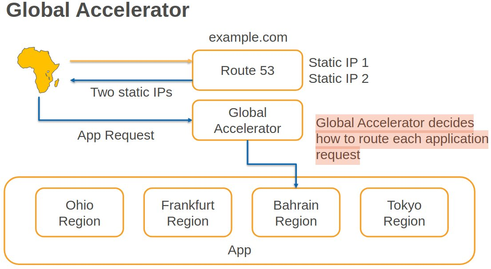

### Architectural Patterns

#### HA and Elastic Scalability for web servers

You can use Amazon EC2 Auto Scaling and Application Load Balancers across multiple AZs.

#### Low latency connections are needed over UDP to a pool of EC2 instances running a gaming application.

Use a Network Load Balancer with a UDP listener.

#### Clients needs to white list static IP addresses for a highly available load balanced application and in an AWS region.

Use a Network Load Balancer, you can create static IP addresses in each AZ.
Remember, with an ALB, you don't get static IP addresses, so you wouldn't be able to do that. You would know the DNS name, but the IP addresses might change over time.

#### An application on EC2 in an Auto Scaling group requires disaster recovery across regions.

create an ASG in a second region with a capacity set to zero.
That means there's not going to be any instances running so you're not wasting money.
You can take snapshots and copy them across regions.
You might use Lambda to automate that process or data lifecycle manager, DLM.

#### An application on EC2 must scale in larger increments if a big increase in traffic occurs compared to small increases in traffic.

Use Auto Scaling and a step scaling policy. And you configure a larger capacity Increase

#### You need to scale EC2 instances behind an ALB based on the number of requests completed by each instance.

In this case, you can use an Auto Scaling group and a target tracking policy. Using the ALBRequestCountPerTarget metric, and that's the number of requests that are outstanding for an individual target.

#### An application runs on EC2 instances behind an ALB, once authenticated, users should not need to reauthenticate if an instance fails.

In this case, you could use a session state store such as DynamoDB or ElastiCache.

#### A company is deploying IDS/IPS. That's an intrusion detection system and intrusion prevention system, and it's using virtual appliances and needs to scale those horizontally.

Use a Gateway Load Balancer in front of the virtual appliances.

#### Your application is expected to receive a lot of traffic after a promotion event. This application has an Elastic Load Balancer for distributing requests to EC2 web servers. What specific steps do you take to ensure internet gateway scales with the traffic?

No action needed. Internet gateway is a managed service and automatically scales, redundant and highly available

#### If an instance fails the health check, Elastic Load Balancer would:

Load Balancer stops new traffic to the instance - Load balancer monitors all registered instances for health. 
If an instance fails the health check, the load balancer stops new traffic to the instance. 
ELB continues to perform health checks, even on unhealthy instances. 
If the instance becomes healthy again, ELB will start using the instance

#### An organization's security policy requires client apps to communicate only with the whitelisted IP Addresses. You need to build a new service on AWS that would be used by client applications. Which of these architectural options would reliably allow whitelisting of the load balancer IP address at the client?

Network Load Balancer assigns a static IP address per availability zone. 
You can use this to configure your client application. 
DNS lookup of Application and Classic Load Balancer Names would return a list of load balancer nodes that are valid at that time; however, this list can change depending on the load on the system. 
So, for application and classic load balancers, you should always refer to it by DNS name.

#### A customer has a hybrid infrastructure consisting of web servers in both on-premises and the AWS cloud. The client request must be distributed across AWS and on-premises servers. Which load balancing product can support this requirement?

Both Application and Network Load Balancers allow you to add targets by IP address. 
You can use this capability to register instances located on-premises and VPC to the same load balancer. 
You need to register private IP of the server for a hybrid load balancer, and on-premises data center should have a VPN connection or a Direct Connect link to AWS (to communicate using private IP)

#### You want to limit access to the load balancer from specific IP ranges. Where can you enforce this policy

Security Groups, are supported by both Classic and Application load balancers. 
You can use the load balancer security group to limit access to the load balancer from specified source IP blocks. 
Network Load Balancer does not support Security Groups. 
You can also restrict access using Network ACL of the load balancer subnets.

#### Which auto scaling group configuration would ensure two running instances when an availability zone is lost? Assume that minimum, maximum, and desired instance count is set to the same value. Pick a choice that is optimized for cost.

We don’t know ahead of time which availability zone will fail. 
When desired instance count is set to 3, and the number of availability zones is set to 3, Auto scaling will deploy one instance in each availability zone.
When an AZ is lost, we would still have two running instances

#### An application consists of an elastic load balancer, a fleet of web servers, and a Relational Database in the multi-AZ configuration. Auto Scaling group dynamically scales the number of web servers based on traffic. Auto Scaling Group uses a load balancer health check. The app team has implemented an in-depth health check that passes only when connectivity to the database is confirmed. The primary database failed, and RDS initiated a failover. How will Auto Scaling respond to this situation?

Auto Scaling would terminate failing web server instances and launch replacement ones. 
In-depth Health checks like these can produce unintended side effects when combined with Auto Scaling. 
With Auto Scaling in the picture, your health check should check only the health of the server and application components. 
An in-depth health check on other dependent services requires careful assessment

#### Which of these options maintains a scaled-down infrastructure in another region and requires only scaling after a disaster?

- Warm Standby maintains a continuously replicated copy of data, and a scaled-down infrastructure is always running for the rest of the components. Warm Standby can meet more stringent RTO/RPO in minutes.
- Backup and Restore only maintains a backup in another region. After a disaster, we need to restore the data and bring the entire infrastructure up in the second region, so the RTO/RPO is in hours.
- Pilot light maintains a continuously replicated copy of the data in another region; however, the rest of the infrastructure needs to be brought up after the disaster. So, the RTO/RPO is in 10s of minutes.
- Multi-site Active/Active is a zero-downtime solution with infrastructure in multiple regions. The application request is routed to any of the regions. This option can meet real-time RTO/RPO requirements.

#### You would like to automatically replace instances that are not healthy due to underlying infrastructure or common guest OS related issues. In order to do so with AutoScaling, you need to

Autoscaling automatically does this for you

#### team wants to use a mix of on-demand and spot instances of various instance types. How would you implement this proposal with Auto Scaling?

Use Auto Scaling Launch Template and specify the on-demand and spot portion of the capacity that the auto scaling group needs to maintain

You can specify a percentage distribution of on-demand and spot instances. To maximize the chances of fulfilling spot requests, you can specify a range of values for vCPU and memory configuration. Auto Scaling will identify a list of instance families that meet the criteria.


## AWS Organizations and Control Tower <a id="Organizations"></a>

With __AWS Organizations, you can consolidate multiple AWS accounts__ into an Organization that you create and then centrally manage.

It's available in two feature sets:
- __consolidated billing__
- __all features__.

It includes the root account and Organizational Units.

Policies get applied to root accounts or OUs.

Consolidated billing includes:
- a paying account, which is independent and can't access the resources of other accounts
- linked accounts - all linked accounts are also independent of each other.

Consolidated billing:
- __single payment method__ for all the AWS accounts in the Organization.
- __combined view__ of charges incurred by all accounts
- __pricing benefits__ from the aggregated usage.
- There's a limit of 20 linked accounts for consolidated billing by default.
- can help with cost control through the volume discounts.
- __unused reserved instances are applied across the group__
- paying accounts should be used for billing purposes only.

Service Control Policies:
- __manage the maximum available permissions__.
- must have all features enabled in the Organization
- can be applied to accounts or OUs.
- __policies can be assigned at different points in the hierarchy__
- __SCPs affect only IAM users and roles, not resource policies__.
- __SCPs affect the root account in member accounts__.
- SCPs do not affect any action performed by the management accounts.

Different strategies:
- The __deny list strategy__ uses the FullAWSAccess SCP
  - attached to every OU and account
  - overrides the implicit deny.
  - explicitly allows all permissions to flow down from the root, so it grants full access to all permissions.
  - create additional SCPs to explicitly deny permissions anywhere in the hierarchy.
- __allow list strategy__.
  - remove the FullAWSAccess SCP.
  - No APIs are permitted anywhere unless you explicitly allow them.
  - create SCPs to allow all permissions.
  - SCPs must be attached to target accounts and every OU above it including the root.

AWS Organizations – migration
- accounts can be migrated between organizations.
- You must have root or IAM access to both the member and management accounts.
- Use the AWS Organization's console if it's just a few accounts or use the API or CLI if there are many accounts to migrate.

### Architectural Patterns

#### A company needs a method of quickly creating AWS accounts programmatically.

Use the Organization's API to create accounts programmatically.

#### Users in a member account in AWS Organizations should be restricted from making changes in IAM.

Use a Service Control Policy, an SCP to deny access to IAM actions.

#### An AWS account must be moved between Organizations.

Migrate the account using the AWS's Organization's console.
Again, you can do that for a single account.
If you have lots of accounts you want to move, again, you can do that through the API as well.

#### A solutions architect created a new account through the Organization's console and needs to log in to launch resources.

The architect should switch roles to access the new accounts.

#### Multiple member accounts in AWS Organizations require the same permissions to be restricted using SCPs.

Create an OU and add the member accounts and then attached the SCP to the OU.

#### The developers in a company each have their own AWS accounts for testing. The security team wish to enable centralized governance.

Create an AWS Organization and send an invite to each developer's AWS account to join the Organization.


## Amazon VPC <a id="VPC"></a>

Analogous to having your own data center inside AWS.

You get complete control over the virtual networking environment.

VPC is logically isolated from other VPCs on AWS.

__VPCs are region-wide__.

A __default VPC gets created in each region and that always has a subnet in each availability zone__.

By default, you can create up to five VPCs per region.

__Public subnets__ are subnet that have:
- the __auto assigned public IPv4 address__ setting configured to yes, and
- the __subnet route table must have a route to an internet gateway__.

When you create a VPC, you specify a range of IPv4 addresses for the VPC in the form of a CIDR block.

A __VPC will span all availability zones in the region__.

You get full control of who has access to the resources inside the VPC.

The names of availability zones are mapped to different zones for different uses. So, you can __use the AZ ID to identify the actual physical zone__.

Components of a VPC:
- __subnet__: segments of a VPC's IP range where you can place groups of isolated resources and they map toa single AZ.
  - AWS subnet is alswys in one AZ
  - Azure subnet can span multiple AZ
  - By default 2 subnets are connected to each other via Route Table and EC2 can communicate with private IP
- __Internet gateway__ is the VPC side of a connection to the public internet.
- A __NAT gateway__ is a highly available managed network address translation service for enabling access to the internet from private instances.
- The __VPC router__ performs all the routing functions in your VPC.
- A __peering connection__ connects you to another VPC using private IP addresses.
- __VPC endpoints__ enable private IP addresses to be used to connect to services in the public zone.
- An egress only Internet gateway is used by IPv6 addresses to access the internet, and it's outbound only.
- For VPN:
  - A __hardware VPN__ connection is a virtual private network that you can connect your VPC to your data center, your home network, or your co-location facility.
  - The __virtual private gateway__ is the VPC side of the VPN connection,
  - the __customer gateway__ is the customer side of VPN connection.

Rules for your IP CIDR blocks:
- the __size can vary between /16 and /28__.
- The CIDR block cannot overlap with any existing CIDR block that's associated with the VPC.
- you __cannot increase or decrease the size of an existing CIDR block__.
- max = 5 VPCs per region
- The first four and last IP addresses in a subnet are not available for use.
- AWS recommend you use the RC 1918 ranges.
- Ensure you have enough networks and hosts.
- Bigger CIDR blocks are often better and smaller subnets are usually okay.
- Consider deploying your application tiers into subnets.
- Split your high availability resources across subnets that are assigned to different AZ.
- VPC peering requires non-overlapping CIDR blocks.

### Security Groups <a id="SecurityGroups"></a>

Security Group:
- Default Security Group: Inbound: All, Outbound: All
- Only Allow rules, no Deny
- One security group can protect many EC2: SG -- n:n -- EC2
- Stateful: do not check 'inbound' if session has been initiated and this is returning traffic
- One security group can protect EC2s in different AZs.
- can be attached to __anything with NIC__ (network interface)

Security groups versus network ACLs:
- __Security groups__:
  - operate at the __instance level__.
  - support __allow rules only__.
  - __stateful__ all rules get evaluated
  - apply only to instances that are associated with the group.
- A __network ACL__:
  - operates at the __subnet level__
  - supports __allow and deny rules__,
  - __stateless__,
  - rules get __processed in order__
  - automatically applies to all instances in the subnets that it's associated with.

| Port range | Description           | Example
|------------|-----------------------|-------
| 0-1023     | Well-known ports      | Http (80)
| 1024-49151 | Registered ports      | MySQL (3306)
| 49152-65535| Dynamic/Private ports | random

ACL Ephemeral Ports
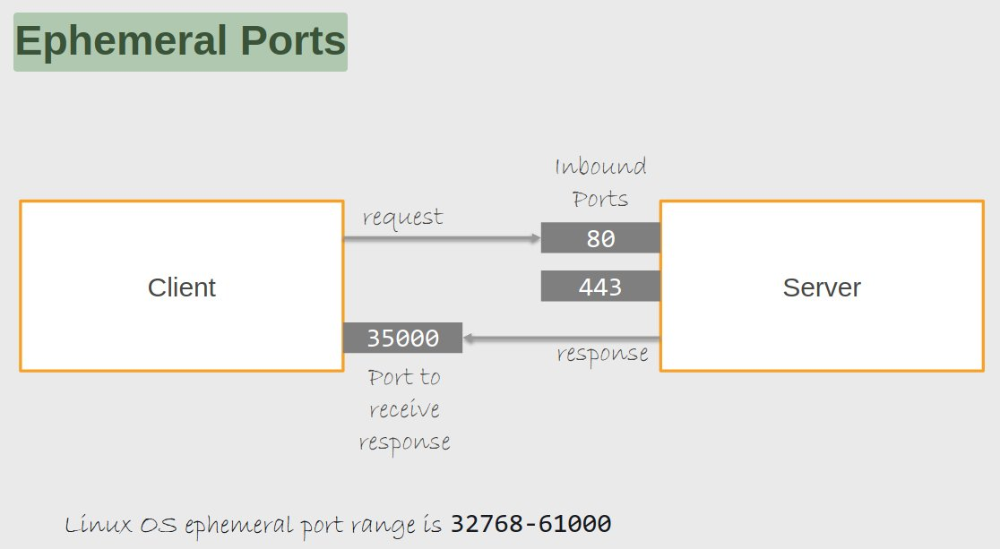

Network ACL – Fix Allow Local Traffic
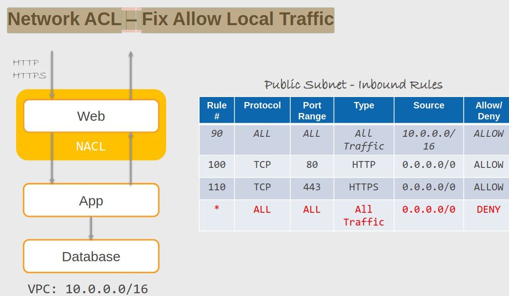

### Connecting to a VPC <a id="ConnectingToVPC"></a>

- AWS __managed VPN__
  - What: an IPSec VPN connection __over the Internet__.
  - When: a quick and easy way to set up a VPN tunnel to a VPC, can be used as a redundant link for some other connection like Direct Connect
  - Pros: supports static routes or BGP peering and routing.
  - Cons: is dependent on an Internet connection.
  - How: create an AWS managed VPN by creating a virtual private gateway, also known as a VWG on AWS and a customer gateway on the on-premises side.
  - Setup:
    - Customer Gateway
    - VPN Gateway, attach to VPC
    - Site-to-site VPN
    - Download and setup configuration file on on-premises router
    - add route in route table in 2 places: aws and on-premises)
  - VPN Site-to-Site , HA AWS-OnPrem:
    - Two Customer Gateway devices preferably in different data centers
    - Two VPN connection from the same VGW but to different CGWs
    - On-premises Connectivity is configured at VPC level
  - VPN using Transit Gateway:
    - Use Transit Gateway to terminate VPN Connection
    - Share the same VPN connection with multiple VPCs

- __Direct Connect__:
  - faster than VPN, no internet
  - What: dedicated network connection over private lines straight into the AWS backbone.
  - When: requires a large network link into AWS. When you have a lot of resources and services being used by corporate users in your data center or your office.
  - Pros: predictable network performance and potential bandwidth cost reduction if you use the right volume of traffic. And you get up to 10 or 100 gigabits per second of provisioned connections. Supports BGP peering and routing.
  - Cons: may require additional telecom and hosting provider relationships and network setups. So, that can take a bit of time and cost to configure.
  - How: work with your data center networking provider to connect into the AWS locations and then you create virtual interfaces for accessing services on AWS.
  - Bypass internet with a dedicated link between on-premises and AWS
  - Cloud is an extension of your datacenter – access using private IP
  - Consistent network performance and throughput
  - For HA, use multiple DX Locations or use a backup VPN over the internet
  - cost of transferring data from aws to data center is significantly lower than transferring data over the public internet
  - __no encryption__
  - Complex setup:
    - AWS has 100+ Direct Connect locations worldwide. Choose the one closest to your data center.
    - Access resources in any of the AWS regions
    - For Critical workloads, use two Direct Connect locations (location or device failure)

- __Combine Direct Connect and a VPN connection__: In this case, you're actually using a VPN connection over your Direct Connect link. Why would you do that? Well, you get an encrypted tunnel over your Direct Connect connection. So, it's more secure in theory at least than Direct Connect alone.

- __VPN CloudHub__
  - What: connect your locations in a hub and spoke manner using AWS's Virtual Private Gateway. So, it's VPN connections from multiple office locations or multiple data centers that you might have.
  - When: linking your remote offices for backup or primary WAN access to AWS resources and to each other because it will route between them as well.
  - Pros: reuses existing Internet connections and supports BGP routes to direct traffic.
  - Cons: is dependent on internet connections again and there's no inherent redundancy.
  - How: assign multiple customer gateways to a virtual private gateway, each with their own BGP ASN and unique IP ranges.
- __Software VPN__:
  - What: provide your own VPN endpoints and software.
  - Whan: You have to manage both ends of the connection. It's a software layer.
  - Pros: flexibility and manageability options.
  - Cons: you need to design for any kind of redundancy as well.
  - How: In terms of actually deploying a software VPN, there's lots of different options out there: can also use the marketplace to find an EC2 instance with pre-packaged software.
- __Transit VPC__:
  - What: strategy where you're connecting geographically dispersed VPCs in a hub and spoke manner with AWS managed VPNs. So then you have one VPC that's configured as the network transit center for the other VPCs.
  - When: Locations and VPC-deployed assets across multiple regions that need to communicate with each other.
  - Pros: flexibility and manageability and also AWS-managed VPN hub-and-spoke between VPCs.
  - Cons:  define any redundancy that you need across the whole chain.
  - How: there are some third-party providers (Cisco, Juniper) that also offer equipment that can be used with your VPCs and help you to configure a transit VPC.
- __VPC peering__:
  - What: provide connectivity between VPCs and they need to have that connectivity via private IP addresses.
  - Whan: Multiple VPCs need to communicate.
  - Pros: use the AWS backbone without traversing the Internet
  - Cons: no transitive peering supported.
  - How: VPC peering request created, accepted,
    - you need to create a route
- __VPC Endpoints__:
  - __Interface Endpoint__
    - What: it's an elastic network interface with a private IP.
    - How: It uses DNS entries to redirect traffic. 
    - Interface endpoint __creates a network interface with private IP__
    - Which services: many services including API Gateway CloudFormation and CloudWatch.
    - Security: security groups which you can assign as well, so you can apply your security groups to your interface.
    - Interface endpoints are also known as __PrivateLink__
    - For HA, create an interface endpoint in each AZ
  - __Gateway Endpoint:__
    - What: this is a target for a specific route
    - How: uses prefix lists in the route table to redirect traffic.
    - And this is for Amazon S3 and DynamoDB only.
    - Security: You can't use security groups, but you can use VPC endpoint policies.
- __Flow Logs__:
  - can capture information about the IP traffic going to and from network interfaces in a VPC.
  - The flow log data is stored using CloudWatch logs or Amazon S3 or Kinesis
  - can be created at different levels: The VPC level, subnet level, or the network interface level.

__VPC Transit Gateway__
- can connect many: VPCs, VPNs, Direct Connect, peering connections.
- must be in the same AWS account and region
- multiple regions: setup Transit Gateway in each region
- add transit gateway attachment for each VPC
- add route table entries

The VPC router connects different AZs together and connects the VPC to the Internet Gateway

Internet Gateways (IGW) must be created and then attached to a VPC, be added to a route table, and then associated with the relevant subnet(s)
IGW is horizontally scaled, redundant and HA and performs NAT between private and public IPv4 addresses
Internet Gateway requires public IP. Else not traffic will go in or out.

Public subnet:
- Auto-assign public IPv4 address” set to 'Yes'.
- If your subnet is associated with a route to the Internet

You have to create Route Table
- main route table is created when you create VPC. It is automatically associated with all subnets
- separate route table for public (create new) and private subnets (main route table)
- associate public subnet with public route table and
- add route to Internet Gateway (destination: 0.0.0.0/0; target: InternetGateway)


To enable access to or from the Internet for instances in a VPC subnet, you must do the following:
- Attach an Internet Gateway to your VPC
- Ensure that your subnetʼs route table points to the Internet Gateway
- Ensure that instances in your subnet have a globally unique IP address
- Ensure that your network access control and security group rules allow the relevant traffic to flow to and from your instance

Managed Prefix List
- one or more CIDR blocks
- use it in VPC security groups, subnets, transit gateway tables, firewall etc
- use it for outboud traffic

#### VPC Endpoint

- powered by PrivateLink: provides private connectivity between VPCs, AWS services and on-premises aapplications using amazon network (not internet)
- Gateway endpoint ( Dynamodb or S3): you need to define route table target in route table
- Interface endpoint: ENI with private IP
- Gateway Load Balancer endpoint:
- Limits to access specific service (through load balancer). VPC Peering - access everything
- Endpoint is always in the same region
- To access endpoint from another region use VPC peering

Interface Endpoint:


Gateway endpoints:
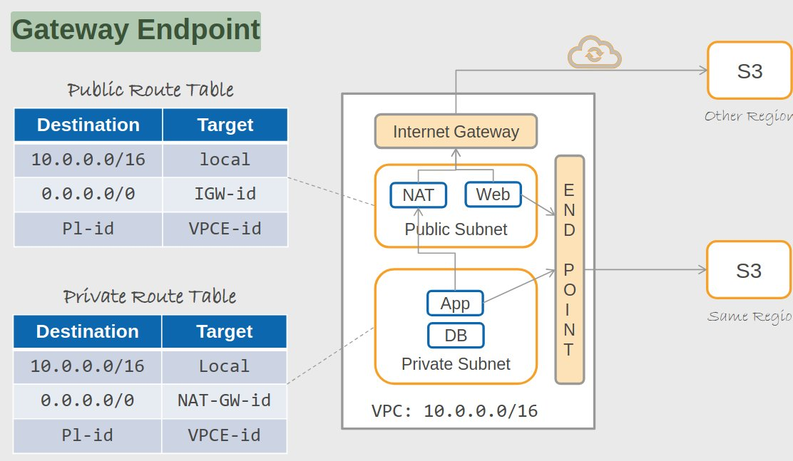

DHCP - dynamic host connection protocol
- router provides IP for host
- you can have custom DHCP option set

### Architecture Patterns

#### An Amazon S3 bucket must only allow access from EC2 instances in a private subnet using private IPs.

Create a VPC endpoint and configure a bucket policy that restricts access to the VPC endpoint ID using the condition elements.

#### Malicious traffic is reaching some EC2 instances in a public subnet from a few identified public IP addresses.

Use a network ACL to deny access based on the source IP addresses.

#### A company wants to connect their on-premises data center to AWS and requires consistent performance and encryption.

Create a Direct Connect connection. But you can't get encryption on a Direct Connect connection, so you have to run a site-to-site VPN over the top.

#### A company requires private connectivity between VPCs in different regions with full redundancy.

Create VPC peering connection between the VPCs.

#### Several remote office locations should be connected to an Amazon VPC and to each other over the internet with full encryption.

Create a VPG and attach multiple remote locations in a hub and spoke topology, and that's an AWS cloud hub topology.

#### Microservices app requires instance level firewall with different rules per application component.

Classic case for security groups for each application component, and you just need to make sure you configure the appropriate rules.

#### A company is using IPv6 addresses with Amazon EC2 and needs to enable outbound internet connectivity.

Rather than an Internet gateway, you need an egress only Internet gateway. That's for IPv6.

#### A subnet must be configured that allows internet connectivity using IPv4 with auto address assignment.

Attach an Internet gateway to the VPC, update the route table so, for the new subnet and then enable the auto assigned public IPv4 setting for the subnet as well.

#### An on-premises data center needs to establish site-to-site VPN connections to several VPCs in a full mesh architecture.

Deploy an AWS transit gateway, attach the VPN connection from the on-premises and then attach it also to each VPC.

#### How would you increase the availability of your VPN setup between on-premises and AWS cloud?

Use a single virtual private gateway (VGW) and two customer gateways (CGW). VGWs are highly available and can tolerate AZ failure

#### What capability can you use for auditing inbound and outbound traffic in your VPC?

#### How would you increase the availability of your Direct Connect link between on-premises and AWS Cloud?

To avoid a single point of failure, you need to consider using two different direct connect locations for critical workloads. 
This will protect you from device failures and direct connect location outages

#### When a NAT Gateway is deployed in a VPC, it:

- Resides in a public subnet
- Scales inside one availability zone

#### You are hired to help with migrating a customer's solution to the AWS Cloud.  Customer wants to perform a phased migration strategy and they would like to first run couple of webservers on AWS that points to existing on-premises database. Application requests should routed across webservers in AWS as well as webservers located on-premises.  Which load balancing product can be used for this requirement?

Both Application and Network Load Balancers allow you to add targets by IP address. You can use this capability to register instances located on-premises and VPC to the same load balancer


## Amazon Simple Storage Service <a id="S3"></a>

You can store any type of file.

Files can be anywhere from __0 bytes to 5TB__.

There is virtually unlimited storage available.

S3 is a __universal namespace, so bucket names must be unique globally__.

You have to __create your buckets within a specific region__.

There's __no hierarchy__ for objects within a bucket.

S3 delivers __strong read-after-write consistency__.

S3 Buckets:
- Files get stored in buckets
- the bucket can be viewed as a container for the objects.
- It's a flat container of objects with no hierarchy
- you can use an object key name or a prefix to mimic folders.
- 100 buckets per account by default as a limit,
- you can store unlimited objects in your buckets.
- cannot create nested buckets, so a bucket will never go inside another bucket.

S3 objects:
- Objects are the files that you upload to S3.
- S3 supports any file type.
- each object is stored and retrieved by a unique key.
- Objects remain in the region in which they're stored unless you set up replication.
- Permissions can be defined on objects at any time.
- The storage class is set at the object level.

S3:__PutObjectLegalHold__ permissions privileges are limited to people with a business need

Data Access Pattern:

| S3 Storage Class  | Standard            | Infrequent Access       | Glacier Deep Archive
|-------------------|---------------------|-------------------------|-------------------------
| Access            | Immediate           | Immediate               | Several hours
| Usage             | Frequently Accessed | Less frequently accessed| Rarely accessed
| Monthly Cost 500GB| USD 11.50           | USD 6.25                | USD 0.50
| Retrieval Fee     | N/A                 | Per GB                  | Per GB
| Redundancy        | 3 AZ                | 3 AZ                    | 3 AZ

Storage classes:


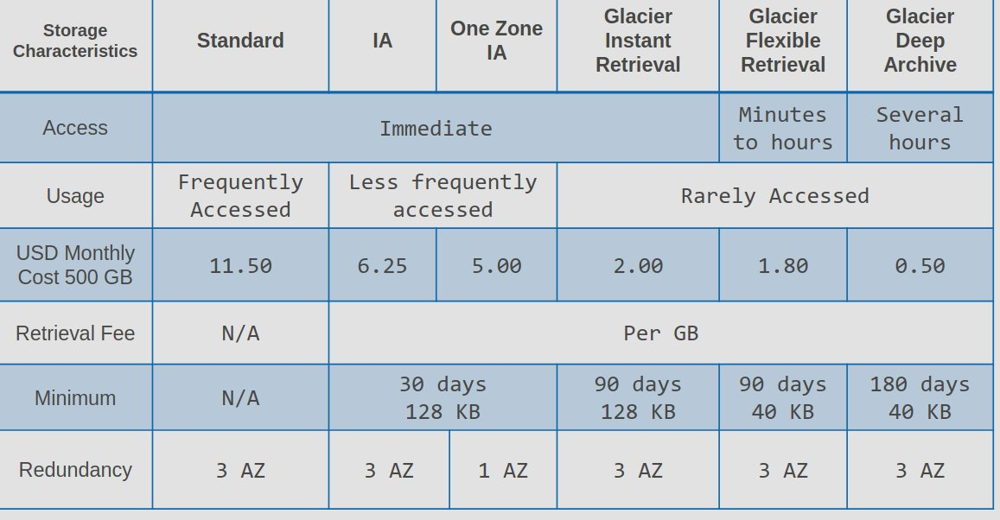
 
__IAM / Bucket policies__:
- IAM policies are identity-based policies.
- The principal is not defined within an IAM policy.
- Bucket policies are resource-based policies.
- Bucket policies, they can only be attached to Amazon S3 buckets.
- Use them when:
  - IAM policies if you need to control access to AWS services other than as S3.
  - numerous S3 buckets, each with different permissions requirements, IAM policies will turn out to be a lot easier to manage.
  - if you prefer to keep access control policies in the IAM environment.

__S3 Access Control Lists__:
- These are a legacy access control mechanism.
- AWS will generally recommend using S3 bucket policies or IAM policies rather than ACLs.
- They can be attached to a bucket or directly to an object,
- limited options for the grantees and the permissions that you can apply.
- Not as good as JSON-based IAM policy.
- Use it when:
  - simple way to grant cross account access to S3 without using IAM roles.
  - if your IAM policies are reaching the size limits,
  - you prefer to keep access control policies in S3.

__S3 Versioning__:
- Versioning is a means of keeping multiple variants of an object in the same bucket.
- You use versioning to preserve, retrieve, and restore every version of the object stored in your S3bucket.
- Versioning enabled buckets will enable you to recover objects from accidental deletion or overwrites.

Lifecycle management:


Archive Flow – Intelligent Tiering:

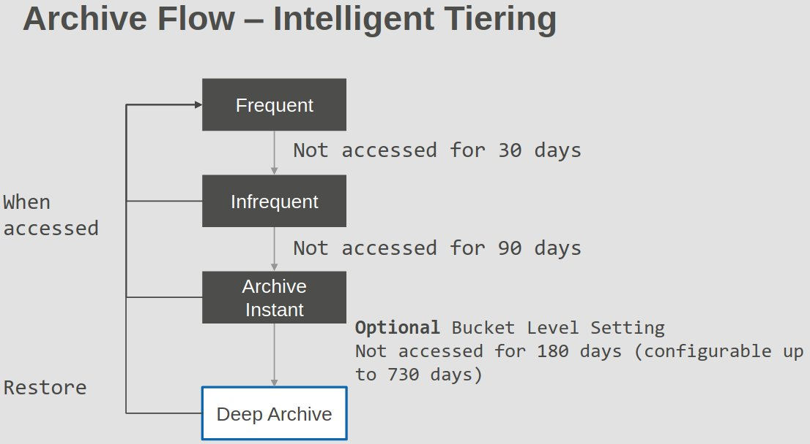
 
Multi-Factor Authentication Delete:
- Adds an MFA requirement for bucket owners to the following operations:
  - changing the versioning state of a bucket
  - permanently deleting an object version,
- The x-amz-mfa request header must be included in the above requests.
- The second factor of authentication is generated by a hardware device or software program like an authenticator app such as the Google Authenticator app that we've used in this course. It does require versioning to be enabled on the bucket.
- Versioning can be enabled by:
  - bucket owners,
  - the root account,
  - AWS account that created the bucket,
  - authorized IAM users.
- MFA Delete can be enabled by the bucket owner only.

Protected API access with MFA:
- This is used to enforce another authentication factor, an MFA code when accessing resources and not just S3.
- It's enforced using the AWS MultiFactorAuthAge key in a bucket policy.

S3 encryption:
- SSE-S3, using S3's existing encryption key for AES 256 encryption.
- SSE-C you're uploading your own AES 256 encryption key, which S3 then uses for you.
- SSE-KMS is where you're using KMS keys
- client-side is where you have your own encryption keys and you're managing the encryption as well. There's no encryption happening on AWS you're doing it before you upload your objects.

Event notifications:
- this is where S3 sends notifications when an event happens in an S3 bucket.
- The destinations include SNS, SQS, and Lambda.

Multipart upload:
- uploads objects in parts, independently, in parallel and in any order
- It's performed using the Multipart upload API
- recommended for objects __above 100 MB__.
- can be used for objects from 5MB up to the maximum file size, which is __5TB__.
- it has to be used for any objects larger than 5GB.

S3 copy API:
- you can copy objects __up to 5GB__.
- it can be used to:
  - generate additional copies of objects,
  - rename objects,
  - change the storage class or encryption at rest status,
  - move the objects between AWS locations and regions.
  - You can also change the object metadata.

Server Access Logging:
- provides detailed records for the requests that are made to a bucket.
- information that is logged includes the requester, the bucket name, the request time, request action, response status, and the error code.
- It's disabled by default.
- you only pay for the storage space that's actually used.
- You must configure a separate bucket as the destination,
- you can specify a prefix if you want to.
- You must also grant write permission to the Amazon S3 Log Delivery group on the destination bucket.

CORS with Amazon S3:
- is enabled through setting:
  - the access-control-allow-origin,
  - access-control-allow-methods,
  - access-control-allow-header.
- These settings are defined using rules
- the rules are added using JSON files in Amazon S3.

Cross Account Access Methods:
- Resource-based policies and IAM policies can be used for programmatic access to S3 bucket objects,
- resource-based ACL and IAM policies for programmatic access to S3 bucket objects as well.
- If you need programmatic and console access, you can use cross account IAM roles.

Performance optimizations:
- S3 does support at least 3,500 PUT, COPY, POST, DELETE, or 5,500 GET HEAD requests per second per prefix in a bucket.
- You can increase, read or write performance by parallelizing reads.
- You can use Byte-Range Fetches.
- You can retry requests for latency sensitive applications
- you can combine S3 and EC2 in the same region for better performance.
- you can use Amazon S3 Transfer Acceleration to minimize any latency caused by long distances.

### Amazon S3 and Glacier

A bucket owner can grant cross-account permissions to another AWS account (or users in an account) to upload objects.
- The AWS account that uploads the objects owns them.
- The bucket owner does not have permissions on objects that other accounts own, however:
  - The bucket owner pays the charges.
  - The bucket owner can deny access to any objects regardless of ownership

You can use the AWS Policy Generator to create a bucket policy for your Amazon S3 bucket.

Bucket and object permissions are independent of each other.

### Transfer acceleration

Amazon S3 Transfer Acceleration enables fast, easy, and secure transfers of files over long distances between your client and your Amazon S3 bucket.

S3 Transfer Acceleration leverages Amazon CloudFrontʼs globally distributed AWS Edge Locations.

Transfer acceleration is as secure as a direct upload to S3

- improving the performance of transfers of files,
- leverages the CloudFront edge locations.
- Used to accelerate uploads of objects over long distances, so you're reducing latency.
- Transfer Acceleration is as secure as a direct upload to S3,
- you're charged only if there's a benefit in the transfer time.
- You need to enable Transfer Acceleration on the S3 bucket. It cannot be disabled after that, but only suspended.

Must use one of the following endpoints:
- .s3-accelerate.amazonaws.com.
- .s3-accelerate.dualstack.amazonaws.com (dual-stack option)

__Cross Region Replication requires versioning__ to be enabled on the source and destination buckets.

__Replication is 1:1__ (one source bucket, to one destination bucket).
You can configure __separate S3 Lifecycle rules on the source and destination buckets__.

### Static Websites

You can use a custom domain name with S3 using a __Route 53 Alias record__.

When using a custom domain name the __bucket name must be the same as the domain name__.

Only supports __GET and HEAD requests__ on objects.

To enable website hosting on a bucket, specify:
- Bucked should be marked __'static website'__
- Bucket - __public read access__ for bucket and all docs
- __disable block public access settings__
- Bucket __permissions__: add an object access control list (ACL) that grants __everyone read access__.
- Define An __index.html__ document (default web page) and optionally error.html document.
- define __DNS entry__
  - __register custom domain name__
  - create 2 buckets:
    - __Domain bucket__ – __example.com__. Configure your root domain bucket for website hosting
    - __Subdomain bucket__ – __www.example.com__. Configure your subdomain bucket for website redirect
  - Add __alias records__ for your domain and subdomain
- __only http__ (no s). if you want https: use cloudFront

### S3 Object Lock

S3’s Object Lock feature allows you to enforce the “Write Once Read Many” (WORM) paradigm. 
In this paradigm, an object version cannot be modified or deleted; however, it is available for reading.

S3 Object Lock protects your data from accidental and malicious deletion Object Lock needs to be enabled at Bucket Level. 
This feature also automatically enables versioning.

Why can’t you enforce the WORM paradigm using IAM policies?
The issue with IAM policies are:
- The root user has full access and can remove objects
- Identity and Resource-based policies may not be sufficient to comply with legal hold notice
- It may not be easy to enforce operationally

There are three ways in which you can use Object Lock:
- __Legal Hold__.
  You can place an object version on legal hold (__s3:PutObjectLegalHold__).
  When a legal hold is in place, the object version cannot be deleted.
  Lifecycle policies cannot delete an object version with a legal hold.
  This feature lets you keep an object version for as __long as needed__
  Once the legal hold is removed, the object version can be deleted.
- __Retention Period__
  We can also protect an object version from deletion or modification by __specifying a retention period__
  In __Governance Mode__, anyone with __S3:BypassGovernanceRetention__ permission can override retention configuration and delete the object version
  In __Compliance Mode__, the __Object version cannot be deleted by anyone__ (including the root user) until the retention period expires.


### Architecture Patterns

#### A  company is concerned about accidental deletion of Amazon S3 objects.

Well, they might want to mitigate this by using S3 Versioning.

#### Data stored in S3 is frequently accessed for 30 days, then is rarely accessed, but must be immediately retrievable.

Use a lifecycle policy to transition objects from S3 Standard to S3 Standard Infrequently Accessed after 30 days.

#### A backup of S3 objects within a specific folder in a bucket must be replicated to another region.

Configure cross-region replication and specify the folder name as a prefix.

#### Previous versions of objects in a versioning enabled S3 bucket must be stored long term at the lowest cost.

Create a lifecycle rule that transitions previous versions to S3 Glacier Deep Archive, and that's the cheapest option for storing that long term.

#### A company wishes to manage all encryption of S3 objects through their application with their own encryption keys.

Use client-side encryption with client managed keys.

#### Unencrypted objects in an Amazon S3 buckets must be encrypted.

Re-upload the objects because they're already there and you can't encrypt existing objects. And when you upload them, you can specify the encryption to use and the encryption key.

#### An administrator requires a notification when objects are deleted from an S3 bucket.

Configure an event notification that uses the SNS service.

#### A group of customers without AWS credentials must be granted limited access to a software update that is stored in an S3 bucket.

Generate a presigned URL and the users won't need an AWS account and it will be time limited.

#### Solutions architects require both programmatic and console access across AWS accounts.

For that, you can configure cross account access using IAM roles.

####  You want to put restrictions in an S3 bucket so that only your EC2 instances can access the bucket.

EC2 instances access S3 using Public IP Address and traffic is routed through internet gateway.
If VPC endpoint is used, S3 is accessed using AWS private network. In this case, bucket policy can use VPC ID or VPC Endpoint ID to restrict access.

####  You want to distribute content in S3 bucket using CloudFront edge locations. You also want to restrict access to the content to only the users who are authorized by your application.

Configure content to be accessible only using signed URLs or signed cookies
Create CloudFront user nad grant read access to S3
Remove permissions for anywone to directly access S3 bucket

#### An object of size 10 KB is stored in S3 using Standard - IA storage class. How is the pricing computed for this object?

Minimum charge computed for object in Standard-IA is based on 128KB size. 
If object is less than 128KB, it is still charged for 128KB​. There is also a 30 day minimum charge.

#### Account A grants S3 bucket access to Account B. An IAM user belonging to Account B needs access to that bucket. What steps need to be performed for this to work?

Account B can delegate access to its users.

#### A social media application needs to store 1000s of objects. The average size of each object is 20 KB size, and it needs to be immediately accessible when needed. The older objects are accessed less frequently. What storage would be suitable for this requirement at the lowest cost?

Object size is 20 KB and needs to be immediately accessible. 
Standard-IA, One Zone-IA, Glacier Instant Retrieval all have a 128 KB minimum charge. 
Standard provides the required performance at the lowest cost for this example

#### A team is currently using the S3 Standard class for all their storage. The data in the bucket are used by different groups in the organization, and there is no clear visibility on the percentage of data accessed. What tool can you use to generate reports on the usage of data automatically?

__Storage Class Analysis__ can continuously monitor your bucket and track how your objects are accessed over time. 
This tool generates detailed reports on the percentage of data retrieved and by age groups. 
You can use this report to manage lifecycle policies. 

#### A game developer is planning to use S3 to store important game statistics for each user. The traffic could reach 1000s of GET and PUT requests per second with millions of users. Which of these key naming conventions would scale to support the traffic?

S3 is a distributed cluster of storage nodes that automatically scales to support the traffic. 
S3 uses the object key to select the node. 
When several objects share the same key prefix, there is a high likelihood of these objects landing in a small set of nodes. 
Among these choices, __/userID/gametitle/stats.txt ensures there is a large number of unique prefixes__.

#### Your department got a legal hold notice from the company's legal department to preserve all the evidence and documents in the S3 bucket. The data should be protected from modification and deletion for three years. All buckets currently have lifecycle policies that automatically purge data at varying intervals. What would you do?

Configure a retention period of three years in __Compliance Mode__ for each object. 
This will ensure current object versions are protected from modification and deletion. 

Governance mode is not the right choice as administrators, and other users with S3:* permission on the bucket would be able to remove the object version. A legal hold may be possible; however, people with s3:PutObjectLegalHold permission can disable the legal hold and then delete the object

#### What feature can you use to protect the data in S3 Data Lake if someone accidentally makes the S3 Bucket public?

With __S3 Server Side Encryption using Customer Master Key__, the user needs permission to access the bucket or object and the customer master key. 
So, even when the bucket is made public, only the users who have access to the customer master key can access the object. 

With default keys, S3 automatically decrypts data for anyone who has permission to access the bucket

####  Your legal department has asked your team to ensure that project documents are not deleted or tampered with.  They have further asked for a three year retention window.  Your team is currently using Glacier for storing the project documents.  What option would you pick to enforce this policy?

Configure a retention period of three years in Compliance Mode for each object. This will ensure current object versions are protected from modification and deletion.

Governance mode is not the right choice as administrators, and other users with S3:* permission on the bucket would be able to remove the object version.

A legal hold may be possible; however, people with s3:PutObjectLegalHold permission can disable the legal hold and then delete the object

#### A company is using S3 to store employee files. Employees are requesting files and documents stored in S3 to be presented as a local network drive.  How can you do this?

In the File Gateway mode of the Storage Gateway, you can present an S3 bucket as a network file share to your on-premises systems. Any changes (addition, deletion, updates) that you make to the files are automatically replicated in the S3 bucket.

#### Multiple applications in different accounts within an enterprise upload data to a central S3 bucket. What security configuration would you use for the bucket?

Disable ACL-based permissions management for the bucket and ensure uploads are allowed only for authorized accounts in the organization

ACL is a legacy way of managing permissions and is problematic with cross-account upload scenarios. A bucket owner cannot read the object in the bucket unless the uploading account grants permissions using ACL. When you disable Object ACL, the bucket owner automatically owns all the objects in the bucket, and permission can be effectively managed using identity-based and resource-based policies

#### You have enabled cross region replication for your S3 bucket.   When you delete an object in the source bucket, what is the behavior observed in replicated bucket?

Delete Marker is not replicated

#### Your company uses S3 for storing a variety of documents and files. Your users ask for a feature similar to a trash can or recycle bin. This feature should allow the users to restore any deleted files or objects within 30 days. The deleted files older than 30 days must be removed automatically. How would you accomplish this?

You can use versioning to keep the older version of the objects and life cycle policies can be defined to remove the older version after 30 days

#### For disaster recovery, a customer needs to replicate the content of an existing S3 bucket to another bucket in a different region. Which option would meet the requirements?

Answer:
- S3 Batch Operations is a serverless solution that can inventory and transfer existing objects. For ongoing incremental transfer of changes to existing objects and newly created objects, we can use S3 Replication
Not correct:
- When you enable S3 Replication, it does not transfer already existing objects. Only new changes are replicated


## DNS, Caching and Performance Optimization <a id="DNS"></a>

DNS components / architecture:
- DNS resolver: ISP provider, caches entries or forwards
- DNS root server: knows about domain suffixes like ".com" and forwards to TLD server
- TLD server: knows about specific domain suffix like .com and forwards to DNS authoritative server for a given FQDN
- DNS authoritative server: forwards to specific server for FQDN like: facebook.com

### Route 53 <a id="Route53"></a>

- Route 53 gives you:
  - __domain name registry__,
  - __DNS resolution__,
  - __health checking__ of resources.
- It is __located along side edge locations__.
- private hosted zone vs public hosted zone
- Route 53 becomes the authoritative DNS server for registered domains and will create a public hosted zone for you.
- Amazon Route 53 automatically creates the Name Server (NS) and Start of Authority (SOA) records for the hosted zones.
- private DNS, lets you have an authoritative DNS server within your VPCs without exposing your DNS records.
- You can transfer existing domains to Route 53 if the top-level domain is supported.
- You can also transfer domain from Route 53 to another registrar, but you have to contact AWS support.
- You can transfer a domain to another account in AWS, but that doesn't migrate the zone by default.
- You can also have a domain registered in one AWS account and the hosted zone in another AWS account.

Hosted zone:
- is a __collection of records for a specified domain__.
- There are two types:
  - public hosted zone for routing traffic on the internet
  - a private hosted zone for your VPC, which helps to route traffic within your VPC.
- For private hosted zones, you must set the following VPC settings to true:
  - EnableDNSHostname
  - enableDNSSupport.

Health checks:
- check the instances health by connecting to it.
- you can point health checks:
  - endpoints,
  - status of other health checks
  - status of a CloudWatch alarm.
- Endpoints can be IP addresses or domain names.

Two types of DNS record:
- __CNAME__
  - Route 53 charges for queries.
  - You can't create CNAME a record at the top node of DNS namespace,
  - If you have the domain namespace example.com, you can't create a CNAME for example.com, but you can for www.example.com because that's a subdomain. So, not the zone apex.
  - A CNAME can point to any DNS record hosted anywhere.
  - __CNAME records must point to a domain, never to an IP address__
  - Example: use CNAME records to point ftp.example.com and www.example.com to the DNS entry for example.com
- __A__ record:
  - __maps a domain name to an IP address__
  - Example: "google.com" pointing to the IP address "74.125.224.147"
- __AAAA__: name -> IP for IPv6
- __Aliases__:
  - Route 53, doesn't charge for queries to AWS resources.
  - You can create an alias record at the zone apex, which is what you can't do with CNAME, so it's a key difference.
  - An alias record can only point to CloudFront, Elastic Beanstalk, ELB, S3 buckets configured as static websites or to another record in the same hosted zone.
  - allows users to access a page or file at an alternative path. It's similar to having multiple front doors to one location
  - An ALIAS record can be used to point multiple domains to the same site, such as example.com, www.example.com, and blog.example.com all pointing to the same site
  - Alias records work like a CNAME record in that you can map one DNS name (e.g. example.com) to another ‘targetʼ DNS name (e.g. elb1234.elb.amazonaws.com).
  - An Alias record can be used for resolving apex / naked domain names (e.g. example.com rather than sub.example.com).
  - A CNAME record canʼt be used for resolving apex / naked domain names.
  - Examples:
    - Domain: www.mywebsite.com  -> Value: myelb.us-east-2.amazonaws.com
- __MX__: email
- __PTR__: IP -> name

Routing policies:
- __simple__ routing (only one IP)
- __weighted__ routing policy + health-check
- __geolocation__: create one A record per regions + IP and default. dnschecker.org
- __latency__: create many A records in different regions
- __geoproximity__: need to __create traffic policy_- (provide exact geo area coordinates + bias)
- __failover__: need to __create health-check__ , decrease __TTL__
- __multivalue__: __returns many IP addresses__ in different order (round robin): same A record can have many IP addresses: Used for load balancer. Can add health-check
    - issues: cannot send traffic to private subnet, no https, slow TTL (min 60s)
- __ip based__ routing: different IP depending on source IP


### Amazon CloudFront <a id="CloudFront"></a>

To use CloudFront to distribute your website content, create a distribution and specify settings for it.
When you create a distribution, CloudFront assigns a domain name to the distribution, such as d111111abcdef8.cloudfront.net. 
You can use this domain name in the URLs for your content.
Instead of using this provided domain name, you can use an alternate domain name (also known as a CNAME).

- Cache copies of content close to your users
- CloudFront routes request to nearest edge location

- CDN as we know for __caching content around the world__.
- You __can define a maximum time to live__ and a default TTL for records.
- TTL is defined at the behavior level and CloudFront.
- This can be used to define different TTLs for different file types, so you could have a different time to live for your PNGs versus your JPEGs.
- __After expiration, CloudFront checks the origin for any new requests__.
- __Headers can be used to control the cache__:
  - the Cache-Control max-age in seconds, and that specifies how long before CloudFront gets the objects again from the origin server.
  - Expires: which specifies an expiration time and date.
- You __can also cache based on request headers__: forward headers in the viewer request to the origin.
- CloudFront can then cache multiple versions of an object based on the values in one or more request headers.
- Controlled in a behavior to do one of the following;
  - forward all headers to your origin, which means the objects are not cached.
  - forward a whitelist of headers that you specify.
  - forward only the default headers and then it doesn't cache the objects based on values in the request headers.

To secure Amazon CloudFront:
- enable HTTPS,
- restrict access with signed URLs/cookies,
- AWS WAF,
- implement field-level encryption,
- consider geographic restrictions,
- leverage CloudFront's security policies

While CloudFront primarily uses ports 80 (HTTP) and 443 (HTTPS), you can configure it to communicate with your origin server on other ports (1024-65535).

However, CloudFront itself only listens on 80 and 443, and clients connecting to CloudFront must use these standard ports

CloudFront is not a service supported by DNS-Route-53 health checks and it does not return health checks.

With CloudFront’s Origin Failover capability, you can setup two origins for your distributions - primary and secondary, such that your content is served from your secondary origin.
If CloudFront detects that your primary origin is unavailable

__S3 Transfer Acceleration__ leverages Amazon CloudFrontʼs globally distributed AWS Edge Locations

CloudFront __does not support region-specific origins__.

#### Origin

- Dynamic and Static Content
- Restrict access - Signed URLs, Signed Cookies
- Geo Restriction
- Configurable Caching, Invalidation Option
- Personalized – Query String Parameters, HTTP Cookies
- Backup Origin (primary not healthy)
- Security:
  - Origin Access Identity – Limit access to S3 bucket only from CloudFront Identity
  - When configured, CloudFront uses OAI credentials to sign S3 requests

#### Signed URLs and cookies

- With __signed URL__s:
  - these provide more control over access to content.
  - __You can specify the beginning and expiration date and time and IP addresses__ or ranges of IP addresses for users.
- With __signed cookies__, that's similar to signed URLs:
  - can use these when you don't want to change URLs,
  - they can also be used when you want to provide access to __multiple restricted files__, that's a key difference.
  - A signed URL is for a single object, whereas if you want multiple objects to be included, then you should use signed cookies.

#### Lambda@edge

Lambda functions at edge locations.

Customize application behavior – without touching origin systems

- This is where you run Node.js and Python Lambda functions to customize the content that CloudFront delivers,
- it __executes the functions closer to the view__ of a better performance.
- You can run Lambda@edge at the following points:
  - __after CloudFront receives a request__ from a viewer that's called a viewer request, before CloudFront forwards the request to the origin, that's an origin request,
  - __after CloudFront receives the response__ from the origin, origin response,
  - __before CloudFront forwards the response__ to the viewer and that's called the viewer response.


### Architecture Patterns

#### An elastic load balancer must be resolvable using a company's public domain name, a Route 53 hosted zone already exists.

create an alias record that maps the domain name to the ELB, and you must use an alias here rather than the CNAME.
A CNAME can be used for a subdomain. But in this case, it's not a sub domain and it's mapping to an ELB.

#### A website runs across two AWS regions. All traffic goes to one region and should be redirected only if the website is unavailable.

Create a failover routing policy in Route 53 and configure health checks on the primary.

#### Websites run in several countries and distribution rights require restricting access to content based on the geographic source of the connection.

use Route 53 geo-location routing and restrict distribution based on geographic location.

#### A CloudFront distribution has multiple S3 origins. Requests should be served from different regions based on file type being requested.

use a behavior and configure a path pattern. You do that within your distribution.

#### Content is accessed using an application and CloudFront distribution. You need to control access to multiple files on the distribution.

Configure signed cookies and then update the application so it processes those cookies.

#### An application runs behind an application load balancer in multiple regions. You need to intelligently route traffic based on latency as well as availability.

Create an AWS global accelerator and add the ALBs

#### An application uses Geo Location Based Routing on Route 53. Route 53 receives a DNS Query and it is unable to detect requester’s Geo location. How will Route 53 respond in this case?

Default location is returned if it is configured. Otherwise 'no answer' response is returned

#### n application is deployed in multiple AWS regions and Route 53 is configured to route request to the region that offers lowest latency for the client. Due to an unplanned downtime, Application is not available in one of the regions. How will Route 53 handle this scenario?

Health Check needs to be configured for Route 53 to become aware of application down scenarios. 
It will then act on the routing configuration specified

#### Your app is using a third party API for some of the functionality. Requests from your app to the API needs to be digitally signed using keys issued by the third party. You are planning to use CloudFront to reach the global audience for the app, and you would like to call the third party API from CloudFront Edge location directly.  What approach would you use?

With Lambda@Edge, you can run your application logic at Edge locations. 
You can configure CloudFront to invoke the Lambda@Edge function to digitally sign the requests for third party API. 
Deploying third-party integration components of your app in multiple regions is not required as it increases complexity and cost.

#### You would like to point your zone apex to your elastic load balancer. Which record type would you use?

Use Alias record. To point Zone Apex Record (example.com is zone apex. www.example.com is a subdomain) to another AWS supported endpoint, you need to use the Alias record

#### You want to configure all your email servers in Route 53. Which record type would you use?

MX Record is used for specifying mail servers in your domain

#### Your application must be accessible only from certain countries.  What routing policy would you use?

Route 53 Geolocation based routing can route based on Continent, Country and for some regions at State level

#### An application uses Geolocation Based Routing on Route 53. Route 53 is unable to pinpoint the originating location of a request. In this case, what will be Route 53's response?

Route 53 uses the caller IP address to determine the location. 
On some occasions, Route 53 may not be able to determine the precise location of the user. 
For these scenarios, you can configure a default record that handles both queries from IP addresses that are not mapped to any location and queries that come from locations that you haven’t created geolocation records for

#### Can you share the same Private DNS Hosted Zone entries with multiple VPCs across different regions?

Yes. You can enable multiple VPCs across the same or different regions in a Private Hosted Zone

#### The latency of a CloudFront application is inconsistent for global users. Some requests are extremely fast, while others are very slow. What could be the cause of this issue?

Requests are going to the origin. 
During a cache-miss, CloudFront route the request to the origin. 
Request response time, in this case, depends on how far the origin is from the user and how long an origin takes to respond. 
CloudFront does not support region-specific origins. 
With anycast routing, the request is routed to the nearest edge location. 
When Geo-restrictions are enabled, CloudFront will simply block requests from countries that are not allowed access.

#### The requests for a web application need to be routed to the webserver close to the user. Which of these options would you use?

Use Route 53 latency-based routing. 
With Route 53, you can configure region-specific endpoints. 
Route 53 will respond with the nearest endpoint address for a DNS query

#### A request needs to be routed to the nearest healthy endpoint. The application needs to respond very quickly to changing health conditions of endpoints.  Which of these options would you use?

The __global accelerator__ automatically routes requests to the nearest endpoint. 
Since the routing decision is made for each request, it can instantly respond to changes in the health conditions of endpoints. 
Route 53 will also work. However, it is based on DNS based endpoint resolution. 
DNS records are cached for the duration specified in the TTL parameter. 
So, a client may attempt to connect an unhealthy, but closest endpoint until new DNS records are fetched.

#### A company wants to minimize disruption during software upgrades. Which of these options would you use?

With __Global Accelerator__, you can control traffic flow to your regional endpoints. 
You can easily perform region-by-region upgrades by reducing traffic-dial to 0 for a region. 
Weight parameter is useful for distributing traffic in-proportion that you specify across multiple endpoints in a single region. 
This is useful for blue-green deployment. There is no need to remove regions from a Global accelerator. 
Route 53 failover routing is used for active-passive failover and Weighted routing is used for routing traffic to resources in proportions that you specify.DNS solution is slow to respond

#### When distributing Private Content with CloudFront, how do you make sure users do not bypass security measures and go directly to custom origin servers and S3 location?

You need to:
- Lockdown S3 with CloudFront Origin Access Identity (OAI) and remove permissions for others
- Configure CloudFront to forward custom headers to your publicly accessible origin server. Verify Custom header and value in your application

CloudFront Origin needs to have a public endpoint. To prevent others from calling your Origin endpoints directly, you need to configure the endpoint to verify if the request is coming from CloudFront.

A common pattern is configuring CloudFront to embed a specific header and value (either static value or dynamic values using Lambda@edge). You can verify the header content in your origin server to allow or deny access.

You can configure CloudFront to embed specific code to a custom header and cross-check the header value in Origin Server.

For S3, CloudFront uses Origin Access Identity (OAI) to access your S3 bucket. In the S3 bucket policy, you need to limit access only to this identity

#### A media company has documents, videos, images and other paid content that is currently hosted in their own datacenter. Content is personalized based on signed-on user. Users are located world wide and they are complaining about timeouts and poor performance. What options do you have to address this situation? (Choose Two)

CloudFront allows you to cache the content closest to your customer using AWS global Edge network. CloudFront Origin can be S3, applications hosted in AWS, and external applications hosted on-premises. CloudFront also supports dynamic content that is personalized based on signed-on user

#### My application uses CloudFront distribution to reach a global audience. The application uses HTTPS to accept payment information (credit card, debit card, bank information) for subscriptions. This payment information must be accessible only for specific billing components in the application and be protected from unauthorized access in other components.

Do this:
- Enable TLS/SSL encryption from CloudFront to your Origin Load Balancer and then from Load Balancer to your Webservers
- Enable Field level encryption in CloudFront to protect sensitive data

Since the application handles sensitive data, you must ensure SSL/TLS is turned on all the way to the web servers. 

If you terminate SSL at the load balancer, communication between the load balancer and the web server is unencrypted, leading to sensitive data access by components other than billing. 

CloudFront supports Field Level Encryption to protect sensitive data. With this capability, you can configure CloudFront to encrypt fields using the specified encryption keys. You would then configure the billing component to use the matching keys so that it can decrypt the sensitive data.

#### A popular SaaS application is hosted using an Application Load Balancer (ALB). A big corporate customer of this application is requesting that the application endpoints have a static IP address so that they can configure the firewall to allow traffic to the endpoint. The SaaS application technical team is heavily using ALB's routing features, and it is a non-trivial task to move to a different load balancer type. Which one of these options is most operationally efficient to meet the requirement?

Configure a Global Accelerator in front of an application load balancer.

Global Accelerator endpoint has two static IP addresses. Customer can configure their firewall and application to communicate with the Global Accelerator IP address. The requests are automatically forwarded to Application Load Balancer by Global accelerator. The global accelerator has several benefits like using the AWS edge network to route the request to the nearest endpoint, static IP address, traffic dial to easily shape traffic flow, responding instantaneously to changes in health and traffic conditions, etc.

#### Route 53 geo-location vs geo-proximity:

- Geolocation Routing, you can route traffic based on the requester's location. You can configure route 53 records based on Country and Continent. In the case of the USA, you can even configure it by State.
- Geoproximity Routing – Similar to Geolocation, if you have resources in multiple regions, you can route traffic to the nearest location and, optionally, shift traffic from resources in one location to another. This allows for more complex traffic shaping; however, Geoproximity requires the use of Traffic Flow, and it involves additional monthly costs (USD 50/month)


## Block and File Storage <a id="Block_File_Storage"></a>

### EBS <a id="EBS"></a>
- __volume data persists independently of the life of the EC2 instance__.
- EBS volumes do not need to be attached to an EC2 instance.
- you __can attach multiple EBS volumes__ to an instance.
- You an use __Multi-Attached to attach a volume to multiple instances__ with a few constraints.
- EBS volumes __need to be in the same AZ as the instances__ you're attaching them to.
- the __root EBS volumes are deleted on termination by default__.
- Extra non-boot volumes are not deleted on termination by default.
- Create Amazon Machine Image (AMI) from Snapshots to launch new EC2 instances
  - Snapshot is async and works in the background

EBS volume data is replicated across multiple servers in an AZ

Volume sizes and types can be upgraded without downtime: increase volume size, adjust performance, or change the volume type. 
However, you cannot decrease an EBS volume size.

volume types:
- SSD:
  - __gp__
    - gp2: 3 IOPS/GB, max 16 000 IOPS, burst capacity, throughput: 250 MiB/s
    - gp3: __constant 3000 IOPS__, max 16 000 IOPS, __throughput: 1000 MiB/s__
  - __io__
    - io1: 64 000 IOPS, multi-attach, throughput: 1000MiB/s
    - __io2: 64 000 IOPS + 256 000 with block express__, __multi-attach__, __throughput: 4000 MiB/s__, 99.99% durability

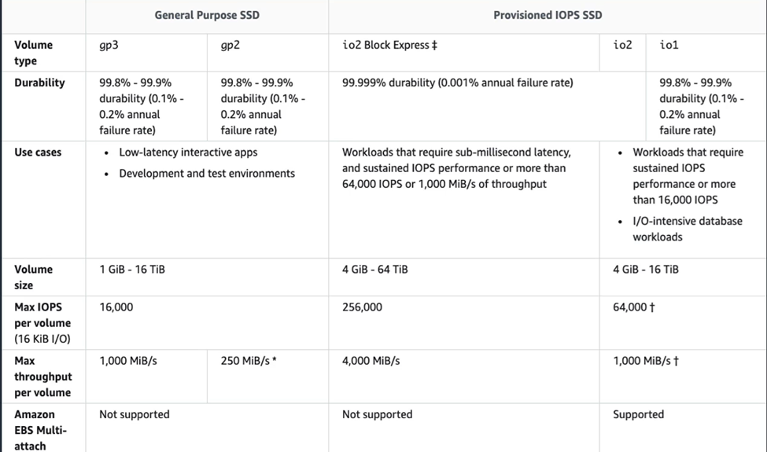

- HDD backed:
  - __500 IOPS__, throughput: __500 MiB/s__
  - extremely cheap in comparison to the SSD-backed volumes.
  - Key thing to note here, there's no Multi-Attach enabled and you cannot use these as boot volumes.

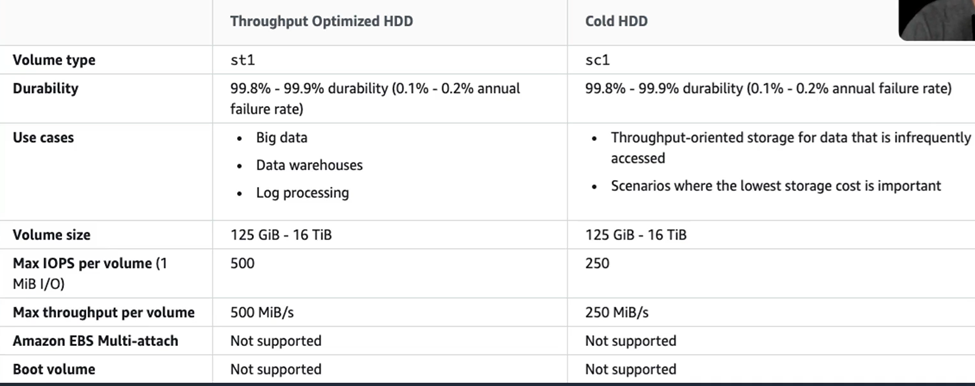


#### Data Lifecycle Manager:
- automates the creation, retention, and deletion of EBS snapshots and EBS-backed AMIs.
- DLM helps with:
  - __protecting valuable data by enforcing a regular backup schedule__
  - __create standardized AMIs that can be refreshed at regular intervals__,
  - retain backups as you might need for auditors or compliance
  - __reduces storage costs by deleting outdated backups__.
  - create disaster recovery backup policies that backup data to other accounts.

#### EBS versus Instance Store:
- Instance Store volumes are high performance local disks physically attached to the host computer on which your instance is running.
- They are ephemeral, so the data is non-persistent.
- Instance stores are good for temporary storage of information that changes  frequently
- Instance store volume root devices are created from AMI templates stored on S3
- And Instance Store volumes cannot be detached and reattached.

#### AMIs:
- these __provide the information required to launch an instance__.
- AMI includes one or more EBS snapshots or for Instance Store-backed AMIs, a template for the root volume of the instance.
- Launch permissions that control which accounts can use the AMI
- a block device mapping specifying the volumes to attach to the instance.

#### EBS snapshots

- __capture a point in time state__ of an instance.
- cost effective and easy backup strategy.
- __can be used to migrate a system to a new availability zone or region__.
- can also use them to __convert an unencrypted volume to an encrypted volume__.
- Snapshots are __stored on S3__.
- EBS volumes are __AZ specific__, but __snapshots are region specific because they're on S3__.

EBS snapshot: you can:
- restore in different AZ 
- you can create encrypted/unencrypted volume (EBS)
- you can copy snapshot to another region
- snapshot automation

#### RAID with EB
- RAID is a Redundant Array of Independent Disks.
- It's not provided by AWS. It's something you configure in your operating system.
- __RAID 0__,
  - This is __striping data for performance__.
  - You need two or more disks
  - if one disk fails the entire RAID set fails.
- __RAID 1 is mirroring__
  - data across disks for __redundancy and fault tolerance__.
  - If one disk fails, the other disk is still working.
  - data gets sent to two EBS volumes at the same time.

#### EBS encryption:
- you can encrypt both the boot and data volumes of an EC2 instance
- What is encrypted:
  - The data at rest inside the volume,
  - all data moving between the volume and the instance,
  - all snapshots that get created from the volume.
  - all volumes created from those snapshots.
- Encryption is supported by all EBS volume types.
- all instance families support encryption as well.

### File Share <a id="FileShare"></a>

| Service                  |   Purpose
|--------------------------|-----------------
| Elastic File System (EFS)| File share for Linux EC2 instances on AWS
| FSx for Windows          | File share for Windows EC2 instances on AWS
| FSx for Lustre           | File share Optimized for High Performance
|                          | Computing – Linux EC2 instances
|                          | Access S3 as a file share (like Storage Gateway)

- Fully managed – automatically grow and shrink
- High Durability and Availability – Replicated across multiple availability zones in a region
- All these file shares can be used from On-Premises using AWS Direct Connect or VPN

#### Elastic File System (EFS) 

Amazon EFS is a fully managed service for hosting Network File System (__NFS__) filesystems in the cloud.

- File Share for __Linux__ EC2 instances on AWS (NOT Windows).
- fully managed file system solution accessed using the __NFS protocol__ only.
- You get __elastic storage capacity__
- you __pay only for what you use__.
- You get __multi-AZ metadata and data storage__.
- can configure __mount points in one or many AZs__.
- __can mount from on-premises systems, but only if you have a Direct Connect or VPN connection__.
- you can use the AWS Data Sync service to synchronize data into an AWS EFS.
- EFS is elastic and grows and shrinks as you add and remove data.
- can scale up to petabytes.
- can __concurrently connect up to thousands of EC2 instances from multiple AZs within a region__.
- You can choose general purpose or Max I/O Both SSD-backed.
- Data always get stored across __multiple AZs__ within a region
- you get __read-after write consistency__.
- You need to create mount targets and choose the AZs to include
- You can mount an AWS EFS filesystem from on-premises systems ONLY if you are using __AWS Direct Connect or a VPN connection__
- Lifecycle management moves files that have not been accessed for a period of time to the EFS Infrequent Access Storage class
- Encryption in transit is enabled when mounting the file system. Enable encryption at rest in the EFS console or by using the AWS CLI or SDKs.
- EFS is much more __expensive__ than EBS or S3
- managed, scalable, secure, file sharing
- __can be protected with security group__
- __create mounts points to EFS in each AZ__
- __accessible from ec2, ecs, eks or from on premises__
- DR: you can move files to S3 using: DataSync (EFS->EFS or EFS->S3), scripts, or AWS Backup (EFS->S3)


Access control:
- use IAM to control who can administer your file system.
- For controlling access to files and directories, there's a __POSIX compliant user and group level permissions__ that you can apply.
  - POSIX permissions allow you to restrict access from hosts by user and group.
- EFS security groups act as a firewall and the rules you add to find the traffic flow, who's allowed to connect to your file system.

For encryption:
- EFS offers the ability to encrypt data at rest and in transit.
- Encryption at rest must be enabled at file system creation time.
- Encryption keys are managed by AWS KMS.
- Data encryption in transit uses transport layer security.

Data Sync:
- is a service that you can use for transferring data into EFS.
- provides a fast and simple way to securely sync existing file systems into Amazon EFS.
- You can securely and efficiently copy files over the internet or a Direct Connect connection.
- Copies file data and file system metadata such as ownership, timestamps, and access permissions.

Replication:
- You can replicate your EFS file system in an __AWS Region__.
- If you enable replication Amazon EFS __automatically and transparently replicates the data and metadata__ on the source file system to a destination file system.
- Data is transferred based on the __Last synced time__ for the replication.
- To __back up__ EFS data to __S3__, you can use the AWS CLI 'sync'__ command or use AWS Backup for a more managed approach

#### FSx

- provides a fully managed third-party file system.
- extermly high performance >> EFS
- __Linux and Windows__
- supports __SMB__, __NTFS__ and also __Linux__ and __MacOS__
- provides you with two options to choose from:
  - __FSx for Windows File Server__, for Windows based apps 
    - FSx for Windows File Server provides a fully managed native Microsoft Windows File System.
    - get full support for __SMB__, Windows __NTFS__, and __Microsoft AD.__
    - supports Windows Native File System features, ACL, shadow copies, and user quotas, NTFS file systems
    - that can be accessed from up to thousands of computer instances using SMB.
    - replicates data within an AZ. And in terms of Multi-AZ,
    - the file systems include an active and standby file server in separate AZs.
  - __Amazon FSx for Lustre__ for compute intensive workloads.
    - __high-performance file system __optimized for fast processing of workloads such as machine learning, high performance computing, video processing, financial modelling,
    - It works natively with S3, which means you can transparently access your S3 objects as files.
    - S3 objects are presented as files in the file system, and you can write your results back to S3.
    - It also provides a POSIX compliant file system interface.
- accessible from ec2, ecs, eks or from on premises
- supports NFS (Linux), SMB (Windows), NetApp etc. It supports file systems:
  - FSx for NetApp ONTAP: prioprietary OS to manage storage, snapshots, clones, deduplication, compression
  - FSx for OpenZFS: open source on top of Linux, solves data corruption issues, storage pool, snapshot, cloning, transactions, RAID-Z, deduplication, compression, tiered
  - FSx for Windows file server: managed service, scalable, needs Active Directory (authentication service for windows)
  - FSx for Luster (linux cluster): HPC (__high-performance__) = throughput 1000GB/s which is 100 times better then any other, cluster, open source, integrated with S3, only Linux, single AZ

Replication:
- FSx __automatically replicates data__ within the __same AZ__
- You can deploy FSx with a __Multi-AZ architecture__, where data is replicated to a __second AZ__
- To __back up__ data from FSx to __S3__, you can leverage __AWS Backup__ or you can create a Data Repository Association (DRA) to link your FSx file system to an S3 bucket
- In case of a failure, FSx __automatically fails over__ to a standby file server, ensuring minimal downtime and continued operation
    

#### Storage gateway – File gateway

- This provides an __on-premises file server__.
- You can store and retrieve files as objects in __S3__.
- You can use it with __on-premises applications and EC2-based applications__ that need file storage in S3 for object-based workloads.
- File gateway offers SMB or NFS-based access to data in S3 with local caching.

#### Storage gateway - volume gateway

- This supports __block-based volumes__. So, it's an iSCSI protocol that you use to connect.
- __cached volume mode__ where the entire data set is stored on S3, and a cache of the most frequently accessed data is on site.
- __stored volume mode__ means that the __entire data set is stored on site and asynchronously backed up to S3__

#### Storage gateway - tape gateway

- used for back up with popular backup software.
- Each gateway is pre-configured with a media changer and tape drives, all virtual, of course.
- supported by NetBackup, Backup Exec, Veeam and so on.
- When creating virtual tapes, there are various sizes available.
- Annotate gateway can have up to 1,500 virtual tapes with a maximum aggregate capacity of one petabytes.
- All data transferred between the gateway and AWS storage is encrypted using SSL.
- all data stored by Tape Gateway in S3 is encrypted with server-side encryption using Amazon S3 managed encryption keys, SSE-S3


### Architecture Patterns

#### simple method of backing up Amazon EBS volumes and it needs to be fully automated.

Use Data Lifecycle Manager to create a backup schedule.

#### A distributed application has many nodes that each hold a copy of data that is synchronized between them, and you need the best performance for your storage subsystem.

use instance stores for storing the data. That would give you great performance, and you don't have to worry about it being ephemeral because the data is synchronized.

#### An application must start out quickly when launched by an ASG, but requires app dependencies and code to be installed.

Create an AMI that includes the application dependencies and code.
That means you don't have to run the installation process when the system starts, when it first launches.

#### Many Linux instances must be attached to a shared file system that scales elastically.

use an EFS file system and mount from each instance.

#### A company requires a managed file system that uses the NTFS file system.

use Amazon FSx for Windows File Server.

#### On-premises servers must be able to attach a block storage system locally, and the data should be backed up to S3 as snapshots.

use a storage gateway, volume gateway that's in stored volume mode.

#### An Amazon EBS volume must be moved between regions.

take a snapshot and copy the snapshot between regions.

#### Root EBS volumes for critical application must not be deleted on termination.

modifying the delete on termination attribute when you launch the instances.

#### On-premises servers use NFS to attach a file system, the file system should be replaced with an AWS service that uses S3 with a local cache.

use a storage gateway, file gateway and that will give you the local cache and it backs onto S3.

#### How can you change the encryption key associated with an EBS volume?

Change the key during snapshot copy process. Another option is: from an EC2 instance, mount a new EBS volume with the desired key and copy data from old volume to new volume

#### A company is evaluating use of AWS for backing up data in the cloud.  One important consideration is that data needs to be available even when connection over the internet is down

The Volume Gateway runs in either a cached or stored mode.

In the cached mode, your primary data is written to S3, while retaining your frequently accessed data locally in a cache for low-latency access.

In the stored mode, your primary data is stored locally and your entire dataset is available for low-latency access while asynchronously backed up to AWS

#### How can you change the encryption key associated with an EBS volume?
There are couple of ways in which you change the encryption keys associated with an EBS volume: Change the key during snapshot copy process. 
Another option is: from an EC2 instance, mount a new EBS volume with the desired key and copy data from old volume to new volume

#### A company is evaluating use of AWS for backing up data in the cloud. One important consideration is that data needs to be available even when connection over the internet is down.

The Volume Gateway runs in either a cached or stored mode. 
In the cached mode, your primary data is written to S3, while retaining your frequently accessed data locally in a cache for low-latency access. 
In the stored mode, your primary data is stored locally and your entire dataset is available for low-latency access while asynchronously backed up to AWS

#### An organization has a pool of EC2 Linux and Windows instances running in region us-east-2. A multimedia production workload uses Linux instances for some of the tasks followed by a set of operations in Windows instances. The media files needs to be shared across Linux and Windows instances.

__FSx for windows__ is a file share for __windows__ instances and also now __supports Linux and MacOS__.
EFS is a file share for Linux instances.
FSx for Lustre is a high performance file share and it currently supports only Linux instances. 
FSx for Lustre also supports a link to S3 bucket where the objects can accessed and stored using file system commands

#### Your customer is a small business that works with lot of images .  These images need to be backed up in a secure offsite location.  Images are accessed very often initially and then rarely accessed after few days.  However, when needed, it needs to be accessible as quickly as possible.  How can you use AWS Cloud Storage for this?

Use AWS Storage Gateway deployed as a File Gateway

File Gateway configuration can locally cache frequently used data and for data that is not in cache, it can retrieve from AWS. It automatically and securely backsup file to S3. Volume gateway is used as block storage and not suitable for this requirement.


## Docker Containers and ECS <a id="Containers"></a>

Key features of the Elastic Container Service:
- __serverless computing with AWS Fargate__ managed for you and fully scalable.
- __Fully managed container orchestration__. The control plane is managed for you.
- __Docker support__, you can run and manage Docker containers with integration into the Docker compose CLI.
- You also get __Windows Container Support__. ECS supports management of Windows containers.
- You get __Elastic Load Balancer integration__ so you can distribute traffic across containers using either an ALB or an NLB.
- You get Amazon ECS anywhere. It enables the use of the ECS control plane to manage on-premises implementations.

### ECS components <a id="ECS"></a>

- __Cluster__: It's a __logical grouping of EC2 instances__. you can create IAM policies for your clusters to allow or restrict users access to specific clusters.
- A __container instance__: is an EC2 instance that runs the ECS agent.
- __Container agent__: The container agent __runs on each infrastructure resource on an ECS cluster__. The container agent is included in the Amazon ECS optimized AMI. The container agent is Linux and Windows-based. And for non-Linux instances to be used on AWS, you must manually install the ECS container agent.
- A __task definition__ is a __blueprint that describes how a Docker container should launch__, It's a text file in JSON format that describes one or more containers up to 10. Task definitions use Docker images to launch the actual containers. And you can specify the number of tasks to run.
- __task__ itself is a __running container__ using settings from a task definition.
  - Three ways to run:
    - Batch
      - Scheduled execution of tasks
      - Invoked through EventBridge rules
    - Service
      - Suitable for continuously running tasks
      - Example, global ecommerce site need web, app and data tiers running 24x7
    - Run-task
      - Manually start a task or configure run-task action in response to an event
  - ECS __automatically replaces unhealthy tasks and instances__
- A __service__ is used to define long running tasks, and you can control how many tasks you want to run. You can also use auto scaling and elastic load balancing.

Launch types: determine the type of infrastructure on which your tasks and services are hosted:
- Amazon __EC2 launch type__
  - explicitly provision EC2 instances,
  - you're responsible for upgrading, patching, and taking care of that pool of instances
  - you handle cluster optimization,
  - you get more granular control over infrastructure.
- __Fargate__
  - the control plane asks for resources and Fargate provisions,
  - it's fully serverless.
  - provisions the compute as needed and handles all cluster optimization.
  - You have limited control as the infrastructure is automated, but also you have less management overhead.

ECS images:
- containers are created from Read-Only templates called an image, which has the instructions for creating a Docker container.
- Images are built from a Docker file.
- only Docker containers are currently supported.
- An image contains the instructions for creating the container.
- Images are stored in a registry such as Docker Hub or the Elastic Container Registry.
- ECR is a managed AWS Docker registry service that is secure, scalable, and reliable, and it's also private.

Deployment Options:

| Location        | Purpose
|-----------------|----------------------------------------------------------
| AWS Local Zones | AWS location closer to large population centers and industries
|                 | Run latency sensitive applications in local zones
| AWS Wavelength  | AWS managed edge infrastructure embedded within 5G communication providers
|                 | Run latency sensitive mobile services
| AWS Outposts    | AWS managed on-premises infrastructure
|                 | Suitable when on-premises systems need low-latency access to AWS services
| ECS Anywhere    | Run containers in customer-managed infrastructure
|                 | On-premises or other cloud providers

Deployment strategies - Upgrade production app with no downtime:
- Rolling Deployment:
  - Small number of new tasks are launched
  - Wait until health check passes
  - Remove old tasks
  - Repeat until all old tasks are replaced with new
- Blue/Green Deployment:
  - Old and new version of software running side-by-side
  - Rapidly respond to issues with new version

Auto scaling for ECS:
- service autoscaling:
  - adjusts the desired task count up or down using the application auto scaling service.
  - supports target tracking, step, and scheduled scaling policies
- cluster auto scaling:
  - uses a capacity provided to scale the number of EC2 cluster instances using EC2 auto scaling.
  - the ASG can automatically scale using managed scaling and managed instance termination protection can be configured as well.

"Container Instance Role" - Agent (EC2) uses this role to:
- Communicate with ECS service
  - EC2 Instance registration, deregistration
  - Launch and terminate tasks
  - Reports status of tasks and server to Cluster
- Download images from private repository
- Retrieve third-party repository credentials stored in Secrets Manager
- Publish Container generated logs to CloudWatch Logs

Data Volumes for Containers:
- EFS File Share' and 'FSx for Windows File Share:
  - All tasks (from a task definition) access the same storage
- EBS Volumes: Private task level storage

Networking Modes:
- Host Mode: Container is directly connected to host networking
- Bridge Mode (static port): Virtual network bridge between host and container. Remap Host port to container port
- Bridge Mode (Dynamic port): Virtual network bridge between host and container. Docker assigns a random host port for container
- AWSVPC Mode: Each Task is assigned a network interface and private IP. Containers can bind to static port

Service Discovery:
- Internal Elastic Load Balancer
- Shared Internal Elastic Load Balancer: Single Load Balancer shared with many services
- Cloud Map: Maintain service domain names in Cloud Map. ECS automatically updates entries
- App Mesh: 
  - Service discovery with ease of managed load balancer
  - Envoy proxy handles load balancing
  - Envoy Proxy can detect failures and retry failed requests

### Elastic Kubernetes Service, EKS <a id="EKS"></a>

- use this when you need to standardize container orchestration across multiple environments using a managed Kubernetes implementation.
- can have a hybrid deployment where you manage Kubernetes clusters and applications across hybrid environments like AWS and on-premises.
- Batch processing where you're using the Kubernetes Jobs API.
- It can be used for machine learning use cases and web applications as well.

ECS versus EKS
- So, both are all managed, highly available, highly scalable container platforms.
- ECS, it's AWS specific and supports Docker. It's considered simpler to learn and use and it leverages various AWS services.
- EKS, it's compatible with Kubernetes, so it's easy to lift and shift from other Kubernetes deployments. Kubernetes is considered to be more feature rich and complex and has a steep learning curve.

### Architectural Patterns

#### application will be deployed on Amazon ECS and it must scale based on memory.

use service auto scaling and use the memory utilization as the metric to follow.

#### An application will run on ECS tasks across multiple hosts and needs access to an S3 bucket.

use a task execution IAM role to provide permissions to the S3 bucket. So remember this is task level, not host level.

#### A company requires standard Docker container automation and management service to be used across multiple environments.

use Amazon EKS. If they're looking for industry standards rather

#### A company plans to deploy Docker containers on AWS at the lowest cost.

use ECS with a cluster of spot instances and enable spot instance draining.
You might actually find that Fargate is cheaper because you're paying for the tasks themselves rather than the cluster hosts, but it really depends on your workload.

#### A company plans to migrate Docker containers to AWS and does not want to manage operating systems.

use Fargate because it is serverless,

#### Multiple microservices applications running on ECS need to route based on information in the HTTP header.

use an ALB in front of ESC and use query string parameter-based routing.

#### A containerized app runs on Amazon EKS and you need to collect and centrally view metrics and logs including EKS namespaces and EKS services.

use the CloudWatch performance monitoring tool and it has a feature called Container Insights. And you can view that data in the CloudWatch console.

####  Your lambda function needs to access internet and other AWS Service end points: By default, a lambda function is not bounded to a VPC

If you attach the lambda to a VPC, you'll loose internet access, which prevents you from accessing resources such S3 and Dynamo, and from making HTTP requests.

####  Lambda functions, by default, are allowed access to internet resources.

To access databases and other resources in your VPC, you need to configure Lambda function to run inside the context of a private subnet in your VPC.
When this is done: your lambda function gets a private IP address and can reach resources in your VPC.
In this mode, it can access internet services only if private subnet has a route to a NAT device

#### What option do you have to monitor the performance characteristics of distributed applications? You need the ability to pinpoint components that are slow or have a high error rate.

AWS X-Ray helps developers analyze and debug production, distributed applications, such as those built using a microservices architecture. 
With X-Ray, you can understand how your application and its underlying services perform to identify and troubleshoot the root cause of performance issues and errors

#### The container images are hosted on a third-party private repository. The image must be privately shared with applications running on an ECS cluster. How would you configure security to allow image access for authorized applications?

Store access credentials in Secrets Manager and configure Task Execution Role with permission to access Secrets Manager. 
The __task execution role__ is assigned to a specific task definition and is used by ECS Container Agent to download images and run the container. 
The __Container Instance Role__ would also work; however, the permissions are assigned to the EC2 instance, and all Tasks running on that instance would get elevated privileges. 
The __task role__ is used for granting permissions to your application code to access other AWS services (like S3, DynamoDB, SQS, and so forth)

#### A distributed application uses many containers to process the pending work. The containers are short-lived, and after completing the work, they stop running. The container logs must be stored in CloudWatch logs to troubleshoot any issues. How would you send the logs to CloudWatch logs?

Docker containers use log drivers to collect containers' standard output and standard error streams and forward the log to the configured destination. 
The awslogs driver publishes the captured logs to the CloudWatch log group. 
This is a straightforward setup to consolidate logs from containers

#### A containerized application sees sustained high CPU and memory utilization. Which of these launch types may optimize the cost?

ECS Cluster with EC2 instance launch type

#### A microservice deployment uses an Elastic Load Balancer to facilitate service-to-service communication. The caller sends the request to a load balancer endpoint, and the load balancer routes the request to healthy containers running in an ECS cluster. However, the drawback of this approach is that every micro service requires a load balancer, which increases the deployment cost. Which options would lower the cost and ensure the requests are forwarded only to healthy containers?

We can minimize the number of load balancers using Application Load Balancer path-based routing capability. Here, we create one target group for each microservice and assign a unique path. Depending on the path used by the caller, the request is routed to the appropriate microservice. Another option is using App Mesh. With App Mesh, an envoy sidecar is deployed along with each container. App Mesh publishes services and their tasks to Envoy. Envoy performs a health check of tasks and routes the request to a healthy target. With App Mesh, we don't need an elastic load balancer.

#### You have a docker container that is listening on Port 80. It is part of an ECS Task and managed using ECS. An Elastic Load Balancer routes the requests to the container. You want flexibility to launch multiple instances of this Task in a single EC2 Instance. What Elastic Load Balancer can you use for this?

Application Load Balancer with Dynamic Port Mapping

Dynamic Port mapping allows automatic mapping of unused EC2 instance port to container. When container is registered with ALB, it automatically tracks the instance and port combination. This will allow you to run multiple tasks belonging to same task definition in a single EC2 instance


## Serverless Applications <a id="Serverless"></a>

Serverless Services:
- no instances to manage.
- don't need supervision hardware
- there's no management of operating systems or software
- capacity provisioning and patching is handled automatically
- it provides automatic scaling and high availability.
- can be very cheap to run serverless services.

Serverless services:


### Lambda <a id="Lambda"></a>

- Lambda runs code as functions.
- Lambda executes the code only when needed and __scales automatically__.
- You __pay only for the compute time you consume__ and you pay nothing when your code is not running.
- You specify the amount of memory you need allocated to your Lambda functions.
- Lambda __allocates CPU power proportional to the memory__ you specify using the same ratio as a general purpose EC2 instance type.
- There is a __maximum execution time out, and that's 15 minutes or 900 seconds. And the default is 3s__.
- Lambda terminates the function at the timeout.
- Lambda is an event-driven compute service.
- An __event source is an AWS service application that produces events that trigger an AWS Lambda function__.
- Event sources are mapped to Lambda functions.
- __For stream-based services Lambda performs the polling e.g. DynamoDB and Kinesis__. So that means Lambda checks with the stream based service rather than the polling coming the other way.
- __Inbound network connections are blocked by AWS Lambda__. However, outbound calls are allowed from Lambda. In this case, we can use an API Gateway to listen and receive inbound requests. The API Gateway would then invoke a Lambda function to process the request
- Benefits of Lambda:
  - there's no service to manage.
  - continuous scaling,
  - millisecond billing,
  - integrates with almost all other AWS services.
- The primary use cases:
  - data processing,
  - real time file processing,
  - real time streaming processing,
  - building serverless backends for various different use cases.
  - Pricing based on memory, and duration (GB-Seconds). Millisecond Metering

There is an upper limit on number of __concurrent lambda function executions__ for your account in each region.

Lambda support __versioning__ and you can maintain one or more versions of your lambda function. Each lambda function has a unique ARN.

Lambda also supports __Alias__ for each of your functions. 
Lambda alias is a pointer to a specific lambda function version.
Alias enables you to promote new lambda function versions to production and if you need to rollback a function, you can simply update the alias to point to the desired version

__Cold start__: o process new request, Lambda must initialize new instances – slowness in response (Cold Start)

For Latency sensitive applications, keep lambda instances always ready! Configured using “__Provisioned concurrency__” setting

Different types of function invocation:
- synchronous
  - CLI,SDK, or API Gateway.
  - result gets returned immediately.
  - Error handling happens on the client side
- Asynchronous:
  - S3, SNS, and CloudWatch events.
  - Lambda will retry up to 3 times,
  - processing needs to be idempotent.
- event source mappings:
  - SQS, Kinesis data streams, and DynamoDB streams
  - Lambda has the mapping to the stream-based service.
  - Lambda does the polling,
  - Records get processed in order except for SQS Standard.

Orchestrate Lambda:
- Use Step Functions for long running workflows
- Build your app using smaller Lambda functions
- Orchestrate using Step Functions

Lambda Scaling:
- Deploys 500 function instances for initial burst!
- Some regions deploy up to 3000 instances
- Additional 500 instances per minute until concurrency limit is reached
- Application Requests Per Second: 
  - Function takes 300 ms to process a request
  - Per second = 3.3 requests [1000/300]
  - With 500 Lambda instances, your app can support 3.3 X 500 = 1,600 requests per second
  - Throttling error when requests exceed concurrency limit

RDS Connection:
- Large number of open connections to database
- Open and Close at a high rate
- Exhaust database resources
- __Use RDS Proxy__: et’s you share database connections across multiple Lambda instances

Lambda netework isolation:

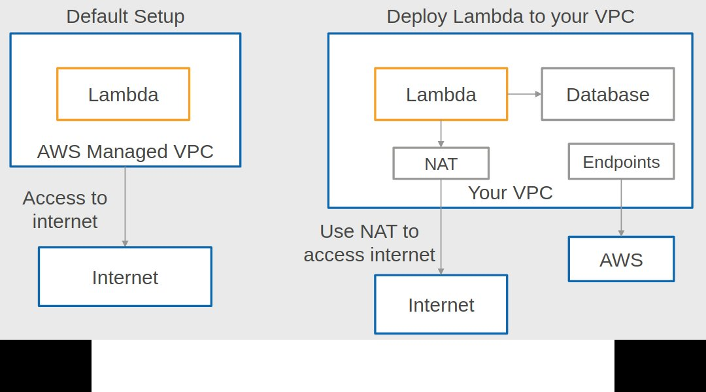

Synchronous Invocation:
1. Caller waits for function execution to complete
2. Any errors are returned to the caller – invalid permission, invalid data, throttling error and more
3. Retries are handled by the caller
4. Throttling errors – caller must retry using exponential backoff strategy (increase wait time between successive retries)

Asynchronous Invocation:
1. Caller gets a success acknowledgement (that request was added to queue!)
2. Separate Lambda process reads the events and sends them to your function

Error Handling in Asynchronous execution:
1. Function error – Lambda retries two more times
2. Throttling errors – Lambda will retry for up to six hours with exponential backoff
3. Original caller is not aware of errors!
4. Optional – Store failed events in a Dead-Letter Queue
5. Optional – Store send success events to SQS, SNS, EventBridge

Lambda@Edge:
- Customize cached content without routing request to origin
- Improve security by checking for expired or invalid JWT token and redirect to login page

### Fargate <a id="Fargate"></a>

Fargate Serverless Compute for Containers

Specify CPU and Memory needed

Hourly charge for CPU and Memory

Scheduled Tasks – Pay only when the task is running

Web App - Need to pay even when there is no traffic

"Task Execution Role" - Fargate Agent uses this role to:
- Download images from private repository
- Retrieve third-party repository credentials stored in Secrets Manager
- Publish Container generated Logs to CloudWatch Logs

### API Gateway <a id="APIGateway"></a>

All the APIs created with Amazon API Gateway expose HTTPS endpoints only (does not support unencrypted endpoints).

An API can present a certificate to be authenticated by the back end

CloudFront is used as the public endpoint for API Gateway

With API Gateway, you can route requests to private resources in your VPC. Using HTTP APIs, you can
build APIs for services behind private ALBs, private NLBs, and IP-based services registered in AWS Cloud Map, such as ECS tasks

- fully managed service for publishing, maintaining, monitoring and securing APIs
- An API endpoint type refers to the hostname of the API.
- all of the APIs created with API Gateway expose HTTPS endpoints only.
- The endpoint type can be edge-optimized if you've got a global user base, regional if your user base is within a region or private if you want to provide access only within a VPC or to computers connected over a Direct Connect connection.
- API Gateway also has caching.
- you can add caching to API calls by provisioning the cache and specifying its size in gigabytes. That means you can cache the end points response.
- Caching can reduce the number of API calls to your backend and improve latency.
- Throttling with API Gateway, where you're setting a limit on the steady state rate and the burst of request submissions against the APIs in your account.
- By default, API Gateway limits to steady state requests to 10,000 requests per second and the maximum concurrent request is 5,000 across all APIs within the account. If you go over those limits, you get a 429 too many requests error message.
- if those exceptions occur, then you'll need your client application to resubmit the failed requests in a way that doesn't exceed those rate limits again.

#### API Gateway endpoints

An API endpoint type is a hostname for an API in API Gateway that is deployed to a specific region.
The hostname is of the form {api-id}.execute-api.{region}.amazonaws.com.

The API endpoint type can be:
- __edge-optimized__ for geographically distributed clients. API requests are routed to the nearest CloudFront Point of Presence (POP)
- __regional__ intended for clients in the same region. When a client running on an EC2 instance calls an API in the same region
- __private__ can only be accessed from your Amazon Virtual Private Cloud (VPC) using an interface VPC endpoint, which is an endpoint network interface (ENI) that you create in your VPC


#### Caching

You can add caching to API calls by provisioning an Amazon API Gateway cache and specifying its size in gigabytes.

API Gateway caches responses for a specific amount of time (time to live or TTL). The default TTL is 300 seconds

#### API Gateway Scaling

API Gateway sets a limit on a steady-state rate and a burst of request submissions against all APIs in your account.

By default API Gateway limits the steady-state request rate to 10,000 requests per second.
The maximum concurrent requests is 5,000 requests across all APIs within an AWS account

Default scaling up to 10,000 requests/second
• Throttle requests
• Limit requests/second by API keys
• Usage Plan based on API Keys

#### Usage plans and API keys

A usage plan specifies who can access one or more deployed API stages and methods — and how much and how fast they can access them


### Architecture Patterns

#### an application includes EC2 and RDS and spikes in traffic are causing writes to be dropped by RDS.

You can decouple EC2 and RDS with an SQS queue and you can use Lambda to process the records from the queue.

#### A web app includes a web tier and a processing tier. And it must be decoupled and the processing tier should dynamically scale based on the number of jobs.

decouple the web tier and the processing tier with an SQS queue. You can scale with auto scaling based on the queue length.

#### A Lambda function execution time has increased significantly as the payload size increased.

optimize execution time by increasing the memory available to the function. It will proportionately increase the amount of CPU available to the function as well.

#### Statistical data stored in RDS and will be accessed using a REST API. Demand will range from no traffic to sudden bursts of traffic and it's unpredictable.

create a REST API using API Gateway and integrate with a Lambda function for connecting to the RDS database.

#### A new application processes customer orders and consists of multiple decoupled tiers. Orders must be processed in the order they are received.

you need SQS with a FIFO queue to preserve the record order.

#### An app uses API Gateway and Lambda. During busy periods, many requests fail multiple times before succeeding and no errors are reported in Lambda.

The cause of this could be that the throttle limit is set too low. So, you just need to increase that and that will hopefully resolve the issue.

#### EC2 instance processes images using JavaScript code and stores the results in S3. The load is highly variable and you need a more cost-effective solution.

replace EC2 with a Lambda function.

#### An app uses an API Gateway Regional Rest API. It's just gone global and performance has suffered

in that case, they might want to convert the API to an edge-optimized API to optimize for a global user base. And then it will use the CloudFront edge network and improve latency and performance.

#### A legacy application uses many batch scripts that process data and pass on to the next script. And it's complex and difficult to maintain.

Use Lambda functions along with step functions for coordinating and orchestrating the application.

#### Objects uploaded to an S3 bucket must be processed by Lambda.

For this, you can create an event source notification to notify Lambda to process the new objects.

#### Your application has a Lambda function that needs access to both internet services and a database hosted in private subnet of your VPC.  What steps are needed to accomplish this?
Lambda functions, by default, are allowed access to internet resources. 
To access databases and other resources in your VPC, you need to configure Lambda function to run inside the context of a private subnet in your VPC. 
When this is done: your lambda function gets a private IP address and can reach resources in your VPC. 
In this mode, it can access internet services only if private subnet has a route to a NAT device

#### You are writing a mini-web server that would listen on the configured port to process requests from users. The code you have is straightforward, and you observe that it can fit nicely as a lambda function. Which of these options would you pick?

AWS Lambda blocks inbound network connections. 
You would need to use a service like API Gateway to receive the requests and configure API Gateway to invoke the appropriate Lambda function

#### A Lambda function is triggered whenever objects are added to the S3 bucket. Function needs to read the object and store the meta-data about the object in a DynamoDB table. What permissions are needed for this scenario?

S3 needs permission to invoke Lambda function; Lambda function needs permission to read S3 Objects and to put items in the DynamoDB table

#### An S3 bucket is configured to invoke the Lambda function whenever a new object is added to the bucket. The Lambda function transforms the object and uploads the transformed object to the same bucket. Would you approve of this solution?

No. This solution can unintentionally create an infinite loop and accumulate massive charges to your account.

#### Your Lambda function needs access to a private web end point available in your VPC.  What steps do you need to enable such an access?

Configure Lambda to run inside a private subnet of your VPC. Lambda function can only access private resources inside your VPC when you configure it to run inside your VPC. You need to specify the VPC, private subnets, and Security group as part of the Lambda configuration

#### Your application services are used by several third parties. To ensure quality of service for all customers and to prevent a single customer from consuming all the resources, you want to enforce limits on maximum requests per second that can be made by a single customer.

API Gateway can act as a single point for your third parties to integrate with your services. API Gateway allows to throttle requests at specific method level and manage individual API Keys. It also allows you to cache the responses so that API Gateway can directly answer certain method calls without invoking your backend services for every request. You can configure your API methods to require authorization can support IAM based control, third party identity providers, custom authorizers and so forth.

#### Your Lambda function subscribes to an SNS topic, and the Lambda function is invoked asynchronously when a message arrives for that topic. When there is an error while processing a message, you want to ensure that the message is available for your team to troubleshoot. What configuration can you use for this?

Configure Dead Letter Queue for Lambda function

Using Dead Letter configuration, you can direct Lambda to send unprocessed events to SQS queue or SNS topic. This can be used for troubleshooting events that were unsuccessful. While you can catch errors in a Lambda function and push the events to SQS queue, Lambda does it automatically for you using Dead Letter config. SNS Topic itself does not have dead letter configuration. SQS has a dead letter option to move messages that were not processed after specified number of retries


## Database <a id="Database"></a>

Different options:
- We can use a database on EC2. We might do that if we need full control over the instance in the database or maybe the third party database engine is not available on RDS.
- RDS is where we need a traditional relational database.
- DynamoDB is a NoSQL database, it gives you in-memory performance, and is useful for where your I/O needs are very high. It also offers dynamic scaling.
- Redshift is more for data warehouses for large volumes of aggregated data.
- ElastiCache is for temporary storage for small amounts of data. It's also in-memory.
- EMR is used for running analytics workloads using Hadoop.

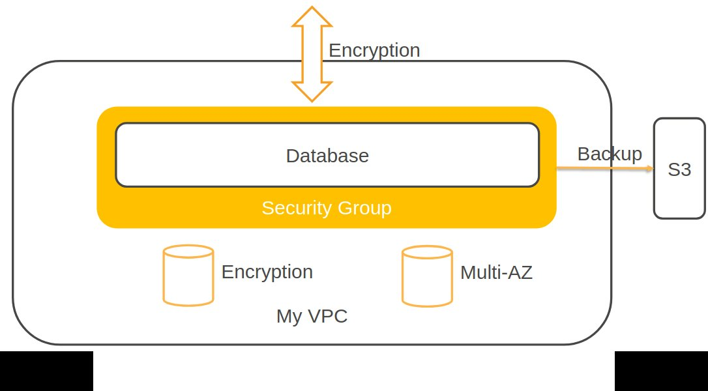

### RDS <a id="RDS"></a>

- RDS uses instances, so you have to choose the instance family and type.
- It's a relational database, so it uses SQL.
- RDS is an online transaction processing type of database.
- It's easy to set up, highly available, fault tolerant, and scalable.
- Can encrypt your RDS instances and your snapshots at rest by enabling the encryption option. And you do that when you create the database. Encryption uses KMS keys.
- supports the following engines, SQL, Oracle, MySQL, Postgres, and Aurora and also MariaDB.
- scales up by increasing the instance size for compute and storage.
- Read replicas are an option for read heavy workloads and that scaling out your reads.
- Disaster recovery with the Multi-AZ option.

Multi-AZ versus read replica

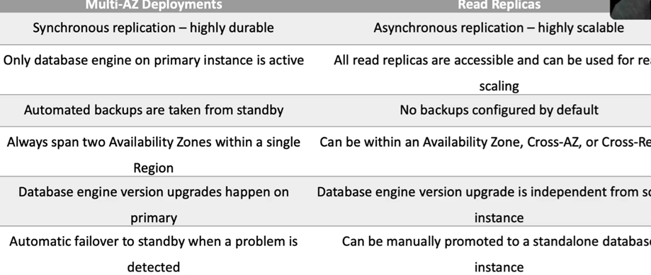

Push-button scaling, replication, and redundancy

You cannot have an encrypted Read Replica of an unencrypted DB instance or an unencrypted Read Replica of an encrypted DB instance

RDS supports SSL encryption between applications and RDS DB instances. RDS generates a certificate for the instance.

Enable db encryption without data loss: create snapshot -> encrypted snapshot of db -> encrypted rds db -> DMS to synchronize data

For __multi-AZ__ high availability, RDS uses __synchronous__ replication between primary and standby systems.
If standby is slow, transactions will take longer to complete. 
After failover, DNS is updated to point to new primary

__RDS Read Replica__ on the other hand uses __asynchronous__ replication and any slowness in Read Replica instance would simply cause data lag in the read - replica.
Transactions in primary is not impacted

RDS Maintenance Windows:
- Operating system and database patching can require taking that database offline,
- those tasks take place during a maintenance window
- by default, a weekly maintenance window is configured, but you can choose your own.

#### RDS Security

- __encryption at rest__ can be enabled, and that includes the database storage, backups, read replicas and snapshots.
- You can only enable it when you create the instance, not afterwards.
- DB instances that are encrypted can't be modified to disable encryption,
- it uses AES 256 encryption, which is transparent with minimal performance impacts.
- Oracle and SQL, they also support transparent data encryption, which may have a performance impact.
- __KMS__ is used for managing encryption keys.
- You can't have an encrypted read replica of an unencrypted DB instance or an unencrypted read replica of an encrypted DB instance.
- Read replicas of encrypted primary instances are encrypted and the same KMS key is used if in the same region as the primary, or if it's in a different region, a different KMS key is used.
- You can't restore an unencrypted backup or snapshot to an encrypted DB instance.

Recomendations:
- Deploy RDS in __Private Subnet__ (unless your requirement is a publicly accessible RDS instance)
- __Configure RDS Security Group__ to allow access from Web Server or Application Server Security Groups
- Assign a __subnet in all Availability Zones__ to the DB Subnet Group

#### RDS backups are snapshots

Automated backups and patching are applied in customer- defined maintenance windows.

By default, Amazon RDS creates and saves automated backups of your DB instance securely in Amazon S3 for a user-specified retention period. 

Automated Backups:
- they backup the __entire DB instance, not just individual databases__.
- backup occurs during a daily user-configurable 30 minute period known as the backup window
- For __single AZ DB instances, there's a brief suspension in I/O__.
- For __multi-AZ SQL, I/O activity is briefly suspended on the primary__.
- backup your databases and transaction logs
- You can restore your DB instance to any specific time during the backup retention period, creating a new DB instance
- The first snapshot of a DB instance contains the data for the full database. Subsequent snapshots of the same database are incremental, which means that only the data that has changed after your most recent snapshot is saved.
- In addition to the daily automated backup, RDS archives database change logs. This __enables recovery of the database to any point in time during__ the backup retention period, __up to the last five minutes__ of database usage

In addition, you can create snapshots, which are user-initiated backups of your instance that are kept until you explicitly delete them. 

Snapshots:
- For Multi-AZ, MariaDB, MySQL, Oracle, and Postgres, the snapshot gets taken from the standby.
- Snapshots do not expire. There's no retention period.
- you can share a manual DB snapshot or DB cluster snapshot with other AWS accounts.

#### RDS Scaling

You can only scale RDS up (compute and storage).
You cannot decrease the allocated storage for an RDS instance.
You can scale storage and change the storage type for all DB engines except MS SQL.

RDS now supports Storage Auto Scaling

Scaling compute will cause downtime.

#### Multi-AZ and Read Replicas

Multi-AZ:
- Multi-AZ RDS creates a __standby replica__ in another AZ and synchronously replicates to it (DR only)
- During failover RDS automatically updates configuration (including DNS endpoint) to use the second node.
- It is recommended to implement DB connection retries in your application
- The secondary DB in a multi-AZ configuration cannot be used as an independent read node (read or write).

Read Replica Support for Multi-AZ:
- Amazon RDS Read Replicas for MySQL, MariaDB, PostgreSQL, and Oracle support Multi-AZ deployments
- A Read Replica in a different region than the source database can be used as a standby database and promoted

Read Replicas:
- Read replicas are used for read-heavy DBs and replication is __asynchronous__.
- Read replicas provide read-only DR.
- Read replicas are created from a snapshot of the master instance.
- Read replicas are available for MySQL, PostgreSQL, MariaDB, Oracle, Aurora, and SQL Server.
- In a multi-AZ failover the read replicas are switched to the new primary.

#### Aurora <a id="Aurora"></a>

Separation of compute and storage

Storage Subsystem that automatically maintains __6 copies__ of data across __3 availability zones__

- This is an AWS database offering in the RDS family.
- Aurora is a MySQL and Postgres compatible relational database built for the cloud.
- Aurora is __up to 5 times faster than standard MySQL and 3 times faster than Postgres__.
- Aurora features a distributed fault tolerant, self-healing storage system that scales up to 128 terabytes per database instance.
- key features of Aurora:
  - Gives you high performance self-healing storage up to 128 terabytes.
  - Point-in-time recovery and continuous back up to S3
  - compatible with MySQL and Postgres databases.
  - in-region read scaling __failover target with up to 15 Aurora replicas__
  - __cross-region scaling with failover targets with MySQL replicas__.
  - Global database is a cross-region cluster with read scaling and it gives you fast replication and low latency reads. And you can remove the secondary and promote it if you need to.
  - __Multi-master scales out writes within a region__
  - __serverless__ is an on-demand auto scaling configuration for Aurora. Does not support read replicas or public IPs.

Aurora endpoints:
- Cluster endpoint: Points to Current Primary Instance
- Reader endpoint: Points to Read Replicas
- Instance endpoint: Points to Individual Aurora Instance


When should you not use RDS?
- Any time you have a DB type other than the supported database engines.
- you need root access to the operating system. You won't be able to do that on RDS.
- for large binary objects, S3,
- automated scalability, name/value data structures or data that's not well structured or is unpredictable. Those would be better on DynamoDB.

2 copies of data are kept in each AZ with a minimum of 3 AZʼs (6 copies)

Can handle the loss of up to two copies of data without affecting DB write availability and up to three copies without affecting read availability.

Aurora Auto Scaling enables your Aurora DB cluster to handle sudden increases in connectivity or workload.
Aurora Auto Scaling dynamically adjusts the number of Aurora Replicas (reader DB instances) provisioned for an Aurora DB cluster.
Aurora Auto Scaling enables your Aurora DB cluster to handle sudden increases in connectivity or workload.
When the connectivity or workload decreases, Aurora Auto Scaling removes unnecessary Aurora Replicas so that you don't pay for unused provisioned DB instances.
The scaling policy defines the minimum and maximum number of Aurora Replicas that Aurora Auto Scaling can manage

Amazon Auroraʼs backup capability enables point-in-time recovery for your instance.
Allows you to restore your database to any second during your retention period

Aurora Replicas:
- __Aurora Replica__
  - up to 15 replicas
  - in-region
  - automated failover
  - asynchronous
- __MySQL Replica__
  - up to 5 replicas
  - cross-region
  - manual failover
  - asynchronous

Cross-Region Read Replicas:
- available ONLY for __Amazon Aurora with MySQL compatibility__


##### Aurora global databases:

An __Aurora global database__ consists of a:
- __primary Aurora DB cluster__ in one AWS Region, where your data is __written__,
- up to 5 __read-only secondary DB clusters__ in up to five other AWS Regions.

You issue __write__ operations directly to the __primary__ DB cluster in the primary AWS Region.
Aurora replicates data to the secondary AWS Regions using dedicated infrastructure, with latency typically under 1 second.

A database in a secondary region can be __promoted to full read/write__ capabilities in less than 1 minute

##### Multi-Master

Amazon Aurora Multi-Master is a feature of the __Aurora MySQL-compatible__ edition that adds the ability to
__scale out write performance__ across multiple Availability Zones, allowing applications to direct read/write workloads to multiple
instances in a database cluster and operate with higher availability.

designed to achieve high availability and __ACID transactions across a cluster of database nodes__ with configurable __read after write consistency__

##### Aurora Serverless

On-demand, auto-scaling configuration for Amazon Aurora.

Available for MySQL-compatible and PostgreSQL-compatible editions.

You only pay for database storage and the database capacity and I/O your database consumes while it is active. Pay on a per-second basis for the database capacity you use when the database is active.

Storage and Processing are separate – scale down to zero processing and pay only for storage

Automatic Pause and Resume – Configurable period of inactivity after which DB Cluster is Paused

Rapid scaling: uses a pool of warm resources

#### Migrate database from datacenter to RDS using DMS

Use the AWS __Database Migration Service__ (AWS DMS), which allows you to transfer data between on-premises databases and cloud-based RDS instances with minimal downtime

steps involved in migrating a database to RDS using AWS DMS:
- Create AWS resources
- Configure source database
- Create replication instance in DMS
- Set up data providers
- Create migration project
- Perform schema conversion (if needed)
- Start migration
- Test and switch over

#### Migrate database from RDS without DMS

- Take a full backup of the database on the on-premises DB instance.
- Upload the backup file to Amazon S3.
- Download the backup file from S3 to your RDS Custom for SQL Server DB instance.
- Restore a database using the downloaded backup file on the RDS Custom for SQL Server DB instance.


### ElastiCache <a id="ElastiCache"></a>

- fully managed implementation of Redis and Memcached.
- It's a key value store
- an in-memory database with great performance and low latency.
- You can put it in front of databases such as RDS and DynamoDB.
- nodes run on EC2 instances,


Push-button scalability for memory, writes and reads.

ElastiCache EC2 nodes cannot be accessed from the Internet, nor can they be accessed by EC2 instances in other VPCs.

Memcached:
- Does not support multi-AZ failover or replication.
- Does not support snapshots.
- You can place nodes in different AZs.
- multi-threaded
- no HA (replication)

Redis:
- Supports master / slave replication and multi-AZ for cross-AZ redundancy
- Supports automatic and manual snapshots (S3)
- Data is persistent and it can be used as a datastore.
- Redis is not multi-threaded
- Supports more complex data structures: sorted sets and lists.
- Replication from the primary node is asynchronous

Multi-AZ failover:
- ElastiCache automatically promotes the replica that has the lowest replica lag
 
### DynamoDB <a id="DynamoDB"></a>

- It's a fully managed NoSQL database service.
- It's a key value store and a document store.
- It's fully serverless and you get push button scaling.
- you can achieve ACID compliance with DynamoDB transactions.
- Data is synchronously replicated across three facilities in a region.
- DynamoDB is schema-less.
- it can be used for storing session state data.
- It provides two read models, eventually consistent reads and strongly consistent reads.
- two pricing models:
  - on-demand capacity where DynamoDB charges you for the data reads and writes your application actually performs.
  - Provisioned capacity mode means that you specify the number of reads and writes, and you'll pay whenever it's used or not.
- We can define a TTL, so the items in our table will expire after a period of time.
- key features a DynamoDB:
  - It's serverless, fully managed, and fault tolerant.
  - It's highly available with great availability, even better with global tables.
  - It's a NoSQL type of database with a name/value structure, so good when you need a flexible schema.
  - It gives you horizontal scaling with push button scaling and auto-scaling options.
  - Transaction options are strongly consistent or eventually consistent reads as well as support for ACID transactions.
  - Backup is point in time recovery down to the last second in the last 35 days
  - on-demand backup and restore as well.
  - Global Tables is a multi-region multi-master solution.
- Point-in-Time Recovery – Automated Continuous Backup (35 days retention)
- On-Demand Backup/Snapshot for long term retention
- Automatic deletion of expired items – Time To Live
- Limits - Item size cannot exceed 400 KB

DynamoDB streams:
- captures a time mode sequence of item level modifications in your table,
- stores them in a log file for up to 24 hours,
- you can process that data.
- you can configure what data is actually written. Keys only, new image, old image, or new and old images.
      
DynamoDB Accelerator:
- fully managed in-memory cache for DynamoDB,
- will reduce latency from milliseconds to microseconds.
- can be both a read-through cache and a write-through cache.
- DAX is updated only if DynamoDB is successfully updated first.
- you don't need to modify any application logic, DAX is fully compatible with the DynamoDB APIs.

Data is synchronously __replicated across 3 AZs in a region__

Multi-AZ redundancy and Cross-Region Replication option.

DynamoDB stores and retrieves data based on a __Primary key__. There are 2 types of primary key:
- __Partition key__ - unique attribute. Value of the Partition key is input to an internal hash function which determines the partition or physical location on which the data is stored
- __Composite key__ - combination of __primary key and sort key__. All items with the same Partition key are stored together, then sorted according to the Sort key value.

If your access pattern exceeds 3000 RCU or 1000 WCU for a single partition key value, your requests might be throttled.

DynamoDB supports:
- __eventually consistent reads__: When you read data from a DynamoDB table, the response might not reflect the results of a recently completed write
- __strongly consistent reads__: response with the most up-to-date data, reflecting the updates from all prior write operations that were successful
  - may have higher latency than eventually consistent reads.
  - are not supported on global secondary indexes.
  - use more throughput capacity than eventually consistent reads.

#### DynamoDB Transactions

Transactions provide atomicity, consistency, isolation, and durability (ACID) in DynamoDB.

Enables reading and writing of __multiple items across multiple tables__ as an all or nothing operation

Example:

```
    Collection<TransactWriteItem> actions = Arrays.asList(
        new TransactWriteItem().withConditionCheck(checkCustomerValid),
        new TransactWriteItem().withUpdate(markItemSold),
        new TransactWriteItem().withPut(createOrder));

    TransactWriteItemsRequest placeOrderTransaction = new TransactWriteItemsRequest()
        .withTransactItems(actions)
        .withReturnConsumedCapacity(ReturnConsumedCapacity.TOTAL);

    // Run the transaction and process the result.
    try {
        client.transactWriteItems(placeOrderTransaction);
        System.out.println("Transaction Successful");

    } catch (ResourceNotFoundException rnf) {
        System.err.println("One of the table involved in the transaction is not found" + rnf.getMessage());
    } catch (InternalServerErrorException ise) {
        System.err.println("Internal Server Error" + ise.getMessage());
    } catch (TransactionCanceledException tce) {
        System.out.println("Transaction Canceled " + tce.getMessage());
    }
```

#### Scan and Query API calls

Scan:
- returns one or more items and item attributes by accessing every item in a table or a secondary index.
- reads up to the maximum number of items set (if using the Limit parameter) or a maximum of 1 MB.
- A filter expression is applied after a Scan finishes but before the results are returned

Query:
- finds items in your table based on the primary key attribute and a distinct value to search for.
- You can use an optional sort key name and value to refine the results.
- Results are always sorted by the sort key

#### Indexes

An index is a data structure which allows you to perform fast queries on specific columns in a table.

You select columns that you want included in the index and run your searches on the index instead of the entire dataset.

2 types of indexes:
- Local Secondary Index
  - alternative sort key to use for scans and queries.
  - You can have up to five LSIs per table.
  - The sort key consists of exactly one scalar attribute
  - must be created at table creation time
  - benefit of an LSI is that you can query on additional values in the table other than the partition key / sort key
- Global Secondary Index
  - You can create when you create your table or at any time later.
  - A GSI has a different partition key as well as a different sort key

#### Global Tables

Provide a fully managed solution for deploying a __multi-region__, __multi-master__ database.

Global tables provide automatic multi-master replication to AWS regions world-wide

A __global table__ is a collection of one or more __replica tables__, all owned by a single AWS account.

Each replica table stores the same set of data items.

An application can read and write data to any replica table.
If your application only uses eventually consistent reads, and only issues reads against one AWS region, then it will work without any modification.

If your application requires strongly consistent reads, then it must perform all its strongly consistent reads and writes in the same region. DynamoDB does not support
strongly consistent reads across AWS regions.

Conflicts can arise if applications update the same item in different Regions at about the same time. To help ensure eventual consistency, DynamoDB global tables use a “last writer wins” method to reconcile between concurrent updates.


### Redshift <a id="Redshift"></a>

- This is a SQL-based data warehouse used for analytics.
- You get to analyze data using standard SQL and business intelligence tools.
- it's a relational database used for OLAP use cases.
- Redshift uses EC2 instances, so you have to choose the instance family and type.
- it always keeps free copies of your data and provides continuous and incremental backups.
- Use cases are where you need to perform complex queries or massive collections of structured and semi structured data with great performance, frequently access data that needs a consistent, highly structured format.
- You can use Spectrum for direct access of S3 objects in a data lake.
- it's a managed data warehouse solution with automated provisioning, configuration and patching, data durability with continuous backup to S3 and it scales with simple API calls.
- It also offers exabyte scale query capability.

Option to query directly from data __files on S3 via Amazon RedShift Spectrum__

Amazon RedShift can store huge amounts of data but __cannot ingest huge amounts of data in real time__.

Only available in one AZ but you can restore snapshots into another AZ.
Alternatively, you can run data warehouse clusters in multiple AZʼs by loading data into two Amazon RedShift data warehouse clusters in separate AZs from the same set of Amazon S3 input files.

Amazon RedShift does not support Multi-AZ deployments.

Amazon RedShift always keeps three copies of your data:
- The original.
- A replica of compute nodes (within the cluster).
- A backup copy on S3.

### Architectural Patterns

#### Each Read Capacity Unit provisioned in a DynamoDB table translates to

A unit of Read Capacity enables you to perform one strongly consistent read per second or two eventually consistent reads per second. 
Each read can transfer up to 4KB.
Each Read Capacity Unit provisioned in a DynamoDB table translates to one strongly consistent read per second or two eventually consistent reads per second

#### An organization has several RDS databases, DynamoDB tables, and EFS file shares. The data needs to be backed up automatically, and a copy must be maintained in the disaster recovery region. Which solution would you use?

Use AWS Backup to set up backup policies, automate the process, and maintain a copy in the DR site

We can centrally manage the backup policies and automate the process using the AWS Backup service. In addition, AWS Backup can also maintain a copy of the backup in a disaster recovery region.

AWS Backup is a fully-managed service that makes it easy to centralize and automate data protection across AWS services, in the cloud, and on premises. Using this service, you can configure backup policies and monitor activity for your AWS resources in one place.

#### You have configured an Aurora database with five read replicas.  What is the recommended mechanism for clients to connect to read replicas?

Use Aurora database reader endpoint.

If there is more than one Aurora Replica, the reader endpoint directs each connection request to one of the Aurora Replicas.

#### Your RDS instance was upgraded to most current major and minor database version. Legal requirement calls for a 10 year retention of your database backups and some of the backup were created on database versions that are no longer supported by RDS. What will happen when you restore an unsupported database version?

Older version when restored from snapshot will be automatically upgraded to currently supported database engine version

#### In a multi-AZ RDS Deployment, automatic failover will not happen under this condition

Primary Instance Deadlock and Query Timeouts

#### Your DynamoDB application stores and retrieves Items that are 8KB in size. The application reads 10 items per second in eventually consistent mode The application also writes 10 items per second. How much capacity would you need to provision?

10 Read Capacity Units and 80 Write capacity units

- A read capacity unit represents one strongly consistent read per second, or two eventually consistent reads per second, for an item up to 4 KB in size.  Item size is rounded to the next 4KB boundary.  
- A write capacity unit represents one write per second, for an item up to 1 KB in size.  Item size is rounded to the next 1KB boundary.

####  A DynamoDB table is provisioned with 20 Read Units and 20 Write Units. If items are 4KB in size, what is the net throughput that can be achieved?

A read capacity unit represents one strongly consistent read per second, or two eventually consistent reads per second, for an item up to 4 KB in size. Item size is rounded to the next 4KB boundary. For example: if item size is 4.5KB, DynamoDB would round it to 8KB for Read Capacity Unit calculation. A write capacity unit represents one write per second, for an item up to 1 KB in size. Item size is rounded to the next 1KB boundary. For example: if item size is 4.5KB, DynamoDB would round it to 5KB for Write Capacity Unit calculation


## Analytics <a id="Analytics"></a>

### EMR <a id="EMR"></a>
- is a managed cluster platform that runs Apache Hadoop and Apache Spark.
- Its use for processing data for analytics and business intelligence.
- you can transform and move large amounts of data.
- performs ETL functions.

### Amazon Kinesis <a id="Kinesis"></a>

Kinesis is a collection of services for processing streams of various data

Data is processed in “shards” – with each shard able to ingest 1000 records per second. One shard provides a capacity of 1MB/sec data input and 2MB/sec data output

A record consists of a partition key, sequence number, and data blob (up to 1 MB)

Transient data store – default retention of 24 hours but can be configured for up to 7 days

#### Kinesis Data Streams <a id="KinesisDataStreams"></a>

Records are organized in partitions (shards).

Throughput per shard 1 MB/sec (for ingestion) and 2 MB/sec (for reading).

Increase throughput by adding additional shards

Records with same partition key are added to same shard. 
All records for a sensor are available in a single shard.
Records are ordered by arrival time.

- enables you to build custom applications that process or analyze streaming data for specialized needs.
- enables real time processing of streaming big data.
- can move data off data producers and then process that data.
- Producers send data to Kinesis and it's stored in shards for __24 hours__, and that's the default, up to seven days.
- Consumers then take the data and process it, and they can save it to another service.
- allows for the later processing by applications rather than with Firehose where it delivers the data directly to an AWS service.
- Kinesis data streams is real time with around 200 milliseconds of delay.
- The Client Library helps you consume and process data from the Kinesis Stream, and each shard is processed by exactly one KCL worker and has one corresponding record processor.
- One worker can process any number of shards, so it's fine if the number of shards exceeds the number of instances.
- A __shard is the base throughput unit__ of an Amazon Kinesis data stream.
- A __stream__ is composed of one or more shards
- __stores data__ for later processing by applications (__key difference with Firehose__ which delivers data directly to AWS services)
- Producers continually push data to Kinesis Data Streams.
- Kinesis Streams __applications are consumers that run on EC2 instances__.
- Kinesis Data Streams replicates synchronously across three AZs
- AWS now supports update-shard-count API – automatically adjusts the number of shards

#### Kinesis Data Firehose <a id="KinesisFirehose"></a>

- No need to worry about shards and streams
- __captures, transforms, and load streaming data__.
- __Producers send the data to a Firehose, there are no shards, it's completely automated__, so scalability is elastic unlike data streams where you have to add shards.
- __Firehose data is sent to another service for storing and data can be optionally processed and transformed using Lambda__.
- It enables near real time analytics.
- it's near real time, so around 60 seconds of latency.
- Firehose destinations include Redshift, ElasticSearch, Amazon S3, Splunk, Datadog, MongoDB, and New Relic, as well as an HTTP endpoint.
- easiest way to load streaming data into data stores and analytics tools.
- Captures, transforms, and loads streaming data. It can also batch, compress, and encrypt.
- Kinesis Data Streams can be used as the source(s) to Kinesis Data Firehose
- No shards, totally automated

#### Kinesis data analytics <a id="KinesisDataAnalytics"></a>

- easiest way to process and analyze real-time, streaming data.
- you get __real time SQL processing for streaming data__.
- It provides __analytics for data coming from data streams or data firehose__.
- Destinations can be data streams, data firehose or lambda.
- you can quickly author and run powerful __SQL__ code against those streaming sources.
- It can ingest data from both streams and firehose.
- A Kinesis Data Analytics application consists of three components:
  - Input – the streaming source for your application.
  - Application code – a series of SQL statements that process input and produce output.
  - Output – one or more in-application streams to hold intermediate results.

### Amazon Athena <a id="Athena"></a>

- is used for querying data in S3 using SQL.
- you can connect it to other data sources with Lambda.
- Data can be in various formats.
- uses a managed data catalog, AWS Glue to store information and schemas about the databases and tables.
- How do you optimize Athena for performance:
  - partition your data,
  - bucket your data, so bucket the data within a single partition.
  - Use compression. AWS recommend using Apache Parquet or Apache ORC.
  - Optimize file sizes.
  - Optimize columnar data storage generation
  - Optimize order buy and optimized group buy,
  - use approximate functions
  - only include the columns that you actually need.

### AWS Glue <a id="Glue"></a>

- is a fully managed extract, transform, and load service used for preparing data for analytics.
- It runs the ETL jobs on a fully managed scale-out Apache Spark environment.
- Glue discovers data and stores the associated metadata in the Glue data catalog
- it works with data lake, so data on S3, data warehouses like Redshift, and data stores, including on RDS and EC2.
- You can use a crawler to populate the Glue data catalog with tables.
- the crawler can crawl multiple data stores in a single run.
- Upon completion, the crawler creates or updates one or more tables in your data catalog.
- ETL jobs that you define in Glue use the data catalog tables as sources and targets.


### Architecture Patterns

#### relational database running on MySQL must be migrated to AWS and must be highly available.

use RDS MySQL and Configure a Multi-AZ standby node for high availability.

#### An RDS DB has high query traffic that's causing performance degradation.

that's great for a read replica, and you must configure the application to use the reader endpoint for any database queries.

#### An RDS DB is approaching its storage capacity limits and or is suffering from high write latency.

you have to scale up the DB instance to an instance type that has more storage and CPU.
So that means changing the instance type rather than adding a read replica.

#### And RDS database is unencrypted and you need a cross-region read replica, which must be encrypted.

create an encrypted snapshot of the main DB, create a new encrypted DB instance from the encrypted snapshot and then create an encrypted cross-region read replica.

#### Amazon Aurora DB deployed and requires a cross region replica.

use the Aurora MySQL replica type in the second region.

#### Aurora DB is deployed and requires a read replica in the same region with minimal synchronization latency.

use an aurora replica rather than a MySQL replica. And it could be in a different availability zone. And that will help your paycheck.

#### Aurora is deployed and an app in another region requires read only access with low latency. Synchronization latency must also be minimized.

use the Aurora global database and configure the app in the second region to use the reader endpoint, and that will help with the latency issues.

#### An application in DB migrated to Aurora and requires the ability to write to the DB across multiple nodes.

use Aurora Multi-Master for an in-region multi-master database.

#### An application requires a session state data store that provides low latency.

either ElastiCache or DynamoDB.

#### A multi-threaded in-memory datastore is required for unstructured data.

use ElastiCache with Memcached and that would be needed for the multi-threaded application, you wouldn't be able to use Redis.

#### An in-memory datastore required that offers microsecond performance for unstructured data.

use DynamoDB DAX, the DynamoDB Accelerator.

#### An in-memory datastore is required that supports data persistence and high availability.

use ElastiCache and you would need to use the Redis engine.

#### A serverless database is required that supports a NoSQL key value store workload.

Use Amazon DynamoDB.

#### A serverless database is required that supports MySQL or PostgreSQL.

use Amazon Aurora Serverless.

#### A relational database is required for a workload with an unknown usage pattern.

usage is expected to be low and variable., that would be Aurora Serverless

#### An application requires a key value database that can be written to from multiple regions.

DynamoDB Global Tables would be a good solution.

#### Amazon Athena is being used to analyze a large volume of data based on date ranges, and the performance must be optimized.

you can store data using Apache Hive partitioning with a key based on the data. And you can use Apache Parquet and ORC storage formats.

#### Lambda is processing streaming data from API Gateway and it's generating a too many requests exception as the volume increases.

stream the data into Kinesis data stream from API Gateway and then process it in batches.

#### A Lambda function is processing streaming data that must be analyzed with SQL.

load the data into a Kinesis data stream and then analyze it with Kinesis Data Analytics to get that SQL analysis.

#### Security logs generated by the AWS web application firewall must be sent to a third party auditing application.

send the logs to Kinesis Data Firehose and configure the auditing application using an HTTP endpoint.

#### Real time streaming data must be stored for future analysis.

use Kinesis data streams for the real time streaming and then Firehose to load the data to a data store where you might want to analyze it later on.

#### A company runs several production databases and must run complex queries across consolidated datasets for business forecasting.

load the data from the OLTP databases into a Redshift data warehouse for OLAP.


## Messaging <a id="Messaging"></a>

Kinesis vs SQS vs SNS

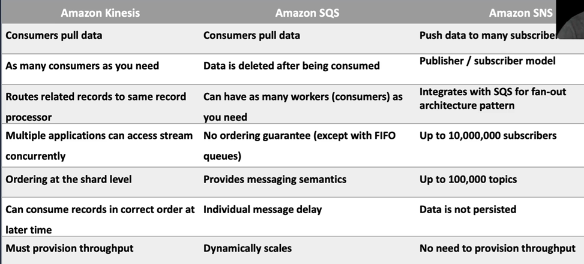
 
SNS, SQS: Redundant copies of a message are stored across multiple AZs

|                     | SQS                        | SNS, Event Bridge              | Kinesis Data Streams
|---------------------|----------------------------|--------------------------------|-----------------------------
| Poll or Push        | Polling                    | Push notification              | Polling
| Message Processing  | Message is processed once  | broadcast to all sub. consumers| Many consumers can read ALL messages
| Retention           | Unprocessed messages can   | Immediate Delivery with retry  | Default 1 day. Extended 1 year
|                     | be kept for up to 14 days  |                                |
| Processing Time     | Visibility Timeout dictates| Consumer can take as long as   | Consumers must process
|                     | how long a consumer can    | needed (each consumer gets a   | messages by retention duration
|                     | take to process a message. | copy of a message)             |
| Strength            | Buffer messages            | Broadcast messages for         | Time ordered messages
|                     |                            | time sensitive processing      | for real-time analytics


### SQS <a id="SQS"></a>

Consumers poll the queue for any new messages.

A message is processed once and removed.

Messages are replicated in multiple AZ (handles AZ and device failures).

Multiple producers and consumers can simultaneously use the queue

Simple Queue Service (SQS)
- Highly scalable, simple to use
- Recommended for new applications on AWS

Amazon MQ
- Support for Apache ActiveMQ, RabbitMQ
- Migrate existing applications to cloud

SQS Queue Types
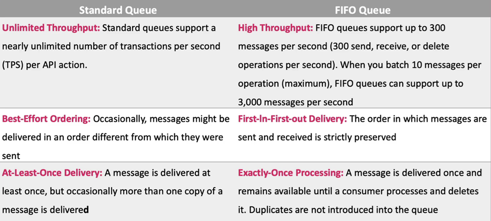


The MessageRetentionPeriod attribute in SQS allows you to set the message retention period, which is the length of time (in seconds) that Amazon SQS retains a message.

Retention: Keep unprocessed messages for up to 14 days

Encryption: At-rest encryption using server-side encryption. Use AWS managed Key or specify your customer master key. Metadata not encrypted.

Maximum message size is 256 KB

We then have a dead-letter queue. This is designed for handling message failure. It lets you set aside and isolate messages so that you can look at them later on and process them.
It's not a queue type, it's a configuration of a queue.

Long polling versus short polling:
- Long polling as a way to retrieve messages from SQS queues and it waits for messages to arrive. Long polling can lower costs. Long polling is enabled at the queue level or at the API level with the wait time seconds parameter. Long polling is in effect when the receive message wait time is a value greater than zero up to 20 seconds.
- Short polling returns immediately even if the queue is empty. So that can turn out more expensive from an API cost perspective.

#### Standard Queue

- Multiple messages and multiple consumers
- Messages are processed concurrently
- Message arrival order and processing order is different in a standard queue

Standard Queue - Lifecycle of a message:
1. Consumer received the message and receipt handle
2. Queue locked the message and started a timer (__Visibility Timeout__)
3. Consumer processed the message before timeout expired
4. Consumer deleted the message by providing the receipt handle

Failure scenario:
1. Consumer received the message along with receipt handle
2. Queue locked the message and started a timer (Visibility Timeout)
3. Consumer crashed
4. Queue waited until message visibility timeout expired
5. Message not deleted
6. Queue unlocked the message and assigns to next consumer

Visibility Timeout:
- Visibility timeout used for handling failures
- Default timeout is 30 seconds, maximum is 12 hours
- Queue level configuration
- Consumer can increase timeout for a specific message

#### FIFO Queue

__FIFO queue__:
- strict ordering of messages
- require the __message group ID__ and __message deduplication ID__ parameters to be added to messages.
- The message group ID: is a tag that indicates that a message belongs to a certain group.
- The deduplication ID is used for deduplication of messages within a specific interval.

FIFO Queue - Lifecycle of a message:
1. Consumer receives the message and receipt handle
2. Queue locks the __message group__ and starts a timer for the message(__Visibility Timeout__)
3. Consumer processes the message before timer expires
4. Consumer deletes the message by providing the receipt handle
5. Queue unlocks the message group
6. Another consumer can now receive the message

Failure Scenario:
1. Consumer crashed
2. FIFO Queue waits for visibility timeout to expire
3. FIFO Queue unlocks the message group
4. Assigns the first message to the next consumer

Less throughput when compared to Standard queue
- 300 messages per second
- 3000 messages per second (with batching)

### SNS <a id="SNS"></a>

Broadcast a message to many consumers.

Push notification and Event Driven Architecture

- When you publish a message to a topic, SNS sends the message to every subscribed queue.
- is a highly available, durable, secure, fully managed publisher/subscriber messaging service.
- it provides topics for high throughput, push-based, many-to-many messaging.
- can fan out messages to a large number of subscriber endpoints. And those include SQS queues Lambda functions, HTTP or HTTPS webhooks, mobile push, and SMS, and also, of course, email.
- Multiple recipients can be grouped using topics. And that's essentially an access point that allows the recipients to subscribe to get the same copy of a message.
- One topic can support deliveries to __multiple endpoint__ types
- simple APIs and easy integration with applications is available with SNS.
- you get flexible message delivery over multiple transport protocols.
- Publishers and consumers __can dynamically change__
- SNS decouples publishers and consumers
- SNS has __automatic retry__ if subscriber is not online
- __Filtering__: Use filtering to deliver messages to the correct subscriber

SNS plus SQS:
- fan out is where you subscribe one or more SQS queue to an SNS topic. 
- SQS Queue to hold the message until consumer is ready to consume
- Handles scenario where consumer is down possibly for an extended period

SNS Topic Types:
- Standard Topic: Out of order and duplicate messages possible
- FIFO Topic: Preserves order of messages Message group and deduplication (similar to SQS FIFO)

### Step Functions <a id="StepFunctions"></a>

- allows you to build distributed applications as a series of steps
- in a visual workflow, so it's an orchestration service.
- You can run state machines to execute the steps of your application,
- it's a managed workflow and orchestration platform, scalable and highly available
- you get to define your app as what's called a state machine.
- You create the tasks, sequential steps, parallel steps, branching paths, or timers.

### Event Bridge <a id="EventBridge"></a>

- This is a serverless event bus for building event-driven applications.
- Events are generated by custom applications, SAS applications, or AWS services
- an event is a signal that a systems state has changed.
- it routes events to AWS service targets and API destinations via HTTP endpoints.
- targets include Lambda, SNS, SQS, and API Gateway.
- 24 hours retry event delivery
- Recommended when you need to process events from AWS services (90+)
- Well defined JSON structure for events
- Schema registry
- Generate code to process events

### Architectural Patterns

#### An application polls SQS Standard Queue to process pending messages. The following parameters are specified in the ReceiveMessage call to the queue: The maximum number of messages is set to 10, and the wait time is 10 seconds. There is only one message currently available in the queue. What will be the response for a ReceiveMessage call?

Response to the ReceiveMessage request contains at least one of the available messages and up to the maximum number of messages specified in the ReceiveMessage action. 
Long polling also protects you from receiving empty responses from standard queue when small number of messages are available. 
This can happen with short polling due to distribute queue implementation. 
With short polling you have to simply repeat the request to receive message.

#### An application needs to process new objects added to S3.  The average time taken to process an object is 24 hours.  The solution also needs to handle the fault in consumers and restart the job in a different consumer. What messaging service can you use for this requirement?

Use Kinesis Data stream to store the new object details. 
Since the average processing time is 24 hours, we cannot use an SQS queue. 
The maximum visibility timeout for a message is 12 hours; so, a message cannot take longer than 12 hours to process. 
We also need to handle consumer faults. 
So, the message needs to be available until the object is fully processed. 
While SNS can push the message to the consumer, it does not handle the scenario of a consumer crashing immediately after receiving the message.

#### An enterprise uses a SaaS application to manage the ticketing process. When a ticket is created in the SaaS application, it must trigger a workflow on your AWS account.  What messaging service would you use for this requirement?

Amazon EventBridge provides native integrations with a number of SaaS platforms, giving you the ability to build rich event-driven applications without writing custom code

#### An enterprise uses an SQS queue for support tickets (Account A). An application running in a different account (Account B) needs to publish a message to the queue. How would you manage access to the queue?

For cross-account access to work, both the resource owner and application owner needs to permit the access. 
Queue owner can grant access using resource-based policy and then application owner needs to delegate the permission to the application (using IAM role policy permission). 
Another option is to create an IAM role in queue owner account and add Account B as the trusted entity. 
Account B can now delegate AssumeRole permission to the application. 
PrivateLink is used for keeping the communication inside the AWS network. It does not address the permission issue asked in this question.

#### An SNS Topic needs to fanout message to a Lambda function and Kinesis Firehose. However, messages are not delivered to the subscribers. How will you troubleshoot this issue?

Topic logs all delivery failures to Delivery Status Log. 
As part of shared responsibility, the customer has to enable delivery status logging for supported subscriber protocols. 
Dead Letter Queue is useful to hold undelivered messages. 
However, to determine the root cause of message delivery failure, we need to look into delivery status logs. 
CloudWatch will report metrics, but metric alone is not sufficient to pinpoint the failure root-cause.

#### An application publishes records to a Kinesis Firehose. The Firehose then delivers the messages to Elasticsearch. How will you manage access for this scenario?

Kinesis does not support resource-based policies. 
You can grant permission to the application using an identity-based policy (assigned to IAM Role, User, or Groups). 
Firehose relies on IAM Role to deliver messages to the destination.

#### A ticketing system needs to route tickets based on the priority to an appropriate queue. Which solution would you use to implement a priority queue?

SNS and EventBridge support flexible routing using filtering capability to deliver messages only to relevant subscribers.
Using priority as a filter criteria, topic will deliver the message to the correct queue.
The FIFO queue decides which message is processed by the consumer.
Even though tickets are grouped by priority, it is up to FIFO to decide which ticket is processed next.
Kinesis data stream with one shard for each priority level might work. 
However, we don't know which priority is in which shard. 
Consumer application has to poll all the shards and map them to the processing priority

#### You are using Simple Queue Service to hold messages, and the consumer application processes the messages on a best effort basis. If the consumer application is down for extended periods, what is the maximum message retention period in the Simple Queue Service (SQS) before a message is automatically removed?

The MessageRetentionPeriod attribute in SQS allows you to set the message retention period, which is the length of time (in seconds) that Amazon SQS retains a message. You can set this value from 60 seconds (1 minute) to 1,209,600 seconds (14 days). Messages that exceed the retention period are automatically deleted by SQS.


## Deployment and Management <a id="Depolyment"></a>

CloudFormation:
- CloudFormation deploys infrastructure using code, and that code is in JSON or YAML.
- Infrastructure is provisioned consistently with fewer mistakes or less chance of human error.
- less time and effort than configuring resources manually.
- can use version control and peer review for your CloudFormation templates, and it's free to use,
- you only pay for the resources that are provisioned.
- It can be used to manage updates and dependencies, and you can roll back and delete the entire stack as well.
- The core components:
  - templates, which are JSON or YAML text files that contain the information to build out the environment.
  - stack is then created, and that's the entire environment as described by the templates.
  - Stack sets allow you to extend the functionality of stacks across accounts and across regions.
  - Change sets show you the proposed changes to a CloudFormation stack when you upload a new template so you can see what's going to happen before it does.
      
Elastic Beanstalk:
- can be used to quickly deploy and manage web applications in the cloud.
- It's considered to be a platform as a service solution.
- you upload code to Elastic Beanstalk and then it deploys the environment for you, including capacity provisioning, load balancing, auto scaling, and health monitoring.
- supports various different programming languages like Java, .Net, PHP, Node.js and so on.
- There are several layers to Beanstalk:
  - Applications: they contain the environments, the environment configurations, and application versions.
    - You can have multiple application versions within an application.
    - A version is a specific reference to a section of deployable code.
    - The application version will point typically to an S3 bucket, where the code is stored.
  - Environments: are an application version that's been deployed on AWS resources.
    - The resources are configured and provisioned by Elastic Beanstalk.
    - The environment is comprised of all resources created by Beanstalk and not just an EC2 instance with your uploaded code.
- In Beanstalk, we have web servers and workers:
  - Web servers are standard applications listening for and processing HTTP requests typically, over port 80.
  - Workers are specialized applications used for long running background tasks, and they use an SQS queue.
  - Workers should be used for any long running tasks.

SSM Parameter Store:
- provides secure hierarchical storage for configuration data and secrets.
- It's highly scalable, available and durable.
- can store things like passwords, database strings and license codes as parameter values.
- It stores values as plain text, unencrypted or encrypted ciphertext.
- You can reference values by using the unique name you specified when you created the parameter.
- There's no native rotation of keys with Parameter Store.

AWS Config:
- evaluates your resource configurations for desired settings.
- gives you a snapshot of the current configurations of resources that are associated with your account.
- You can retrieve the configuration of resources that exist.
- You can also retrieve historical configurations of one or more resources,
- you can receive a notification whenever a resource is created, modified or deleted.
- You can view relationships between resources as well.
- AWS Config – Managed Rule Checks
  - Access key rotated periodically
  - ALB HTTP to HTTPS redirection configured
  - Unused EBS Volumes, unused Elastic IP
  - Check if multi-az is configured for RDS
  - Verify is S3 bucket has bucket-level encryption enabled
  - Check if EC2 instance is managed by systems manager

Secrets Manager:
- This is another way that you can store secrets.
- it will rotate them for you as well without the need for deploying your own code.
- Automatic rotation is built in for Amazon RDS with MySQL, Postgres, Aurora, Amazon Redshift, and DocumentDB.
- For any other services, you have to write your own Lambda function code to perform the automation of the rotation.
- So when you're comparing Secrets Manager with Parameter Store, you get automatic rotation with Secrets Manager built in for some services or use lambda for others.

AWS OpWorks:
- is a configuration management service providing managed instances of Chef and Puppet.
- Updates include patching, updating, backup configuration, and compliance management.

AWS Resource Access Manager:
- You can share resources with RAM across AWS accounts, within organizations or Ous and IAM rules, and IAM users.
- Resource shares are created with the RAM console, the RAM APIs, the CLIs or the SDKs.
- RAM can be used to share a variety of AWS services.

### Architecture Patterns

#### An application must authenticate to Amazon Aurora and needs to securely store credentials. Automatic credential rotation is required on a monthly basis.

use Secrets Manager to store the credentials and update the app to retrieve credentials from secrets manager. Enable automatic rotation on a monthly basis.
you can do that with parameter store, but it's not built-in for Aurora so you'd have to build out your own Lambda function to rotate the secrets.

#### A company currently uses Chef cookbooks to manage infrastructure and it's moving to the cloud and they need to minimize migration complexity.

use AWS OpsWorks for Chef Automate. And then they can use the existing cookbooks and they'll be familiar with the technology.

#### You need a managed environment for running a simple Web application. The app processes incoming data which can take several minutes per task.

use an Elastic Beanstalk environment with a web server for the app frontend and a decoupled worker tier for the long running processes.
Web applications often pushes you towards Beanstalk, and in this case, you need a worker tier for running those long running tasks.

#### A systems integrator deploys standardized Amazon VPC configurations for many customers and needs to increase efficiency and reduce errors.

use CloudFormation to automate the process by using a standardized template.

#### A company has experienced issues rolling out updates to the CloudFormation stack and needs to preview changes before the next update.

use a change set so that you can view what's going to happen before you actually push those changes out to the actual live stack.

#### A manager wishes to monitor and enforce configuration compliance for AWS resources, including S3 buckets and security groups.

use AWS Config to create rules to monitor compliance and use auto-remediation to enforce the compliance.

#### The corporate policy requires credential rotation every 90 days. While the users were promptly changing their passwords on time, an audit of access key age showed that keys were not rotated for several months. How can you enforce this policy and take corrective action?

Use AWS Config to automatically disable keys that are older than the specified max access key age
AWS Config has a managed rule to check if active access keys are rotated within the number of days specified in the maxAccessKeyAge parameter.

Trusted Advisor can alert about access keys that are older than 90 days. The max-age parameter in Trusted Advisor is not configurable. You can automate the remediation by monitoring EventBridge and triggering an action in response to the event.

Inspector is used for host-level vulnerability assessment

Amazon Detective is an interactive tool to investigate security findings and identify the root cause of potential security issues or suspicious activities. Detective can analyze trillions of events from multiple data sources such as Amazon Virtual Private Cloud (Amazon VPC) Flow Logs, AWS CloudTrail logs, Amazon Elastic Kubernetes Service (Amazon EKS) audit logs, and Amazon GuardDuty findings, and automatically creates a unified, interactive view of your resources, users, and the interactions between them over time.

#### The database credentials for an application are stored as a secure string parameter in the Systems Manager Parameter Store. The application uses IAM role with Get Parameter permission to access the database credentials. However, during testing, the application could not connect to the database. The developer verified and confirmed that the credential stored in parameter store are valid. What could be causing the connectivity problem?

Ensure IAM role has permission to access the KMS Keys used for secure string encryption
SecureString parameter uses KMS keys for encryption. Ensure the Application IAM Role has permission to use the keys and access the parameter.


## Observability = Monitoring, Logging and Auditing <a id="Observability"></a>

### CloudWatch for monitoring <a id="CloudWatch"></a>

CloudWatch Use cases and benefits:
- it collects performance metrics from AWS and on-premises systems.
- can automate responses to operational changes.
- can improve operational performance and resource optimization,
- derive actionable insights from logs.
- can get operational visibility and insights.

CloudWatch core features:
- include CloudWatch metrics, where services send time-ordered data points to CloudWatch.
- CloudWatch Alarms, where CloudWatch monitors metrics and initiates actions.
- CloudWatch Logs is a centralized collection of system and application logs.
- CloudWatch Events is a stream of system events describing changes to AWS resources and can trigger actions.

EC2 metrics:
- go every 5 minutes by default, and that's free.
- Detailed monitoring is every 1 minute and that's chargeable.
- The Unified CloudWatch Agent sends system-level metrics for EC2 as well as on-premises service.
- System-level metrics include memory and disk usage,
- You can publish custom metrics using the CLI or the API.
- Custom metrics are one of the following resolutions:
  - standard with one minute granularity
  - high resolution with granularity of one second.

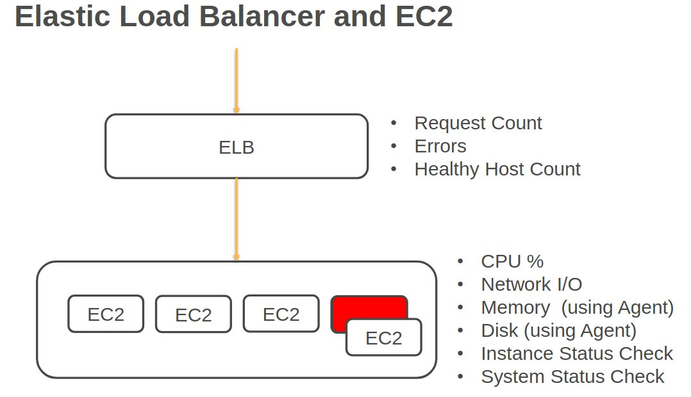

#### Unified CloudWatch Agent:
- Collect __internal system-level metrics from EC2 instances__ across operating systems,
- collect system level metrics from __on-premises servers__
- retrieve custom metrics __from your applications using the StatsD and collectD__ the protocols.
- can __collect logs__ from EC2 instances and on-premises servers running Windows and Linux.
- The agent must be installed on the server and it can be installed on EC2, on-premises servers, Linux, Windows Server, or Mac OS.

### CloudWatch Alarms <a id="CloudWatchAlarms"></a>

- 2 types of alarms:
  - the __metric alarm__ for one or more actions based on a single metric
  - the __composite alarm__, which uses a rule expression and takes into account multiple alarms.
- The alarm states are:
  - __OK__, when a metric is within a threshold,
  - __Alarm__, when the metric is outside the threshold,
  - __insufficient data__ when there's simply not enough data to make a determination.

### CloudWatch logs <a id="CloudWatchLogs"></a>

- gathers application and system logs in CloudWatch.
- can define expiration policies and KMS encryption.
- can send them to S3 by exporting Kinesis Data Streams and Kinesis Data Firehose.

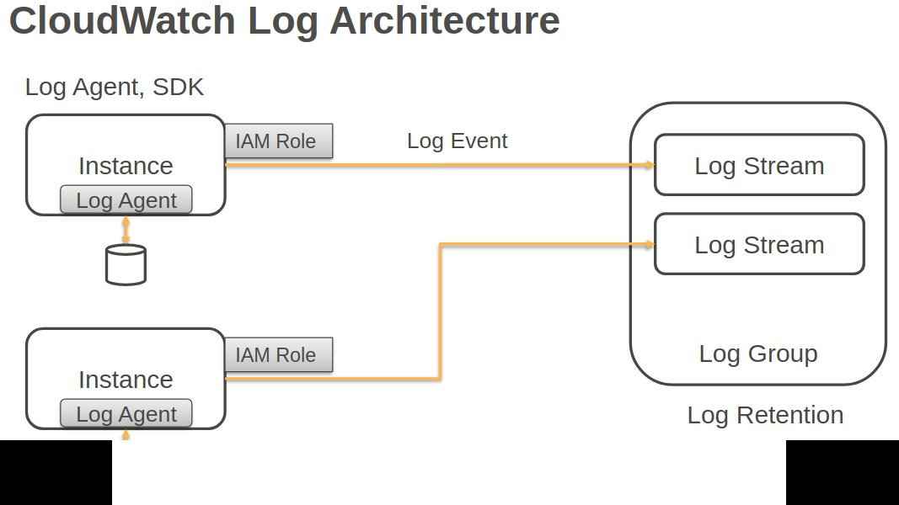

- Log Events: Activity recorded by an application or system
- Log Streams: Sequence of log events from the same source (application instance, resource)
- Log Groups: 
  - Group of Log Streams
  - Shares the same retention, monitoring, and access control settings
- Metric Filters convert log file events to CloudWatch data points
- Specify retention period for events kept in CloudWatch logs
- Expired log events are deleted automatically

### CloudTrail <a id="CloudTrail"></a>

- logs API activity for auditing.
- By default, management events are logged and all retained for 90 days.
- You can create a ClaudTrail trail and then your events are logged to S3 with indefinite retention.
- Trails can be logged within a region or within all regions.

### CloudWatch events <a id="CloudWatchEvents"></a>
- can be triggered based on API calls in CloudTrail.
- Events can also be streamed to CloudWatch logs.
- types of events:
  - __management events__: this is information about management operations being performed on your resources.
  - __Data events__: provide lots more detailed information about resource operations performed on actual resources.
  - __Insights events__ are there to identify and respond to unusual activity associated with writes API calls.

### Architecture Patterns

#### need to stream logs from Amazon EC2 instances in an auto scaling group.

install the Unified CloudWatch Agent and that will collect the log files in Amazon CloudWatch.

#### You need to collect metrics from EC2 instances with a 1 second granularity.

create a custom metric with high resolution.

#### The application logs from on-premises servers must be processed by AWS Lambda in real time.

install the Unified CloudWatch Agent on the servers and use a subscription filter in CloudWatch to connect to the Lambda function.

#### CloudWatch logs entries must be transformed with Lambda and then loaded into S3.

configure a Kinesis Firehose destination, transform with Lambda, and then load into an S3 bucket.

#### Access auditing must be enabled and records must be stored for a minimum of five years. Any attempts to modify the log files must be identified.

create a trail in AWS CloudTrail that stores the data in an S3 bucket and also enable log file integrity validation.

#### API activity must be captured from all accounts in an AWS Organization. Admins in member accounts must not be able to modify or delete the trail.

create an organization trail in AWS CloudTrail that applies to the management accounts and all member accounts, and the member accounts cannot modify that trail.

#### A company requires API events that involve the root user account to generate a notification.

create a CloudTrail trail and an EventBridge rule that looks for API events that involve root and configure an SNS notification.

#### For compliance reasons, all S3 buckets must have encryption enabled and any non-compliant buckets must be auto remediated.

use AWS Config to check the encryption status of the buckets and use auto remediation to enable encryption as required.

#### You would like to monitor two different metrics in an AWS Service and take automated action based on the metric value.  How many CloudWatch alarms would you need?

Two. Alarm is associated with one metric. So, we need one alarm per metric.

#### How do you reset the alarm in the "in-alarm" state?

The alarm will reset when the underlying issue that triggered the alarm is resolved. 

For example, if there are is alarm based on CPU utilization, in-response to the alarm, an application may add EC2 instances to handle the workload. When CPU utilization reduces, the alarm will automatically go back to "OK" state

Alarm: Increase the alarm evaluation interval to detect persistent problems and to ignore the temporary issues. 
The application is handling transient spikes without requiring additional EC2 instances. 
To capture the persistent issues, increase the alarm evaluation interval so that the alarm is triggered only when the data point is outside the threshold for consecutive periods. 
If you lower the limit or the evaluation interval, the alarm will trigger more often. Another possible solution is to increase the threshold for triggering the alarm.
Alarms can stop the instance - but they cannot start an instance.

#### An organization uses Bastion Host (an EC2 instance) for the developers to connect to other AWS resources. You would like to maximize the availability of Bastion Host and automatically recover from issues related to Physical Host. What mechanism can you use to accomplish this?

With System Status Check Alarm, you can configure the instance to recover from underlying AWS issues automatically. Recover option is only available with System Status Check alarms.

#### I want to track all user and API activities in my account. What service should I use for this?

CloudTrail captures all user activity and API usage. When you enable a trail, CloudTrail publishes CloudWatch Events that you can use to enable automation workflow based on specific events. Guard Duty reports only suspicious events. VPC Flow log captures network traffic flow in your VPC. Macie is used for protecting sensitive data in S3

#### You have a pool of EC2 instances to manage application requests. Application has a metric that tracks pending requests and you would like to configure Autoscaling to add or remove instances based on this application metric. How can you accomplish this?

CloudWatch supports custom metrics and application can take advantage of this capability to push relevant metrics to CloudWatch. Once it is available in CloudWatch, you can use rest of the capabilities provided by CloudWatch to monitor based on that metric

#### Your application is generating several false alarms. The alarm is currently based on the CPU utilization metric. Upon investigation, you found that the false alarms can be reduced if you consider the pending items in the SQS Queue. How would you ensure the alarm goes into ALARM state only when both the CPU utilization and SQS Queue length metrics breach the threshold?

With CloudWatch, you can create two types of alarms: metric and composite. 

A metric alarm watches a single metric, and when the metric breaches the threshold, the alarm changes to an "ALARM" state. 

A composite alarm is a new capability that considers the state of multiple alarms. The outcome of a composite alarm depends on the rule expression you define. For example, let's say you have a metric alarm to monitor CPU utilization and another to monitor SQS Queue Length. 

You can create a composite alarm when you need to perform a certain action only when both CPU and SQS Queue Length alarms are in the ALARM state. Rule expression allows you to combine these underlying metric alarms or other composite alarms and create a new Alarm based on the state of these existing alarms.

#### You application runs in two different regions and you would like aggregate instance utilization metrics across regions. What is the mechanism that can be used for aggregating CloudWatch data across regions?

Use a script to pull data from different regions, and push it to CloudWatch Logs for analysis
You can perform aggregation only with a region.


## Security in the Cloud <a id="Security"></a>

| Service                                   | Use Case
|-------------------------------------------|-------------------------------------------
| AWS Identity and Access Management (IAM)  | Securely manage access to services and resources
| IAM Access Analyzer                       | Identify resources (such as S3 bucket, IAM Roles, KMS
|                                           | Keys, Lambda functions, SQS Queue) that are shared with 
|                                           | external accounts outside of your organization
| AWS Single Sign-On (SSO)                  | Cloud Single-sign-on Service
| Amazon Cognito                            | Identity management for your apps
| AWS Directory Service                     | Managed Active Directory
| AWS Resource Access Manager (RAM)         | Share AWS resources securely between accounts
| AWS Organizations                         | Central governance and management across AWS accounts


### Active Directory <a id="AD"></a>

Managed Microsoft AD:
- This is a __fully managed AWS service__.
- It's the best choice if you have __more than 500 users__ and or you need a trust relationship set up,
- you can perform schema extensions.
- You can __set up trust relationships with on-premises active directories__:
  - on premise users and groups can access resources in either domain using SSO
  - once you have that trust relationship, it does require a VPN or DX connection.
- Managed Microsoft AD can be used as a stand-alone active directory in the AWS cloud

AD Connector:
- __redirects directory requests to your on premises AD__.
- best choice when you want to use an __existing active directory__ with AWS services
- AD connector comes in two sizes:
  - small for organization up to 500 users and
  - large for up to 5000 users.
- __requires a VPN or DX connection__.
- You can join EC2 instances to your on premises a through a connector
- You can login into the management console using your on premises active directory, domain controllers for authentication.

Simple AD:
- is an __inexpensive AD compatible service with common directory features__.
- standalone fully managed directory on the AWS cloud.
- the least expensive option.
- best choice for __less than 500 users__ if you don't need those advanced AD features.
- Features include:
  - managing user accounts and groups,
  - applying group policies
  - Kerberos based SSO
  - supports joining Linux or Windows-baseded EC2 instances

### Identity providers <a id="IdentityProviders"></a>

Identity providers and federation :
- IDP you can manage user identities outside of AWS and give these identities permissions to use resources in your account.
- For example:
  - your organization already has its own identity system such as a corporate user directory.
  - You're __creating a mobile app or web application that requires access to AWS resources__
- with an IAM identity provider there's no need to create custom signing code or manage your own identities. The IDP will do that for you.
- __External users sign in for a well known IDP such as login with Facebook, Amazon or Google__,
- IAM supports IDPs that are compatible with openID Connect or SAML 2.0.

IAM Identity center:
- centrally manage access to multiple AWS accounts and business applications
- easily manage SSO access and user permissions to all your accounts in organizations centrally,
- IAM Identity Center also includes built in integrations to many business applications like Salesforce, Box and office 365.
- You can create and manage user identities in IAM Identity Center
- you can connect to existing identity stores such as Ad or Azure

### KMS <a id="KMS"></a>

- enables you to create and manage cryptographic keys.
- You can control your key usage across services and in applications.
- It allows you to centrally manage and securely store your
- KMS keys and it supports symmetric and asymmetric encryption.
- KMS keys are the primary resources in KMS.

KMS keys:
- contain the key material used to encrypt and decrypt data.
- KMS keys are created in AWS KMS
- symmetric KMS keys and the private keys of asymmetric KMS keys will never leave AWS KMS unencrypted
- by default KMS creates the key material for KMS key.
- You can also import your own key material
- KMS keys can only encrypt data up to four 4KB in size.
- KMS keys can generate encrypt and decrypt data encryption keys,
- data encryption keys can then be used for encrypting large quantities of data.

AWS managed KMS keys:
- are created managed and used on your behalf by a service that is integrated with KMS.
- You can't manage these keys, you can't rotate them or change their key policies.
- You also cannot use AWS managed KMS keys, encrypt graphic operations directly.
- The service uses them on your behalf,
- KMS - AWS Managed Keys are automatically rotated Every year

Data Encryption Keys:
- data keys are encryption keys that you can use to encrypt data, including large amounts of data and other data encryption keys.
- You can use KMS keys to generate encrypt and decrypt your data keys.
- KMS doesn't store manage or track your data keys or perform the operations with those data keys
- you must use and manage the data keys outside of KMS.

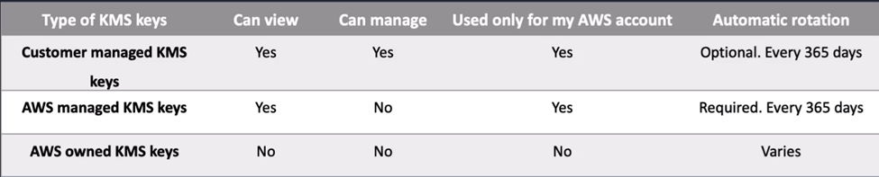

KMS key types and how are they rotataed:
- __KMS – AWS Managed Keys__ are rotated: __automatically 1/year__
- __KMS - Customer Managed Keys__ with KMS key-material origin are rotated: __automatically every year if you enable rotation__
- __KMS – External Key Origin keys__ are rotated: __Never__. Automatic key rotation is not supported when you use External Key Origin
- __KMS – Custom key stores (CloudHSM)__ keys are rotated: __Never__. Automatic key rotation is not supported when you use CloudHSM

### Cloud HSM <a id="HSM"></a>

- cloud based hardware security module
- You can generate and use your own encryption keys on the AWS cloud.
- runs in your VPC
- uses FIPS 140-2 level three validated HSMs.
- It's a managed service and automatically scales
- You retain control over your encryption keys and you control access with no visibility for AWS.
- Use cases:
  - offload SSL/TLS processing from web servers,
  - protect private keys from issuing CA,
  - store the master key for oracle DB transparent data encryption
  - custom key store for KMS, so you can retain control of the HSM that protects the master keys.

### AWS Certificate Manager <a id="CertificateManager"></a>

- create, store and renew SSL/TLS X 509 certificates that supports single domains, multiple domain names and wild cards
- integrates with several services like elbs, cloudfront, Elastic beanstalk, Nitro enclaves and AWS cloud formation.
- Public certificates are signed by the AWS public CA.
- You can also create a private CA with ACM, then you can issue private certificates.
- You can also import certificates from third party issuers as well.

### AWS web application firewall - WAF <a id="WAF"></a>

- This service lets you create rules to filter web traffic based on conditions such as IP addresses, http headers and body or custom URIs.
- It makes it easy to create rules that block common web exploits like sequel injection and cross site scripting.
-  Web Application Firewall allows you to enforce country-specific rules. You can block or allow traffic from specific countries.
- Monitor requests to Application Load Balancer, CloudFront, API Gateway (and more)
- Secure at the edge (with CloudFront, CloudFront query parameter whitelist)
- Concepts:
  - __web ACLS__, are used to protect a set of resources
  - __rules__: that define the inspection criteria and actions to take if a web request meets your defined criteria
  - __rule groups__:  reusable rule groups.
  - __IP set__ provides a collection of IP addresses and IP address ranges that you want to use together in a rule statement.
  - __regeX pattern set__ provides a collection of regular expressions you want to use together in a rule statement.
  - __rule action__ tells WAS what to do with a web request. When it matches the criteria defined in the rule:
    - count,
    - allow
    - block the request.
  - A match statement compares the web request or its origin against conditions that you provide:
    - geographic,
    - IP sets
    - regex size constraints,
    - sequel injection attacks,
    - string, match and
    - cross site scripting attacks.
- Monitor requests to Application Load Balancer, CloudFront, API Gateway (and more)
- Secure at the edge (with CloudFront, CloudFront query parameter whitelist)

Web Application Firewall allows for access limitation by IP address. 
It's important to highlight that __WAF integration is exclusive__ to:
- Application Load Balancer, 
- CloudFront distribution, and 
- API Gateway. 
- You cannot use CIDRs

These are various different ways of identifying traffic that could be malicious in nature:

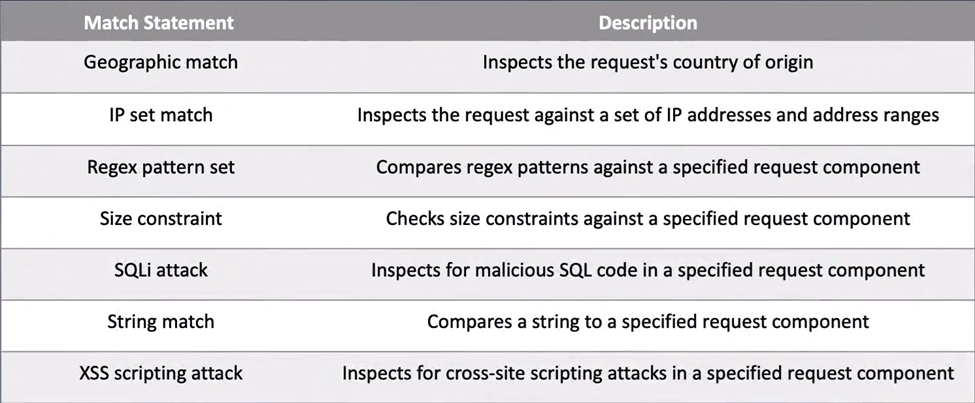

#### WAF – Managed Rule Groups

Preconfigured set of rules managed by AWS and Marketplace Sellers:
- OWASP Top 10
- Common Vulnerabilities and Exposure (CVE)
- AWS IP Reputation List – Block addresses associated with bots and other threats
- AWS IP Anonymous List – Block requests from services that obfuscate caller identity (VPN, Proxies, Tor nodes)


### AWS shield <a id="Shield"></a>

- Protection against Layer 3 and 4 attacks
- managed distributed denial of service (DDOS) protection service.
- It safeguards web applications running on AWS with always on detection and automatic in line mitigations.
- It helps to minimize application downtime and latency.
- Protection against regional and global resources
- Includes WAF
- 2 tiers:
  - the standard which is no cost at all
  - advance which comes for a monthly fee and a one year commitment.

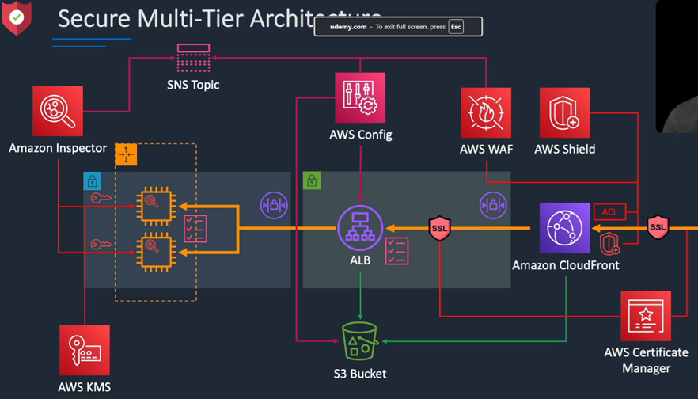

### Amazon Cognito <a id="Cognito"></a>

AWS Cognito works with external identity providers that support SAML or OpenID Connect, social identity providers (such as Facebook, Twitter, Amazon)

Federation allows users to authenticate with a Web Identity Provider (e.g. Google, Facebook, Amazon).

The user authenticates first with the Web ID provider and receives an authentication token, which is then exchanges for temporary AWS credentials allowing them to assume an IAM role allowing access to the required resources.

Cognito is an Identity Broker which handles interaction between your applications and the Web ID provider

- add user sign-up and sign-in and access control to your web and mobile apps.
- A __user pool__ is a directory for managing sign-in and sign-up
- users can be stored in a user pool or can sign in using social IDPs.
- It supports SAML and OIDC compatible IDPs.
- Cognito acts as an identity broker between the IDP and AWS.
- __Identity pools__ are used to obtain temporary limited privilege credentials for AWS services using the STS service.
- IAM role is assumed providing access to those services.

User pools:
- Cognito User Pools are user directories used to manage sign-up and sign-in functionality for mobile and web applications.
- With a user pool, users can sign in to your web or mobile app through Amazon Cognito
- Users can also sign in through social identity providers like Facebook or Amazon, and through SAML identity providers.

Identity Pools:
- With an identity, you can obtain temporary, limited-privilege AWS credentials to access other AWS services.
- Cognito tracks the association between user identity and the various different devices they sign-in from
- In order to provide a seamless user experience for your application, Cognito uses Push Synchronization to push updates and synchronize user data across multiple devices


### Architectural Patterns

#### you need to enable a custom domain name and encryption in transit for an application that's running behind an ALB.

you can use Route 53 to create an alias record to the ALBs DNS name, and then attach an SSL/TTLS certificate issued by Amazon Certificate Manager, ACM.

#### A website running on EC2 instances behind an ALB must be protected against well-known web exploits.

think about the Web Application Firewall. So you'd create a web ACL in WAF to protect against those web exploits and you can attach that to the ALB.

#### You need to block access to an application running on an ALB from connections originating in a specific list of countries.

create a web ACL in WAF with a geographic match and block traffic that matches the list of countries.

#### A company needs to encrypt large volumes of data using a CMK in AWS KMS.

For this, you need to create a data encryption key using the CMK to encrypt the large volumes of data.

#### A mobile app requires authorized access to AWS services. Users authenticate using social IDPs and a preconfigured web UI is required for logging in.

use a Cognito user pool that leverages the social IDPs and an identity pool for gaining temporary credentials for AWS. And the user pool will give you that pre-configured web UI, it has that out of the box.

#### A company has an on-premises Microsoft AD and a Direct Connect connection. They require the ability to join EC2 instances to the on-premises domain.

use an AD connector that uses

#### How often is the KMS-CMK rotated? 

Every year when automatic rotation is enabled.

#### A web application uses Network Load Balancer (NLB) to route traffic to the compute instances. Which of these configurations would offer comprehensive protection against Layer 7 attacks?

With AWS __WAF__, you can subscribe to ready-to-use managed rule groups provided by AWS and marketplace sellers. 
With this option, you get comprehensive protection against known application layer (Layer 7) vulnerabilities and exploits. 
AWS WAF does not support NLB. 
One option is to configure CloudFront distribution with NLB as the origin and associate AWS WAF to the CloudFront distribution

#### A financial company needs to limit access to the web application only for users from specific regions where they have a presence.  Which of these options would enable you to that?

AWS __WAF__ has the option to __allow or block based on the request originating countries__. 
With this option, AWS automatically manages the IP to country mapping and keeps the information up-to-date. 
You can also use Amazon’s Anonymous IP Address managed rule group to block requests from services that hide caller identity (VPNs, Proxies, Tor nodes). 
All other options require you to maintain IP Blocks – which is a lot of overhead to keep track and maintain.

#### A web-based SaaS provider offers a solution for auto service centers and dealerships. To protect against attackers, the SaaS provider whitelists all CIDR IP blocks belonging to subscribed auto dealers. The number of CIDR entries is in several hundred.  Which of these options provide would you use for this scenario?

With __WAF IP Address sets__, you have a scalable solution for whitelisting or blacklisting. 
This solution __supports 1000s of IP address blocks__. 
The WAF IP Address sets and Regex Pattern Sets are reusable across different Web ACLs. 

Security Group has a limit of a few hundred entries, and Network ACL has a limit of a few 10s of entries.

#### Which of these solutions provide extensive visibility into layer 3, 4, and 7 attacks on your AWS resources?

With AWS __Shield Advanced__, you get access to real-time metrics and reports for extensive visibility into attacks on your AWS resources. 
You can also configure CloudWatch alarms to notify you of an attack in progress. 
WAF provides full visibility into rules and requests that match your rules using CloudWatch metrics. 
These metrics are useful for tracking the application layer (Layer 7) attacks that were blocked by your rules

#### An organization wants to rotate database credentials automatically. The credentials must be stored in a secure data store. Which of these services provides built-in credential rotation support for this requirement?

With __Secrets manager__, you can easily __rotate__, manage, and retrieve secrets. 
Secrets Manager __encrypts the secrets using KMS keys__ that you specify. 

Systems Manager Parameter Store supports the storage of encrypted passwords; however, by default, they store unencrypted. 
Parameter Store does not have an automated mechanism for credential rotation

#### I need a tool that automatically scans CloudTrail Logs, VPC Flow Logs, and DNS logs and identifies suspicious events that are not part of normal baseline activities in my account. Which service should I use?

Guard Duty is a managed threat detection service. It learns by reviewing the CloudTrail events, VPC Flow Log, and DNS logs to build a baseline of normal activities. It checks network activity, data access patterns, account behavior. Any abnormal and suspicious activities are flagged and reported by Guard Duty. You can use CloudWatch Events and Lamda for automated remediation.

#### Our application requires several third-party and open-source software libraries. How do I automatically check for vulnerabilities in these libraries? The solution should also check for any newly reported vulnerabilities. What capability can I use for this?

Inspector can analyze your instance and application libraries for known vulnerability reported in the CVE database, CIS host hardening standards, network reachability assessment, and processes reachable over the exposed ports.

#### Developers require a new version of the framework installed on the servers. I need to make sure all development servers have the latest version installed. What service should I use for this?

With the Systems Manager’s Patch Manager capability, you can define baseline patch levels, and patch manager automatically patches the instances.

#### Web Application Firewall allows for access limitation by IP address. However, it's important to highlight that WAF integration is exclusive to Application Load Balancer, CloudFront distribution, and API Gateway.
Any of these:
- Enable Advanced Shield on Network Load Balancer
- Protect CloudFront using AWS WAF: A common strategy is to use CloudFront in front of NLB and protect CloudFront with WAF

Cannot use:
- GuardDuty is an intrusion detection system that can detect suspicious activities
- AWS Inspector identifies software vulnerabilities in your EC2 instances and container images. Inspector does not block attacks.

#### An online retailer is looking for an automated solution to alert about fraudulent transactions, fake and spam accounts. Which solution would you recommend?

Amazon Fraud Detector can detect online frauds with machine learning. For example, this service can flag suspicious online payments, detect new account fraud and incorporate additional verification steps, account takeover detection, and so forth

#### Apache Log4j vulnerability, which allows remote code execution and the ability to download and run arbitrary code on your servers. Let’s assume an issue like this vulnerability is reported and you want to assess the impact to your environment consisting of 1000s of servers and containers. What tools would you use to identify vulnerable systems and apply the fix?

Use:
- Inspector can scan hosts and container images and report Security exposures and vulnerabilities. This tool assigns a risk score to prioritize your remediation.
- Systems Manager Patch Manager, you can automatically patch the vulnerable systems at scale. For patching container image, you may need additional CI/CD pipeline and tools to build a new image.
The following will not help:
- GuardDuty is an intrusion detection system that alerts about malicious activities in your environment.
- Control Tower provides a blueprint that follows AWS security and compliance best practices and sets up a multi-account environment for you, called a Landing Zone.
- Amazon Macie scans your S3 buckets and flags them if it contains sensitive data. Macie can also alert you when policies or settings in S3 buckets are changed in a way that reduces the security


## Migration and Transfer <a id="Migration"></a>

Tools:
- DataSync
- Storage Gateway
- Snowball
- S3 sync, cp

### Service Migration Service – SMS <a id="SMS"></a>

 VMware, Hyper-V or Azure -> SMS connector -> Server volumes -> AMIs -> EC2

- agentless service for migrating on-premises and cloud-based VMs to AWS.
- Source platforms can be VMware, Hyper-V or Azure.
- The Server Migration Service connector is installed on the source's platform.
- Server volumes are replicated and it's encrypted with TLS and saved as AMIs, which can then be launched as EC2 instances.
- You can use application groupings and SMS will launch servers in a CloudFormation stack.
- you can replicate your on-premises service to AWS for up to 90 days per server.
- It provides automated live incremental server replication and AWS console support.

### Database Migration Service – DMS <a id="DMS"></a>

Database Migration Service: to transfer data between __on-premises databases and cloud-based__ RDS

Supports __homogeneous__, so Oracle to Oracle, as well as __heterogeneous__. 
You can move to the managed data to Amazon Redshift, NoSQL platforms like Amazon DynamoDB, or low-cost storage platforms like Amazon Simple Storage Service (Amazon S3).
Application is live, minimizing downtime.

- used for migrating databases from on-premises, Amazon EC2 or Amazon RDS.
- supports homogeneous, so Oracle to Oracle, as well as heterogeneous, example, Oracle to Amazon Aurora.
- Data is continuously replicated while the application is live, minimizing downtime.
- You pay based on the compute resources used during the migration and the log storage.
- fully managed migration process.
- you can use it along with the schema conversion tool for converting schemas.
- DMS use cases include cloud to cloud, so EC2 to RDS, RDS to RDS, or RDS to Aurora, on premises to cloud and homogeneous migrations like Oracle to Oracle, MySQL to RDS MySQL, and so on.
- Also, heterogeneous migration:  moving from Oracle to Aurora, Oracle to Postgres, or Microsoft SQL to RDS MySQL. And then you'll need to use the schema conversion tool.
- It's also useful for development and test, so you can use the cloud for dev/test workloads and database consolidation.
- consolidating multiple source DBs to a single target DB.
- does continuous data replication so you can use it for DR, dev/test, or single source multi target or multi-source single target.

### DataSync <a id="DataSync"></a>

Moves data (agent) between on-premises storage and AWS service.
Copy data FROM: NFS, SMB, HDFS, between AWS storage services TO: S3, EFS, or FSx for Windows File Server.

A secure, online service that automatically moves data between on-premises storage and AWS services.

It __uses AWS Direct Connect__ to move data between on-premises storage systems and AWS storage services

Can copy data between Network File System (NFS), Server Message Block (SMB), and Hadoop Distributed File Systems (HDFS)

Can also transfer data between AWS storage services

Uses in-flight encryption and end-to-end data validation

- software agent to connect to on-premises NAS storage systems.
- The NAS can use NFS or SMB protocols, and it synchronizes data into AWS using a scheduled automated data transfer with TLS encryption.
- Destinations can be S3, EFS, or FSx for Windows File Server.
- can improve performance for data transfers.
- Permissions and metadata are preserved.
- you pay per gigabyte transferred.

Steps to move data using AWS DataSync:
- Deploy and activate an AWS DataSync agent virtual machine
- Gather configuration data from your data center
- Validate network connectivity
- Create an AWS DataSync task
- Run the task to copy data to your Amazon S3 bucket


### Snowball <a id="Snowball"></a>

- are used for migrating large volumes of data to AWS.
- The __Snowball Edge Compute Optimized__:
  - provides block and object storage and an optional GPU.
  - You can use the data collection, machine learning and processing and storage in environments with intermittent connectivity, so edge use cases.
- __Snowball Edge Storage Optimized__:
  - This provides block storage and S3 compatible object storage.
  - You can use it for local storage and large scale data transfer.
- __Snowcone__:
  - This is a small device used for edge computing storage and data transfer.
  - You can transfer data offline or online with the AWS DataSync agent.
- Snowball uses secure storage devices for physical transportation,
- you have some client software that you install on a local machine and that can be used to identify the data that you want to transfer, compress it, encrypt it, and then actually transfer it.
- Snowball uses 256-bit encryption with managed KMS keys and tamper resistant enclosures with TPM.
- different devices:
  - Snowball: is capable of 80 terabytes or 50 terabytes depending on your model, and that's petabyte scale.
  - Snowball Edge: goes up to 100 terabytes and that's also known as petabyte scale.
  - Snowmobile: This is known as being exabyte scalable up to 100 petabytes per Snowmobile.
- There are a few ways to optimize the performance of Snowball transfers:
  - You can use the latest Mac or Linux Snowball client, batch small files together, perform multiple copy operations at one time, copy from multiple workstations, and transfer directories, not individual files.
- Use cases for Snowball are cloud data migration, so migrating data to the cloud. Content distribution, sending data to clients or customers.

Optimal data migration per data size comparison:
- Snowball: > 10TB
  - Snowball: 80TB
  - Snowball Edge: 100TB, block and object storage
  - SnowCone: device used for edge computing storage and data transfer
  - SnowMobile: 100PB
- Site-to-Site VPN < 100GB
- Direct Connect < 10TB

### AWD Data Transfer <a id="DataTransfer"></a>

- Site-to-Site VPN
  - For small to moderate amounts of data (< 100 GB) that need infrequent transfers
- AWS Direct Connect
  - For large amounts of data (< 10 TB) that need frequent transfers and a consistent connection with low latency
  - Direct Connect bypasses the public internet and provides a secure and dedicated connection to AWS.
- Snow family
  - For very large amounts of data ( > 10s of TBs) and infrequent transfers


### Architectural Patterns

#### company is migrating Linux and Windows VMs to in VMWARE to the cloud and they need to determine the performance requirements for right-sizing.

you can install the application discovery service discovery connector in vmware V center to gather the data.

#### A company has a mixture of VMware VMs and physical servers to migrate to AWS and dependencies exist between application components.

you might install the MGN replication agent and create application groups to migrate the servers in waves.

#### You need to migrate an oracle data warehouse to AWS.

AWS DMS and the schema conversion tool to a Redshift data warehouse.

#### we have snowball edge being used to transfer millions of small files using a shell script and transfer times are very slow.

you can perform multiple copy operations at one time by running each command from a separate terminal. In separate instances of the Snowball client,

#### you need to minimize downtime for servers that must be migrated to AWS.

use the MGN and perform a final synchronization before cutting over in a short outage window.

#### you need to migrate 50 terabytes of data and the company only has a one gigabits per second internet link.

Use AWS Snowball to transfer data

####  AWS Transfer Family: Your environment has several existing clients that use SFTP, FTP, FTPS, and AS2 protocols for file transfer. Which service offers a fully managed solution to move data into and out of AWS Storage services using these protocols?

#### Customer needs to migrate 50 TB of data from on-premises systems to AWS cloud Incremental data needs to be in sync until  cutover to cloud What cloud storage and data transfer service would you use for this?

DataSync for initial transfer (if network is not a constraint) and for incremental loading

#### Customer needs to migrate 50 TB from on-premises file shares to AWS cloud and make data available to on-premises applications. Customer is interested in reducing the storage footprint on-premises. What storage service and data transfer solution would you use?

DataSync for initial transfer (if network is not a constraint)

Storage Gateway  for incremental loading and for replacing on-premises storage (block, file share, tape)

#### Customer has on-premises Linux and windows applications that use NFS, SMB file shares. Customer is migrating the application to cloud. What storage service and data transfer service would you use that minimizes changes to the application?

DataSync for initial transfer (if network is not a constraint) and, for incremental transfer

#### Customer needs to migrate 50 TB of data from on-premises systems to AWS cloud. Incremental data needs to be in sync until cutover to the cloud. What cloud storage and data transfer service would you use for this?

Storage Gateway

#### Your environment has several existing clients that use SFTP, FTP, FTPS, and AS2 protocols for file transfer. Which service offers a fully managed solution to move data into and out of AWS Storage services using these protocols?

AWS Transfer family

AWS Transfer Family is a secure transfer service that enables you to transfer files into and out of AWS storage services.

AWS Transfer Family offers fully managed support for the transfer of files over SFTP, AS2, FTPS, FTP, and web browser-based transfers

AWS Transfer Family supports transferring data from or to the following AWS storage services:
- Amazon Simple Storage Service (Amazon S3) storage.
- Amazon Elastic File System (Amazon EFS)
- Network File System (NFS) file systems

#### You are consolidating data from multiple SaaS partners like Salesforce, SAP, and Zendesk. Which service would you use for this?

AWS AppFlow.

AppFlow is a no-code solution to automate data flow by securely integrating third-party applications and AWS services and securely transferring data from SaaS applications like Salesforce, SAP, Zendesk, Slack, and ServiceNow.

AppSync is used for building applications with serverless GraphQL and Pub/Sub APIs.

Amazon AppFlow is a fully-managed integration service that enables you to securely exchange data between software as a service (SaaS) applications, such as Salesforce, and AWS services, such as Amazon Simple Storage Service (Amazon S3) and Amazon Redshift.

For example, you can ingest contact records from Salesforce to Amazon Redshift or pull support tickets from Zendesk to an Amazon S3 bucket

#### You plan to migrate over 100 TB of data from your data warehouse system to the Amazon Redshift database. The network bandwidth from on-premises to the internet for this data migration is 250 Mbps. What option would you use to transfer data to AWS quickly?

Snowball

With a 250 Mbps link, it will take 40 days to transfer 100 TB data. Whereas, snowball turn around time is less than 1 week

#### Customer has on-premises Linux and windows applications that use NFS, SMB file shares. Customer is planning a lift and shift migration to cloud. What storage service would you use that minimizes changes to the application

FSx for Windows or EFS

#### The Fruit company needs to analyze data generated by sensors of their autonomous car. The dataset size in 100s of TBs and stored in S3 standard storage. To analyze all this data, data science team needs a high-performance cluster with over 1000 servers with very low latency and very high throughput network connectivity. The servers also need low latency data access. How should they design the system?

Use
- Use FSx for Lustre linked to an S3 bucket
  FSx for Lustre is a high-performance file share that offers low latency data access. This is optimized for high performance computing and fast processing. FSx for Lustre can operate as a standalone file share or you can link it to S3 bucket and present the content of S3 bucket as a file share. Any changes you make to the file system is automatically updated to S3. Similarly, the linked file system is automatically updated as objects are changed in S3.
- Create cluster using Cluster Placement Group
With EC2’s Cluster Placement Group, the instances are packed closely together in a single availability zone. These instances may share the same rack and networking infrastructure to achieve low latency.
Another option is the Partition Placement Group. This option minimizes the impact to your application due correlated hardware failure.

#### The customer needs to migrate 50 TB of data from on-premises file shares to S3 Any new changes in on-premises (incremental data) need to be in sync with S3 until cutover to the cloud. What data transfer service would you use for this?

- Data Sync: Data Sync is an AWS tool optimized for moving large amounts of data.
  You can use this to transfer from on-premises to AWS Storage services (S3, EFS, FSx for Windows).
  Data Sync supports both one-time migration and scheduled incremental transfer. Data Sync automatically tracks changes to perform incremental transfers efficiently
- Snowball Edge Storage Optimized.
  remember this information: 100 Mbps network link can transfer 1 TB/day
  transferring 50 TB can take 50 days using a 100 Mbps link.
  Snowball Edge: end-to-end time to transfer is approximately one-week
