# AWS Architect exam

## IAM

IAM is used to securely control individual and group access to AWS resources.

It makes it easy to provide multiple users with access to AWS resources.

And with IAM, you can manage:
- users,
- goups,
- access policies,
- roles
- user credentials
- User password policies
- enable multifactor authentication
- generate API keys for programmatic access to IAM.

By default, all __new users are created with no access to any services__. They can only log into AWS, but they can't actually do anything.

Permissions must then be explicitly granted to allow a user to access an AWS service.

IAM users are the individuals who've been granted access to an AWS account.

__IAM is a universal or global service__, so it doesn't apply to specific regions.

__IAM is eventually consistent__.

Authentication methods:
- __console passwords__ for logging into the management console,
- __access keys__ for programmatic access,
- __server certificates__, which can be used for some services as well.

IAM users:
- IAM user is an entity that represent a person or a service.
- By default, they cannot access anything in the account.
- The root user credentials are the email address used to create the account, and there's a password associated with that account.
- The __root account has full administrative permissions and they cannot be restricted__.
- IAM users can be created to represent applications, and those are known then as __service accounts__.
- You can have up to 5,000 users per AWS account.

IAM groups:
- IAM groups are collections of users and have policies attached to them.
- A group's not an identity in itself, so it can't be identified as a principal in a policy.
- use groups to assign permissions to users.
- Always follow the principal of least privilege when assigning permissions.
- You can't nest groups

IAM Roles:
- Roles are created and then assumed by trusted entities.
- They are a __way of delegating permissions to resources for users and services__.
- __Users and services can assume a role to obtain temporary security credentials. And those are issued by the Security Token Service, the STS service__.

IAM Policies:
- Policies are documents that define the permissions and they can be applied to users, groups, and roles
- Policy documents are written in JSON and include key value pairs that consist of an attribute and a value.
- __All permissions are implicitly denied by default__.
- The most restrictive policy is applied if there's multiple policies with conflicting statements.

Types of IAM policy:
- __identity-based policies__ which you can attach to users, groups, or roles.
- __resource-based policies__. They get attached to resources like S3 buckets, and you can define permissions for principals accessing the resources using a resource policy.
- __permissions boundaries__. These set the maximum permissions that an identity-based policy can grant to an IAM entity.
- __organizations service__ control policies. These specify the maximum permissions for an organization or an OU.
- __session policies__ that are used with Assume Role API actions.

IAM best practices:
- lock away your account root user access keys,
- create individual users,
- use groups to assign permissions to users,
- grant least privilege,
- get started using permissions with AWS managed policies,
- Use customer managed policies instead of inline policies.
- Use access levels to review IAM permissions always bearing in mind that least privilege,
- Configure a strong password policy for your users.
- Enable multi-factor authentication.
- Use roles for applications that run on EC2 instances,
- use roles to delegate permissions.
- Do not share access keys. Always keep them to yourself and use them only for your accounts.
- rotate all credentials regularly.
- remove any unnecessary credentials.
- use policy conditions for extra security when you're writing your IAM policies.
- monitor activity in your account to see what's actually happening.

### Architecture Patterns

#### select group of users only should be allowed to change their IAM password

Create a group for the users and apply a permissions policy that grants the iam:changePassword API permission.

#### an Amazon EC2 instance must be delegated with permissions to an Amazon DynamoDB table.

Create a role, assign a permissions policy to the role that grants access to the DynamoDB database service.

#### A company has created their first AWS account. They need to assign permissions to users based on job function.

Use the AWS managed policies. And those can be aligned with specific common job functions.

#### A solutions architect needs to restrict access to an AWS service based on the source IP address of the requester.

You can create an IAM permissions policy and use the condition element to control access based on source IP address.

#### A developer needs to make programmatic API calls from the AWS CLI.

In this case, you can instruct the developer to create a set of access keys and use those for any programmatic access.

#### A group of users require full access to all Amazon EC2 API actions.

Create a permissions policy that uses a wildcard for the action element relating to EC2. And that would look like the (ec2:*) action.

## Amazon Elastic Compute Cloud (EC2)

With EC2, you launch virtual server instances on the AWS cloud.

Each virtual server is known as an instance.

With EC2, you get full control at the operating system layer.

Key pairs are then used to securely connect to EC2 instances.

The storage is either Amazon EBS, which is persistent storage, or Instance Store, which is non-persistent storage.

An Amazon Machine Image provides the information required to launch an instance.

AMI includes:
- a __template__ for the root volume of the instance,
- __launch permissions__
- a __block device mapping__, which specifies which volume is to attach to the instance.

__AMIs are regional__, so you can only launch an AMI from the region in which it is created.

You can __copy AMIs to other regions__ using the console command line or the API.

__Instance metadata__ is the data about your instance that you can use to configure or manage the running instance. Instance metadata is available at this URL: http://169.254.169.254/latest/meta-data

__User data__ is data that gets supplied in the form of a script and that runs at system startup. Instance user data is available at this URL: http://169.254.169.254/latest/user-data

Benefits of Amazon EC2 include:
- __elastic computing__. You can easily launch hundreds to thousands of EC2 instances within minutes.
- You get __complete control__ with full root and administrative access.
- __Flexible__: a choice of instance types, operating system, software packages, the type of storage you're adding, and so on and so forth.
- __Reliable__: EC2 offers very high levels of availability. And instances can be rapidly commissioned and replace where needed.
- __Secure__ It's fully integrated with Amazon VPC and the security features of AWS.
- __Inexpensive__, so it can be very low cost and you only pay for what you use.

public IP address:
- lost when you stop your instance
- used in public subnets
- no charge
- associated with private IP of the instance
- cannot be moved between instances

private IP address:
- retained when the instance is stopped
- Used in public and private subnets

elastic IP address:
- static public IP address,
- charged if not used
- associated with private IP address on the instance
- can move around between instances

Placement groups:
- __Cluster placement group__ is designed to keep instances very close for low latency. Think about high performance computing, tightly coupled applications where you've got node to node communication
- __Partition__ will spread your instances across logical partitions so that the groups in one partition don't share the same underlying hardware with other groups of instances. So you can use this for high availability. It's usually used with distributed and replicated workloads. For example, Hadoop, Cassandra and Kafka.
- __Spread placement group__: This will place a small group of instances across distinct underlying hardware to reduce any kind of correlated failures.

NAT instances versus NAT gateways:
- The __NAT instance__ is fully managed by you. It's really the old way of doing things.
- __NAT gateway__ is likely to be the best solution in most use cases.    
  - It's fully managed by AWS.
  - You get more scalability over NAT gateway.
  - You get automatic high availability as well.
  - The only real limitations of the NAT gateway are things like you can't use it as a bastion host, but you should probably separate that into a different instance anyway.
  - There are also no security groups with a NAT gateway, whereas there are with a NAT instance.

EC2 instance lifecycle:
- __Stopping__:
  - Stopping instances works only for EBS-backed instances,
  - no charge for a stopped instance.
  - There is a charge for any EBS volumes in terms of the amount of data that's stored.
  - Data in RAM is lost
  - the instance is migrated to a different host when you start it again.
  - Private IPv4 and IPv6 addresses are retained, public addresses are lost.
  - Any associated elastic IP will, of course, be retained.
- __Hibernation__ applies to on-demand or reserved Linux instances.
  - The contents of RAM get saved to an EBS volume, has to be enabled for hibernation when launched, and specific prerequisites do apply.
  - When you start an instance after hibernation, the root volume is restored to its previous state.
  - The RAM contents are then reloaded and the processes that were previously running on the instance get resumed.
  - Any previously attached volumes are re-attached and the instance retains its instance ID.
- __Rebooting__
  - instances, this is the equivalent to an operating system reboot.
  - The DNS name and IP address gets retained.
  - It doesn't affect billing at all because the instance is still running and it hasn't stopped and started, so it's not a new billing lifecycle.
- AWS may sometimes __retire__ instances:
  - if there's some irreparable failure of the underlying hardware,
  - when an instance reaches its scheduled retirement date
  - it might be stopped or terminated by AWS. Of course, they'll notify you if that happens.
- __Terminating__ EC2 instances:
  - means deleting the instance.
  - And you can't recover a terminated instance.
  - By default, the root EBS volumes are deleted,
- __Recovering__ instances:
  - this is where CloudWatch is monitoring the system status and you can recover the instance if required.
  - It applies if the instance becomes impaired due to underlying hardware or platform issues.
  - A recovered instance is identical to the original instance.

The __Nitro__ system:
- is the underlying platform for the __newer generation EC2 instances__.
- __Breaks logical functions into specialized hardware__ with a hypervisor.
- The hardware includes the Nitro cards for VPC, EBS, Instance Storage, a card controller, a security chip, and the hypervisor itself.
- Nitro aims to improve performance, security, and innovation.
- The __performance is close to bare metal__, even for virtualized instances.
- It gives you the ENA and the EFA.
  - ENA (Elastic Network Adapter) allows: 200 Gbps / network card etc.
  - EFA (Elastic Fabric Adapter): lower and more consistent latency and higher throughput than the TCP transport traditionally used in cloud-based HPC systems
- You have more available bare metal instance types you can use, and it gives you higher network performance.
- It's also good for HPC because there's more optimizations for high performance computing.
- It can also have dense storage instances as well.

__Nitro enclaves__:
- are __isolated compute environments__ that run on hardened virtual machines.
- __no persistent storage, interactive access, or external networking__,
- uses cryptographic attestation to ensure only the authorized code is running
- integrates with KMS.
- __good for securing and protecting highly sensitive data like PII__, health care data, financial data, or intellectual property data.

EC2 pricing options:
- __on-demand__, which is the standard rate, there's no discount, there's no commitment. It's very good for any kind of short-term requirements or unpredictable workloads.
- __reserved__ one or three year commitment, but you get a good discount.
- __spot__ instances, you get a very low price because you're essentially using unused capacity. So you can get a large discount, but you can also be terminated at any time.
- __Dedicated instances__ offer physical isolation at the host hardware level from instances belonging to other customers. And you pay per instance.
- __Dedicated host__ is physical servers dedicated for your use, so you get the actual hardware dedicated for you. There's no sharing going on there.
- __savings plans__ where you can commit to a certain amount of usage for various compute services. You have a one or three-year commitment.

### Architecture Patterns

#### A company needs to run a short batch script to configure Amazon EC2 Linux instances after they are launched.

Add the bash script to the user data of the EC2 instances, and then it will run as they boot up, as they launch for the first time.

#### A tightly coupled HPC workload, high performance computing requires low latency between nodes and optimum network performance.

Launch the EC2 instances in a single AZ in a cluster placement group and use an Elastic Fabric Adapter.
And that's a standard pattern for this type of workload that needs very low latency communications between nodes.

#### A line of business application receives weekly bursts of traffic and must scale for short periods, and you need the most cost-effective solution.

Use reserved instances for the minimum required workloads, so that's going to give you a big discount from the standard rates.
And then you can use spot instances for the occasional bursts in traffic because you know those are short-lived. And that means that you can get some cost savings there as well.

#### A single instance application uses a static public IP address. In the event of failure, the address must be remapped to a fail over instance.

Attach an elastic IP address to the instance, and you can remap the IP address in the event of a failure.
And that can be done programmatically, so you might have some kind of automated way of deploying that.

#### A fleet of Amazon EC2 instances run in private subnets across multiple AZs. A company needs a redundant path to the internet.

Use NAT gateways so that your instances in the private subnets have internet access. And you can put them into multiple AZs so you've got that high availability because it does ask for redundancy here. And then you need to update the route tables to point them to the NAT gateway.

#### A team of engineers must administer EC2 instances in private subnets from remote locations using SSH,

Deploy a bastion host to jump to the instances in private subnets.

#### An application uses several EC2 instances, the architect must eliminate the risk of correlated hardware failures.

Launch the instances in a spread placement group across distinct underlying hardware.
This means that each of the instances in the application is essentially in a separate rack of servers in the AWS data center with separate power supplies and so on.

#### An application requires enhanced networking capabilities.

Choose an instance type that supports enhanced networking. And you need to ensure that the ENA module is installed and ENA support is enabled.

#### An instance needs close to bare metal performance, EFA, the Elastic Fabric Adapter, and high performance networking

Use an AWS Nitro instance type

## Elastic Load Balancing and Auto Scaling

Auto Scaling:
- Auto Scaling __launches and terminates EC2 instance__ is automatically.
- __Scaling is horizontal__, it scales out.
- It provides elasticity and scalability
- __Responds to EC2 status checks and CloudWatch metrics__.
- You can __scale based on demand, performance or on a schedule__.
- __Scaling policies__ will define how to respond to changes in-demand.
- Auto Scaling groups define collections of EC2 instances that are scaled and managed together.

Health checks:
- __EC2 health checks__, which are the EC2 status checks
- __ELB health checks__, which means it's going to use the ELB health checks in addition to the EC2 instance status checks.

The __health check grace period__:
- how long to wait before checking the health status of an instance after it's been launched into an Auto Scaling group.
- Auto Scaling does not act on health checks until the grace period expires.

Auto scaling monitoring:
- __Group metrics__:
  - data points about the __ASG__.
  - They have __1 minute granularity__
  - there's no charge.
  - they have to be enabled manually.
- __Basic monitoring__ is at the instance level.
  - By default,
  - it has __5-minute granularity__ and there's no charge.
- With __detailed monitoring__ at the instance level:
  - that's __1 minute granularity__
  - charges do apply.

There are some additional scaling settings:
- We've got __cooldowns__, and they're used with simple scaling policies to prevent Auto Scaling from launching or terminating before the effects of a previous activity are visible.
- The termination policy controls which instances to terminate first when a scale in event occurs.
- __Termination protection__ prevents Auto Scaling from terminating the protected instances.
- The __standby state__ is used to put an instance that's in the in-service state into the standby state for updating and troubleshooting.
- __Lifecycle hooks__ can be used to perform custom actions by pausing instances as the ASG launches or terminates them.
  - Use cases:
    - running scripts to download and install software after launching your instance.
    - Pausing an instance to process data before the instance is terminated by a scale in event.

An __ELB distributes incoming traffic across__ multiple targets such as __EC2 instances__, __containers__, and __IP addresses__, and also __Lambda functions__.

It provides fault tolerance for applications.

ELBs can distribute incoming traffic into a __single AZ or multiple AZs__.
 
Only __one subnet per AZ__ can be enabled for each ELB.

You need to ensure you have at least a /27 subnet and make sure there's at least 8 IP addresses available for the ELB to scale.

ELBs can be configured as internet facing or internal only.

Internet facing ELBs:
- the ELB nodes will have public IPs
- they will route traffic to the private addresses of the EC2 instances.
- You need one public subnet in each AZ where the ELB is defined even if you're routing to a private subnet.

Internal only ELB:
- the nodes have private IPs and
- also routes to the private IPS of the instances.

Application Load Balancer:
- use it with web applications with layer 7 routing - http and https,
- microservices architectures such as Docker containers
- Lambda targets.

Network Load Balancer:
- operating at the TCP and UDP level – layer 4
- offers ultra-low latency
- static IP addresses.
- can be used with VPC endpoint services.

Gateway Load Balancer:
- This is layer 3.
- listens for all IP packets across all ports.
- GLP and virtual appliances exchange application traffic using the GENEVE protocol on port 6081.
- Used with virtual appliances such as firewalls, intrusion detection systems, intrusion prevention systems, and deep packet inspection systems.

Cross-zone load balancing:
- when cross-zone load balancing is enabled, each load balancer node will distribute traffic across the register targets in all enabled AZ.
- When it's disabled, each load balancer node distributes traffic only across the registered targets in its availability zone.
- With __Application Load Balancers, cross-zone load balancing is always enabled__.
- With __Network Load Balancers and Gateway Load Balancers, cross-zone load balancing is disabled by default__.

### Architectural Patterns

#### HA and Elastic Scalability for web servers

You can use Amazon EC2 Auto Scaling and Application Load Balancers across multiple AZs.

#### Low latency connections are needed over UDP to a pool of EC2 instances running a gaming application.

Use a Network Load Balancer with a UDP listener.

#### Clients needs to white list static IP addresses for a highly available load balanced application and in an AWS region.

Use a Network Load Balancer, you can create static IP addresses in each AZ.
Remember, with an ALB, you don't get static IP addresses, so you wouldn't be able to do that. You would know the DNS name, but the IP addresses might change over time.

#### An application on EC2 in an Auto Scaling group requires disaster recovery across regions.

create an ASG in a second region with a capacity set to zero.
That means there's not going to be any instances running so you're not wasting money.
You can take snapshots and copy them across regions.
You might use Lambda to automate that process or data lifecycle manager, DLM.

#### An application on EC2 must scale in larger increments if a big increase in traffic occurs compared to small increases in traffic.

Use Auto Scaling and a step scaling policy. And you configure a larger capacity Increase

#### You need to scale EC2 instances behind an ALB based on the number of requests completed by each instance.

In this case, you can use an Auto Scaling group and a target tracking policy. Using the ALBRequestCountPerTarget metric, and that's the number of requests that are outstanding for an individual target.

#### An application runs on EC2 instances behind an ALB, once authenticated, users should not need to reauthenticate if an instance fails.

In this case, you could use a session state store such as DynamoDB or ElastiCache.

#### A company is deploying IDS/IPS. That's an intrusion detection system and intrusion prevention system, and it's using virtual appliances and needs to scale those horizontally.

Use a Gateway Load Balancer in front of the virtual appliances.

## AWS Organizations and Control Tower

With __AWS Organizations, you can consolidate multiple AWS accounts__ into an Organization that you create and then centrally manage.

It's available in two feature sets:
- __consolidated billing__
- __all features__.

It includes the root account and Organizational Units.

Policies get applied to root accounts or OUs.

Consolidated billing includes:
- a paying account, which is independent and can't access the resources of other accounts
- linked accounts - all linked accounts are also independent of each other.

Consolidated billing:
- __single payment method__ for all the AWS accounts in the Organization.
- __combined view__ of charges incurred by all accounts
- __pricing benefits__ from the aggregated usage.
- There's a limit of 20 linked accounts for consolidated billing by default.
- can help with cost control through the volume discounts.
- __unused reserved instances are applied across the group__
- paying accounts should be used for billing purposes only.

Service Control Policies:
- __manage the maximum available permissions__.
- must have all features enabled in the Organization
- can be applied to accounts or OUs.
- __policies can be assigned at different points in the hierarchy__
- __SCPs affect only IAM users and roles, not resource policies__.
- __SCPs affect the root account in member accounts__.
- SCPs do not affect any action performed by the management accounts.

Different strategies:
- The __deny list strategy__ uses the FullAWSAccess SCP
  - attached to every OU and account
  - overrides the implicit deny.
  - explicitly allows all permissions to flow down from the root, so it grants full access to all permissions.
  - create additional SCPs to explicitly deny permissions anywhere in the hierarchy.
- __allow list strategy__.
  - remove the FullAWSAccess SCP.
  - No APIs are permitted anywhere unless you explicitly allow them.
  - create SCPs to allow all permissions.
  - SCPs must be attached to target accounts and every OU above it including the root.

AWS Organizations – migration
- accounts can be migrated between organizations.
- You must have root or IAM access to both the member and management accounts.
- Use the AWS Organization's console if it's just a few accounts or use the API or CLI if there are many accounts to migrate.

### Architectural Patterns

#### A company needs a method of quickly creating AWS accounts programmatically.

Use the Organization's API to create accounts programmatically.

#### Users in a member account in AWS Organizations should be restricted from making changes in IAM.

Use a Service Control Policy, an SCP to deny access to IAM actions.

#### An AWS account must be moved between Organizations.

Migrate the account using the AWS's Organization's console.
Again, you can do that for a single account.
If you have lots of accounts you want to move, again, you can do that through the API as well.

#### A solutions architect created a new account through the Organization's console and needs to log in to launch resources.

The architect should switch roles to access the new accounts.

#### Multiple member accounts in AWS Organizations require the same permissions to be restricted using SCPs.

Create an OU and add the member accounts and then attached the SCP to the OU.

#### The developers in a company each have their own AWS accounts for testing. The security team wish to enable centralized governance.

Create an AWS Organization and send an invite to each developer's AWS account to join the Organization.

## Amazon VPC

Analogous to having your own data center inside AWS.

You get complete control over the virtual networking environment.

VPC is logically isolated from other VPCs on AWS.

__VPCs are region-wide__.

A __default VPC gets created in each region and that always has a subnet in each availability zone__.

By default, you can create up to five VPCs per region.

__Public subnets__ are subnet that have:
- the __auto assigned public IPv4 address__ setting configured to yes, and
- the __subnet route table must have a route to an internet gateway__.

When you create a VPC, you specify a range of IPv4 addresses for the VPC in the form of a CIDR block.

A __VPC will span all availability zones in the region__.

You get full control of who has access to the resources inside the VPC.

The names of availability zones are mapped to different zones for different uses. So, you can __use the AZ ID to identify the actual physical zone__.

Components of a VPC:
- __subnet__: segments of a VPC's IP range where you can place groups of isolated resources and they map toa single AZ.
- __Internet gateway__ is the VPC side of a connection to the public internet.
- A __NAT gateway__ is a highly available managed network address translation service for enabling access to the internet from private instances.
- The __VPC router__ performs all the routing functions in your VPC.
- A __peering connection__ connects you to another VPC using private IP addresses.
- __VPC endpoints__ enable private IP addresses to be used to connect to services in the public zone.
- An egress only Internet gateway is used by IPv6 addresses to access the internet, and it's outbound only.
- For VPN:
  - A __hardware VPN__ connection is a virtual private network that you can connect your VPC to your data center, your home network, or your co-location facility.
  - The __virtual private gateway__ is the VPC side of the VPN connection,
  - the __customer gateway__ is the customer side of VPN connection.

Rules for your IP CIDR blocks:
- the __size can vary between /16 and /28__.
- The CIDR block cannot overlap with any existing CIDR block that's associated with the VPC.
- you __cannot increase or decrease the size of an existing CIDR block__.
- The first four and last IP addresses in a subnet are not available for use.
- AWS recommend you use the RC 1918 ranges.
- Ensure you have enough networks and hosts.
- Bigger CIDR blocks are often better and smaller subnets are usually okay.
- Consider deploying your application tiers into subnets.
- Split your high availability resources across subnets that are assigned to different AZ.
- VPC peering requires non-overlapping CIDR blocks.

Security groups versus network ACLs:
- __Security groups__:
  - operate at the __instance level__.
  - support __allow rules only__.
  - __stateful__ all rules get evaluated
  - apply only to instances that are associated with the group.
- A __network ACL__:
  - operates at the __subnet level__
  - supports __allow and deny rules__,
  - __stateless__,
  - rules get __processed in order__
  - automatically applies to all instances in the subnets that it's associated with.

Connecting to a VPC:
- AWS __managed VPN__
  - What: an IPSec VPN connection over the Internet.
  - When: a quick and easy way to set up a VPN tunnel to a VPC, can be used as a redundant link for some other connection like Direct Connect
  - Pros: supports static routes or BGP peering and routing.
  - Cons: is dependent on an Internet connection.
  - How: create an AWS managed VPN by creating a virtual private gateway, also known as a VWG on AWS and a customer gateway on the on-premises side.
- __Direct Connect__:
  - What: dedicated network connection over private lines straight into the AWS backbone.
  - When: requires a large network link into AWS. When you have a lot of resources and services being used by corporate users in your data center or your office.
  - Pros: predictable network performance and potential bandwidth cost reduction if you use the right volume of traffic. And you get up to 10 or 100 gigabits per second of provisioned connections. Supports BGP peering and routing.
  - Cons: may require additional telecom and hosting provider relationships and network setups. So, that can take a bit of time and cost to configure.
  - How: work with your data center networking provider to connect into the AWS locations and then you create virtual interfaces for accessing services on AWS.
- __Combine Direct Connect and a VPN connection__: In this case, you're actually using a VPN connection over your Direct Connect link. Why would you do that? Well, you get an encrypted tunnel over your Direct Connect connection. So, it's more secure in theory at least than Direct Connect alone.
- __VPN CloudHub__
  - What: connect your locations in a hub and spoke manner using AWS's Virtual Private Gateway. So, it's VPN connections from multiple office locations or multiple data centers that you might have.
  - When: linking your remote offices for backup or primary WAN access to AWS resources and to each other because it will route between them as well.
  - Pros: reuses existing Internet connections and supports BGP routes to direct traffic.
  - Cons: is dependent on internet connections again and there's no inherent redundancy.
  - How: assign multiple customer gateways to a virtual private gateway, each with their own BGP ASN and unique IP ranges.
- __Software VPN__:
  - What: provide your own VPN endpoints and software.
  - Whan: You have to manage both ends of the connection. It's a software layer.
  - Pros: flexibility and manageability options.
  - Cons: you need to design for any kind of redundancy as well.
  - How: In terms of actually deploying a software VPN, there's lots of different options out there: can also use the marketplace to find an EC2 instance with pre-packaged software.
- __Transit VPC__:
  - What: strategy where you're connecting geographically dispersed VPCs in a hub and spoke manner with AWS managed VPNs. So then you have one VPC that's configured as the network transit center for the other VPCs.
  - When: Locations and VPC-deployed assets across multiple regions that need to communicate with each other.
  - Pros: flexibility and manageability and also AWS-managed VPN hub-and-spoke between VPCs.
  - Cons:  define any redundancy that you need across the whole chain.
  - How: there are some third-party providers (Cisco, Juniper) that also offer equipment that can be used with your VPCs and help you to configure a transit VPC.
- __VPC peering__:
  - What: provide connectivity between VPCs and they need to have that connectivity via private IP addresses.
  - Whan: Multiple VPCs need to communicate.
  - Pros: use the AWS backbone without traversing the Internet
  - Cons: no transitive peering supported.
  - How: VPC peering request created, accepted
- __VPC Endpoints__:
  - Interface Endpoint
    - What: it's an elastic network interface with a private IP.
    - How: It uses DNS entries to redirect traffic.
    - Which services: many services including API Gateway CloudFormation and CloudWatch.
    - Security: security groups which you can assign as well, so you can apply your security groups to your interface.
  - gateway endpoint:
    - What: this is a target for a specific route
    - How: uses prefix lists in the route table to redirect traffic.
    - And this is for Amazon S3 and DynamoDB only.
    - Security: You can't use security groups, but you can use VPC endpoint policies.
- __Flow Logs__:
  - can capture information about the IP traffic going to and from network interfaces in a VPC.
  - The flow log data is stored using CloudWatch logs or Amazon S3.
  - can be created at different levels: The VPC level, subnet level, or the network interface level.

### Architecture Patterns

#### An Amazon S3 bucket must only allow access from EC2 instances in a private subnet using private IPs.

Create a VPC endpoint and configure a bucket policy that restricts access to the VPC endpoint ID using the condition elements.

#### Malicious traffic is reaching some EC2 instances in a public subnet from a few identified public IP addresses.

Use a network ACL to deny access based on the source IP addresses.

#### A company wants to connect their on-premises data center to AWS and requires consistent performance and encryption.

Create a Direct Connect connection. But you can't get encryption on a Direct Connect connection, so you have to run a site-to-site VPN over the top.

#### A company requires private connectivity between VPCs in different regions with full redundancy.

Create VPC peering connection between the VPCs.

#### Several remote office locations should be connected to an Amazon VPC and to each other over the internet with full encryption.

Create a VPG and attach multiple remote locations in a hub and spoke topology, and that's an AWS cloud hub topology.

#### Microservices app requires instance level firewall with different rules per application component.

Classic case for security groups for each application component, and you just need to make sure you configure the appropriate rules.

#### A company is using IPv6 addresses with Amazon EC2 and needs to enable outbound internet connectivity.

Rather than an Internet gateway, you need an egress only Internet gateway. That's for IPv6.

#### A subnet must be configured that allows internet connectivity using IPv4 with auto address assignment.

Attach an Internet gateway to the VPC, update the route table so, for the new subnet and then enable the auto assigned public IPv4 setting for the subnet as well.

#### An on-premises data center needs to establish site-to-site VPN connections to several VPCs in a full mesh architecture.

Deploy an AWS transit gateway, attach the VPN connection from the on-premises and then attach it also to each VPC.

## Amazon Simple Storage Service

You can store any type of file.

Files can be anywhere from __0 bytes to 5TB__.

There is virtually unlimited storage available.

S3 is a __universal namespace, so bucket names must be unique globally__.

You have to __create your buckets within a specific region__.

There's __no hierarchy__ for objects within a bucket.

S3 delivers __strong read-after-write consistency__.
      
S3 Buckets:
- Files get stored in buckets
- the bucket can be viewed as a container for the objects.
- It's a flat container of objects with no hierarchy
- you can use an object key name or a prefix to mimic folders.
- 100 buckets per account by default as a limit,
- you can store unlimited objects in your buckets.
- cannot create nested buckets, so a bucket will never go inside another bucket.

S3 objects:
- Objects are the files that you upload to S3.
- S3 supports any file type.
- each object is stored and retrieved by a unique key.
- Objects remain in the region in which they're stored unless you set up replication.
- Permissions can be defined on objects at any time.
- The storage class is set at the object level.

Storage classes:
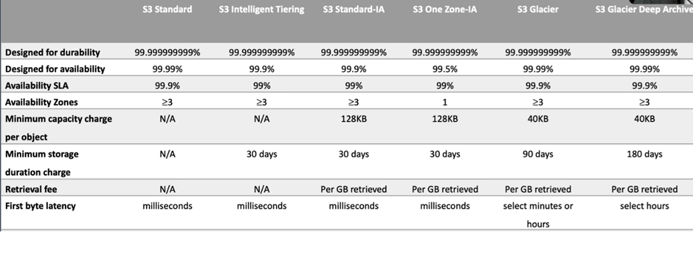
 
__IAM / Bucket policies__:
- IAM policies are identity-based policies.
- The principal is not defined within an IAM policy.
- Bucket policies are resource-based policies.
- Bucket policies, they can only be attached to Amazon S3 buckets.
- Use them when:
  - IAM policies if you need to control access to AWS services other than as S3.
  - numerous S3 buckets, each with different permissions requirements, IAM policies will turn out to be a lot easier to manage.
  - if you prefer to keep access control policies in the IAM environment.

__S3 Access Control Lists__:
- These are a legacy access control mechanism.
- AWS will generally recommend using S3 bucket policies or IAM policies rather than ACLs.
- They can be attached to a bucket or directly to an object,
- limited options for the grantees and the permissions that you can apply.
- Not as good as JSON-based IAM policy.
- Use it when:
  - simple way to grant cross account access to S3 without using IAM roles.
  - if your IAM policies are reaching the size limits,
  - you prefer to keep access control policies in S3.

__S3 Versioning__:
- Versioning is a means of keeping multiple variants of an object in the same bucket.
- You use versioning to preserve, retrieve, and restore every version of the object stored in your S3bucket.
- Versioning enabled buckets will enable you to recover objects from accidental deletion or overwrites.

Lifecycle management:
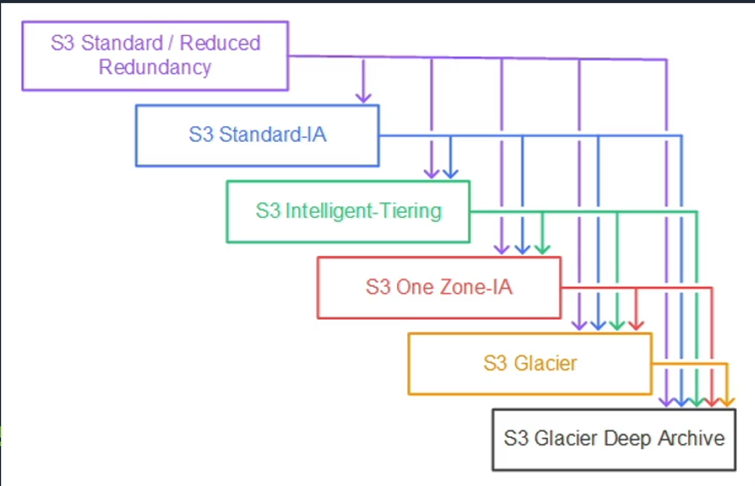
 
Multi-Factor Authentication Delete:
- Adds an MFA requirement for bucket owners to the following operations:
  - changing the versioning state of a bucket
  - permanently deleting an object version,
- The x-amz-mfa request header must be included in the above requests.
- The second factor of authentication is generated by a hardware device or software program like an authenticator app such as the Google Authenticator app that we've used in this course. It does require versioning to be enabled on the bucket.
- Versioning can be enabled by:
  - bucket owners,
  - the root account,
  - AWS account that created the bucket,
  - authorized IAM users.
- MFA Delete can be enabled by the bucket owner only.

Protected API access with MFA:
- This is used to enforce another authentication factor, an MFA code when accessing resources and not just S3.
- It's enforced using the AWS MultiFactorAuthAge key in a bucket policy.

S3 encryption:
- SSE-S3, using S3's existing encryption key for AES 256 encryption.
- SSE-C you're uploading your own AES 256 encryption key, which S3 then uses for you.
- SSE-KMS is where you're using KMS keys
- client-side is where you have your own encryption keys and you're managing the encryption as well. There's no encryption happening on AWS you're doing it before you upload your objects.

Event notifications:
- this is where S3 sends notifications when an event happens in an S3 bucket.
- The destinations include SNS, SQS, and Lambda.

Multipart upload:
- uploads objects in parts, independently, in parallel and in any order
- It's performed using the Multipart upload API
- recommended for objects above 100 MB.
- can be used for objects from 5MB up to the maximum file size, which is 5TB.
- it has to be used for any objects larger than 5GB.

Transfer Acceleration:
- improving the performance of transfers of files,
- leverages the CloudFront edge locations.
- Used to accelerate uploads of objects over long distances, so you're reducing latency.
- Transfer Acceleration is as secure as a direct upload to S3,
- you're charged only if there's a benefit in the transfer time.
- You need to enable Transfer Acceleration on the S3 bucket. It cannot be disabled after that, but only suspended.

S3 copy API:
- you can copy objects up to five gigabytes.
- it can be used to:
  - generate additional copies of objects,
  - rename objects,
  - change the storage class or encryption at rest status,
  - move the objects between AWS locations and regions.
  - You can also change the object metadata.

Server Access Logging:
- provides detailed records for the requests that are made to a bucket.
- information that is logged includes the requester, the bucket name, the request time, request action, response status, and the error code.
- It's disabled by default.
- you only pay for the storage space that's actually used.
- You must configure a separate bucket as the destination,
- you can specify a prefix if you want to.
- You must also grant write permission to the Amazon S3 Log Delivery group on the destination bucket.

CORS with Amazon S3:
- is enabled through setting:
  - the access-control-allow-origin,
  - access-control-allow-methods,
  - access-control-allow-header.
- These settings are defined using rules
- the rules are added using JSON files in Amazon S3.

Cross Account Access Methods:
- Resource-based policies and IAM policies can be used for programmatic access to S3 bucket objects,
- resource-based ACL and IAM policies for programmatic access to S3 bucket objects as well.
- If you need programmatic and console access, you can use cross account IAM roles.

Performance optimizations:
- S3 does support at least 3,500 PUT, COPY, POST, DELETE, or 5,500 GET HEAD requests per second per prefix in a bucket.
- You can increase, read or write performance by parallelizing reads.
- You can use Byte-Range Fetches.
- You can retry requests for latency sensitive applications
- you can combine S3 and EC2 in the same region for better performance.
- you can use Amazon S3 Transfer Acceleration to minimize any latency caused by long distances.

### Architecture Patterns

#### A  company is concerned about accidental deletion of Amazon S3 objects.

Well, they might want to mitigate this by using S3 Versioning.

#### Data stored in S3 is frequently accessed for 30 days, then is rarely accessed, but must be immediately retrievable.

Use a lifecycle policy to transition objects from S3 Standard to S3 Standard Infrequently Accessed after 30 days.

#### A backup of S3 objects within a specific folder in a bucket must be replicated to another region.

Configure cross-region replication and specify the folder name as a prefix.

#### Previous versions of objects in a versioning enabled S3 bucket must be stored long term at the lowest cost.

Create a lifecycle rule that transitions previous versions to S3 Glacier Deep Archive, and that's the cheapest option for storing that long term.

#### A company wishes to manage all encryption of S3 objects through their application with their own encryption keys.

Use client-side encryption with client managed keys.

#### Unencrypted objects in an Amazon S3 buckets must be encrypted.

Re-upload the objects because they're already there and you can't encrypt existing objects. And when you upload them, you can specify the encryption to use and the encryption key.

#### An administrator requires a notification when objects are deleted from an S3 bucket.

Configure an event notification that uses the SNS service.

#### A group of customers without AWS credentials must be granted limited access to a software update that is stored in an S3 bucket.

Generate a presigned URL and the users won't need an AWS account and it will be time limited.

#### Solutions architects require both programmatic and console access across AWS accounts.

For that, you can configure cross account access using IAM roles.

## DNS, Caching and Performance Optimization

Route 53:
- Route 53 gives you:
  - __domain name registry__,
  - __DNS resolution__,
  - __health checking__ of resources.
- It is __located along side edge locations__.
- Route 53 becomes the authoritative DNS server for registered domains and will create a public hosted zone for you.
- private DNS, lets you have an authoritative DNS server within your VPCs without exposing your DNS records.
- You can transfer existing domains to Route 53 if the top-level domain is supported.
- You can also transfer domain from Route 53 to another registrar, but you have to contact AWS support.
- You can transfer a domain to another account in AWS, but that doesn't migrate the zone by default.
- You can also have a domain registered in one AWS account and the hosted zone in another AWS account.

Hosted zone:
- is a __collection of records for a specified domain__.
- There are two types:
  - public hosted zone for routing traffic on the internet
  - a private hosted zone for your VPC, which helps to route traffic within your VPC.
- For private hosted zones, you must set the following VPC settings to true:
  - EnableDNSHostname
  - enableDNSSupport.

Health checks:
- check the instances health by connecting to it.
- you can point health checks:
  - endpoints,
  - status of other health checks
  - status of a CloudWatch alarm.
- Endpoints can be IP addresses or domain names.

Two types of DNS record:
- CNAME
  - Route 53 charges for queries.
  - You can't create CNAME a record at the top node of DNS namespace,
  - If you have the domain namespace example.com, you can't create a CNAME for example.com, but you can for www.example.com because that's a subdomain. So, not the zone apex.
  - A CNAME can point to any DNS record hosted anywhere.
  - __CNAME records must point to a domain, never to an IP address__
  - Example: use CNAME records to point ftp.example.com and www.example.com to the DNS entry for example.com
- A record:
  - __maps a domain name to an IP address__
  - Example: "google.com" pointing to the IP address "74.125.224.147"
- Aliases:
  - Route 53, doesn't charge for queries to AWS resources.
  - You can create an alias record at the zone apex, which is what you can't do with CNAME, so it's a key difference.
  - An alias record can only point to CloudFront, Elastic Beanstalk, ELB, S3 buckets configured as static websites or to another record in the same hosted zone.
  - allows users to access a page or file at an alternative path. It's similar to having multiple front doors to one location
  - An ALIAS record can be used to point multiple domains to the same site, such as example.com, www.example.com, and blog.example.com all pointing to the same site

Routing policies:
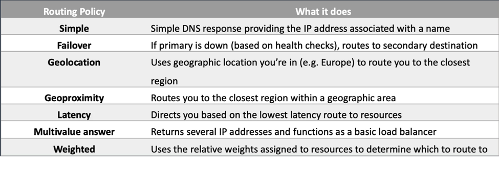
 
Amazon CloudFront:
- CDN as we know for __caching content around the world__.
- You __can define a maximum time to live__ and a default TTL for records.
- TTL is defined at the behavior level and CloudFront.
- This can be used to define different TTLs for different file types, so you could have a different time to live for your PNGs versus your JPEGs.
- __After expiration, CloudFront checks the origin for any new requests__.
- __Headers can be used to control the cache__:
  - the Cache-Control max-age in seconds, and that specifies how long before CloudFront gets the objects again from the origin server.
  - Expires: which specifies an expiration time and date.
- You __can also cache based on request headers__: forward headers in the viewer request to the origin.
- CloudFront can then cache multiple versions of an object based on the values in one or more request headers.
- Controlled in a behavior to do one of the following;
  - forward all headers to your origin, which means the objects are not cached.
  - forward a whitelist of headers that you specify.
  - forward only the default headers and then it doesn't cache the objects based on values in the request headers.

Signed URLs and cookies:
- With __signed URL__s:
  - these provide more control over access to content.
  - __You can specify the beginning and expiration date and time and IP addresses__ or ranges of IP addresses for users.
- With __signed cookies__, that's similar to signed URLs:
  - can use these when you don't want to change URLs,
  - they can also be used when you want to provide access to __multiple restricted files__, that's a key difference.
  - A signed URL is for a single object, whereas if you want multiple objects to be included, then you should use signed cookies.

Lambda@edge:
- This is where you run Node.js and Python Lambda functions to customize the content that CloudFront delivers,
- it __executes the functions closer to the view__ of a better performance.
- You can run Lambda@edge at the following points:
  - __after CloudFront receives a request__ from a viewer that's called a viewer request, before CloudFront forwards the request to the origin, that's an origin request,
  - __after CloudFront receives the response__ from the origin, origin response,
  - __before CloudFront forwards the response__ to the viewer and that's called the viewer response.

### Architecture Patterns

#### An elastic load balancer must be resolvable using a company's public domain name, a Route 53 hosted zone already exists.

create an alias record that maps the domain name to the ELB, and you must use an alias here rather than the CNAME.
A CNAME can be used for a subdomain. But in this case, it's not a sub domain and it's mapping to an ELB.

#### A website runs across two AWS regions. All traffic goes to one region and should be redirected only if the website is unavailable.

Create a failover routing policy in Route 53 and configure health checks on the primary.

#### Websites run in several countries and distribution rights require restricting access to content based on the geographic source of the connection.

use Route 53 geo-location routing and restrict distribution based on geographic location.

#### A CloudFront distribution has multiple S3 origins. Requests should be served from different regions based on file type being requested.

use a behavior and configure a path pattern. You do that within your distribution.

#### Content is accessed using an application and CloudFront distribution. You need to control access to multiple files on the distribution.

Configure signed cookies and then update the application so it processes those cookies.

#### An application runs behind an application load balancer in multiple regions. You need to intelligently route traffic based on latency as well as availability.

Create an AWS global accelerator and add the ALBs

## Block and File Storage

EBS:
- __volume data persists independently of the life of the EC2 instance__.
- EBS volumes do not need to be attached to an EC2 instance.
- you __can attach multiple EBS volumes__ to an instance.
- You an use __Multi-Attached to attach a volume to multiple instances__ with a few constraints.
- EBS volumes __need to be in the same AZ as the instances__ you're attaching them to.
- the __root EBS volumes are deleted on termination by default__.
- Extra non-boot volumes are not deleted on termination by default.

volume types:
- SSD:
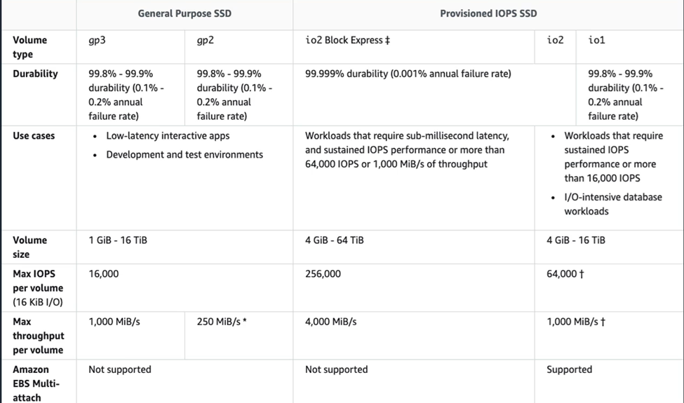

- HDD backed:
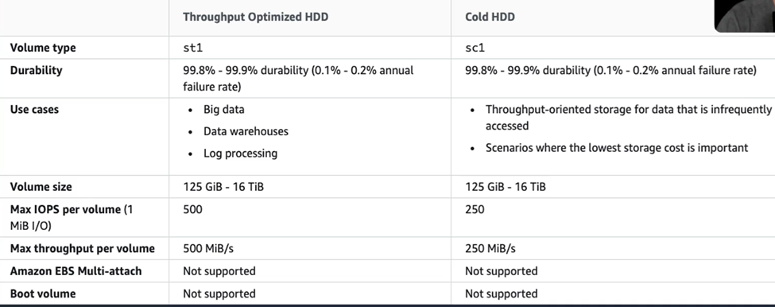

  - extremely cheap in comparison to the SSD-backed volumes.
  - Key thing to note here, there's no Multi-Attach enabled and you cannot use these as boot volumes.

Data Lifecycle Manager:
- automates the creation, retention, and deletion of EBS snapshots and EBS-backed AMIs.
- DLM helps with:
  - __protecting valuable data by enforcing a regular backup schedule__
  - __create standardized AMIs that can be refreshed at regular intervals__,
  - retain backups as you might need for auditors or compliance
  - __reduces storage costs by deleting outdated backups__.
  - create disaster recovery backup policies that backup data to other accounts.

EBS versus Instance Store:
- Instance Store volumes are high performance local disks physically attached to the host computer on which your instance is running.
- They are ephemeral, so the data is non-persistent.
- Instance stores are good for temporary storage of information that changes  frequently
- Instance store volume root devices are created from AMI templates stored on S3
- And Instance Store volumes cannot be detached and reattached.

AMIs:
- these __provide the information required to launch an instance__.
- AMI includes one or more EBS snapshots or for Instance Store-backed AMIs, a template for the root volume of the instance.
- Launch permissions that control which accounts can use the AMI
- a block device mapping specifying the volumes to attach to the instance.

AMIs categories:
- community AMIs,
- marketplace AMIs,
- your AMIs, the ones you create yourself.

EBS snapshots:
- __capture a point in time state__ of an instance.
- cost effective and easy backup strategy.
- __can be used to migrate a system to a new availability zone or region__.
- can also use them to __convert an unencrypted volume to an encrypted volume__.
- Snapshots are __stored on S3__.
- EBS volumes are __AZ specific__, but __snapshots are region specific because they're on S3__.

RAID with EB
- RAID is a Redundant Array of Independent Disks.
- It's not provided by AWS. It's something you configure in your operating system.
- __RAID 0__,
  - This is __striping data for performance__.
  - You need two or more disks
  - if one disk fails the entire RAID set fails.
- __RAID 1 is mirroring__
  - data across disks for __redundancy and fault tolerance__.
  - If one disk fails, the other disk is still working.
  - data gets sent to two EBS volumes at the same time.

EBS encryption:
- you can encrypt both the boot and data volumes of an EC2 instance
- What is encrypted:
  - The data at rest inside the volume,
  - all data moving between the volume and the instance,
  - all snapshots that get created from the volume.
  - all volumes created from those snapshots.
- Encryption is supported by all EBS volume types.
- all instance families support encryption as well.

Amazon Elastic File System:
- fully managed file system solution accessed using the __NFS protocol__.
- You get __elastic storage capacity__
- you __pay only for what you use__.
- You get __multi-AZ metadata and data storage__.
- can configure __mount points in one or many AZs__.
- __can mount from on-premises systems, but only if you have a Direct Connect or VPN connection__.
- you can use the AWS Data Sync service to synchronize data into an AWS EFS.
- EFS is elastic and grows and shrinks as you add and remove data.
- can scale up to petabytes.
- can __concurrently connect up to thousands of EC2 instances from multiple AZs within a region__.
- You can choose general purpose or Max I/O Both SSD-backed.
- Data always get stored across multiple AZs within a region
- you get __read-after write consistency__.
- You need to create mount targets and choose the AZs to include

Access control:
- use IAM to control who can administer your file system.
- For controlling access to files and directories, there's a __POSIX compliant user and group level permissions__ that you can apply.
  - POSIX permissions allow you to restrict access from hosts by user and group.
- EFS security groups act as a firewall and the rules you add to find the traffic flow, who's allowed to connect to your file system.

For encryption:
- EFS offers the ability to encrypt data at rest and in transit.
- Encryption at rest must be enabled at file system creation time.
- Encryption keys are managed by AWS KMS.
- Data encryption in transit uses transport layer security.

Data Sync:
- is a service that you can use for transferring data into EFS.
- provides a fast and simple way to securely sync existing file systems into Amazon EFS.
- You can securely and efficiently copy files over the internet or a Direct Connect connection.
- Copies file data and file system metadata such as ownership, timestamps, and access permissions.

FSx
- provides a fully managed third-party file system.
- provides you with two options to choose from:
  - __FSx for Windows File Server__, for Windows based apps 
    - FSx for Windows File Server provides a fully managed native Microsoft Windows File System.
    - get full support for SMB, Windows NTFS, and Microsoft AD.
    - supports Windows Native File System features, ACL, shadow copies, and user quotas, NTFS file systems
    - that can be accessed from up to thousands of computer instances using SMB.
    - replicates data within an AZ. And in terms of Multi-AZ,
    - the file systems include an active and standby file server in separate AZs.
  - __Amazon FSx for Lustre__ for compute intensive workloads.
    - high-performance file system optimized for fast processing of workloads such as machine learning, high performance computing, video processing, financial modelling,
    - It works natively with S3, which means you can transparently access your S3 objects as files.
    - S3 objects are presented as files in the file system, and you can write your results back to S3.
    - It also provides a POSIX compliant file system interface.

Storage gateway – File gateway:
- This provides an __on-premises file server__.
- You can store and retrieve files as objects in S3.
- You can use it with __on-premises applications and EC2-based applications__ that need file storage in S3 for object-based workloads.
- File gateway offers SMB or NFS-based access to data in S3 with local caching.

Storage gateway - volume gateway:
- This supports __block-based volumes__. So, it's an iSCSI protocol that you use to connect.
- You've got cached volume mode where the entire data set is stored on S3, and a cache of the most frequently accessed data is on site.
-  Stored volume mode means that the entire data set is stored on site and asynchronously backed up to S3

Storage gateway - tape gateway:
- used for back up with popular backup software.
- Each gateway is pre-configured with a media changer and tape drives, all virtual, of course.
- supported by NetBackup, Backup Exec, Veeam and so on.
- When creating virtual tapes, there are various sizes available.
- Annotate gateway can have up to 1,500 virtual tapes with a maximum aggregate capacity of one petabytes.
- All data transferred between the gateway and AWS storage is encrypted using SSL.
- all data stored by Tape Gateway in S3 is encrypted with server-side encryption using Amazon S3 managed encryption keys, SSE-S3

### Architecture Patterns

#### simple method of backing up Amazon EBS volumes and it needs to be fully automated.

Use Data Lifecycle Manager to create a backup schedule.

#### A distributed application has many nodes that each hold a copy of data that is synchronized between them, and you need the best performance for your storage subsystem.

use instance stores for storing the data. That would give you great performance, and you don't have to worry about it being ephemeral because the data is synchronized.

#### An application must start out quickly when launched by an ASG, but requires app dependencies and code to be installed.

Create an AMI that includes the application dependencies and code.
That means you don't have to run the installation process when the system starts, when it first launches.

#### Many Linux instances must be attached to a shared file system that scales elastically.

use an EFS file system and mount from each instance.

#### A company requires a managed file system that uses the NTFS file system.

use Amazon FSx for Windows File Server.

#### On-premises servers must be able to attach a block storage system locally, and the data should be backed up to S3 as snapshots.

use a storage gateway, volume gateway that's in stored volume mode.

#### An Amazon EBS volume must be moved between regions.

take a snapshot and copy the snapshot between regions.

#### Root EBS volumes for critical application must not be deleted on termination.

modifying the delete on termination attribute when you launch the instances.

#### On-premises servers use NFS to attach a file system, the file system should be replaced with an AWS service that uses S3 with a local cache.

use a storage gateway, file gateway and that will give you the local cache and it backs onto S3.

## Docker Containers and ECS

Key features of the Elastic Container Service:
- __serverless computing with AWS Fargate__ managed for you and fully scalable.
- __Fully managed container orchestration__. The control plane is managed for you.
- __Docker support__, you can run and manage Docker containers with integration into the Docker compose CLI.
- You also get __Windows Container Support__. ECS supports management of Windows containers.
- You get __Elastic Load Balancer integration__ so you can distribute traffic across containers using either an ALB or an NLB.
- You get Amazon ECS anywhere. It enables the use of the ECS control plane to manage on-premises implementations.

ECS components:
- __Cluster__: It's a __logical grouping of EC2 instances__. you can create IAM policies for your clusters to allow or restrict users access to specific clusters.
- A __container instance__: is an EC2 instance that runs the ECS agent.
- __Container agent__: The container agent __runs on each infrastructure resource on an ECS cluster__. The container agent is included in the Amazon ECS optimized AMI. The container agent is Linux and Windows-based. And for non-Linux instances to be used on AWS, you must manually install the ECS container agent.
- A __task definition__ is a __blueprint that describes how a Docker container should launch__, It's a text file in JSON format that describes one or more containers up to 10. Task definitions use Docker images to launch the actual containers. And you can specify the number of tasks to run.
- __task__ itself is a __running container__ using settings from a task definition.
- A __service__ is used to define long running tasks, and you can control how many tasks you want to run. You can also use auto scaling and elastic load balancing.

Launch types: determine the type of infrastructure on which your tasks and services are hosted:
- Amazon __EC2 launch type__
  - explicitly provision EC2 instances,
  - you're responsible for upgrading, patching, and taking care of that pool of instances
  - you handle cluster optimization,
  - you get more granular control over infrastructure.
- __Fargate__
  - the control plane asks for resources and Fargate provisions,
  - it's fully serverless.
  - provisions the compute as needed and handles all cluster optimization.
  - You have limited control as the infrastructure is automated, but also you have less management overhead.

ECS images:
- containers are created from Read-Only templates called an image, which has the instructions for creating a Docker container.
- Images are built from a Docker file.
- only Docker containers are currently supported.
- An image contains the instructions for creating the container.
- Images are stored in a registry such as Docker Hub or the Elastic Container Registry.
- ECR is a managed AWS Docker registry service that is secure, scalable, and reliable, and it's also private.

Auto scaling for ECS:
- service autoscaling:
  - adjusts the desired task count up or down using the application auto scaling service.
  - supports target tracking, step, and scheduled scaling policies
- cluster auto scaling:
  - uses a capacity provided to scale the number of EC2 cluster instances using EC2 auto scaling.
  - the ASG can automatically scale using managed scaling and managed instance termination protection can be configured as well.

Elastic Kubernetes Service, EKS
- use this when you need to standardize container orchestration across multiple environments using a managed Kubernetes implementation.
- can have a hybrid deployment where you manage Kubernetes clusters and applications across hybrid environments like AWS and on-premises.
- Batch processing where you're using the Kubernetes Jobs API.
- It can be used for machine learning use cases and web applications as well.

ECS versus EKS
- So, both are all managed, highly available, highly scalable container platforms.
- ECS, it's AWS specific and supports Docker. It's considered simpler to learn and use and it leverages various AWS services.
- EKS, it's compatible with Kubernetes, so it's easy to lift and shift from other Kubernetes deployments. Kubernetes is considered to be more feature rich and complex and has a steep learning curve.

### Architectural Patterns

#### application will be deployed on Amazon ECS and it must scale based on memory.

use service auto scaling and use the memory utilization as the metric to follow.

#### An application will run on ECS tasks across multiple hosts and needs access to an S3 bucket.

use a task execution IAM role to provide permissions to the S3 bucket. So remember this is task level, not host level.

#### A company requires standard Docker container automation and management service to be used across multiple environments.

use Amazon EKS. If they're looking for industry standards rather

#### A company plans to deploy Docker containers on AWS at the lowest cost.

use ECS with a cluster of spot instances and enable spot instance draining.
You might actually find that Fargate is cheaper because you're paying for the tasks themselves rather than the cluster hosts, but it really depends on your workload.

#### A company plans to migrate Docker containers to AWS and does not want to manage operating systems.

use Fargate because it is serverless,

#### Multiple microservices applications running on ECS need to route based on information in the HTTP header.

use an ALB in front of ESC and use query string parameter-based routing.

#### A containerized app runs on Amazon EKS and you need to collect and centrally view metrics and logs including EKS namespaces and EKS services.

use the CloudWatch performance monitoring tool and it has a feature called Container Insights. And you can view that data in the CloudWatch console.

## Serverless Applications

Serverless Services:
- no instances to manage.
- don't need supervision hardware
- there's no management of operating systems or software
- capacity provisioning and patching is handled automatically
- it provides automatic scaling and high availability.
- can be very cheap to run serverless services.

Lambda:
- Lambda runs code as functions.
- Lambda executes the code only when needed and __scales automatically__.
- You __pay only for the compute time you consume__ and you pay nothing when your code is not running.
- You specify the amount of memory you need allocated to your Lambda functions.
- Lambda __allocates CPU power proportional to the memory__ you specify using the same ratio as a general purpose EC2 instance type.
- There is a __maximum execution time out, and that's 15 minutes or 900 seconds. And the default is 3s__.
- Lambda terminates the function at the timeout.
- Lambda is an event-driven compute service.
- An __event source is an AWS service application that produces events that trigger an AWS Lambda function__.
- Event sources are mapped to Lambda functions.
- __For stream-based services Lambda performs the polling e.g. DynamoDB and Kinesis__. So that means Lambda checks with the stream based service rather than the polling coming the other way.
- Benefits of Lambda:
  - there's no service to manage.
  - continuous scaling,
  - millisecond billing,
  - integrates with almost all other AWS services.
- The primary use cases:
  - data processing,
  - real time file processing,
  - real time streaming processing,
  - building serverless backends for various different use cases.

Different types of function invocation:
- synchronous
  - CLI,SDK, or API Gateway.
  - result gets returned immediately.
  - Error handling happens on the client side
- Asynchronous:
  - S3, SNS, and CloudWatch events.
  - Lambda will retry up to 3 times,
  - processing needs to be idempotent.
- event source mappings:
  - SQS, Kinesis data streams, and DynamoDB streams
  - Lambda has the mapping to the stream-based service.
  - Lambda does the polling,
  - Records get processed in order except for SQS Standard.

Serverless services:
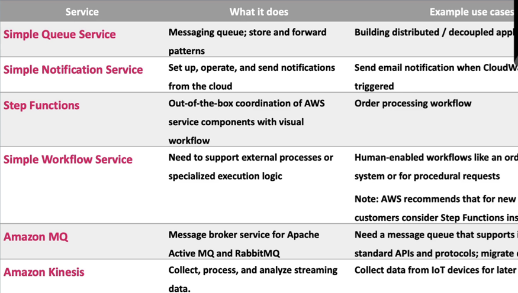

Kinesis vs SQS vs SNS
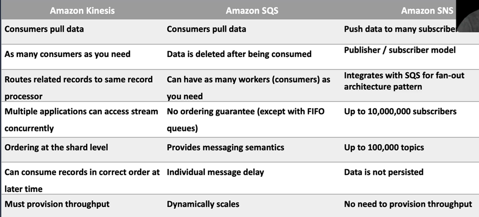
 
SQS Queue Types
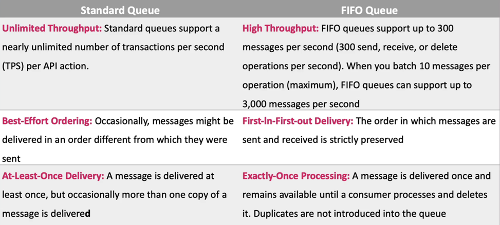
 
__FIFO queue__:
- require the __message group ID__ and __message deduplication ID__ parameters to be added to messages.
- The message group ID: is a tag that indicates that a message belongs to a certain group.
- The deduplication ID is used for deduplication of messages within a specific interval.

We then have a dead-letter queue. This is designed for handling message failure. It lets you set aside and isolate messages so that you can look at them later on and process them.
It's not a queue type, it's a configuration of a queue.

Long polling versus short polling:
- Long polling as a way to retrieve messages from SQS queues and it waits for messages to arrive. Long polling can lower costs. Long polling is enabled at the queue level or at the API level with the wait time seconds parameter. Long polling is in effect when the receive message wait time is a value greater than zero up to 20 seconds.
- Short polling returns immediately even if the queue is empty. So that can turn out more expensive from an API cost perspective.

SNS
- is a highly available, durable, secure, fully managed publisher/subscriber messaging service.
- it provides topics for high throughput, push-based, many-to-many messaging.
- can fan out messages to a large number of subscriber endpoints. And those include SQS queues Lambda functions, HTTP or HTTPS webhooks, mobile push, and SMS, and also, of course, email.
- Multiple recipients can be grouped using topics. And that's essentially an access point that allows the recipients to subscribe to get the same copy of a message.
- One topic can support deliveries to multiple endpoint types
- simple APIs and easy integration with applications is available with SNS.
- you get flexible message delivery over multiple transport protocols.

SNS plus SQS fan out is where you subscribe one or more SQS queue to an SNS topic. And SQS manages the subscription and any necessary permissions.

When you publish a message to a topic, SNS sends the message to every subscribed queue.

Step Functions:
- allows you to build distributed applications as a series of steps
- in a visual workflow, so it's an orchestration service.
- You can run state machines to execute the steps of your application,
- it's a managed workflow and orchestration platform, scalable and highly available
- you get to define your app as what's called a state machine.
- You create the tasks, sequential steps, parallel steps, branching paths, or timers.

EventBridge:
- This is a serverless event bus for building event-driven applications.
- Events are generated by custom applications, SAS applications, or AWS services
- an event is a signal that a systems state has changed.
- it routes events to AWS service targets and API destinations via HTTP endpoints.
- targets include Lambda, SNS, SQS, and API Gateway.

API Gateway:
- fully managed service for publishing, maintaining, monitoring and securing APIs
- An API endpoint type refers to the hostname of the API.
- all of the APIs created with API Gateway expose HTTPS endpoints only.
- The endpoint type can be edge-optimized if you've got a global user base, regional if your user base is within a region or private if you want to provide access only within a VPC or to computers connected over a Direct Connect connection.
- API Gateway also has caching.
- you can add caching to API calls by provisioning the cache and specifying its size in gigabytes. That means you can cache the end points response.
- Caching can reduce the number of API calls to your backend and improve latency.
- Throttling with API Gateway, where you're setting a limit on the steady state rate and the burst of request submissions against the APIs in your account.
- By default, API Gateway limits to steady state requests to 10,000 requests per second and the maximum concurrent request is 5,000 across all APIs within the account. If you go over those limits, you get a 429 too many requests error message.
- if those exceptions occur, then you'll need your client application to resubmit the failed requests in a way that doesn't exceed those rate limits again.

### Architecture Patterns

#### an application includes EC2 and RDS and spikes in traffic are causing writes to be dropped by RDS.

You can decouple EC2 and RDS with an SQS queue and you can use Lambda to process the records from the queue.

#### A web app includes a web tier and a processing tier. And it must be decoupled and the processing tier should dynamically scale based on the number of jobs.

decouple the web tier and the processing tier with an SQS queue. You can scale with auto scaling based on the queue length.

#### A Lambda function execution time has increased significantly as the payload size increased.

optimize execution time by increasing the memory available to the function. It will proportionately increase the amount of CPU available to the function as well.

#### Statistical data stored in RDS and will be accessed using a REST API. Demand will range from no traffic to sudden bursts of traffic and it's unpredictable.

create a REST API using API Gateway and integrate with a Lambda function for connecting to the RDS database.

#### A new application processes customer orders and consists of multiple decoupled tiers. Orders must be processed in the order they are received.

you need SQS with a FIFO queue to preserve the record order.

#### An app uses API Gateway and Lambda. During busy periods, many requests fail multiple times before succeeding and no errors are reported in Lambda.

The cause of this could be that the throttle limit is set too low. So, you just need to increase that and that will hopefully resolve the issue.

#### EC2 instance processes images using JavaScript code and stores the results in S3. The load is highly variable and you need a more cost-effective solution.

replace EC2 with a Lambda function.

#### An app uses an API Gateway Regional Rest API. It's just gone global and performance has suffered

in that case, they might want to convert the API to an edge-optimized API to optimize for a global user base. And then it will use the CloudFront edge network and improve latency and performance.

#### A legacy application uses many batch scripts that process data and pass on to the next script. And it's complex and difficult to maintain.

Use Lambda functions along with step functions for coordinating and orchestrating the application.

#### Objects uploaded to an S3 bucket must be processed by Lambda.

For this, you can create an event source notification to notify Lambda to process the new objects.

## Database and Analytics

Different options:
- We can use a database on EC2. We might do that if we need full control over the instance in the database or maybe the third party database engine is not available on RDS.
- RDS is where we need a traditional relational database.
- DynamoDB is a NoSQL database, it gives you in-memory performance, and is useful for where your I/O needs are very high. It also offers dynamic scaling.
- Redshift is more for data warehouses for large volumes of aggregated data.
- ElastiCache is for temporary storage for small amounts of data. It's also in-memory.
- EMR is used for running analytics workloads using Hadoop.

RDS:
- RDS uses instances, so you have to choose the instance family and type.
- It's a relational database, so it uses SQL.
- RDS is an online transaction processing type of database.
- It's easy to set up, highly available, fault tolerant, and scalable.
- Can encrypt your RDS instances and your snapshots at rest by enabling the encryption option. And you do that when you create the database. Encryption uses KMS keys.
- supports the following engines, SQL, Oracle, MySQL, Postgres, and Aurora and also MariaDB.
- scales up by increasing the instance size for compute and storage.
- Read replicas are an option for read heavy workloads and that scaling out your reads.
- Disaster recovery with the Multi-AZ option.

Multi-AZ versus read replica
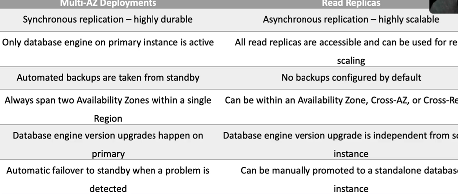

RDS manual backups are snapshots:
- they backup the __entire DB instance, not just individual databases__.
- For __single AZ DB instances, there's a brief suspension in I/O__.
- For __multi-AZ SQL, I/O activity is briefly suspended on the primary__.
- For Multi-AZ, MariaDB, MySQL, Oracle, and Postgres, the snapshot gets taken from the standby.
- Snapshots do not expire. There's no retention period.

RDS Maintenance Windows:
- Operating system and database patching can require taking that database offline,
- those tasks take place during a maintenance window
- by default, a weekly maintenance window is configured, but you can choose your own.

RDS Security:
- encryption at rest can be enabled, and that includes the database storage, backups, read replicas and snapshots.
- You can only enable it when you create the instance, not afterwards.
- DB instances that are encrypted can't be modified to disable encryption,
- it uses AES 256 encryption, which is transparent with minimal performance impacts.
- Oracle and SQL, they also support transparent data encryption, which may have a performance impact.
- KMS is used for managing encryption keys.
- You can't have an encrypted read replica of an unencrypted DB instance or an unencrypted read replica of an encrypted DB instance.
- Read replicas of encrypted primary instances are encrypted and the same KMS key is used if in the same region as the primary, or if it's in a different region, a different KMS key is used.
- You can't restore an unencrypted backup or snapshot to an encrypted DB instance.

Aurora:
- This is an AWS database offering in the RDS family.
- Aurora is a MySQL and Postgres compatible relational database built for the cloud.
- Aurora is __up to 5 times faster than standard MySQL and 3 times faster than Postgres__.
- Aurora features a distributed fault tolerant, self-healing storage system that scales up to 128 terabytes per database instance.
- key features of Aurora:
  - Gives you high performance self-healing storage up to 128 terabytes.
  - Point-in-time recovery and continuous back up to S3
  - compatible with MySQL and Postgres databases.
  - in-region read scaling __failover target with up to 15 Aurora replicas__
  - __cross-region scaling with failover targets with MySQL replicas__.
  - Global database is a cross-region cluster with read scaling and it gives you fast replication and low latency reads. And you can remove the secondary and promote it if you need to.
  - __Multi-master scales out writes within a region__
  - __serverless__ is an on-demand auto scaling configuration for Aurora. Does not support read replicas or public IPs.

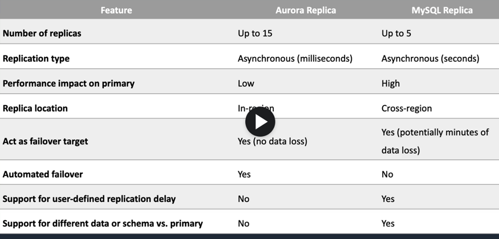

When should you not use RDS?
- Any time you have a DB type other than the supported database engines.
- you need root access to the operating system. You won't be able to do that on RDS.
- for large binary objects, S3,
- automated scalability, name/value data structures or data that's not well structured or is unpredictable. Those would be better on DynamoDB.

ElastiCache
- fully managed implementation of Redis and Memcached.
- It's a key value store
- an in-memory database with great performance and low latency.
- You can put it in front of databases such as RDS and DynamoDB.
- nodes run on EC2 instances,

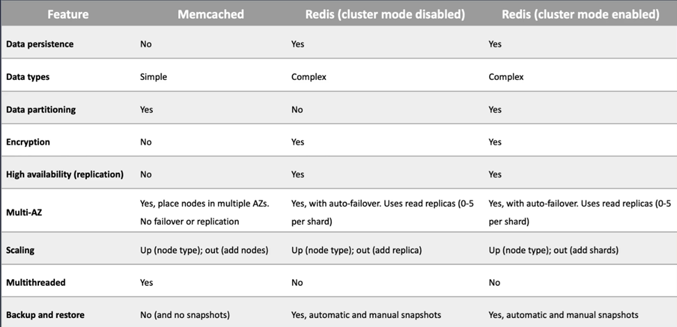
 
DynamoDB
- It's a fully managed NoSQL database service.
- It's a key value store and a document store.
- It's fully serverless and you get push button scaling.
- you can achieve ACID compliance with DynamoDB transactions.
- Data is synchronously replicated across three facilities in a region.
- DynamoDB is schema-less.
- it can be used for storing session state data.
- It provides two read models, eventually consistent reads and strongly consistent reads.
- two pricing models:
  - on-demand capacity where DynamoDB charges you for the data reads and writes your application actually performs.
  - Provisioned capacity mode means that you specify the number of reads and writes, and you'll pay whenever it's used or not.
- We can define a TTL, so the items in our table will expire after a period of time.
- key features a DynamoDB:
  - It's serverless, fully managed, and fault tolerant.
  - It's highly available with great availability, even better with global tables.
  - It's a NoSQL type of database with a name/value structure, so good when you need a flexible schema.
  - It gives you horizontal scaling with push button scaling and auto-scaling options.
  - Transaction options are strongly consistent or eventually consistent reads as well as support for ACID transactions.
  - Backup is point in time recovery down to the last second in the last 35 days
  - on-demand backup and restore as well.
  - Global Tables is a multi-region multi-master solution.

DynamoDB streams:
- captures a time mode sequence of item level modifications in your table,
- stores them in a log file for up to 24 hours,
- you can process that data.
- you can configure what data is actually written. Keys only, new image, old image, or new and old images.
      
DynamoDB Accelerator:
- fully managed in-memory cache for DynamoDB,
- will reduce latency from milliseconds to microseconds.
- can be both a read-through cache and a write-through cache.
- DAX is updated only if DynamoDB is successfully updated first.
- you don't need to modify any application logic, DAX is fully compatible with the DynamoDB APIs.

Redshift:
- This is a SQL-based data warehouse used for analytics.
- You get to analyze data using standard SQL and business intelligence tools.
- it's a relational database used for OLAP use cases.
- Redshift uses EC2 instances, so you have to choose the instance family and type.
- it always keeps free copies of your data and provides continuous and incremental backups.
- Use cases are where you need to perform complex queries or massive collections of structured and semi structured data with great performance, frequently access data that needs a consistent, highly structured format.
- You can use Spectrum for direct access of S3 objects in a data lake.
- it's a managed data warehouse solution with automated provisioning, configuration and patching, data durability with continuous backup to S3 and it scales with simple API calls.
- It also offers exabyte scale query capability.

EMR:
- is a managed cluster platform that runs Apache Hadoop and Apache Spark.
- Its use for processing data for analytics and business intelligence.
- you can transform and move large amounts of data.
- performs ETL functions.

Kinesis Data Streams:
- enables real time processing of streaming big data.
- can move data off data producers and then process that data.
- Producers send data to Kinesis and it's stored in shards for 24 hours, and that's the default, up to seven days.
- Consumers then take the data and process it, and they can save it to another service.
- allows for the later processing by applications rather than with Firehose where it delivers the data directly to an AWS service.
- Kinesis data streams is real time with around 200 milliseconds of delay.
- The Client Library helps you consume and process data from the Kinesis Stream, and each shard is processed by exactly one KCL worker and has one corresponding record processor.
- One worker can process any number of shards, so it's fine if the number of shards exceeds the number of instances.

Kinesis data Firehose:
- __captures, transforms, and load streaming data__.
- __Producers send the data to a Firehose, there are no shards, it's completely automated__, so scalability is elastic unlike data streams where you have to add shards.
- __Firehose data is sent to another service for storing and data can be optionally processed and transformed using Lambda__.
- It enables near real time analytics.
- it's near real time, so around 60 seconds of latency.
- Firehose destinations include Redshift, ElasticSearch, Amazon S3, Splunk, Datadog, MongoDB, and New Relic, as well as an HTTP endpoint.

Kinesis data analytics:
- you get __real time SQL processing for streaming data__.
- It provides __analytics for data coming from data streams or data firehose__.
- Destinations can be data streams, data firehose or lambda.
- you can quickly author and run powerful SQL code against those streaming sources.
- It can ingest data from both streams and firehose.

Amazon Athena:
- is used for querying data in S3 using SQL.
- you can connect it to other data sources with Lambda.
- Data can be in various formats.
- uses a managed data catalog, AWS Glue to store information and schemas about the databases and tables.
- How do you optimize Athena for performance:
  - partition your data,
  - bucket your data, so bucket the data within a single partition.
  - Use compression. AWS recommend using Apache Parquet or Apache ORC.
  - Optimize file sizes.
  - Optimize columnar data storage generation
  - Optimize order buy and optimized group buy,
  - use approximate functions
  - only include the columns that you actually need.

AWS Glue:
- is a fully managed extract, transform, and load service used for preparing data for analytics.
- It runs the ETL jobs on a fully managed scale-out Apache Spark environment.
- Glue discovers data and stores the associated metadata in the Glue data catalog
- it works with data lake, so data on S3, data warehouses like Redshift, and data stores, including on RDS and EC2.
- You can use a crawler to populate the Glue data catalog with tables.
- the crawler can crawl multiple data stores in a single run.
- Upon completion, the crawler creates or updates one or more tables in your data catalog.
- ETL jobs that you define in Glue use the data catalog tables as sources and targets.

### Architecture Patterns

#### relational database running on MySQL must be migrated to AWS and must be highly available.

use RDS MySQL and Configure a Multi-AZ standby node for high availability.

#### An RDS DB has high query traffic that's causing performance degradation.

that's great for a read replica, and you must configure the application to use the reader endpoint for any database queries.

#### An RDS DB is approaching its storage capacity limits and or is suffering from high write latency.

you have to scale up the DB instance to an instance type that has more storage and CPU.
So that means changing the instance type rather than adding a read replica.

#### And RDS database is unencrypted and you need a cross-region read replica, which must be encrypted.

create an encrypted snapshot of the main DB, create a new encrypted DB instance from the encrypted snapshot and then create an encrypted cross-region read replica.

#### Amazon Aurora DB deployed and requires a cross region replica.

use the Aurora MySQL replica type in the second region.

#### Aurora DB is deployed and requires a read replica in the same region with minimal synchronization latency.

use an aurora replica rather than a MySQL replica. And it could be in a different availability zone. And that will help your paycheck.

#### Aurora is deployed and an app in another region requires read only access with low latency. Synchronization latency must also be minimized.

use the Aurora global database and configure the app in the second region to use the reader endpoint, and that will help with the latency issues.

#### An application in DB migrated to Aurora and requires the ability to write to the DB across multiple nodes.

use Aurora Multi-Master for an in-region multi-master database.

#### An application requires a session state data store that provides low latency.

either ElastiCache or DynamoDB.

#### A multi-threaded in-memory datastore is required for unstructured data.

use ElastiCache with Memcached and that would be needed for the multi-threaded application, you wouldn't be able to use Redis.

#### An in-memory datastore required that offers microsecond performance for unstructured data.

use DynamoDB DAX, the DynamoDB Accelerator.

#### An in-memory datastore is required that supports data persistence and high availability.

use ElastiCache and you would need to use the Redis engine.

#### A serverless database is required that supports a NoSQL key value store workload.

Use Amazon DynamoDB.

#### A serverless database is required that supports MySQL or PostgreSQL.

use Amazon Aurora Serverless.

#### A relational database is required for a workload with an unknown usage pattern.

usage is expected to be low and variable., that would be Aurora Serverless

#### An application requires a key value database that can be written to from multiple regions.

DynamoDB Global Tables would be a good solution.

#### Amazon Athena is being used to analyze a large volume of data based on date ranges, and the performance must be optimized.

you can store data using Apache Hive partitioning with a key based on the data. And you can use Apache Parquet and ORC storage formats.

#### Lambda is processing streaming data from API Gateway and it's generating a too many requests exception as the volume increases.

stream the data into Kinesis data stream from API Gateway and then process it in batches.

#### A Lambda function is processing streaming data that must be analyzed with SQL.

load the data into a Kinesis data stream and then analyze it with Kinesis Data Analytics to get that SQL analysis.

#### Security logs generated by the AWS web application firewall must be sent to a third party auditing application.

send the logs to Kinesis Data Firehose and configure the auditing application using an HTTP endpoint.

#### Real time streaming data must be stored for future analysis.

use Kinesis data streams for the real time streaming and then Firehose to load the data to a data store where you might want to analyze it later on.

#### A company runs several production databases and must run complex queries across consolidated datasets for business forecasting.

load the data from the OLTP databases into a Redshift data warehouse for OLAP.

## Deployment and Management

CloudFormation:
- CloudFormation deploys infrastructure using code, and that code is in JSON or YAML.
- Infrastructure is provisioned consistently with fewer mistakes or less chance of human error.
- less time and effort than configuring resources manually.
- can use version control and peer review for your CloudFormation templates, and it's free to use,
- you only pay for the resources that are provisioned.
- It can be used to manage updates and dependencies, and you can roll back and delete the entire stack as well.
- The core components:
  - templates, which are JSON or YAML text files that contain the information to build out the environment.
  - stack is then created, and that's the entire environment as described by the templates.
  - Stack sets allow you to extend the functionality of stacks across accounts and across regions.
  - Change sets show you the proposed changes to a CloudFormation stack when you upload a new template so you can see what's going to happen before it does.
      
Elastic Beanstalk:
- can be used to quickly deploy and manage web applications in the cloud.
- It's considered to be a platform as a service solution.
- you upload code to Elastic Beanstalk and then it deploys the environment for you, including capacity provisioning, load balancing, auto scaling, and health monitoring.
- supports various different programming languages like Java, .Net, PHP, Node.js and so on.
- There are several layers to Beanstalk:
  - Applications: they contain the environments, the environment configurations, and application versions.
    - You can have multiple application versions within an application.
    - A version is a specific reference to a section of deployable code.
    - The application version will point typically to an S3 bucket, where the code is stored.
  - Environments: are an application version that's been deployed on AWS resources.
    - The resources are configured and provisioned by Elastic Beanstalk.
    - The environment is comprised of all resources created by Beanstalk and not just an EC2 instance with your uploaded code.
- In Beanstalk, we have web servers and workers:
  - Web servers are standard applications listening for and processing HTTP requests typically, over port 80.
  - Workers are specialized applications used for long running background tasks, and they use an SQS queue.
  - Workers should be used for any long running tasks.

SSM Parameter Store:
- provides secure hierarchical storage for configuration data and secrets.
- It's highly scalable, available and durable.
- can store things like passwords, database strings and license codes as parameter values.
- It stores values as plain text, unencrypted or encrypted ciphertext.
- You can reference values by using the unique name you specified when you created the parameter.
- There's no native rotation of keys with Parameter Store.

AWS Config:
- evaluates your resource configurations for desired settings.
- gives you a snapshot of the current configurations of resources that are associated with your account.
- You can retrieve the configuration of resources that exist.
- You can also retrieve historical configurations of one or more resources,
- you can receive a notification whenever a resource is created, modified or deleted.
- You can view relationships between resources as well.

Secrets Manager:
- This is another way that you can store secrets.
- it will rotate them for you as well without the need for deploying your own code.
- Automatic rotation is built in for Amazon RDS with MySQL, Postgres, Aurora, Amazon Redshift, and DocumentDB.
- For any other services, you have to write your own Lambda function code to perform the automation of the rotation.
- So when you're comparing Secrets Manager with Parameter Store, you get automatic rotation with Secrets Manager built in for some services or use lambda for others.

AWS OpWorks:
- is a configuration management service providing managed instances of Chef and Puppet.
- Updates include patching, updating, backup configuration, and compliance management.

AWS Resource Access Manager:
- You can share resources with RAM across AWS accounts, within organizations or Ous and IAM rules, and IAM users.
- Resource shares are created with the RAM console, the RAM APIs, the CLIs or the SDKs.
- RAM can be used to share a variety of AWS services.

### Architecture Patterns

#### An application must authenticate to Amazon Aurora and needs to securely store credentials. Automatic credential rotation is required on a monthly basis.

use Secrets Manager to store the credentials and update the app to retrieve credentials from secrets manager. Enable automatic rotation on a monthly basis.
you can do that with parameter store, but it's not built-in for Aurora so you'd have to build out your own Lambda function to rotate the secrets.

#### A company currently uses Chef cookbooks to manage infrastructure and it's moving to the cloud and they need to minimize migration complexity.

use AWS OpsWorks for Chef Automate. And then they can use the existing cookbooks and they'll be familiar with the technology.

#### You need a managed environment for running a simple Web application. The app processes incoming data which can take several minutes per task.

use an Elastic Beanstalk environment with a web server for the app frontend and a decoupled worker tier for the long running processes.
Web applications often pushes you towards Beanstalk, and in this case, you need a worker tier for running those long running tasks.

#### A systems integrator deploys standardized Amazon VPC configurations for many customers and needs to increase efficiency and reduce errors.

use CloudFormation to automate the process by using a standardized template.

#### A company has experienced issues rolling out updates to the CloudFormation stack and needs to preview changes before the next update.

use a change set so that you can view what's going to happen before you actually push those changes out to the actual live stack.

#### A manager wishes to monitor and enforce configuration compliance for AWS resources, including S3 buckets and security groups.

use AWS Config to create rules to monitor compliance and use auto-remediation to enforce the compliance.

## Monitoring, Logging and Auditing

CloudWatch is used for performance monitoring, alarms, log connection, and automated actions.

CloudWatch Use cases and benefits:
- it collects performance metrics from AWS and on-premises systems.
- can automate responses to operational changes.
- can improve operational performance and resource optimization,
- derive actionable insights from logs.
- can get operational visibility and insights.

CloudWatch core features:
- include CloudWatch metrics, where services send time-ordered data points to CloudWatch.
- CloudWatch Alarms, where CloudWatch monitors metrics and initiates actions.
- CloudWatch Logs is a centralized collection of system and application logs.
- CloudWatch Events is a stream of system events describing changes to AWS resources and can trigger actions.

EC2 metrics:
- go every 5 minutes by default, and that's free.
- Detailed monitoring is every 1 minute and that's chargeable.
- The Unified CloudWatch Agent sends system-level metrics for EC2 as well as on-premises service.
- System-level metrics include memory and disk usage,
- You can publish custom metrics using the CLI or the API.
- Custom metrics are one of the following resolutions:
  - standard with one minute granularity
  - high resolution with granularity of one second.

CloudWatch Alarms:
- 2 types of alarms:
  - the __metric alarm__ for one or more actions based on a single metric
  - the __composite alarm__, which uses a rule expression and takes into account multiple alarms.
- The alarm states are:
  - __OK__, when a metric is within a threshold,
  - __Alarm__, when the metric is outside the threshold,
  - __insufficient data__ when there's simply not enough data to make a determination.

CloudWatch logs:
- gathers application and system logs in CloudWatch.
- can define expiration policies and KMS encryption.
- can send them to S3 by exporting Kinesis Data Streams and Kinesis Data Firehose.

Unified CloudWatch Agent:
- Collect __internal system-level metrics from EC2 instances__ across operating systems,
- collect system level metrics from __on-premises servers__
- retrieve custom metrics __from your applications using the StatsD and collectD__ the protocols.
- can __collect logs__ from EC2 instances and on-premises servers running Windows and Linux.
- The agent must be installed on the server and it can be installed on EC2, on-premises servers, Linux, Windows Server, or Mac OS.

CloudTrail:
- logs API activity for auditing.
- By default, management events are logged and all retained for 90 days.
- You can create a ClaudTrail trail and then your events are logged to S3 with indefinite retention.
- Trails can be logged within a region or within all regions.

CloudWatch events:
- can be triggered based on API calls in CloudTrail.
- Events can also be streamed to CloudWatch logs.
- types of events:
  - __management events__: this is information about management operations being performed on your resources.
  - __Data events__: provide lots more detailed information about resource operations performed on actual resources.
  - __Insights events__ are there to identify and respond to unusual activity associated with writes API calls.

### Architecture Patterns

#### need to stream logs from Amazon EC2 instances in an auto scaling group.

install the Unified CloudWatch Agent and that will collect the log files in Amazon CloudWatch.

#### You need to collect metrics from EC2 instances with a 1 second granularity.

create a custom metric with high resolution.

#### The application logs from on-premises servers must be processed by AWS Lambda in real time.

install the Unified CloudWatch Agent on the servers and use a subscription filter in CloudWatch to connect to the Lambda function.

#### CloudWatch logs entries must be transformed with Lambda and then loaded into S3.

configure a Kinesis Firehose destination, transform with Lambda, and then load into an S3 bucket.

#### Access auditing must be enabled and records must be stored for a minimum of five years. Any attempts to modify the log files must be identified.

create a trail in AWS CloudTrail that stores the data in an S3 bucket and also enable log file integrity validation.

#### API activity must be captured from all accounts in an AWS Organization. Admins in member accounts must not be able to modify or delete the trail.

create an organization trail in AWS CloudTrail that applies to the management accounts and all member accounts, and the member accounts cannot modify that trail.

#### A company requires API events that involve the root user account to generate a notification.

create a CloudTrail trail and an EventBridge rule that looks for API events that involve root and configure an SNS notification.

#### For compliance reasons, all S3 buckets must have encryption enabled and any non-compliant buckets must be auto remediated.

use AWS Config to check the encryption status of the buckets and use auto remediation to enable encryption as required.

## Security in the Cloud

Managed Microsoft AD:
- This is a __fully managed AWS service__.
- It's the best choice if you have __more than 500 users__ and or you need a trust relationship set up,
- you can perform schema extensions.
- You can __set up trust relationships with on-premises active directories__:
  - on premise users and groups can access resources in either domain using SSO
  - once you have that trust relationship, it does require a VPN or DX connection.
- Managed Microsoft AD can be used as a stand-alone active directory in the AWS cloud

AD Connector:
- __redirects directory requests to your on premises AD__.
- best choice when you want to use an __existing active directory__ with AWS services
- AD connector comes in two sizes:
  - small for organization up to 500 users and
  - large for up to 5000 users.
- __requires a VPN or DX connection__.
- You can join EC2 instances to your on premises a through a connector
- You can login into the management console using your on premises active directory, domain controllers for authentication.

Simple AD:
- is an __inexpensive AD compatible service with common directory features__.
- standalone fully managed directory on the AWS cloud.
- the least expensive option.
- best choice for __less than 500 users__ if you don't need those advanced AD features.
- Features include:
  - managing user accounts and groups,
  - applying group policies
  - Kerberos based SSO
  - supports joining Linux or Windows-baseded EC2 instances

Identity providers and federation :
- IDP you can manage user identities outside of AWS and give these identities permissions to use resources in your account.
- For example:
  - your organization already has its own identity system such as a corporate user directory.
  - You're __creating a mobile app or web application that requires access to AWS resources__
- with an IAM identity provider there's no need to create custom signing code or manage your own identities. The IDP will do that for you.
- __External users sign in for a well known IDP such as login with Facebook, Amazon or Google__,
- IAM supports IDPs that are compatible with openID Connect or SAML 2.0.

IAM Identity center:
- centrally manage access to multiple AWS accounts and business applications
- easily manage SSO access and user permissions to all your accounts in organizations centrally,
- IAM Identity Center also includes built in integrations to many business applications like Salesforce, Box and office 365.
- You can create and manage user identities in IAM Identity Center
- you can connect to existing identity stores such as Ad or Azure

Amazon Cognito:
- add user sign-up and sign-in and access control to your web and mobile apps.
- A __user pool__ is a directory for managing sign-in and sign-up
- users can be stored in a user pool or can sign in using social IDPs.
- It supports SAML and OIDC compatible IDPs.
- Cognito acts as an identity broker between the IDP and AWS.
- __Identity pools__ are used to obtain temporary limited privilege credentials for AWS services using the STS service.
- IAM role is assumed providing access to those services.

KMS:
- enables you to create and manage cryptographic keys.
- You can control your key usage across services and in applications.
- It allows you to centrally manage and securely store your
- KMS keys and it supports symmetric and asymmetric encryption.
- KMS keys are the primary resources in KMS.

KMS keys:
- contain the key material used to encrypt and decrypt data.
- KMS keys are created in AWS KMS
- symmetric KMS keys and the private keys of asymmetric KMS keys will never leave AWS KMS unencrypted
- by default KMS creates the key material for KMS key.
- You can also import your own key material
- KMS keys can only encrypt data up to four 4KB in size.
- KMS keys can generate encrypt and decrypt data encryption keys,
- data encryption keys can then be used for encrypting large quantities of data.

AWS managed KMS keys:
- are created managed and used on your behalf by a service that is integrated with KMS.
- You can't manage these keys, you can't rotate them or change their key policies.
- You also cannot use AWS managed KMS keys, encrypt graphic operations directly.
- The service uses them on your behalf,

Data Encryption Keys:
- data keys are encryption keys that you can use to encrypt data, including large amounts of data and other data encryption keys.
- You can use KMS keys to generate encrypt and decrypt your data keys.
- KMS doesn't store manage or track your data keys or perform the operations with those data keys
- you must use and manage the data keys outside of KMS.

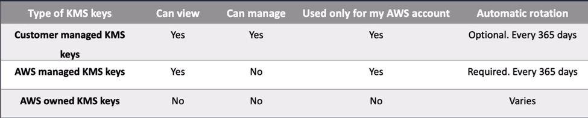

Cloud HSM
- cloud based hardware security module
- You can generate and use your own encryption keys on the AWS cloud.
- runs in your VPC
- uses FIPS 140-2 level three validated HSMs.
- It's a managed service and automatically scales
- You retain control over your encryption keys and you control access with no visibility for AWS.
- Use cases:
  - offload SSL/TLS processing from web servers,
  - protect private keys from issuing CA,
  - store the master key for oracle DB transparent data encryption
  - custom key store for KMS, so you can retain control of the HSM that protects the master keys.

AWS Certificate Manager:
- create, store and renew SSL/TLS X 509 certificates that supports single domains, multiple domain names and wild cards
- integrates with several services like elbs, cloudfront, Elastic beanstalk, Nitro enclaves and AWS cloud formation.
- Public certificates are signed by the AWS public CA.
- You can also create a private CA with ACM, then you can issue private certificates.
- You can also import certificates from third party issuers as well.

AWS web application firewall - WAF
- This service lets you create rules to filter web traffic based on conditions such as IP addresses, http headers and body or custom URIs.
- It makes it easy to create rules that block common web exploits like sequel injection and cross site scripting.
- Concepts:
  - __web ACLS__, are used to protect a set of resources
  - __rules__: that define the inspection criteria and actions to take if a web request meets your defined criteria
  - __rule groups__:  reusable rule groups.
  - __IP set__ provides a collection of IP addresses and IP address ranges that you want to use together in a rule statement.
  - __regeX pattern set__ provides a collection of regular expressions you want to use together in a rule statement.
  - __rule action__ tells WAS what to do with a web request. When it matches the criteria defined in the rule:
    - count,
    - allow
    - block the request.
  - A match statement compares the web request or its origin against conditions that you provide:
    - geographic,
    - IP sets
    - regex size constraints,
    - sequel injection attacks,
    - string, match and
    - cross site scripting attacks.

These are various different ways of identifying traffic that could be malicious in nature:

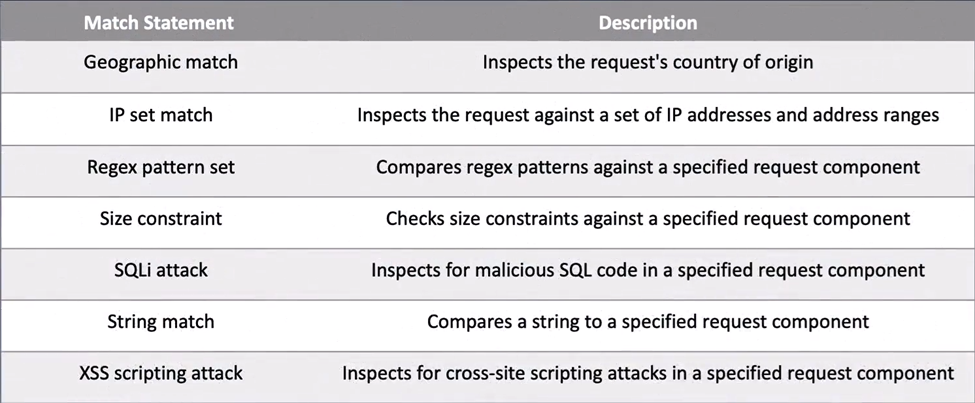

AWS shield:
- managed distributed denial of service (DDOS) protection service.
- It safeguards web applications running on AWS with always on detection and automatic in line mitigations.
- It helps to minimize application downtime and latency.
- 2 tiers:
  - the standard which is no cost at all
  - advance which comes for a monthly fee and a one year commitment.

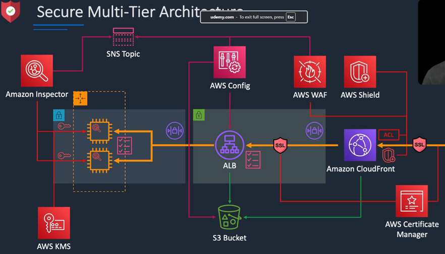

### Architectural Patterns

#### you need to enable a custom domain name and encryption in transit for an application that's running behind an ALB.

you can use Route 53 to create an alias record to the ALBs DNS name, and then attach an SSL/TTLS certificate issued by Amazon Certificate Manager, ACM.

#### A website running on EC2 instances behind an ALB must be protected against well-known web exploits.

think about the Web Application Firewall. So you'd create a web ACL in WAF to protect against those web exploits and you can attach that to the ALB.

#### You need to block access to an application running on an ALB from connections originating in a specific list of countries.

create a web ACL in WAF with a geographic match and block traffic that matches the list of countries.

#### A company needs to encrypt large volumes of data using a CMK in AWS KMS.

For this, you need to create a data encryption key using the CMK to encrypt the large volumes of data.

#### A mobile app requires authorized access to AWS services. Users authenticate using social IDPs and a preconfigured web UI is required for logging in.

use a Cognito user pool that leverages the social IDPs and an identity pool for gaining temporary credentials for AWS. And the user pool will give you that pre-configured web UI, it has that out of the box.

#### A company has an on-premises Microsoft AD and a Direct Connect connection. They require the ability to join EC2 instances to the on-premises domain.

use an AD connector that uses

## Migration and Transfer

Service Migration Service – SMS:
- agentless service for migrating on-premises and cloud-based VMs to AWS.
- Source platforms can be VMware, Hyper-V or Azure.
- The Server Migration Service connector is installed on the source's platform.
- Server volumes are replicated and it's encrypted with TLS and saved as AMIs, which can then be launched as EC2 instances.
- You can use application groupings and SMS will launch servers in a CloudFormation stack.
- you can replicate your on-premises service to AWS for up to 90 days per server.
- It provides automated live incremental server replication and AWS console support.

Database Migration Service – DMS
- used for migrating databases from on-premises, Amazon EC2 or Amazon RDS.
- supports homogeneous, so Oracle to Oracle, as well as heterogeneous, example, Oracle to Amazon Aurora.
- Data is continuously replicated while the application is live, minimizing downtime.
- You pay based on the compute resources used during the migration and the log storage.
- fully managed migration process.
- you can use it along with the schema conversion tool for converting schemas.
- DMS use cases include cloud to cloud, so EC2 to RDS, RDS to RDS, or RDS to Aurora, on premises to cloud and homogeneous migrations like Oracle to Oracle, MySQL to RDS MySQL, and so on.
- Also, heterogeneous migration:  moving from Oracle to Aurora, Oracle to Postgres, or Microsoft SQL to RDS MySQL. And then you'll need to use the schema conversion tool.
- It's also useful for development and test, so you can use the cloud for dev/test workloads and database consolidation.
- consolidating multiple source DBs to a single target DB.
- does continuous data replication so you can use it for DR, dev/test, or single source multi target or multi-source single target.

DataSync:
- software agent to connect to on-premises NAS storage systems.
- The NAS can use NFS or SMB protocols, and it synchronizes data into AWS using a scheduled automated data transfer with TLS encryption.
- Destinations can be S3, EFS, or FSx for Windows File Server.
- can improve performance for data transfers.
- Permissions and metadata are preserved.
- you pay per gigabyte transferred.

Snowball:
- are used for migrating large volumes of data to AWS.
- The __Snowball Edge Compute Optimized__:
  - provides block and object storage and an optional GPU.
  - You can use the data collection, machine learning and processing and storage in environments with intermittent connectivity, so edge use cases.
- __Snowball Edge Storage Optimized__:
  - This provides block storage and S3 compatible object storage.
  - You can use it for local storage and large scale data transfer.
- __Snowcone__:
  - This is a small device used for edge computing storage and data transfer.
  - You can transfer data offline or online with the AWS DataSync agent.
- Snowball uses secure storage devices for physical transportation,
- you have some client software that you install on a local machine and that can be used to identify the data that you want to transfer, compress it, encrypt it, and then actually transfer it.
- Snowball uses 256-bit encryption with managed KMS keys and tamper resistant enclosures with TPM.
- different devices:
  - Snowball: is capable of 80 terabytes or 50 terabytes depending on your model, and that's petabyte scale.
  - Snowball Edge: goes up to 100 terabytes and that's also known as petabyte scale.
  - Snowmobile: This is known as being exabyte scalable up to 100 petabytes per Snowmobile.
- There are a few ways to optimize the performance of Snowball transfers:
  - You can use the latest Mac or Linux Snowball client, batch small files together, perform multiple copy operations at one time, copy from multiple workstations, and transfer directories, not individual files.
- Use cases for Snowball are cloud data migration, so migrating data to the cloud. Content distribution, sending data to clients or customers.

### Architectural Patterns

#### company is migrating Linux and Windows VMs to in VMWARE to the cloud and they need to determine the performance requirements for right-sizing.

you can install the application discovery service discovery connector in vmware V center to gather the data.

#### A company has a mixture of VMware VMs and physical servers to migrate to AWS and dependencies exist between application components.

you might install the MGN replication agent and create application groups to migrate the servers in waves.

#### You need to migrate an oracle data warehouse to AWS.

AWS DMS and the schema conversion tool to a Redshift data warehouse.

#### we have snowball edge being used to transfer millions of small files using a shell script and transfer times are very slow.

you can perform multiple copy operations at one time by running each command from a separate terminal. In separate instances of the Snowball client,

#### you need to minimize downtime for servers that must be migrated to AWS.

use the MGN and perform a final synchronization before cutting over in a short outage window.

#### you need to migrate 50 terabytes of data and the company only has a one gigabits per second internet link.

Use AWS Snowball to transfer data