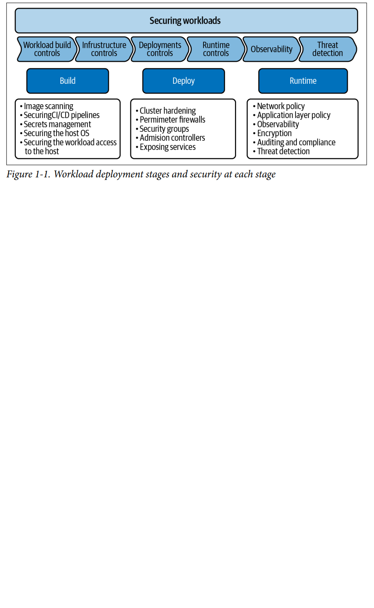
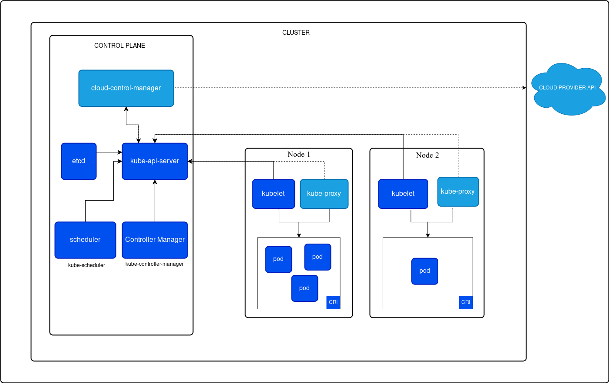

# Kubernetes: Up and Running by Brendan Burns, Joe Beda, Kelsey Hightower, and Lachlan Evenson 2022

## Creating and Running Containers

The traditional methods of running multiple programs on a single machine
require that all of these programs share the same versions of shared libraries
on the system.
Docker, the default tool most
people use for containers makes it easy to package an executable and push
it to a remote registry where it can later be pulled by others.
Container images bundle a program and its dependencies into a single
artifact under a root filesystem. The most popular container image format is
the Docker image format.

### Container Images

A container image is a binary package that
encapsulates all of the files necessary to run a program inside of an OS
container.

The most popular and widespread container image format is the Docker
image format, which was developed by the Docker open source project for
packaging, distributing, and running containers using the docker
command.

Each layer adds, removes, or modifies files from the preceding layer in the filesystem.

Containers fall into two main categories:

* System containers: seek to mimic virtual machines and often run a full boot
process. They often include a set of system services typically found in a
VM, such as ssh, cron, and syslog

* Application containers: they commonly run a single program

### Building Application Images with Docker

#### Dockerfiles

A Dockerfile can be used to automate the creation of a Docker container image.

The Dockerfile is a recipe for how to build the container image, while .dockerignore defines the set of files that should be ignored when copying files into the image.

```
# Start from a Node.js 16 (LTS) image 
FROM node:16
# Specify the directory inside the image in which all commands will
run 
WORKDIR /usr/src/app
# Copy package files and install dependencies 
COPY package*.json ./
RUN npm install
RUN npm install express
# Copy all of the app files into the image 
COPY . .
# The default command to run when starting the container 
CMD [ "npm", "start" ]
```

Run the following command to create the simple-node Docker image:

```
docker build -t simple-node .
```

To run this image:

```
docker run --rm -p 3000:3000 simple-nod
```

Optimizing Image Sizes:

* files that are removed by subsequent layers in the system are actually still present in the images.
* preceding layers means that they need to be rebuilt, repushed, and repulled to deploy your image to development. In general, you want to order
your layers from least likely to change to most likely to change in order to optimize the image size for pushing and pulling.
* do not do the actual program compilation as part of the construction of the application container image. The
trouble with doing this is that it leaves all of the unnecessary development tools, which are usually quite large

Image Security: don’t build containers with passwords baked in

### Storing Images in a Remote Registry

The standard within the Docker community is to store Docker images in a remote registry.

```
docker login

# tag the 'kuard' image by prepending the target Docker registry. Append another identifier that is usually used for the version of that image, separated by a colon (:)

docker tag kuard gcr.io/kuar-demo/kuard-amd64:blue

# push image to registry

docker push gcr.io/kuar-demo/kuard-amd64:blue

```

### The Container Runtime Interface

Kubernetes provides an API for describing an application deployment, but
relies on a container runtime to set up an application container using the
container-specific APIs native to the target OS.
The interface to this container runtime is defined by the Container Runtime Interface (CRI) standard.
When you install the docker tooling the containerd runtime is also installed and used by the Docker daemon.

Running Containers with Docker:

```
docker run -d --name kuard \
 --publish 8080:8080 \
 gcr.io/kuar-demo/kuard-amd64:blue
 ```

Docker provides the ability to limit the amount of resources used by
applications by exposing the underlying cgroup technology provided by the
Linux kernel. These capabilities are likewise used by Kubernetes to limit
the resources used by each Pod.

Limiting memory resources: use the --memory and --memory-swap flags

```
docker run -d --name kuard \
 --publish 8080:8080 \
 --memory 200m \
 --memory-swap 1G \
 gcr.io/kuar-demo/kuard-amd64:blue
 ```

Limiting CPU resources: Restrict CPU utilization using the --cpu-shares flag

```
 docker run -d --name kuard \
 --publish 8080:8080 \
 --memory 200m \
 --memory-swap 1G \
 --cpu-shares 1024 \
 gcr.io/kuar-demo/kuard-amd64:blue
```

## Deploying a Kubernetes Cluster

### Kubernetes components

* controller-manager: is responsible for running various controllers that regulate behavior in the cluster; for example, ensuring that all of the
replicas of a service are available and healthy.
* scheduler: is responsible for placing different Pods onto different nodes in the cluster.
* etcd server: is the storage for the cluster where all of the API objects are stored
* nodes: nodes are separated into control-plane nodes that contain containers like the API server, scheduler, etc., which manage the cluster,
and worker nodes where your containers will run

### The Kubernetes Client

The official Kubernetes client is kubectl: a command-line tool for interacting with the Kubernetes API

Commands:

```
# check the version of the cluster
kubectl version

# verify that your cluster is generally healthy
kubectl get componentstatuses

# list out all of the nodes in your cluster
kubectl get nodes

# get more information about a specific node
kubectl describe nodes kube1

# label kubernetes objects
kubectl label pods bar color=red

# see logs
kubectl logs <pod-name>

# execute command in running container
kubectl exec -it <pod-name> -- bash

# see kubernetes events
kubectl get events

# top command
kubectl top nodes
kubectl top pods

# an easy way to see how a Kubernetes object changes over time:
kubectl get endpoints alpaca-prod --watch

```

### Cluster Components

* Kubernetes Proxy: responsible for routing network traffic to load-balanced services in the Kubernetes cluster. To do its job, the proxy must be
present on every node in the cluster.

* Kubernetes DNS: provides naming and discovery for the services that are defined in the cluster

* Kubernetes UI: 

### Namespaces

Kubernetes uses namespaces to organize objects in the cluster. You can think of each namespace as a folder that holds a set of objects.

### Creating, Updating, and Destroying Kubernetes Objects

Objects in the Kubernetes API are represented as JSON or YAML files

You can use kubectl to create (or update) this object in Kubernetes by running:

```
kubectl apply -f obj.yaml
```

If you want to see what the apply command will do without actually making the changes, you can use the --dry-run flag to print the objects
to the terminal without actually sending them to the server.

## Pods

A Pod is a collection of application containers and volumes running in the same execution environment. Pods, not containers, are the smallest
deployable artifact in a Kubernetes cluster. This means all of the containers in a Pod always land on the same machine.

Applications running in the same Pod share the same IP address and port
space (network namespace), have the same hostname (UTS namespace),
and can communicate using native interprocess communication channels.

In general, the right question to ask yourself when designing Pods is, “Will
these containers work correctly if they land on different machines?” If the
answer is “no,” a Pod is the correct grouping for the containers.

Create a Pod:

```
kubectl run kuard --generator=run-pod/v1 \
 --image=gcr.io/kuar-demo/kuard-amd64:blue

# check
kubectl get pods
```

### Creating a Pod Manifest:

Pod manifests include a couple of key fields and attributes: 
* metadata section for describing the Pod and its labels,
* spec section for describing volumes and a list of containers that will run in the Pod

```
apiVersion: v1
kind: Pod
metadata:
    name: kuard
spec:
    containers:
    - image: gcr.io/kuar-demo/kuard-amd64:blue
      name: kuard
      ports:
      - containerPort: 8080
        name: http
        protocol: TCP
```

### Accessing Your Pod

#### Using Port Forwarding

```
kubectl port-forward kuard 8080:8080
```

A secure tunnel is created from your local machine, through the Kubernetes master, to the instance of the Pod running on one of the worker nodes.

#### Getting More Info with Logs

The kubectl logs command downloads the current logs from the running instance:

```
kubectl logs kuard
```

#### Running Commands in Your Container with exec

 execute commands in the context of the container itself:

 ```
kubectl exec -it kuard ash
 ```

### Health Checks

When you run your application as a container in Kubernetes, it is
automatically kept alive for you using a process health check. This health
check simply ensures that the main process of your application is always
running. If it isn’t, Kubernetes restarts it.

### Liveness Probe

Liveness health checks run application-specific logic, like loading a web page, to verify that the application is not just still running, but is
functioning properly.

Liveness determines if an application is running properly.

Liveness probes are defined per container

```
apiVersion: v1
kind: Pod
metadata:
    name: kuard
spec:
    containers:
    - image: gcr.io/kuar-demo/kuard-amd64:blue
      name: kuard
      livenessProbe:
        httpGet:
            path: /healthy
            port: 8080
        initialDelaySeconds: 5      # will not be called until 5 seconds after all the containers in the Pod are created
        timeoutSeconds: 1           # The probe must respond within the 1-second timeout
        periodSeconds: 10           # Kubernetes will call the probe every 10 seconds
        failureThreshold: 3         # If more than 3 consecutive probes fail, the container will fail and restart
      ports:
        - containerPort: 8080
          name: http
          protocol: TCP
```

### Readiness Probe

Readiness describes when a container is ready to serve user requests. Containers that fail readiness checks are removed from service load balancers

### Resource Management

Kubernetes allows users to specify two different resource metrics. Resource
requests specify the minimum amount of a resource required to run the
application. Resource limits specify the maximum amount of a resource that
an application can consume.

#### Minimum Required Resources:

Kubernetes guarantees that these resources are available to the Pod. The
most commonly requested resources are CPU and memory, but Kubernetes
supports other resource types as well, such as GPUs.

```
apiVersion: v1
kind: Pod
metadata:
    name: kuard
spec:
    containers:
    - image: gcr.io/kuar-demo/kuard-amd64:blue
      name: kuard
      resources:
        requests:
            cpu: "500m"
            memory: "128Mi"
        limits:
            cpu: "1000m"
            memory: "256Mi"

```

The Kubernetes scheduler will ensure that the sum of all requests of all Pods on a node does
not exceed the capacity of the node

#### Capping Resource Usage with Limits

You can also set a maximum on a it’s resource usage via resource limits.

When you establish limits on a container, the kernel is configured to ensure
that consumption cannot exceed these limits.

### Persisting Data with Volume

Using Volumes with Pods

```
apiVersion: v1
kind: Pod
metadata:
    name: kuard
spec:
    volumes:
    - name: "kuard-data"
      hostPath:
      path: "/var/lib/kuard"
    containers:
    - image: gcr.io/kuar-demo/kuard-amd64:blue
      name: kuard
      volumeMounts:
        - mountPath: "/data"
          name: "kuard-data"

```

There are a variety of ways you can use data in your application:

* Communication/synchronization: shared volume between two containers, forming the basis for communication between them
* Cache: An application may use a volume that is valuable for performance
* Persistent data: Sometimes you will use a volume for truly persistent data—data that is
independent of the lifespan of a particular Pod, and should move
between nodes in the cluster if a node fails or a Pod moves to a different
machine for some reason. To achieve this, Kubernetes supports a wide
variety of remote network storage volumes, including widely supported
protocols like NFS and iSCSI as well as cloud provider network storage
like Amazon’s Elastic Block Store
* Mounting the host filesystem

## Labels and Annotations

* Labels are key/value pairs that can be attached to Kubernetes objects such
as Pods and ReplicaSets

* Annotations, on the other hand, provide a storage mechanism that resembles
labels: key/value pairs designed to hold nonidentifying information that
tools and libraries can leverage

### Labels

In addition to enabling users to organize their infrastructure, labels play a
critical role in linking various related Kubernetes objects.

Kubernetes is a purposefully decoupled system. There is no hierarchy and all components
operate independently. However, in many cases objects need to relate to one
another, and these relationships are defined by labels and label selectors.

For example, ReplicaSets, which create and maintain multiple replicas of a
Pod, find the Pods that they are managing via a selector.

#### Label Selectors

Label selectors are used to filter Kubernetes objects based on a set of labels.

```
# show all pod labels
kubectl get pods --show-labels

# list Pods that have the ver label set to 2
kubectl get pods --selector="ver=2"
```

### Annotations

Annotations provide a place to store additional metadata for Kubernetes
objects where the sole purpose of the metadata is assisting tools and
libraries.

Annotations are used to provide extra information about where an object came from, how to use it,
or policy around that object.

Annotations are used to:
* Keep track of a “reason” for the latest update to an object.
* Communicate a specialized scheduling policy to a specialized scheduler.

## Service Discovery

Service-discovery tools help solve the problem of finding which processes are listening at which addresses for which services.

The Domain Name System (DNS) is the traditional system of service discovery on the internet. DNS is designed for relatively stable name
resolution with wide and efficient caching. It is a great system for the internet but falls short in the dynamic world of Kubernetes.

Real service discovery in Kubernetes starts with a Service object. A Service object is a way to create a named label selector.

The kubernetes service is automatically created for you so that you can find and talk to the Kubernetes API from within the app.

```
 kubectl run alpaca-prod \
 --image=gcr.io/kuar-demo/kuard-amd64:blue \
 --replicas=3 \
 --port=8080 \
 --labels="ver=1,app=alpaca,env=prod"
```

Kubernetes provides a DNS service exposed to Pods running in the cluster. This Kubernetes DNS service was installed as a system component when
the cluster was first created. The DNS service is, itself, managed by Kubernetes. The Kubernetes DNS service provides DNS names for cluster IPs

When referring to a service in your own namespace you can just use the
service name (alpaca-prod). You can also refer to a service in another
namespace with alpaca-prod.default. And, of course, you can use
the fully qualified service name (alpacaprod.default.svc.cluster.local.).

One nice thing the Service object does is track which of your Pods are ready via a readiness check.

Kubernetes service types:

* 

### NodePort
In addition to a cluster IP, the system picks a
port (or the user can specify one), and every node in the cluster then
forwards traffic to that port to the service.
With this feature, if you can reach any node in the cluster you can contact a
service. You use the NodePort without knowing where any of the Pods for
that service are running.

Here we see that the system assigned port 32711 to this service. Now we
can hit any of our cluster nodes on that port to access the service. If you are
sitting on the same network, you can access it directly. If your cluster is in
the cloud someplace, you can use SSH tunneling with something like this:

```
ssh <node> -L 8080:localhost:32711
```

Now if you point your browser to http://localhost:8080 you will be connected to that service.

## HTTP Load Balancing with Ingress

Service object operates at Layer 4 (according to the OSI model ).
This means that it only forwards TCP and UDP connections and doesn’t look inside of those connections

In the case where these services are type: NodePort, you’ll have to have clients connect to a
unique port per service. In the case where these services are type:
LoadBalancer, you’ll be allocating (often expensive or scarce) cloud
resources for each service. But for HTTP (Layer 7)-based services, we can do better.

Kubernetes calls its HTTP-based load-balancing system Ingress. Ingress is a Kubernetes-native way to implement the “virtual hosting” pattern:
That program then parses the HTTP connection and, based on the Host header and the URL path that is requested, proxies the HTTP call to some other program.

CONTINUE: PAGE 115


# Kubernetes Security and Observability by Brendan Creane & Amit Gupta 2021

Kubernetes is not secure by default. 

## Security and Observability Strategy

The reason Kubernetes is popular is its declarative nature: It abstracts infrastructure details and allows users to specify the workloads they want to
run and the desired outcomes. 

Kubernetes achieves this abstraction by managing workload creation, shutdown, and restart

In the Kubernetes world, workloads are built as container images and are deployed in a Kubernetes cluster using a configuration file (yaml)
This is typically integrated in the development process, and most development teams use continuous integration
(CI) and continuous delivery (CD) to ensure speedy and reliable delivery of software.

Adding a security-review step to this process is counterproductive, as the only logical place to add that is when the code is being committed.

### Deploying a Workload in Kubernetes: Security at Each Stage



The __build__ stage is where you create (build) software for your workload (application) and build the infrastructure components (host or virtual machines) to host applications. In this stage you consider security for:
* the CI/CD pipeline, 
* implement security for image repositories, 
* scan images for vulnerabilities,
* harden the host operating system,
* implement best practices to secure the image registry and avoid compromising the images in the image registry (use private registries)
* best practices for secrets management; secrets are like passwords that allow access to resources in your cluster

In most cases the development team is responsible for it.

The next stage, __deploy__, is where you set up the platform that runs your Kubernetes deployment and deploy workloads. In this stage you need to think about:
* the security best practices for configuring your Kubernetes cluster and providing external access to applications running inside your Kubernetes cluster,
* policies to limit access to workloads (pod security policies), 
* network policies to control applications’ access to the platform components, 
* role-based access control (RBAC) for access to resources (for example, service creation, namespace creation, and adding/changing labels to pods)

In most enterprises the platform team is responsible for this stage

The final stage is the __runtime__ stage, where you have deployed your application
and it is operational. In this stage you need to think about:
* network security, which involves controls using network policy, 
* threat defense (using techniques to detect and prevent malicious activity in the cluster), 
* enterprise security controls like compliance, auditing, and encryption. 

The security team is responsible for this stage of the deployment.


# Kubernetes Concepts

https://kubernetes.io/docs/concepts/

## Advantages

Kubernetes provides you with:

* Service discovery and load balancing Kubernetes can expose a container using the DNS name or using their own IP address. If traffic to a container is high, Kubernetes is able to load balance and distribute the network traffic so that the deployment is stable.
* Storage orchestration Kubernetes allows you to automatically mount a storage system of your choice, such as local storages, public cloud providers
* Automated rollouts and rollbacks You can describe the desired state for your deployed containers using Kubernetes, and it can change the actual state to the desired state at a controlled rate.
* Automatic bin packing You provide Kubernetes with a cluster of nodes that it can use to run containerized tasks. You tell Kubernetes how much CPU and memory (RAM) each container needs. Kubernetes can fit containers onto your nodes to make the best use of your resources.
* Self-healing Kubernetes restarts containers that fail, replaces containers, kills containers that don't respond to your user-defined health check, and doesn't advertise them to clients until they are ready to serve.
* Secret and configuration management Kubernetes lets you store and manage sensitive information, such as passwords, OAuth tokens, and SSH keys.

## Kubernetes API

The core of Kubernetes' control plane is the API server.

The Kubernetes API lets you query and manipulate the state of API objects in Kubernetes.

Most operations can be performed through the kubectl command-line interface, which in turn use the API. However, you can also access the API directly using REST calls.

Each Kubernetes cluster publishes the specification of the APIs that the cluster serves. kubectl tool fetches and caches the API specification for enabling command-line completion and other features.

## Cluster Architecture

A Kubernetes cluster consists of a control plane plus a set of worker machines, called nodes, that run containerized applications. 



Control plane components:

* kube-apiserver: exposes the Kubernetes API
* etcd: Consistent and highly-available key value
* kube-scheduler: watches for newly created Pods with no assigned node, and selects a node for them to run on.
* kube-controller-manager: runs controller processes. There are many different types of controllers: Node controller, Job controller etc.
* cloud-controller-manager: embeds cloud-specific control logic. The cloud controller manager lets you link your cluster into your cloud provider's API

Node components:

* kubelet: An agent that runs on each node in the cluster. It makes sure that containers are running in a Pod.
* kube-proxy: network proxy that runs on each node in your cluster, implementing part of the Kubernetes Service concept. It maintains network rules on nodes. 
* Container runtime: empowers Kubernetes to run containers effectively. It is responsible for managing the execution and lifecycle of containers within the Kubernetes environment. Kubernetes supports container runtimes such as containerd,

Addons:

* DNS: Cluster DNS is a DNS server, in addition to the other DNS server(s) in your environment, which serves DNS records for Kubernetes services.
* Web UI (Dashboard)
* Container resource monitoring: records generic time-series metrics about containers in a central database, and provides a UI for browsing that data.
* Cluster-level Logging: responsible for saving container logs to a central log store with a search/browsing interface
* Network plugins:  software components that implement the container network interface (CNI) specification. They are responsible for allocating IP addresses to pods and enabling them to communicate with each other within the cluster

### Nodes

Kubernetes runs your workload by placing containers into Pods to run on Nodes. 

There are two main ways to have Nodes added to the API server:
* The kubelet on a node self-registers to the control plane
* You (or another human user) manually add a Node object

Kubernetes has a "hub-and-spoke" API pattern. All API usage from nodes (or the pods they run) terminates at the API server.

#### Node to Control Plane communication

Nodes should be provisioned with the public root certificate for the cluster such that they can connect securely to the API server along with valid client credentials. A good approach is that the client credentials provided to the kubelet are in the form of a client certificate. 

Pods that wish to connect to the API server can do so securely by leveraging a service account so that Kubernetes will automatically inject the public root certificate and a valid bearer token into the pod when it is instantiated.

#### Control plane to node communication

The first is from the API server to the kubelet process which runs on each node in the cluster. The second is from the API server to any node, pod, or service through the API server's proxy functionality

The connections from the API server to the kubelet are used for:
* Fetching logs for pods.
* Attaching (usually through kubectl) to running pods.
* Providing the kubelet's port-forwarding functionality.

API server to nodes, pods, and services: 
The connections from the API server to a node, pod, or service default to plain HTTP connections and are therefore neither authenticated nor encrypted. They can be run over a secure HTTPS connection by prefixing https: to the node, pod, or service name in the API URL, but they will not validate the certificate provided by the HTTPS endpoint nor provide client credentials. So while the connection will be encrypted, it will not provide any guarantees of integrity. These connections are not currently safe to run over untrusted or public networks

#### Pods

Pods are the smallest deployable units of computing that you can create and manage in Kubernetes.
It is a group of one or more containers, with shared storage and network resources, and a specification for how to run the containers. 
A Pod's contents are always co-located and co-scheduled, and run in a shared context.

A Pod can contain init containers that run during Pod startup. You can also inject ephemeral containers for debugging a running Pod

The shared context of a Pod is a set of Linux namespaces, cgroups, and potentially other facets of isolation - the same things that isolate a container. A Pod is similar to a set of containers with shared namespaces and shared filesystem volumes.

Example:
```
apiVersion: v1
kind: Pod
metadata:
  name: nginx
spec:
  containers:
  - name: nginx
    image: nginx:1.14.2
    ports:
    - containerPort: 80

```

To create the Pod shown above:
```
kubectl apply -f simple-pod.yaml
```

##### Pod templates

Usually you don't need to create Pods directly, even singleton Pods. Instead, create them using workload resources such as Deployment or Job.

You can use workload resources to create and manage multiple Pods for you. A controller for the resource handles replication and rollout and automatic healing in case of Pod failure. xamples of workload resources that manage one or more Pods: Deployment, StatefulSet, DeamonSet

Controllers for workload resources create Pods from a __pod template__ and manage those Pods on your behalf. PodTemplates are specifications for creating Pods, and are included in workload resources such as __Deployments__, __Jobs__, and __DaemonSets__.

The sample below is a manifest for a simple Job with a template that starts one container:

```
apiVersion: batch/v1
kind: Job
metadata:
  name: hello
spec:
  template:
    # This is the pod template
    spec:
      containers:
      - name: hello
        image: busybox:1.28
        command: ['sh', '-c', 'echo "Hello, Kubernetes!" && sleep 3600']
      restartPolicy: OnFailure
    # The pod template ends here
```

The StatefulSet controller ensures that the running Pods match the current pod template for each StatefulSet object. If you edit the StatefulSet to change its pod template, the StatefulSet starts to create new Pods based on the updated template. Eventually, all of the old Pods are replaced with new Pods, and the update is complete.

Each workload resource implements its own rules for handling changes to the Pod template.

##### Resource sharing and communication

Pods enable data sharing and communication among their constituent containers.

A Pod can specify a set of __shared storage volumes__. All containers in the Pod can access the shared volumes, allowing those containers to share data. Volumes also allow persistent data in a Pod to survive in case one of the containers within needs to be restarted.

Each Pod is assigned a unique IP address for each address family. Every container in a Pod shares the network namespace, including the IP address and network ports. Inside a Pod (and only then), the containers that belong to the Pod can communicate with one another using __localhost__.

The containers in a Pod can also communicate with each other using standard inter-process communications like SystemV semaphores or POSIX shared memory.

##### Pod security settings

To set security constraints on Pods and containers, you use the securityContext field in the Pod specification. This field gives you granular control over what a Pod or individual containers can do. For example:
* Drop specific Linux capabilities to avoid the impact of a CVE.
* Force all processes in the Pod to run as a non-root user or as a specific user or group ID.
* Set a specific seccomp profile.

##### Pod Lifecycle

Pods are only scheduled once in their lifetime; assigning a Pod to a specific node is called binding, and the process of selecting which node to use is called scheduling. if Kubernetes isn't able start the Pod on the selected node, then that particular Pod never starts.

If one of the containers in the Pod fails, then Kubernetes may try to restart that specific container. Pods can however fail in a way that the cluster cannot recover from. 

Kubernetes uses a higher-level abstraction, called a controller, that handles the work of managing the relatively disposable Pod instances.

Pod phases (status):
* Pending: The Pod has been accepted by the Kubernetes cluster, but one or more of the containers has not been set up and made ready to run.
* Running: The Pod has been bound to a node, and all of the containers have been created. At least one container is still running.
* Succeeded: All containers in the Pod have terminated in success, and will not be restarted
* Failed: All containers in the Pod have terminated, and at least one container has terminated in failure. 
* Unknown: For some reason the state of the Pod could not be obtained. 

Container states:
* Waiting
* Running
* Terminated

Kubernetes manages container failures within Pods using a restartPolicy defined in the Pod spec.


CONTINUE: https://kubernetes.io/docs/concepts/workloads/pods/pod-lifecycle/

# Other

* helm chart example
* how to create a service
* kubernetes architecture
* what is deployment?
* what is cluster IP? It is a special IP address the system will load-balance across all of the Pods that are identified by the selector.
* what is NodePort? 
* what are kubernetes service types?

